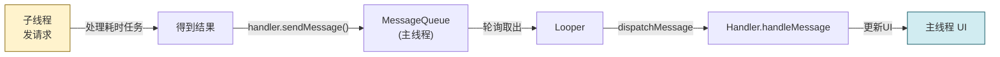
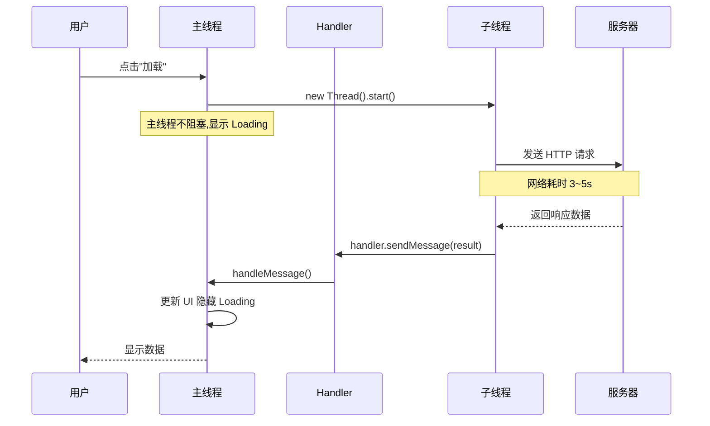

# 6.2 异步网络请求、主线程禁止网络操作

> [!abstract] 本节概述
> Android 采用单线程模型，所有 UI 操作必须在主线程（UI 线程）执行。若在主线程做网络、数据库等耗时操作，会阻塞 UI 渲染导致 ANR，Android 直接禁止主线程网络操作并抛出 NetworkOnMainThreadException。本节讲解单线程模型、Handler 机制与多种异步网络请求方案，并通过对比给出选型建议。

## 1. Android 单线程模型

> [!definition] 单线程模型
> Android 应用的主线程（Main Thread，又称 UI 线程）负责事件分发、UI 绘制与用户交互。系统**只允许主线程更新 UI**，其他线程访问 UI 会抛出 `CalledFromWrongThreadException`。

> [!warning] 主线程禁止的操作
> 1. **网络操作**：HTTP 请求、Socket 通信（API 11+ 抛 NetworkOnMainThreadException）
> 2. **数据库读写**：SQLite 大数据量查询
> 3. **文件 I/O**：大文件读写、SD 卡操作
> 4. **CPU 密集型计算**：图像处理、加密解密大数据
>
> 主线程耗时超过 5 秒会触发 ANR（Application Not Responding）。

```java
// ❌ 错误示范:主线程直接发请求
public void onClick(View v) {
    try {
        URL url = new URL("https://api.example.com/news");
        HttpURLConnection conn = (HttpURLConnection) url.openConnection();
        String result = readStream(conn.getInputStream());   // 抛 NetworkOnMainThreadException
        textView.setText(result);
    } catch (Exception e) { e.printStackTrace(); }
}
```

## 2. Handler 机制

> [!definition] Handler 机制
> Handler 是 Android 线程间通信的核心机制，由 Handler、Message、MessageQueue、Looper 四部分组成，允许子线程通过发送 Message 切回主线程更新 UI。

| 组件 | 职责 |
| ---- | ---- |
| Message | 携带数据与处理标识的消息对象 |
| MessageQueue | 按时序存放 Message 的消息队列 |
| Looper | 循环从 MessageQueue 取出 Message 分发 |
| Handler | 发送 Message 并处理回调 |



## 3. 异步网络请求方案对比

| 方案 | API 难度 | 灵活性 | 状态 | 典型用途 |
| ---- | -------- | ------ | ---- | -------- |
| Thread + Handler | 中 | 高 | 通用 | 自定义线程 + UI 更新 |
| AsyncTask | 低 | 低 | **已废弃**（API 30） | 简单异步任务（了解原理） |
| HandlerThread | 中 | 中 | 通用 | 串行后台任务 |
| 线程池 + Handler | 中高 | 高 | 通用 | 并发任务管理 |
| RxJava/Retrofit | 高 | 极高 | 主流 | 复杂异步、链式调用 |
| Coroutine（Kotlin） | 中 | 高 | 主流 | 协程简化异步 |

### 3.1 Thread + Handler

```java
public class NewsActivity extends AppCompatActivity {
    private static final int MSG_SUCCESS = 1;
    private static final int MSG_FAIL = 2;
    private TextView tvResult;

    private final Handler handler = new Handler(Looper.getMainLooper()) {
        @Override
        public void handleMessage(Message msg) {
            switch (msg.what) {
                case MSG_SUCCESS:
                    tvResult.setText((String) msg.obj);
                    break;
                case MSG_FAIL:
                    tvResult.setText("加载失败: " + msg.obj);
                    break;
            }
        }
    };

    private void loadNews() {
        new Thread(() -> {
            try {
                String result = doHttpRequest("https://api.example.com/news");
                Message msg = Message.obtain();
                msg.what = MSG_SUCCESS;
                msg.obj = result;
                handler.sendMessage(msg);
            } catch (IOException e) {
                Message msg = Message.obtain();
                msg.what = MSG_FAIL;
                msg.obj = e.getMessage();
                handler.sendMessage(msg);
            }
        }).start();
    }

    private String doHttpRequest(String urlStr) throws IOException {
        URL url = new URL(urlStr);
        HttpURLConnection conn = (HttpURLConnection) url.openConnection();
        conn.setConnectTimeout(10000);
        try (InputStream is = conn.getInputStream();
             Scanner sc = new Scanner(is).useDelimiter("\\A")) {
            return sc.hasNext() ? sc.next() : "";
        } finally { conn.disconnect(); }
    }
}
```

### 3.2 AsyncTask（已废弃）

> [!note] AsyncTask 原理（已废弃 API 30）
> AsyncTask 提供 `doInBackground`（子线程）、`onPostExecute`（主线程）、`onProgressUpdate`（主线程）四个回调，内部封装了线程池与 Handler。**API 30 已废弃**，因容易内存泄漏、配置变化失效，需了解原理但不再推荐使用。

```java
// 已废弃,了解原理即可
private static class NewsTask extends AsyncTask<String, Integer, String> {
    private final WeakReference<Activity> ref;

    NewsTask(Activity activity) { ref = new WeakReference<>(activity); }

    @Override
    protected String doInBackground(String... urls) {   // 子线程
        return doHttpRequest(urls[0]);
    }

    @Override
    protected void onPostExecute(String result) {        // 主线程
        Activity a = ref.get();
        if (a != null && !a.isFinishing()) {
            ((NewsActivity) a).updateUI(result);
        }
    }
}

// 调用:new NewsTask(this).execute("https://...");
```

### 3.3 HandlerThread

> [!definition] HandlerThread
> HandlerThread 是自带 Looper 的子线程，适合需要**串行**处理多个后台任务的场景。任务在子线程执行，通过 Handler 把结果发回主线程。

```java
HandlerThread thread = new HandlerThread("worker");
thread.start();
Handler workerHandler = new Handler(thread.getLooper());
workerHandler.post(() -> {
    String result = doHttpRequest("https://...");
    runOnUiThread(() -> updateUI(result));   // 切回主线程
});
// 退出时调用 thread.quit();
```

### 3.4 线程池 + Handler

> [!tip] 线程池优势
> - 控制并发数，避免大量线程抢占资源
> - 复用线程，减少创建销毁开销
> - 提供队列与拒绝策略，任务可被管理

```java
ExecutorService executor = Executors.newFixedThreadPool(4);

public void loadNews() {
    executor.execute(() -> {
        try {
            String result = doHttpRequest("https://api.example.com/news");
            runOnUiThread(() -> updateUI(result));
        } catch (IOException e) {
            runOnUiThread(() -> showError(e.getMessage()));
        }
    });
}

@Override
protected void onDestroy() {
    super.onDestroy();
    executor.shutdown();   // 释放线程池
}
```

### 3.5 RxJava/Retrofit 回调

```java
apiService.getNews()
    .subscribeOn(Schedulers.io())              // 子线程请求
    .observeOn(AndroidSchedulers.mainThread()) // 主线程更新 UI
    .subscribe(
        news -> updateUI(news),
        error -> showError(error.getMessage())
    );
```

## 4. 异步请求时序图



## 5. 案例：新闻列表异步加载

> [!example] 完整流程
> 用户进入新闻列表页，主线程显示加载动画，子线程发起 HTTP 请求，通过 Handler 把结果传回主线程渲染 RecyclerView，失败时显示重试按钮。

```java
public class NewsListActivity extends AppCompatActivity {
    private static final int MSG_DATA = 1;
    private static final int MSG_ERROR = 2;
    private RecyclerView rvNews;
    private ProgressBar pbLoading;
    private NewsAdapter adapter;
    private ExecutorService executor = Executors.newSingleThreadExecutor();

    private final Handler handler = new Handler(Looper.getMainLooper()) {
        @Override
        public void handleMessage(Message msg) {
            pbLoading.setVisibility(View.GONE);
            if (msg.what == MSG_DATA) {
                List<News> data = (List<News>) msg.obj;
                adapter.setData(data);
            } else {
                Toast.makeText(NewsListActivity.this,
                    "加载失败: " + msg.obj, Toast.LENGTH_SHORT).show();
            }
        }
    };

    @Override
    protected void onCreate(Bundle savedInstanceState) {
        super.onCreate(savedInstanceState);
        setContentView(R.layout.activity_news_list);
        rvNews = findViewById(R.id.rv_news);
        pbLoading = findViewById(R.id.pb_loading);
        adapter = new NewsAdapter();
        rvNews.setLayoutManager(new LinearLayoutManager(this));
        rvNews.setAdapter(adapter);

        loadNews();
    }

    private void loadNews() {
        pbLoading.setVisibility(View.VISIBLE);
        executor.execute(() -> {
            try {
                String json = doHttpRequest("https://api.example.com/news");
                List<News> list = new Gson().fromJson(json,
                    new TypeToken<List<News>>(){}.getType());
                handler.obtainMessage(MSG_DATA, list).sendToTarget();
            } catch (Exception e) {
                handler.obtainMessage(MSG_ERROR, e.getMessage()).sendToTarget();
            }
        });
    }

    @Override
    protected void onDestroy() {
        super.onDestroy();
        executor.shutdown();
    }
}
```

## 6. 易错点与最佳实践

> [!warning] 常见易错点
> 1. **主线程发请求**：直接抛 NetworkOnMainThreadException
> 2. **子线程更新 UI**：抛 `CalledFromWrongThreadException`
> 3. **Handler 内存泄漏**：非静态内部类 Handler 持有 Activity 引用，需用静态 + WeakReference
> 4. **Activity 销毁未取消请求**：子线程返回时 Activity 已销毁，导致 NPE 或崩溃
> 5. **AsyncTask 配置变化失效**：旋转屏后 AsyncTask 仍指向旧 Activity

> [!tip] 最佳实践
> - 异步任务使用静态内部类 + 弱引用，避免内存泄漏
> - Activity 销毁时取消任务（线程池 shutdown、Handler removeCallbacks）
> - 推荐使用 RxJava、Coroutine 或 Retrofit 替代裸 Thread
> - 请求结果通过 ViewModel + LiveData 持久化，避免配置变化重发

## 章节导航

- 上级：[[MOC - 第6章|第6章 移动网络通信技术]]
- 上一节：[[6.1 HTTP、HTTPS 协议移动端适配|6.1 HTTP、HTTPS 协议移动端适配]]
- 下一节：[[6.3 JSON 数据解析|6.3 JSON 数据解析]]
- 习题：[[MOC - 第6章习题|第6章习题]]
