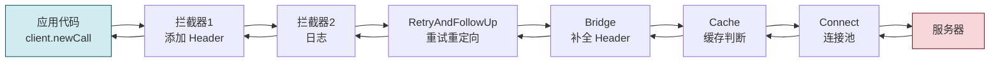
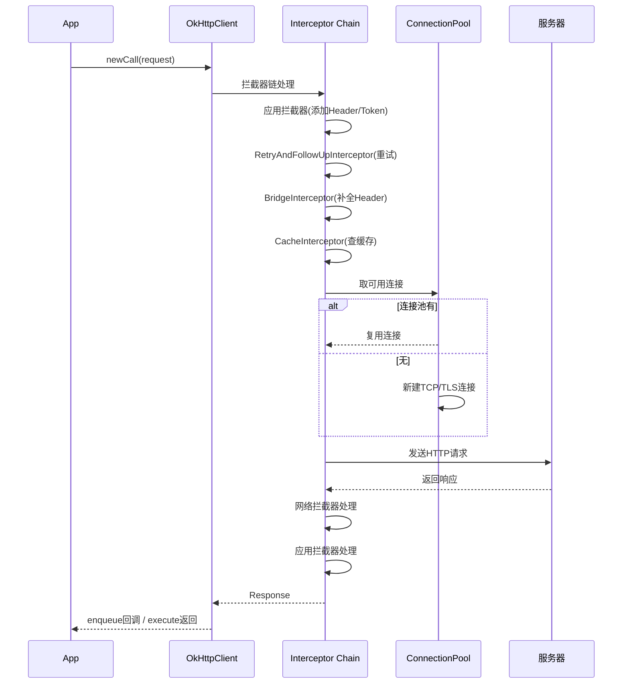

# 6.4 OkHttp 等网络框架基础

> [!abstract] 本节概述
> OkHttp 是 Square 公司开源的 Android 主流 HTTP 客户端，封装了连接池、GZIP 压缩、响应缓存、HTTP/2、连接重用等能力，大幅简化网络开发。本节讲解 OkHttp 的核心特性、客户端创建、请求构建、同步/异步执行、POST 请求（表单/JSON/文件）、拦截器机制，并通过案例演示 REST API 调用。

## 1. OkHttp 简介

> [!definition] OkHttp
> OkHttp 是 Android 平台最广泛使用的 HTTP 客户端，Retrofit 底层也基于 OkHttp。Android 4.4 之后系统内部网络请求也由 OkHttp 实现。

### 1.1 核心特性

| 特性 | 说明 |
| ---- | ---- |
| 连接池 | 默认 5 个空闲连接、5 分钟保活，复用 TCP/TLS 连接 |
| GZIP 压缩 | 自动添加 `Accept-Encoding: gzip`，减少流量 |
| 响应缓存 | 支持磁盘缓存，避免重复请求 |
| HTTP/2 | 多路复用，单连接并行多请求 |
| 自动重试 | 请求失败自动重试（默认 1 次） |
| 拦截器 | 灵活的请求/响应处理链 |
| WebSocket | 内置 WebSocket 客户端 |

### 1.2 依赖引入

```gradle
dependencies {
    implementation 'com.squareup.okhttp3:okhttp:4.12.0'
}
```

## 2. OkHttpClient 与 Request

### 2.1 创建 OkHttpClient

```java
// 全局单例(推荐)
OkHttpClient client = new OkHttpClient.Builder()
    .connectTimeout(10, TimeUnit.SECONDS)
    .readTimeout(15, TimeUnit.SECONDS)
    .writeTimeout(10, TimeUnit.SECONDS)
    .retryOnConnectionFailure(true)
    .cache(new Cache(getCacheDir(), 10 * 1024 * 1024))  // 10MB
    .build();
```

> [!warning] OkHttpClient 应全局单例
> OkHttpClient 持有连接池、缓存等共享资源，**每次 new 会重建连接池**，导致 TCP 连接无法复用，性能大幅下降。应作为单例全局复用。

### 2.2 构建 Request

```java
// GET 请求
Request getRequest = new Request.Builder()
    .url("https://api.example.com/news")
    .header("Authorization", "Bearer token")
    .build();

// POST JSON
String json = "{\"title\":\"hello\",\"content\":\"world\"}";
RequestBody body = RequestBody.create(json,
    MediaType.parse("application/json; charset=utf-8"));
Request postRequest = new Request.Builder()
    .url("https://api.example.com/news")
    .post(body)
    .build();
```

## 3. 同步 execute() vs 异步 enqueue()

> [!definition] 同步与异步
> | 维度 | execute() 同步 | enqueue() 异步 |
> | ---- | -------------- | -------------- |
> | 调用方式 | 阻塞当前线程 | 立即返回，结果回调 |
> | 线程 | 在调用线程执行 | OkHttp 内部线程池 |
> | 必须子线程调用 | 是 | 否（可在主线程发起） |
> | 返回值 | 直接 Response | Callback 异步回调 |
> | 异常处理 | 抛 IOException | onFailure 回调 |

```java
// ❌ 同步:必须在子线程,否则 NetworkOnMainThreadException
new Thread(() -> {
    try {
        Response response = client.newCall(request).execute();
        String body = response.body().string();
        runOnUiThread(() -> updateUI(body));
    } catch (IOException e) {
        e.printStackTrace();
    }
}).start();

// ✅ 异步:可在主线程发起,内部线程池执行
client.newCall(request).enqueue(new Callback() {
    @Override
    public void onFailure(Call call, IOException e) {
        // 子线程
        runOnUiThread(() -> showError(e.getMessage()));
    }

    @Override
    public void onResponse(Call call, Response response) throws IOException {
        // 子线程
        String body = response.body().string();
        runOnUiThread(() -> updateUI(body));
    }
});
```

> [!tip] 异步 Callback 注意点
> - `onResponse` 在**子线程**执行，不能直接更新 UI，需用 `runOnUiThread` 或 Handler 切回主线程
> - Response.body() 只能读取一次，读取后流被关闭
> - 响应体不使用时需 `response.close()`，否则连接无法复用

## 4. POST 请求类型

### 4.1 表单 POST

```java
RequestBody formBody = new FormBody.Builder()
    .add("username", "admin")
    .add("password", "123456")
    .build();
Request request = new Request.Builder()
    .url("https://api.example.com/login")
    .post(formBody)
    .build();
```

### 4.2 JSON POST

```java
Gson gson = new Gson();
String json = gson.toJson(new Article("title", "content"));
RequestBody body = RequestBody.create(json,
    MediaType.parse("application/json; charset=utf-8"));
Request request = new Request.Builder()
    .url("https://api.example.com/articles")
    .post(body)
    .build();
```

### 4.3 文件上传（Multipart）

```java
File file = new File(getExternalFilesDir(null), "photo.jpg");
RequestBody fileBody = RequestBody.create(file,
    MediaType.parse("image/jpeg"));

MultipartBody multipart = new MultipartBody.Builder()
    .setType(MultipartBody.FORM)
    .addFormDataPart("title", "我的照片")
    .addFormDataPart("file", file.getName(), fileBody)
    .build();
Request request = new Request.Builder()
    .url("https://api.example.com/upload")
    .post(multipart)
    .build();
```

### 4.4 文件下载

```java
Request request = new Request.Builder()
    .url("https://example.com/file.apk")
    .build();
client.newCall(request).enqueue(new Callback() {
    @Override
    public void onResponse(Call call, Response response) throws IOException {
        InputStream is = response.body().byteStream();
        File file = new File(getExternalFilesDir(null), "file.apk");
        try (FileOutputStream fos = new FileOutputStream(file)) {
            byte[] buf = new byte[8192];
            int len;
            while ((len = is.read(buf)) != -1) {
                fos.write(buf, 0, len);
            }
        }
    }
});
```

## 5. 拦截器 Interceptor

> [!definition] 拦截器
> 拦截器是 OkHttp 的核心设计，允许在请求发出前与响应返回后插入自定义逻辑。多个拦截器组成责任链，按顺序执行。



### 5.1 应用拦截器 vs 网络拦截器

| 类型 | 调用次数 | 能看到重定向 | 典型用途 |
| ---- | -------- | ----------- | -------- |
| 应用拦截器（addInterceptor） | 1 次 | 否 | 添加公共 Header、Token、日志 |
| 网络拦截器（addNetworkInterceptor） | 每次网络 | 是 | 缓存控制、压缩处理 |

### 5.2 自定义拦截器：添加 Token

```java
public class AuthInterceptor implements Interceptor {
    @NonNull
    @Override
    public Response intercept(Chain chain) throws IOException {
        Request original = chain.request();
        Request authed = original.newBuilder()
            .header("Authorization", "Bearer " + TokenManager.getToken())
            .build();
        return chain.proceed(authed);
    }
}

OkHttpClient client = new OkHttpClient.Builder()
    .addInterceptor(new AuthInterceptor())
    .build();
```

### 5.3 日志拦截器

```java
HttpLoggingInterceptor logging = new HttpLoggingInterceptor();
logging.setLevel(HttpLoggingInterceptor.Level.BODY);

OkHttpClient client = new OkHttpClient.Builder()
    .addInterceptor(logging)
    .build();
// 依赖:implementation 'com.squareup.okhttp3:logging-interceptor:4.12.0'
```

> [!warning] 日志拦截器注意点
> - `Level.BODY` 会打印完整请求体（包括 Token），**生产环境必须降为 NONE 或 BASIC**，避免泄露敏感信息
> - 大文件下载/上传时打印 BODY 会消耗大量内存

## 6. OkHttp 请求完整流程



## 7. 案例：调用 REST API

> [!example] 完整 OkHttp 调用
> 业务场景：从服务器拉取文章列表，用 Gson 解析后更新 UI。

```java
public class ArticleActivity extends AppCompatActivity {
    private static final String TAG = "ArticleDemo";
    private RecyclerView rvArticle;
    private ProgressBar pbLoading;
    private ArticleAdapter adapter;
    private OkHttpClient client;

    @Override
    protected void onCreate(Bundle savedInstanceState) {
        super.onCreate(savedInstanceState);
        setContentView(R.layout.activity_article);
        rvArticle = findViewById(R.id.rv_article);
        pbLoading = findViewById(R.id.pb_loading);
        adapter = new ArticleAdapter();
        rvArticle.setLayoutManager(new LinearLayoutManager(this));
        rvArticle.setAdapter(adapter);

        client = new OkHttpClient.Builder()
            .connectTimeout(10, TimeUnit.SECONDS)
            .addInterceptor(new HttpLoggingInterceptor()
                .setLevel(HttpLoggingInterceptor.Level.BASIC))
            .build();

        loadArticles();
    }

    private void loadArticles() {
        pbLoading.setVisibility(View.VISIBLE);
        Request request = new Request.Builder()
            .url("https://api.example.com/articles?page=1")
            .header("Accept", "application/json")
            .build();
        client.newCall(request).enqueue(new Callback() {
            @Override
            public void onFailure(Call call, IOException e) {
                runOnUiThread(() -> {
                    pbLoading.setVisibility(View.GONE);
                    Toast.makeText(ArticleActivity.this,
                        "网络错误: " + e.getMessage(), Toast.LENGTH_SHORT).show();
                });
            }
            @Override
            public void onResponse(Call call, Response response) throws IOException {
                String json = response.body().string();
                Gson gson = new Gson();
                Type type = new TypeToken<List<Article>>(){}.getType();
                List<Article> list = gson.fromJson(json, type);
                runOnUiThread(() -> {
                    pbLoading.setVisibility(View.GONE);
                    adapter.setData(list);
                });
            }
        });
    }
}
```

## 8. 易错点与最佳实践

> [!warning] 常见易错点
> 1. **每次 new OkHttpClient**：重建连接池，性能急剧下降
> 2. **同步 execute() 在主线程**：抛 NetworkOnMainThreadException
> 3. **Callback 中直接更新 UI**：抛 CalledFromWrongThreadException
> 4. **Response.body() 读取多次**：流只能读取一次，第二次为空
> 5. **未关闭 Response**：连接无法复用，资源泄漏
> 6. **生产环境日志级别 BODY**：泄露 Token 等敏感信息

> [!tip] 最佳实践
> - OkHttpClient 全局单例
> - 默认使用 enqueue() 异步，代码简洁
> - 公共 Header、Token 用拦截器统一添加
> - 大文件下载用流式处理，避免一次性加载到内存
> - 生产环境日志级别设为 BASIC 或 NONE
> - 配合 Retrofit 进一步简化 REST API 调用

## 章节导航

- 上级：[[MOC - 第6章|第6章 移动网络通信技术]]
- 上一节：[[6.3 JSON 数据解析|6.3 JSON 数据解析]]
- 下一节：[[6.5 WebSocket 长连接简介|6.5 WebSocket 长连接简介]]
- 习题：[[MOC - 第6章习题|第6章习题]]
