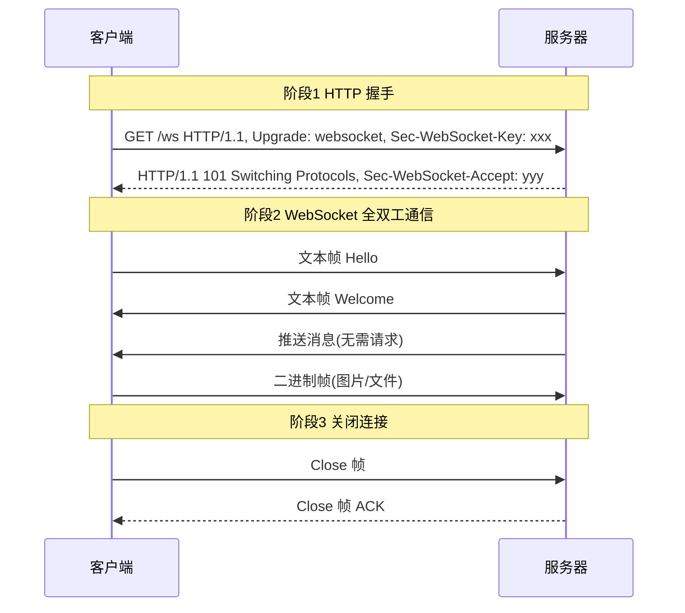
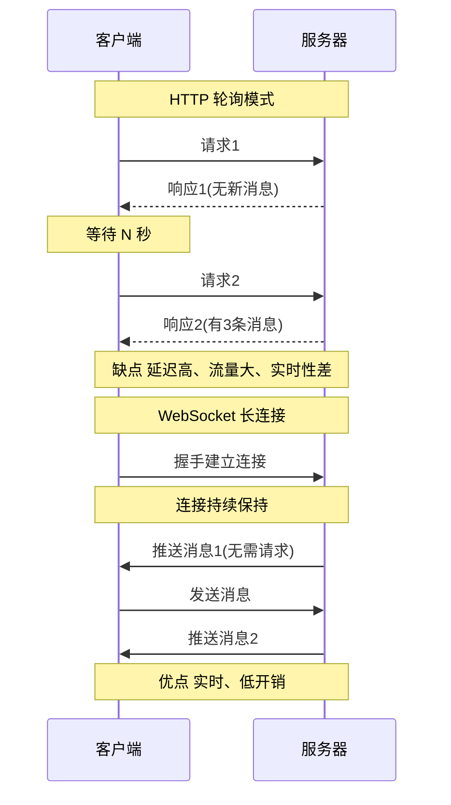

# 6.5 WebSocket 长连接简介

> [!abstract] 本节概述
> HTTP 是请求-响应模式，服务器无法主动推送数据，实时性场景下需要客户端轮询，流量与延迟均不理想。WebSocket 提供单连接全双工通信，适合即时通讯、实时推送、股票行情等场景。本节讲解 WebSocket 与 HTTP 的差异、OkHttp WebSocket 客户端的使用、连接管理与心跳保活，并通过聊天室案例演示完整流程。

## 1. WebSocket 概述

> [!definition] WebSocket
> WebSocket 是 HTML5 规范定义的全双工通信协议，基于 TCP，在 HTTP 握手后升级为 WebSocket 协议（Upgrade: websocket），建立一条持续的双向连接，服务端与客户端可随时互发消息。

### 1.1 WebSocket vs HTTP

| 维度 | HTTP | WebSocket |
| ---- | ---- | --------- |
| 通信模式 | 请求-响应 | 全双工 |
| 连接 | 短连接（默认） | 长连接 |
| 服务器推送 | 不支持（需轮询） | 原生支持 |
| 头部开销 | 每次请求带 Header | 握手后仅 2~10 字节帧头 |
| 协议 | http/https | ws/wss |
| 典型场景 | 普通数据接口 | 即时通讯、实时推送 |
| 复杂度 | 低 | 中（需管理连接） |

### 1.2 WebSocket 握手流程



## 2. WebSocket 适用场景

> [!info] 适用场景
> - **即时通讯（IM）**：聊天、群组消息，服务器实时推送新消息
> - **实时推送**：通知、订单状态变化
> - **股票行情**：高频实时数据推送
> - **多人在线游戏**：状态同步
> - **协同编辑**：多人文档实时同步
>
> **不适用场景**：简单的请求-响应接口（用 HTTP 即可）、低频数据更新（轮询成本可接受）

## 3. OkHttp WebSocket 使用

### 3.1 WebSocketListener 回调

> [!definition] WebSocketListener
> OkHttp 通过 `WebSocketListener` 抽象类回调 WebSocket 事件：

| 回调 | 触发时机 |
| ---- | -------- |
| onOpen | 连接建立成功 |
| onMessage(text) | 收到文本消息 |
| onMessage(bytes) | 收到二进制消息 |
| onClosing | 收到对端关闭帧，即将关闭 |
| onClosed | 连接已关闭 |
| onFailure | 连接异常或失败 |

### 3.2 基础客户端

```java
public class ChatClient {
    private OkHttpClient client;
    private WebSocket webSocket;

    public void connect() {
        client = new OkHttpClient.Builder()
            .pingInterval(30, TimeUnit.SECONDS)   // 心跳保活
            .build();

        Request request = new Request.Builder()
            .url("wss://api.example.com/ws/chat")
            .build();

        webSocket = client.newWebSocket(request, new WebSocketListener() {
            @Override
            public void onOpen(WebSocket ws, Response response) {
                Log.d("WS", "连接成功");
                ws.send("Hello Server");
            }

            @Override
            public void onMessage(WebSocket ws, String text) {
                Log.d("WS", "收到消息: " + text);
            }

            @Override
            public void onMessage(WebSocket ws, ByteString bytes) {
                Log.d("WS", "收到二进制: " + bytes.size() + " bytes");
            }

            @Override
            public void onClosing(WebSocket ws, int code, String reason) {
                Log.d("WS", "正在关闭: " + code + " " + reason);
                ws.close(1000, null);
            }

            @Override
            public void onClosed(WebSocket ws, int code, String reason) {
                Log.d("WS", "已关闭: " + code + " " + reason);
            }

            @Override
            public void onFailure(WebSocket ws, Throwable t, Response response) {
                Log.e("WS", "连接失败", t);
                reconnect();   // 自动重连
            }
        });
    }

    public void send(String msg) {
        if (webSocket != null) {
            webSocket.send(msg);
        }
    }

    public void disconnect() {
        if (webSocket != null) {
            webSocket.close(1000, "客户端主动关闭");
            webSocket = null;
        }
    }
}
```

## 4. 连接管理：重连与心跳

### 4.1 心跳保活

> [!tip] 为什么需要心跳
> 移动网络下 NAT 设备会在连接空闲一段时间后回收映射，导致连接"假死"。客户端定期发送心跳（空消息或 Ping 帧）维持连接活跃。

```java
// 方式1:OkHttp 内置 Ping(推荐)
OkHttpClient client = new OkHttpClient.Builder()
    .pingInterval(30, TimeUnit.SECONDS)   // 每30秒自动发Ping
    .build();

// 方式2:应用层心跳(定时发空消息)
handler.postDelayed(new Runnable() {
    @Override public void run() {
        if (webSocket != null) {
            webSocket.send("ping");   // 自定义心跳消息
        }
        handler.postDelayed(this, 30000);
    }
}, 30000);
```

### 4.2 自动重连

```java
private int retryCount = 0;
private static final int MAX_RETRY = 5;

private void reconnect() {
    if (retryCount >= MAX_RETRY) {
        Log.w("WS", "超过最大重试次数,停止重连");
        return;
    }
    retryCount++;
    long delay = (long) (Math.pow(2, retryCount) * 1000);   // 指数退避
    handler.postDelayed(this::connect, delay);
}

// onOpen 中重置重试次数
@Override
public void onOpen(WebSocket ws, Response response) {
    retryCount = 0;
    Log.d("WS", "连接成功");
}
```

### 4.3 Activity 生命周期管理

> [!warning] WebSocket 生命周期注意点
> 1. **Activity 销毁时关闭连接**：在 `onDestroy` 中 `webSocket.close()`，否则连接泄漏
> 2. **应用退后台时**：建议保持长连接（即时通讯场景），但需考虑电量
> 3. **网络切换时**：WiFi ↔ 4G 切换会断开连接，需在 onFailure 中重连
> 4. **绑定 Service**：IM 场景应把 WebSocket 放在 Service 中，与 Activity 解耦

## 5. HTTP 与 WebSocket 通信对比



## 6. 案例：简单聊天室

> [!example] 完整聊天室客户端
> 业务场景：用户进入聊天室，连接 WebSocket，发送消息并接收他人消息。

```java
public class ChatActivity extends AppCompatActivity {
    private WebSocket webSocket;
    private EditText etInput;
    private TextView tvMessages;
    private Button btnSend;
    private Handler handler = new Handler(Looper.getMainLooper());

    @Override
    protected void onCreate(Bundle savedInstanceState) {
        super.onCreate(savedInstanceState);
        setContentView(R.layout.activity_chat);
        etInput = findViewById(R.id.et_input);
        tvMessages = findViewById(R.id.tv_messages);
        btnSend = findViewById(R.id.btn_send);

        btnSend.setOnClickListener(v -> {
            String msg = etInput.getText().toString().trim();
            if (!msg.isEmpty() && webSocket != null) {
                webSocket.send(msg);
                appendMessage("我: " + msg);
                etInput.setText("");
            }
        });

        connectWebSocket();
    }

    private void connectWebSocket() {
        OkHttpClient client = new OkHttpClient.Builder()
            .pingInterval(30, TimeUnit.SECONDS)
            .build();
        Request request = new Request.Builder()
            .url("wss://api.example.com/ws/chat")
            .build();

        webSocket = client.newWebSocket(request, new WebSocketListener() {
            @Override
            public void onOpen(WebSocket ws, Response response) {
                handler.post(() -> appendMessage("系统: 连接成功"));
            }

            @Override
            public void onMessage(WebSocket ws, String text) {
                handler.post(() -> appendMessage("对方: " + text));
            }

            @Override
            public void onClosing(WebSocket ws, int code, String reason) {
                ws.close(1000, null);
            }

            @Override
            public void onFailure(WebSocket ws, Throwable t, Response response) {
                handler.post(() -> appendMessage("系统: 连接失败 " + t.getMessage()));
            }
        });
    }

    private void appendMessage(String msg) {
        tvMessages.append(msg + "\n");
    }

    @Override
    protected void onDestroy() {
        super.onDestroy();
        if (webSocket != null) {
            webSocket.close(1000, "Activity 销毁");
            webSocket = null;
        }
    }
}
```

## 7. 易错点与最佳实践

> [!warning] 常见易错点
> 1. **未发心跳**：NAT 超时后连接假死，客户端无感知
> 2. **onMessage 在子线程**：直接更新 UI 抛异常，需用 Handler 切回主线程
> 3. **Activity 销毁未关闭连接**：连接泄漏、电量浪费
> 4. **未限制重连次数**：服务器故障时疯狂重连，加剧压力
> 5. **混淆 HTTP 与 WebSocket**：把 WebSocket 当 HTTP 用，每次请求都建连接

> [!tip] 最佳实践
> - 使用 OkHttp 内置 `pingInterval` 自动发心跳
> - 实现指数退避重连，设置最大重试次数
> - IM 场景把 WebSocket 放在 Service 中，与 Activity 解耦
> - 网络变化时主动断开重连（注册 NetworkCallback）
> - 消息加序号防丢失，关键消息要 ACK

## 章节导航

- 上级：[[MOC - 第6章|第6章 移动网络通信技术]]
- 上一节：[[6.4 OkHttp 等网络框架基础|6.4 OkHttp 等网络框架基础]]
- 下一章：[[MOC - 第7章|第7章 后台服务与消息通知]]
- 习题：[[MOC - 第6章习题|第6章习题]]
