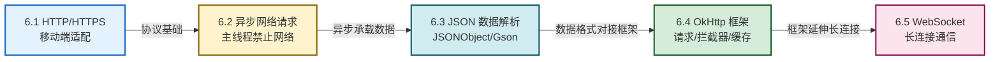

# MOC - 第6章 移动网络通信技术

本章是移动应用从"本地数据"走向"云端数据"的关键一步。围绕 Android 客户端如何与服务器通信，串起 HTTP/HTTPS 协议适配、异步请求机制、JSON 数据解析、OkHttp 框架应用与 WebSocket 长连接五个主题。

> [!info] 本章定位
> - **核心对象**：移动端与服务端之间的网络通信链路及数据交互
> - **关键能力**：HTTP/HTTPS 适配、异步请求与主线程保护、JSON 序列化反序列化、OkHttp 框架使用、WebSocket 实时通信
> - **承前启后**：在第3章 Activity 基础上引入网络通信；为第7章后台服务、第8章移动安全（HTTPS 抓包/防抓包）打基础
> - **考试权重**：异步请求机制、JSON 解析、OkHttp 使用为高频考点

> [!abstract] 本章核心问题
> 1. HTTP/HTTPS 在移动端有何特点？如何针对弱网、网络切换、超时进行适配？
> 2. 为什么 Android 禁止主线程做网络操作？异步网络请求有哪些方案？
> 3. JSON 数据格式如何解析与生成？JSONObject 与 Gson 各有什么优劣？
> 4. OkHttp 框架如何简化网络开发？同步与异步、拦截器如何工作？
> 5. WebSocket 与 HTTP 有何不同？长连接适合哪些场景？

## 本章学习路线

## 知识点导航

| 序号 | 知识点 | 核心内容 | 重点等级 |
| ---- | ------ | -------- | -------- |
| 6.1 | [[6.1 HTTP、HTTPS 协议移动端适配\|HTTP/HTTPS 移动端适配]] | HTTP 方法/状态码/头、TLS 握手与证书校验、移动端网络特点、超时/重试/缓存策略、权限配置 | ⭐⭐⭐⭐ |
| 6.2 | [[6.2 异步网络请求、主线程禁止网络操作\|异步网络请求]] | 单线程模型、NetworkOnMainThreadException、Thread+Handler、AsyncTask、HandlerThread、线程池、RxJava | ⭐⭐⭐⭐⭐ |
| 6.3 | [[6.3 JSON 数据解析\|JSON 数据解析]] | JSON 格式、JSONObject/JSONArray、Gson、TypeToken、嵌套解析、对象生成 | ⭐⭐⭐⭐⭐ |
| 6.4 | [[6.4 OkHttp 等网络框架基础\|OkHttp 框架基础]] | OkHttpClient、Request、execute/enqueue、拦截器、POST/文件上传、缓存 | ⭐⭐⭐⭐⭐ |
| 6.5 | [[6.5 WebSocket 长连接简介\|WebSocket 长连接]] | WebSocket vs HTTP、WebSocketListener、心跳保活、重连机制 | ⭐⭐⭐ |

## 核心考点速览

> [!warning] 高频考点（8 点）
> 1. **主线程禁止网络操作**：NetworkOnMainThreadException 触发条件与异步方案（**必考**）
> 2. **Handler 机制**：主线程与子线程通信原理，Thread+Handler 经典模式
> 3. **异步方案对比**：Thread+Handler、AsyncTask、HandlerThread、线程池、RxJava 各自特点与适用场景
> 4. **JSON 解析**：JSONObject 手动解析、Gson 自动解析（fromJson/toJson/TypeToken）
> 5. **OkHttp 基本使用**：OkHttpClient 创建、Request 构建、同步 execute() 与异步 enqueue() 区别
> 6. **OkHttp 拦截器**：Interceptor 作用链、日志拦截器、自定义拦截器添加 Header/Token
> 7. **HTTPS 与证书校验**：TLS 握手流程、自签名证书处理、移动端证书锁定（Certificate Pinning）
> 8. **WebSocket 长连接**：与 HTTP 的差异、OkHttp WebSocket 使用场景与心跳保活

## 关键概念速查

### 异步方案对比速查

| 方案 | API 难度 | 灵活性 | 状态 | 典型用途 |
| ---- | -------- | ------ | ---- | -------- |
| Thread + Handler | 中 | 高 | 通用 | 自定义线程 + UI 更新 |
| AsyncTask | 低 | 低 | 已废弃(API 30) | 简单异步任务（了解原理） |
| HandlerThread | 中 | 中 | 通用 | 串行后台任务 |
| 线程池 + Handler | 中高 | 高 | 通用 | 并发任务管理 |
| RxJava/Retrofit | 高 | 极高 | 主流 | 复杂异步、链式调用 |
| Coroutine(Kotlin) | 中 | 高 | 主流 | 协程简化异步 |

### HTTP 状态码速查

| 状态码 | 类别 | 含义 |
| ------ | ---- | ---- |
| 1xx | 信息 | 请求已接收，继续处理 |
| 2xx | 成功 | 200 OK、201 Created、204 No Content |
| 3xx | 重定向 | 301 永久重定向、302 临时重定向、304 Not Modified |
| 4xx | 客户端错误 | 400 Bad Request、401 Unauthorized、403 Forbidden、404 Not Found |
| 5xx | 服务端错误 | 500 Internal Server Error、502 Bad Gateway、503 Service Unavailable |

### OkHttp 同步 vs 异步速查

| 维度 | execute() 同步 | enqueue() 异步 |
| ---- | -------------- | -------------- |
| 调用方式 | 阻塞当前线程 | 立即返回，结果回调 |
| 线程 | 在调用线程执行 | OkHttp 内部线程池 |
| 主线程可调用 | 否 | 是 |
| 返回值 | 直接 Response | Callback 异步回调 |

## 章节导航

- 上级：[[MOC - 移动互联网开发技术|移动互联网开发技术总览]]
- 上一章：[[MOC - 第5章|第5章 数据持久化存储]]
- 下一章：[[MOC - 第7章|第7章 后台服务与消息通知]]
- 习题：[[MOC - 第6章习题|第6章习题]]
