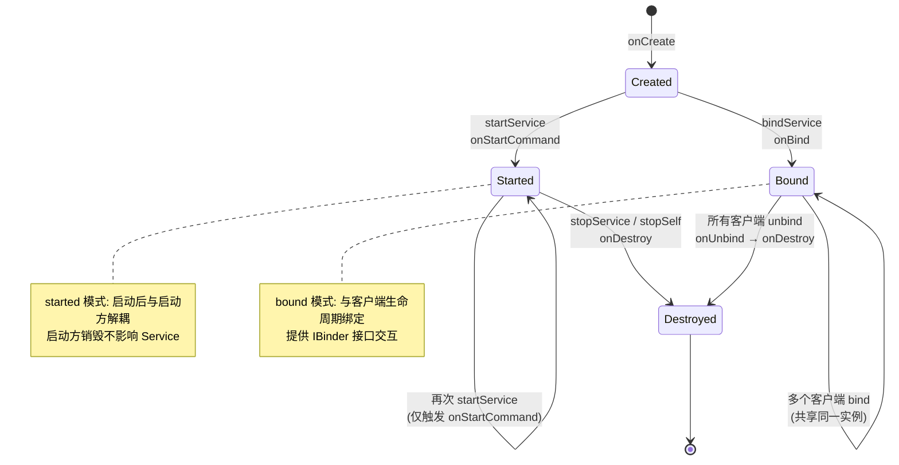
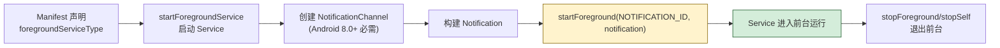

# 7.1 Service 服务基础、前台服务

> [!abstract] 本节概述
> Activity 是用户可见的交互入口，但许多工作需要在"无界面"的情况下持续进行：音乐播放、文件下载、心跳保活、数据同步。Android 提供了 **Service** 这一无界面的四大组件之一，专门承载后台运行逻辑。本节解决两个核心问题：(1) Service 与 Activity 的本质差异是什么，两种启动方式（startService 与 bindService）分别走哪条生命周期；(2) Android 8.0+ 严格限制后台 Service 后，如何通过**前台服务**用一条常驻通知换取"用户可见的运行权"。

## 1. Service 是什么

> [!definition] Service 核心特征
> Service 是 Android 四大组件之一，用于在后台执行**长耗时、无用户界面**的操作。它的关键特征：
> - **无界面**：不提供 UI，与 Activity 解耦
> - **默认运行于主线程**：Service 的 `onCreate`/`onStartCommand`/`onBind` 等回调都在主线程执行，**耗时的网络/数据库操作仍需另开子线程**
> - **不独立于进程**：Service 与启动它的组件位于同一应用进程，进程被杀则 Service 也终止
> - **需在 AndroidManifest 注册**：与 Activity 一样是组件，必须声明

> [!warning] Service 不等于"子线程"
> Service 默认运行在主线程，**直接在 onStartCommand 中做网络请求会抛 NetworkOnMainThreadException**。Service 的真正作用是"提供一个不依赖 UI 的后台运行载体"，而不是并发容器。耗时操作仍需借助 [[6.2 异步网络请求、主线程禁止网络操作|6.2 节]] 的异步方案。

```xml
<!-- AndroidManifest.xml 中注册 Service -->
<service
    android:name=".service.MusicService"
    android:enabled="true"
    android:exported="false" />
```

## 2. Service 生命周期

Service 有两种启动方式，分别对应两条生命周期路径：



### 2.1 startService 路径

| 回调 | 触发时机 | 典型用途 |
| ---- | -------- | -------- |
| `onCreate()` | Service 首次创建时调用一次 | 初始化资源（播放器、线程池） |
| `onStartCommand(intent, flags, startId)` | 每次 `startService` 都会触发 | 执行具体任务，可读 intent 参数 |
| `onDestroy()` | `stopService`/`stopSelf` 时调用 | 释放资源 |

> [!note] onStartCommand 返回值
> `onStartCommand` 的返回值决定 Service 被系统杀掉后如何重启：
> - `START_NOT_STICKY`：除非有未处理的 Intent，否则不重建
> - `START_STICKY`：重建但不重投递最后一个 Intent（intent 为 null）
> - `START_REDELIVER_INTENT`：重建并重投递最后一个 Intent
>
> 音乐播放适合 `START_STICKY`，下载任务适合 `START_NOT_STICKY`（避免重投递造成重复下载）。

### 2.2 bindService 路径

| 回调 | 触发时机 | 典型用途 |
| ---- | -------- | -------- |
| `onCreate()` | Service 首次创建 | 初始化 |
| `onBind(intent)` | 客户端 `bindService` 时调用 | 返回 `IBinder` 供客户端调用 |
| `onUnbind(intent)` | 客户端 `unbindService` 时调用 | 清理绑定相关资源 |
| `onDestroy()` | 所有客户端都 unbind 后调用 | 释放资源 |

> [!tip] 混合模式
> Service 可以同时被 `startService` 与 `bindService`，此时只有调用 `stopService`/`stopSelf` 且所有客户端都 unbind 后才会销毁。典型用于音乐播放器：Activity bind 控制，但希望切到后台仍播放。

## 3. startService vs bindService

| 维度 | startService | bindService |
| ---- | ------------ | ----------- |
| 启动方法 | `startService(intent)` | `bindService(intent, conn, flags)` |
| 生命周期回调 | onCreate→onStartCommand→onDestroy | onCreate→onBind→onUnbind→onDestroy |
| 通信方式 | 无直接通信，只能用 Intent / 广播 | 通过 IBinder 接口直接调用 Service 方法 |
| 多次调用 | 多次 startService 触发多次 onStartCommand | 多个客户端共享同一 Service 实例 |
| 退出方式 | 必须显式 stopService 或 stopSelf | 所有客户端 unbind 后自动销毁 |
| 与启动方关系 | 启动后独立运行，启动方销毁不影响 Service | 与客户端生命周期绑定 |
| 典型场景 | 后台下载、音乐播放、定时同步 | Activity 与 Service 实时交互（控制播放进度） |

## 4. startService 基本使用

```java
public class MusicService extends Service {
    private MediaPlayer player;

    @Override
    public void onCreate() {
        super.onCreate();
        // 初始化播放器
        player = MediaPlayer.create(this, R.raw.bg_music);
        player.setLooping(true);
    }

    @Override
    public int onStartCommand(Intent intent, int flags, int startId) {
        if (intent != null && "play".equals(intent.getAction())) {
            if (!player.isPlaying()) {
                player.start();
            }
        }
        // 音乐被杀后希望重建但不重投递 Intent
        return START_STICKY;
    }

    @Override
    public void onDestroy() {
        if (player != null) {
            player.stop();
            player.release();
            player = null;
        }
        super.onDestroy();
    }

    @Override
    public IBinder onBind(Intent intent) {
        return null;   // 不支持绑定
    }
}
```

```java
// 启动方 Activity
public class MusicActivity extends AppCompatActivity {
    @Override
    protected void onCreate(Bundle savedInstanceState) {
        super.onCreate(savedInstanceState);
        setContentView(R.layout.activity_music);

        Intent intent = new Intent(this, MusicService.class);
        intent.setAction("play");
        startService(intent);   // 启动 Service
    }
}
```

## 5. bindService 基本使用

```java
public class MusicService extends Service {
    private MediaPlayer player;
    private final IBinder binder = new MusicBinder();

    // 通过 Binder 暴露 Service 方法
    public class MusicBinder extends Binder {
        MusicService getService() {
            return MusicService.this;
        }
    }

    @Override
    public IBinder onBind(Intent intent) {
        return binder;
    }

    public void play()  { if (!player.isPlaying()) player.start(); }
    public void pause() { if (player.isPlaying())   player.pause(); }
    public int getProgress() { return player.getCurrentPosition(); }

    @Override
    public void onCreate() {
        super.onCreate();
        player = MediaPlayer.create(this, R.raw.bg_music);
    }

    @Override
    public void onDestroy() {
        player.release();
        super.onDestroy();
    }
}
```

```java
// 客户端 Activity
public class MusicActivity extends AppCompatActivity {
    private MusicService musicService;
    private boolean bound = false;

    private final ServiceConnection conn = new ServiceConnection() {
        @Override
        public void onServiceConnected(ComponentName name, IBinder service) {
            MusicService.MusicBinder binder = (MusicService.MusicBinder) service;
            musicService = binder.getService();
            bound = true;
        }

        @Override
        public void onServiceDisconnected(ComponentName name) {
            bound = false;
        }
    };

    @Override
    protected void onStart() {
        super.onStart();
        bindService(new Intent(this, MusicService.class), conn, Context.BIND_AUTO_CREATE);
    }

    @Override
    protected void onStop() {
        super.onStop();
        if (bound) {
            unbindService(conn);
            bound = false;
        }
    }

    public void onPlayClick(View v) {
        if (bound) musicService.play();
    }
}
```

## 6. 前台服务 Foreground Service

> [!definition] 前台服务
> 前台服务是被系统认为"用户主动感知、不应被杀"的 Service。它必须显示一条**常驻通知**，由于用户可见，系统几乎不会回收它。适合音乐播放、导航、录音、下载等需要在后台长期运行且用户知情的场景。

> [!warning] Android 8.0+ 后台 Service 限制
> 从 Android 8.0（API 26）起，系统对**后台应用**启动 Service 做了严格限制：
> - 处于后台的应用调用 `startService()` 会抛 `IllegalStateException`
> - 解决方案：使用 `startForegroundService()` 启动，并在 **5 秒内**调用 `startForeground()` 显示通知
> - 否则系统会抛出 ANR 并杀掉 Service

> [!warning] Android 14 前台服务类型
> Android 14（API 34）起，前台服务必须声明具体的 **foregroundServiceType**，包括：
> - `mediaPlayback`：媒体播放
> - `dataSync`：数据同步
> - `location`：定位
> - `camera` / `microphone`：摄像头/麦克风
> - `health` / `connectedDevice` 等
>
> 需在 Manifest 中声明类型，并在运行时申请对应权限，避免类型不符被拒。

### 6.1 前台服务使用步骤



### 6.2 前台服务完整代码

```xml
<!-- AndroidManifest.xml -->
<uses-permission android:name="android.permission.FOREGROUND_SERVICE" />
<!-- Android 14+ 还需声明具体类型权限,如媒体播放 -->
<uses-permission android:name="android.permission.FOREGROUND_SERVICE_MEDIA_PLAYBACK" />

<service
    android:name=".service.MusicService"
    android:foregroundServiceType="mediaPlayback"
    android:exported="false" />
```

```java
public class MusicService extends Service {
    private static final int NOTIFICATION_ID = 1001;
    private static final String CHANNEL_ID = "music_playback";
    private MediaPlayer player;

    @Override
    public void onCreate() {
        super.onCreate();
        createChannel();
        player = MediaPlayer.create(this, R.raw.bg_music);
        player.setLooping(true);
    }

    /** Android 8.0+ 必须创建通知通道 */
    private void createChannel() {
        if (Build.VERSION.SDK_INT >= Build.VERSION_CODES.O) {
            NotificationChannel channel = new NotificationChannel(
                CHANNEL_ID, "音乐播放", NotificationManager.IMPORTANCE_LOW);
            channel.setDescription("后台音乐播放通知");
            getSystemService(NotificationManager.class).createNotificationChannel(channel);
        }
    }

    @Override
    public int onStartCommand(Intent intent, int flags, int startId) {
        // 构建前台通知,详细用法见 7.3
        Intent contentIntent = new Intent(this, MusicActivity.class);
        PendingIntent pi = PendingIntent.getActivity(this, 0, contentIntent,
            PendingIntent.FLAG_IMMUTABLE);

        Notification notification = new NotificationCompat.Builder(this, CHANNEL_ID)
            .setContentTitle("正在播放")
            .setContentText("背景音乐")
            .setSmallIcon(R.drawable.ic_music)
            .setContentIntent(pi)
            .build();

        // 关键:在前台启动 Service,并绑定通知
        if (Build.VERSION.SDK_INT >= Build.VERSION_CODES.UPSIDE_DOWN_CAKE) {
            startForeground(NOTIFICATION_ID, notification,
                ServiceInfo.FOREGROUND_SERVICE_TYPE_MEDIA_PLAYBACK);
        } else {
            startForeground(NOTIFICATION_ID, notification);
        }

        if (!player.isPlaying()) player.start();
        return START_STICKY;
    }

    @Override
    public void onDestroy() {
        if (player != null) {
            player.stop();
            player.release();
        }
        super.onDestroy();
    }

    @Override
    public IBinder onBind(Intent intent) { return null; }
}
```

```java
// 启动前台 Service
public class MusicActivity extends AppCompatActivity {
    @Override
    protected void onCreate(Bundle savedInstanceState) {
        super.onCreate(savedInstanceState);
        setContentView(R.layout.activity_music);

        Intent intent = new Intent(this, MusicService.class);
        if (Build.VERSION.SDK_INT >= Build.VERSION_CODES.O) {
            startForegroundService(intent);   // Android 8.0+
        } else {
            startService(intent);
        }
    }
}
```

> [!tip] startForeground 调用时机
> `startForegroundService` 启动后，系统给 Service **5 秒**时间调用 `startForeground`。若超时未调用，系统会抛出 ANR 并杀掉 Service。**应在 `onCreate` 或 `onStartCommand` 最开始就调用**，避免做耗时操作后才显示通知。

## 7. Android 后台运行能力演进

| 版本 | 关键限制 |
| ---- | -------- |
| Android 6.0（API 23） | Doze 模式：屏幕关闭后网络/任务延迟 |
| Android 7.0（API 24） | 增强 Doze：移动时也进入轻度 Doze |
| Android 8.0（API 26） | **后台应用不能 startService**，需用前台 Service 或 JobScheduler |
| Android 9（API 28） | 后台应用不能访问麦克风/摄像头/传感器 |
| Android 12（API 31） | 应用在后台时不能精确闹钟（除非 `SCHEDULE_EXACT_ALARM` 权限） |
| Android 14（API 34） | **前台服务必须声明类型**，且类型与运行行为必须一致 |

## 8. 案例：后台音乐播放器

> [!example] 完整流程
> 用户进入音乐播放页点击"播放"，应用启动前台 Service 持续播放音乐；用户切到其他应用或锁屏后音乐继续；通知栏显示"正在播放"并提供暂停按钮；用户在通知栏点击通知可回到播放页。

```java
public class MusicService extends Service {
    private static final int NOTIFICATION_ID = 1001;
    private static final String CHANNEL_ID = "music_playback";
    private MediaPlayer player;

    @Override
    public void onCreate() {
        super.onCreate();
        createChannel();
        player = MediaPlayer.create(this, R.raw.bg_music);
        player.setLooping(true);
    }

    private void createChannel() {
        NotificationChannel channel = new NotificationChannel(
            CHANNEL_ID, "音乐播放", NotificationManager.IMPORTANCE_LOW);
        getSystemService(NotificationManager.class).createNotificationChannel(channel);
    }

    @Override
    public int onStartCommand(Intent intent, int flags, int startId) {
        // 暂停 Action
        if ("pause".equals(intent.getAction())) {
            if (player.isPlaying()) player.pause();
            updateNotification(false);
            return START_STICKY;
        }

        // 默认:开始播放
        if (!player.isPlaying()) player.start();
        startForeground(NOTIFICATION_ID, buildNotification(true));
        return START_STICKY;
    }

    private Notification buildNotification(boolean playing) {
        Intent pauseIntent = new Intent(this, MusicService.class).setAction("pause");
        PendingIntent pausePi = PendingIntent.getService(this, 1, pauseIntent,
            PendingIntent.FLAG_IMMUTABLE);

        Intent contentIntent = new Intent(this, MusicActivity.class);
        PendingIntent contentPi = PendingIntent.getActivity(this, 0, contentIntent,
            PendingIntent.FLAG_IMMUTABLE);

        return new NotificationCompat.Builder(this, CHANNEL_ID)
            .setContentTitle("音乐播放器")
            .setContentText(playing ? "正在播放" : "已暂停")
            .setSmallIcon(R.drawable.ic_music)
            .setContentIntent(contentPi)
            .addAction(R.drawable.ic_pause, playing ? "暂停" : "播放", pausePi)
            .build();
    }

    private void updateNotification(boolean playing) {
        NotificationManager nm = getSystemService(NotificationManager.class);
        nm.notify(NOTIFICATION_ID, buildNotification(playing));
    }

    @Override
    public void onDestroy() {
        if (player != null) { player.release(); player = null; }
        super.onDestroy();
    }

    @Override
    public IBinder onBind(Intent intent) { return null; }
}
```

## 9. 易错点与最佳实践

> [!warning] 常见易错点
> 1. **Service 中直接做网络请求**：默认在主线程，会抛 NetworkOnMainThreadException
> 2. **忘记在 Manifest 注册 Service**：启动时报 `ServiceNotFoundException`
> 3. **startForegroundService 后未及时 startForeground**：5 秒超时被杀，抛 ANR
> 4. **Android 8.0+ 后台直接 startService**：抛 IllegalStateException
> 5. **bindService 后忘记 unbindService**：导致 Service 无法销毁，内存泄漏
> 6. **前台通知未创建 NotificationChannel**（Android 8.0+）：通知不显示
> 7. **Android 14 前台服务未声明类型**：启动失败

> [!tip] 最佳实践
> - 长耗时任务在 Service 中使用线程池或 [[6.2 异步网络请求、主线程禁止网络操作|HandlerThread]] 异步执行
> - 后台长期运行任务使用前台服务，遵守"可见即不被杀"原则
> - 临时性、可延迟任务优先用 [[7.4 工作任务调度基础|WorkManager]] 而非 Service
> - 跨组件通信优先用 [[7.2 广播 BroadcastReceiver 使用|广播]] 或 LiveData，避免 Service 持有 Activity 引用
> - 通知构建与通道创建统一封装，与 [[7.3 Notification 通知实现|7.3]] 配合使用

## 章节导航

- 上级：[[MOC - 第7章|第7章 后台服务与消息通知]]
- 上一章：[[MOC - 第6章|第6章 移动网络通信技术]]
- 下一节：[[7.2 广播 BroadcastReceiver 使用|7.2 广播 BroadcastReceiver 使用]]
- 习题：[[MOC - 第7章习题|第7章习题]]
