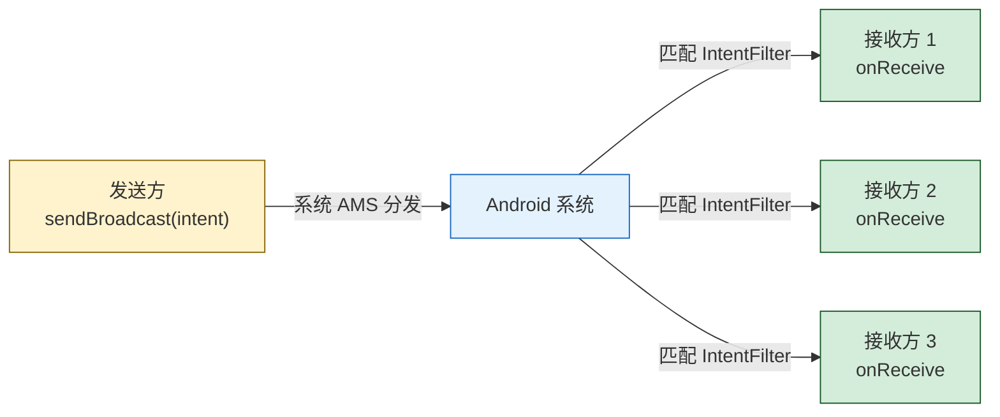
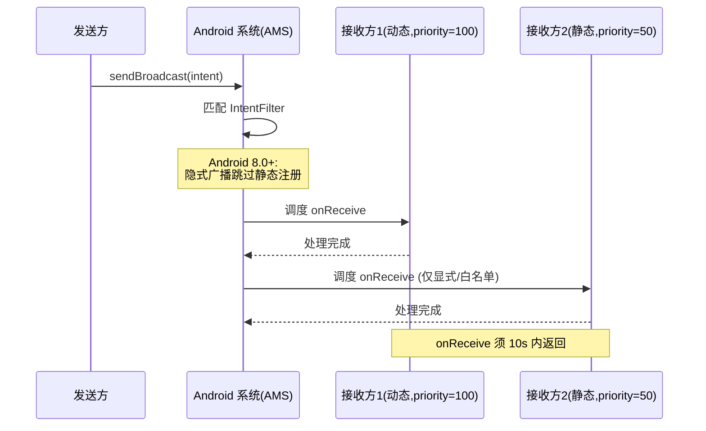

# 7.2 广播 BroadcastReceiver 使用

> [!abstract] 本节概述
> Android 的四大组件中，[[7.1 Service 服务基础、前台服务|Service]] 解决"后台运行"问题，而 **BroadcastReceiver** 解决"跨组件解耦通信"问题。它采用经典的发布-订阅模型：发送方通过 `sendBroadcast` 投递一个 Intent，所有注册了匹配 `IntentFilter` 的接收方都会被回调。本节讲解广播机制、注册方式、广播类型、Android 8.0+ 对隐式广播的限制，以及"开机自启动 + 网络状态监听"这一经典组合案例。

## 1. 广播机制：发布-订阅模型

> [!definition] 广播机制
> 广播是 Android 提供的跨组件异步消息机制，采用发布-订阅（Publish-Subscribe）模型：
> - **发送方**：调用 `sendBroadcast(intent)` 投递广播，无需知道接收方是谁
> - **接收方**：实现 `BroadcastReceiver` 并通过 `IntentFilter` 声明感兴趣的 Action
> - **匹配规则**：系统根据 Intent 的 action、category、data 与接收方的 IntentFilter 匹配，匹配成功的接收方被回调 `onReceive`



> [!warning] onReceive 在主线程执行
> BroadcastReceiver 的 `onReceive` 默认在**主线程**执行，且系统要求 **10 秒内必须返回**，否则触发 ANR。耗时操作应启动 [[7.1 Service 服务基础、前台服务|Service]] 或 `goAsync()` 异步处理，绝不能在 onReceive 中直接做网络请求。

## 2. 广播类型

### 2.1 系统广播 vs 自定义广播

| 类型 | 来源 | 典型 Action | 用途 |
| ---- | ---- | ----------- | ---- |
| 系统广播 | Android 系统 | `BOOT_COMPLETED`、`CONNECTIVITY_CHANGE`、`BATTERY_LOW`、`SCREEN_ON` | 监听系统状态变化 |
| 自定义广播 | 应用自身 | 自定义字符串（如 `com.example.MY_ACTION`） | 应用内/跨应用通信 |

> [!info] 常见系统广播 Action
> - `Intent.ACTION_BOOT_COMPLETED`：开机完成（需 `RECEIVE_BOOT_COMPLETED` 权限）
> - `ConnectivityManager.CONNECTIVITY_ACTION`：网络变化（Android 7.0+ 仅动态注册有效）
> - `Intent.ACTION_BATTERY_LOW`：电量低
> - `Intent.ACTION_SCREEN_ON` / `ACTION_SCREEN_OFF`：屏幕亮/灭（仅动态注册）
> - `Intent.ACTION_PACKAGE_ADDED`：应用安装（需 setDataScheme=package）

### 2.2 普通广播 vs 有序广播

| 维度 | 普通广播（Normal） | 有序广播（Ordered） |
| ---- | ------------------ | ------------------- |
| 发送方法 | `sendBroadcast(intent)` | `sendOrderedBroadcast(intent, permission)` |
| 接收顺序 | 并发，无顺序保证 | 按 priority 从高到低依次接收 |
| 终止传播 | 不能 | `abortBroadcast()` 可终止后续接收 |
| 传递数据 | 不能在接收方间传递 | 可通过 `setResultData` / `getResultData` 传递 |
| 典型场景 | 普通通知型广播 | 短信拦截、权限控制 |

```java
// 普通广播
Intent normal = new Intent("com.example.MY_ACTION");
sendBroadcast(normal);

// 有序广播:可设置 receiverPermission 和结果最终接收者
Intent ordered = new Intent("com.example.ORDERED_ACTION");
sendOrderedBroadcast(ordered, null);
```

```java
// 接收方设置优先级
IntentFilter filter = new IntentFilter("com.example.ORDERED_ACTION");
filter.setPriority(100);   // 数值越大越先收到,范围 -1000 ~ 1000
registerReceiver(receiver, filter);
```

## 3. 注册方式

BroadcastReceiver 有两种注册方式：

### 3.1 静态注册（AndroidManifest）

```xml
<receiver
    android:name=".receiver.BootReceiver"
    android:enabled="true"
    android:exported="true">
    <intent-filter>
        <action android:name="android.intent.action.BOOT_COMPLETED" />
    </intent-filter>
</receiver>
```

```java
public class BootReceiver extends BroadcastReceiver {
    @Override
    public void onReceive(Context context, Intent intent) {
        if (Intent.ACTION_BOOT_COMPLETED.equals(intent.getAction())) {
            // 开机后启动 Service 或 Activity
            Intent service = new Intent(context, KeepAliveService.class);
            if (Build.VERSION.SDK_INT >= Build.VERSION_CODES.O) {
                context.startForegroundService(service);
            } else {
                context.startService(service);
            }
        }
    }
}
```

### 3.2 动态注册（代码）

```java
public class MainActivity extends AppCompatActivity {
    private NetworkReceiver receiver;

    @Override
    protected void onCreate(Bundle savedInstanceState) {
        super.onCreate(savedInstanceState);
        setContentView(R.layout.activity_main);
        receiver = new NetworkReceiver();
    }

    @Override
    protected void onStart() {
        super.onStart();
        IntentFilter filter = new IntentFilter(ConnectivityManager.CONNECTIVITY_ACTION);
        registerReceiver(receiver, filter);   // 动态注册
    }

    @Override
    protected void onStop() {
        super.onStop();
        unregisterReceiver(receiver);          // 必须反注册,否则内存泄漏
    }

    private class NetworkReceiver extends BroadcastReceiver {
        @Override
        public void onReceive(Context context, Intent intent) {
            boolean connected = isNetworkAvailable(context);
            Toast.makeText(context, connected ? "网络已连接" : "网络已断开",
                Toast.LENGTH_SHORT).show();
        }
    }

    private boolean isNetworkAvailable(Context ctx) {
        ConnectivityManager cm =
            (ConnectivityManager) ctx.getSystemService(Context.CONNECTIVITY_SERVICE);
        NetworkInfo info = cm.getActiveNetworkInfo();
        return info != null && info.isConnected();
    }
}
```

### 3.3 静态注册 vs 动态注册对比

| 维度 | 静态注册 | 动态注册 |
| ---- | -------- | -------- |
| 配置位置 | AndroidManifest.xml 中 `<receiver>` | 代码 `registerReceiver(receiver, filter)` |
| 生效时机 | 应用安装后即生效（含未启动） | 仅在注册后到反注册前生效 |
| 应用未启动时 | 系统会**冷启动应用**并触发接收 | 无法接收 |
| 资源占用 | 长期占资源，影响启动速度 | 灵活可控 |
| Android 8.0+ 限制 | 大多数隐式广播**不再投递**给静态注册 | 全部支持 |
| 推荐场景 | 开机自启动、应用安装/卸载等少数 | 绝大多数业务广播 |

## 4. Android 8.0+ 对隐式广播的限制

> [!warning] 隐式广播限制
> 从 Android 8.0（API 26）起，系统对**隐式广播**的静态注册做了限制：
> - 大多数系统隐式广播（如 `CONNECTIVITY_CHANGE`）**不再投递**给清单中静态注册的接收方
> - 仅**显式广播**或少数**白名单**广播（如 `BOOT_COMPLETED`、`LOCALE_CHANGED`）仍可静态注册
> - 受限广播需改为**动态注册**或使用 [[7.4 工作任务调度基础|JobScheduler]] 监听条件
>
> 此举是为防止大量应用在系统事件时被同时唤醒，造成资源浪费。

> [!info] 仍可静态注册的广播白名单（部分）
> - `BOOT_COMPLETED`：开机完成
> - `LOCALE_CHANGED`：系统语言变化
> - `USB_DEVICE_ATTACHED` / `USB_DEVICE_DETACHED`：USB 设备插拔
> - `PACKAGE_ADDED` / `PACKAGE_REMOVED`：应用安装/卸载（需显式 data scheme）
> - 自定义广播（显式指定包名）不受限制

## 5. 自定义广播收发

### 5.1 应用内自定义广播

```java
// 发送方:发送自定义广播
public class SenderActivity extends AppCompatActivity {
    public static final String ACTION_DATA_READY = "com.example.ACTION_DATA_READY";

    public void sendDataBroadcast(String data) {
        Intent intent = new Intent(ACTION_DATA_READY);
        intent.putExtra("data", data);
        // Android 8.0+ 显式指定包名,确保投递给静态注册接收方
        intent.setPackage(getPackageName());
        sendBroadcast(intent);
    }
}
```

```xml
<!-- 静态注册:仅在 setPackage 显式指定包名时才能在 8.0+ 收到 -->
<receiver android:name=".receiver.DataReceiver" android:exported="false">
    <intent-filter>
        <action android:name="com.example.ACTION_DATA_READY" />
    </intent-filter>
</receiver>
```

```java
// 接收方
public class DataReceiver extends BroadcastReceiver {
    @Override
    public void onReceive(Context context, Intent intent) {
        String data = intent.getStringExtra("data");
        Log.d("DataReceiver", "收到数据: " + data);
    }
}
```

### 5.2 有序广播数据传递

```java
// 发送有序广播
Intent intent = new Intent("com.example.ORDERED_DATA");
sendOrderedBroadcast(intent, null);

// 高优先级接收方:修改并传递结果
public class HighPriorityReceiver extends BroadcastReceiver {
    @Override
    public void onReceive(Context context, Intent intent) {
        setResultData("经过高优先级处理: " + "原始数据");
        // abortBroadcast();   // 调用此方法可终止后续接收方
    }
}

// 低优先级接收方:获取前一个结果
public class LowPriorityReceiver extends BroadcastReceiver {
    @Override
    public void onReceive(Context context, Intent intent) {
        String result = getResultData();
        Log.d("LowPriority", "收到传递数据: " + result);
    }
}
```

## 6. 本地广播 LocalBroadcast

> [!definition] 本地广播
> `LocalBroadcastManager` 是 Support/AndroidX 库提供的"应用内广播"机制，广播仅在应用进程内传播，不跨进程、不被其他应用监听，效率更高且更安全。

```java
// 使用 LocalBroadcastManager
LocalBroadcastManager lbm = LocalBroadcastManager.getInstance(this);

// 注册
IntentFilter filter = new IntentFilter("com.example.LOCAL_ACTION");
lbm.registerReceiver(receiver, filter);

// 发送
lbm.sendBroadcast(new Intent("com.example.LOCAL_ACTION"));

// 反注册
lbm.unregisterReceiver(receiver);
```

> [!note] LocalBroadcastManager 已弃用
> 自 AndroidX 1.1.0 起，`LocalBroadcastManager` 已被标记为废弃，官方推荐使用 `LiveData` 或 `Flow` 实现应用内通信。但理解其设计思想对掌握广播机制仍重要，且老项目仍在使用。

## 7. 广播发送与接收时序



## 8. 案例：开机自启动 + 网络状态监听

> [!example] 完整流程
> 用户安装应用后，开机时应用自动启动一个保活 [[7.1 Service 服务基础、前台服务|Service]]；当网络状态变化（连/断/Wi-Fi 切到 4G）时，应用能即时感知并提示用户。

### 8.1 开机自启动（静态注册）

```xml
<!-- AndroidManifest.xml -->
<uses-permission android:name="android.permission.RECEIVE_BOOT_COMPLETED" />

<receiver
    android:name=".receiver.BootReceiver"
    android:enabled="true"
    android:exported="true">
    <intent-filter>
        <action android:name="android.intent.action.BOOT_COMPLETED" />
    </intent-filter>
</receiver>
```

```java
public class BootReceiver extends BroadcastReceiver {
    @Override
    public void onReceive(Context context, Intent intent) {
        if (Intent.ACTION_BOOT_COMPLETED.equals(intent.getAction())) {
            Log.d("BootReceiver", "开机完成,启动保活 Service");
            Intent service = new Intent(context, KeepAliveService.class);
            if (Build.VERSION.SDK_INT >= Build.VERSION_CODES.O) {
                context.startForegroundService(service);
            } else {
                context.startService(service);
            }
        }
    }
}
```

### 8.2 网络状态监听（动态注册）

```java
public class NetworkMonitor {
    private final Context context;
    private NetworkReceiver receiver;

    public NetworkMonitor(Context ctx) {
        this.context = ctx.getApplicationContext();
    }

    public void register() {
        receiver = new NetworkReceiver();
        IntentFilter filter = new IntentFilter(ConnectivityManager.CONNECTIVITY_ACTION);
        // Android 7.0+ CONNECTIVITY_CHANGE 仅动态注册有效
        context.registerReceiver(receiver, filter);
    }

    public void unregister() {
        if (receiver != null) {
            context.unregisterReceiver(receiver);
            receiver = null;
        }
    }

    private class NetworkReceiver extends BroadcastReceiver {
        @Override
        public void onReceive(Context context, Intent intent) {
            ConnectivityManager cm = (ConnectivityManager)
                context.getSystemService(Context.CONNECTIVITY_SERVICE);
            NetworkInfo info = cm.getActiveNetworkInfo();
            if (info != null && info.isConnected()) {
                int type = info.getType();
                String name = type == ConnectivityManager.TYPE_WIFI ? "Wi-Fi" : "移动数据";
                Toast.makeText(context, "网络已切换到: " + name, Toast.LENGTH_SHORT).show();
            } else {
                Toast.makeText(context, "网络已断开", Toast.LENGTH_SHORT).show();
            }
        }
    }
}
```

> [!info] Android 7.0 后监听网络的推荐做法
> Android 7.0（API 24）起，`CONNECTIVITY_ACTION` 静态注册失效。Android 10+ 推荐使用 `ConnectivityManager.NetworkCallback` 替代广播监听网络变化，更精确且节省资源。但 BroadcastReceiver 监听网络变化仍是基础考点。

### 8.3 在 Application 中统一注册

```java
public class App extends Application {
    private NetworkMonitor monitor;

    @Override
    public void onCreate() {
        super.onCreate();
        monitor = new NetworkMonitor(this);
        monitor.register();
    }
}
```

## 9. 易错点与最佳实践

> [!warning] 常见易错点
> 1. **onReceive 中做耗时操作**：超过 10 秒触发 ANR
> 2. **动态注册后忘记 unregisterReceiver**：导致接收方泄漏，Activity 销毁后仍被回调
> 3. **Android 8.0+ 隐式广播静态注册失效**：清单声明了但收不到广播
> 4. **跨应用广播未设置 exported**：被其他应用恶意伪造广播触发
> 5. **静态注册接收方冷启动应用**：onReceive 中初始化大量资源导致 ANR
> 6. **重复注册同一个 receiver**：会触发 `IllegalArgumentException`
> 7. **registerReceiver 重复调用**：注册后再次 register 会报错

> [!tip] 最佳实践
> - 耗时操作在 onReceive 中调用 `goAsync()` 获取 `PendingResult`，或启动 [[7.1 Service 服务基础、前台服务|Service]]
> - 业务广播使用动态注册，仅在注册周期内生效
> - 自定义广播使用 `setPackage(getPackageName())` 显式指定包名，避免被其他应用监听
> - 跨应用广播必须使用 `sendBroadcast(intent, receiverPermission)` 配合权限校验
> - 应用内通信考虑使用 `LocalBroadcastManager`（旧项目）或 `LiveData`/`Flow`（新项目）
> - 接收方类名稳定，避免 Manifest 类名变更导致注册失效

## 章节导航

- 上级：[[MOC - 第7章|第7章 后台服务与消息通知]]
- 上一节：[[7.1 Service 服务基础、前台服务|7.1 Service 服务基础、前台服务]]
- 下一节：[[7.3 Notification 通知实现|7.3 Notification 通知实现]]
- 习题：[[MOC - 第7章习题|第7章习题]]
