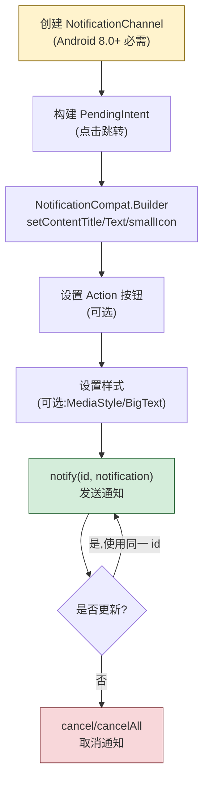
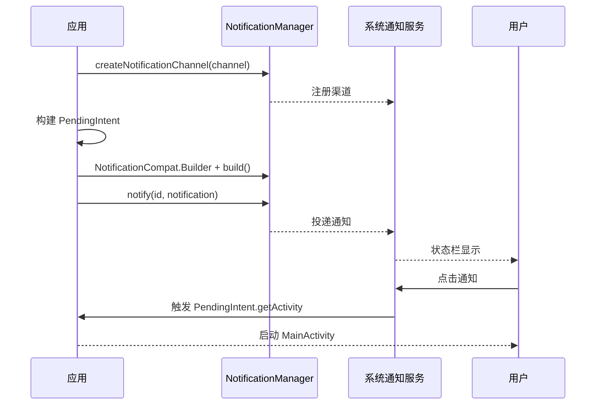

# 7.3 Notification 通知实现

> [!abstract] 本节概述
> Notification 是 Android 提供的"在应用界面之外向用户传达信息"的机制，是 [[7.1 Service 服务基础、前台服务|前台服务]] 的强制配套——前台 Service 必须显示一条常驻通知。本节解决三个核心问题：(1) Android 8.0+ 起 NotificationChannel 为何成为强制要求，如何创建与配置；(2) 如何用 `NotificationCompat.Builder` 构建基础通知、点击跳转、操作按钮、多种样式；(3) 如何更新、取消与管理已发出的通知。

## 1. Notification 的作用

> [!definition] Notification 核心作用
> Notification（通知）是 Android 在系统状态栏、通知抽屉、锁屏上向用户展示信息的机制，主要用途：
> - **用户通知**：消息推送、来电、短信、下载完成等事件提醒
> - **前台服务必需**：[[7.1 Service 服务基础、前台服务|前台 Service]] 必须显示一条常驻通知，表明服务正在运行
> - **后台提醒**：定时任务完成、闹钟触发等
> - **进度展示**：下载进度、上传进度等长耗时操作的实时反馈

> [!warning] 通知滥用会被用户禁用
> 通知会打断用户、消耗电量，Android 提供了"通知渠道级开关"让用户精确控制。应用频繁推送低价值通知会导致用户在系统设置中禁用整个渠道，此后即便发也无效。设计通知时应区分渠道重要性，避免打扰。

## 2. NotificationChannel：Android 8.0+ 强制要求

> [!definition] NotificationChannel
> NotificationChannel（通知渠道）是 Android 8.0（API 26）引入的概念，每个通知必须归属到一个渠道。渠道一旦创建，其**重要性级别、声音、震动等行为由用户在系统设置中控制，应用不可修改**。同一渠道的通知共享同一组行为配置。

### 2.1 重要性级别

| 级别 | 常量 | 用户感知 | 典型用途 |
| ---- | ---- | -------- | -------- |
| 高 | `IMPORTANCE_HIGH` | 发出声音 + 横幅通知（弹出在屏幕顶部） | 紧急消息、来电 |
| 默认 | `IMPORTANCE_DEFAULT` | 发出声音，无横幅 | 普通聊天消息 |
| 低 | `IMPORTANCE_LOW` | 状态栏图标，无声音，通知抽屉中显示 | 后台下载进度 |
| 最低 | `IMPORTANCE_MIN` | 无声音，折叠到通知抽屉底部 | 系统更新、广告 |

### 2.2 创建渠道

```java
public class App extends Application {
    public static final String CHANNEL_MSG_ID   = "message";
    public static final String CHANNEL_MUSIC_ID = "music_playback";
    public static final String CHANNEL_DL_ID    = "download";

    @Override
    public void onCreate() {
        super.onCreate();
        createChannels();
    }

    private void createChannels() {
        if (Build.VERSION.SDK_INT < Build.VERSION_CODES.O) return;

        NotificationManager nm = getSystemService(NotificationManager.class);

        // 消息渠道:高优先级,有声音 + 横幅
        NotificationChannel msgCh = new NotificationChannel(
            CHANNEL_MSG_ID, "消息通知", NotificationManager.IMPORTANCE_HIGH);
        msgCh.setDescription("聊天消息、系统通知");
        msgCh.enableLights(true);
        msgCh.setLightColor(Color.RED);
        msgCh.enableVibration(true);

        // 音乐播放渠道:低优先级,不打扰
        NotificationChannel musicCh = new NotificationChannel(
            CHANNEL_MUSIC_ID, "音乐播放", NotificationManager.IMPORTANCE_LOW);

        // 下载渠道:低优先级
        NotificationChannel dlCh = new NotificationChannel(
            CHANNEL_DL_ID, "下载任务", NotificationManager.IMPORTANCE_LOW);

        nm.createNotificationChannel(msgCh);
        nm.createNotificationChannel(musicCh);
        nm.createNotificationChannel(dlCh);
    }
}
```

> [!tip] 渠道创建要点
> - 渠道**只需创建一次**，重复创建不会报错也不会覆盖已有配置
> - 渠道一旦创建，应用**不能修改**其重要性级别（防止应用绕过用户控制），只能让用户在系统设置中修改
> - 删除渠道：`deleteNotificationChannel(id)`，但已删除渠道的通知行为会被重置
> - 应在 `Application.onCreate` 中统一创建，确保发送通知前渠道已存在

## 3. Notification 创建流程



## 4. 基础通知

```java
public class NotifyHelper {
    private final Context context;
    private final NotificationManager nm;

    public NotifyHelper(Context ctx) {
        this.context = ctx.getApplicationContext();
        this.nm = (NotificationManager) context.getSystemService(Context.NOTIFICATION_SERVICE);
    }

    private static final int NOTIFY_ID = 1001;

    public void sendBasic(String title, String content) {
        // 点击跳转的 PendingIntent
        Intent intent = new Intent(context, MainActivity.class);
        intent.setFlags(Intent.FLAG_ACTIVITY_NEW_TASK | Intent.FLAG_ACTIVITY_CLEAR_TOP);
        PendingIntent pi = PendingIntent.getActivity(context, 0, intent,
            PendingIntent.FLAG_IMMUTABLE);

        Notification notification = new NotificationCompat.Builder(context, App.CHANNEL_MSG_ID)
            .setContentTitle(title)
            .setContentText(content)
            .setSmallIcon(R.drawable.ic_notification)   // 必填:状态栏小图标
            .setLargeIcon(BitmapFactory.decodeResource(
                context.getResources(), R.drawable.ic_avatar))
            .setContentIntent(pi)                       // 点击跳转
            .setAutoCancel(true)                        // 点击后自动消失
            .build();

        nm.notify(NOTIFY_ID, notification);
    }
}
```

> [!note] 必填项
> - **`setSmallIcon`**：必填，状态栏小图标，建议使用透明 PNG/SVG
> - **`setContentTitle`**：必填，通知标题
> - **渠道 ID**：Android 8.0+ 必须指向已创建的渠道，否则通知不显示（无报错）

## 5. PendingIntent：通知点击

> [!definition] PendingIntent
> PendingIntent 是"已封装好 Intent 与执行权限的令牌"，可交给其他应用（如系统 NotificationManager）在未来某个时刻以你的名义执行。它解决的是"系统在用户点击通知时，能以本应用身份启动指定 Activity/Service/广播"。

| 静态方法 | 用途 |
| -------- | ---- |
| `PendingIntent.getActivity(...)` | 启动 Activity |
| `PendingIntent.getService(...)` | 启动 Service |
| `PendingIntent.getBroadcast(...)` | 发送广播 |

> [!warning] FLAG_IMMUTABLE 强制要求
> Android 12（API 31）起，创建 PendingIntent **必须显式指定** `FLAG_IMMUTABLE` 或 `FLAG_MUTABLE`：
> - `FLAG_IMMUTABLE`：PendingIntent 内容不可变（推荐，更安全）
> - `FLAG_MUTABLE`：可被其他应用修改（仅用于需要动态更新的场景，如媒体控制按钮）
>
> 未指定会抛 `IllegalArgumentException`。安全优先，能用 IMMUTABLE 就用 IMMUTABLE。

```java
// 标准做法:不可变 PendingIntent
PendingIntent pi = PendingIntent.getActivity(context, 0, intent,
    PendingIntent.FLAG_IMMUTABLE | PendingIntent.FLAG_UPDATE_CURRENT);
```

## 6. 通知操作按钮

```java
public void sendWithAction(String title, String content) {
    Intent contentIntent = new Intent(context, MainActivity.class);
    PendingIntent contentPi = PendingIntent.getActivity(context, 0, contentIntent,
        PendingIntent.FLAG_IMMUTABLE);

    // 操作 1:回复(使用 RemoteInput,需 FLAG_MUTABLE)
    Intent replyIntent = new Intent(context, ReplyReceiver.class);
    PendingIntent replyPi = PendingIntent.getBroadcast(context, 1, replyIntent,
        PendingIntent.FLAG_MUTABLE);

    // 操作 2:标记已读
    Intent readIntent = new Intent(context, ReadReceiver.class);
    PendingIntent readPi = PendingIntent.getBroadcast(context, 2, readIntent,
        PendingIntent.FLAG_IMMUTABLE);

    Notification notification = new NotificationCompat.Builder(context, App.CHANNEL_MSG_ID)
        .setContentTitle(title)
        .setContentText(content)
        .setSmallIcon(R.drawable.ic_notification)
        .setContentIntent(contentPi)
        .addAction(R.drawable.ic_reply, "回复", replyPi)
        .addAction(R.drawable.ic_read,   "已读", readPi)
        .setAutoCancel(true)
        .build();

    nm.notify(NOTIFY_ID, notification);
}
```

## 7. 通知样式

### 7.1 大文本样式 BigTextStyle

```java
Notification n = new NotificationCompat.Builder(context, App.CHANNEL_MSG_ID)
    .setSmallIcon(R.drawable.ic_notification)
    .setContentTitle("长文本通知")
    .setStyle(new NotificationCompat.BigTextStyle()
        .bigText("这是一段很长的通知正文内容，通知抽屉展开后会显示完整文本，" +
                 "折叠时仅显示前两行作为预览，方便用户在不展开的情况下判断通知重要性。"))
    .build();
```

### 7.2 大图片样式 BigPictureStyle

```java
Notification n = new NotificationCompat.Builder(context, App.CHANNEL_MSG_ID)
    .setSmallIcon(R.drawable.ic_notification)
    .setContentTitle("图片消息")
    .setStyle(new NotificationCompat.BigPictureStyle()
        .bigPicture(BitmapFactory.decodeResource(context.getResources(), R.drawable.big_pic))
        .bigLargeIcon(null))
    .build();
```

### 7.3 收件箱样式 InboxStyle

```java
Notification n = new NotificationCompat.Builder(context, App.CHANNEL_MSG_ID)
    .setSmallIcon(R.drawable.ic_notification)
    .setContentTitle("3 条新消息")
    .setStyle(new NotificationCompat.InboxStyle()
        .addLine("Alice:  晚上一起吃饭吗?")
        .addLine("Bob:    代码已合并,请 review")
        .addLine("Tom:    项目明天上线")
        .setSummaryText("示例邮箱"))
    .build();
```

### 7.4 MediaStyle 媒体样式

```java
Notification n = new NotificationCompat.Builder(context, App.CHANNEL_MUSIC_ID)
    .setSmallIcon(R.drawable.ic_music)
    .setContentTitle("正在播放")
    .setContentText("稻香 - 周杰伦")
    .addAction(R.drawable.ic_prev, "上一首", prevPi)
    .addAction(R.drawable.ic_pause, "暂停", pausePi)
    .addAction(R.drawable.ic_next, "下一首", nextPi)
    .setStyle(new androidx.media.app.NotificationCompat.MediaStyle()
        .setShowActionsInCompactView(0, 1, 2))   // 紧凑视图显示 3 个按钮
    .build();
```

## 8. 通知更新与取消

```java
// 更新通知:使用同一 ID 再次 notify
public void updateProgress(int progress) {
    Notification n = new NotificationCompat.Builder(context, App.CHANNEL_DL_ID)
        .setSmallIcon(R.drawable.ic_download)
        .setContentTitle("正在下载")
        .setContentText("进度: " + progress + "%")
        .setProgress(100, progress, false)   // 不确定进度时第三参传 true
        .setOngoing(true)                    // 不可滑动清除
        .build();
    nm.notify(NOTIFY_ID, n);   // 同 ID 覆盖原通知
}

// 取消单条
nm.cancel(NOTIFY_ID);

// 取消全部
nm.cancelAll();

// 作为前台 Service 通知取消时,需同时调用 stopForeground
// stopForeground(STOP_FOREGROUND_REMOVE);  // Android 13+
// stopForeground(true);                    // 旧版本
```

> [!tip] 进度通知注意事项
> - 下载进度通知用 `setProgress(100, current, false)` 显示精确进度
> - 完成后调用 `setProgress(0, 0, false)` 清除进度条
> - 进度更新频率控制在每秒 1~2 次，过高会卡 UI
> - `setOngoing(true)` 让通知不可滑动清除，适合下载/播放中

## 9. 通知完整创建时序



## 10. 案例：消息推送通知

> [!example] 完整流程
> 应用收到服务器推送的聊天消息，根据消息类型显示不同样式的通知：
> - 普通消息：基础通知 + 回复按钮
> - 图片消息：大图片样式
> - 多条消息合并：InboxStyle 显示

```java
public class MessageNotifier {
    private final Context context;
    private final NotificationManager nm;
    private static final int CHAT_NOTIFY_ID = 2001;

    public MessageNotifier(Context ctx) {
        this.context = ctx.getApplicationContext();
        this.nm = (NotificationManager) context.getSystemService(Context.NOTIFICATION_SERVICE);
    }

    /** 普通消息通知 + 回复按钮 */
    public void notifyTextMessage(String sender, String content) {
        Intent contentIntent = new Intent(context, ChatActivity.class);
        contentIntent.putExtra("sender", sender);
        PendingIntent contentPi = PendingIntent.getActivity(context, 0, contentIntent,
            PendingIntent.FLAG_IMMUTABLE | PendingIntent.FLAG_UPDATE_CURRENT);

        Notification n = new NotificationCompat.Builder(context, App.CHANNEL_MSG_ID)
            .setSmallIcon(R.drawable.ic_msg)
            .setContentTitle(sender)
            .setContentText(content)
            .setContentIntent(contentPi)
            .setAutoCancel(true)
            .setPriority(NotificationCompat.PRIORITY_HIGH)   // < 8.0 兼容
            .build();
        nm.notify(CHAT_NOTIFY_ID, n);
    }

    /** 多条消息合并为 InboxStyle */
    public void notifyMultiple(List<String> messages) {
        NotificationCompat.InboxStyle style = new NotificationCompat.InboxStyle();
        for (String m : messages) style.addLine(m);
        style.setSummaryText("共 " + messages.size() + " 条消息");

        Intent intent = new Intent(context, MessageListActivity.class);
        PendingIntent pi = PendingIntent.getActivity(context, 0, intent,
            PendingIntent.FLAG_IMMUTABLE);

        Notification n = new NotificationCompat.Builder(context, App.CHANNEL_MSG_ID)
            .setSmallIcon(R.drawable.ic_msg)
            .setContentTitle("新消息")
            .setStyle(style)
            .setContentIntent(pi)
            .setAutoCancel(true)
            .build();
        nm.notify(CHAT_NOTIFY_ID, n);
    }

    /** 取消通知 */
    public void cancel() {
        nm.cancel(CHAT_NOTIFY_ID);
    }
}
```

## 11. 前台服务通知（与 7.1 联动）

```java
// 在 Service 中使用,与 [[7.1 Service 服务基础、前台服务|7.1]] 配合
public class MusicService extends Service {
    @Override
    public int onStartCommand(Intent intent, int flags, int startId) {
        Notification n = new NotificationCompat.Builder(this, App.CHANNEL_MUSIC_ID)
            .setContentTitle("音乐播放器")
            .setContentText("正在播放")
            .setSmallIcon(R.drawable.ic_music)
            .setContentIntent(buildContentIntent())
            .addAction(R.drawable.ic_pause, "暂停", buildPauseIntent())
            .setOngoing(true)   // 不可滑动清除
            .build();
        startForeground(1001, n);   // 关键:绑定前台服务
        return START_STICKY;
    }
}
```

## 12. 易错点与最佳实践

> [!warning] 常见易错点
> 1. **Android 8.0+ 未创建渠道直接发通知**：通知不显示，且无报错，难以排查
> 2. **未调用 `setSmallIcon`**：通知不显示
> 3. **Android 12+ PendingIntent 未指定 FLAG_IMMUTABLE/MUTABLE**：抛 IllegalArgumentException
> 4. **渠道 ID 与创建时不一致**：通知不显示
> 5. **使用相同 ID 但希望叠加多条通知**：会被覆盖，每个独立通知应使用唯一 ID
> 6. **`setOngoing(true)` 滥用**：让用户无法清除，体验差
> 7. **进度通知更新过于频繁**：卡 UI、耗电
> 8. **未设置 `setContentIntent`**：点击通知无反应

> [!tip] 最佳实践
> - 渠道按"用户视角的重要性"分类，让用户能精细控制
> - 高优先级通知用 `IMPORTANCE_HIGH` 并设置 `setPriority(PRIORITY_HIGH)`（兼容旧版本）
> - 长文本用 BigTextStyle，图片用 BigPictureStyle，避免 setContentText 截断
> - 进度通知使用同一 ID 反复 `notify` 更新，完成后用 `setProgress(0,0,false)`
> - 前台服务通知必须 `setOngoing(true)`，与 [[7.1 Service 服务基础、前台服务|7.1]] 配合
> - 通知点击必须设置 `setContentIntent`，并使用 `FLAG_IMMUTABLE`
> - 通知 ID 全局唯一，建议封装常量类管理
> - 兼容 Android 13+ 通知权限 `POST_NOTIFICATIONS`，需运行时申请

## 章节导航

- 上级：[[MOC - 第7章|第7章 后台服务与消息通知]]
- 上一节：[[7.2 广播 BroadcastReceiver 使用|7.2 广播 BroadcastReceiver 使用]]
- 下一节：[[7.4 工作任务调度基础|7.4 工作任务调度基础]]
- 习题：[[MOC - 第7章习题|第7章习题]]
