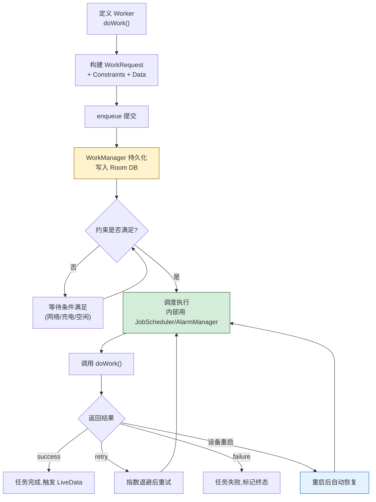

# 7.4 工作任务调度基础

> [!abstract] 本节概述
> [[7.1 Service 服务基础、前台服务|Service]] 适合"用户感知且需要持续运行"的任务，但很多后台任务既不需要常驻、也允许延迟——只要满足某些条件（充电、Wi-Fi、空闲）就能执行：定时同步数据、上传日志、预缓存资源。Android 先后提供了 **AlarmManager**、**JobScheduler**、**WorkManager** 三套调度方案。本节讲解三者的设计目标、API 用法与选型建议，重点掌握 Jetpack **WorkManager** 的 OneTimeWorkRequest、PeriodicWorkRequest 与约束条件配置。

## 1. 后台任务调度的需求

> [!definition] 任务调度的三类需求
> 相比直接启动 [[7.1 Service 服务基础、前台服务|Service]]，调度类方案解决"何时、何条件、何频率执行"的问题：
> - **延迟执行**：5 分钟后发送心跳、每天 8 点推送日报
> - **条件触发**：仅在网络可用 + 充电时同步大文件
> - **系统优化**：让系统在合适窗口批量执行，省电省流量（Doze 模式适配）

| 调度需求 | 推荐方案 |
| -------- | -------- |
| 精确时间触发（闹钟） | AlarmManager（精确闹钟） |
| 条件触发，可延迟 | JobScheduler / WorkManager |
| 持久化、可重启 | WorkManager |
| 持续运行、用户可见 | [[7.1 Service 服务基础、前台服务|前台 Service]] |

## 2. AlarmManager：定时任务

> [!definition] AlarmManager
> AlarmManager 是 Android 最早的定时任务 API，通过系统底层定时机制在指定时间唤醒应用。它的特点是"系统级"——即使应用进程被杀，到时间也会被唤醒。

| 类型 | 行为 | 是否精确 |
| ---- | ---- | -------- |
| `RTC_WAKEUP` | 唤醒设备 + 触发 | 精确 |
| `RTC` | 不唤醒设备，下次唤醒时触发 | 不精确 |
| `ELAPSED_REALTIME_WAKEUP` | 唤醒设备，从开机起算 | 精确 |
| `ELAPSED_REALTIME` | 不唤醒设备，从开机起算 | 不精确 |

> [!warning] Android 12+ 精确闹钟限制
> 从 Android 12（API 31）起，普通应用**默认不能使用精确闹钟**（`setExact` / `setExactAndAllowWhileIdle`）。必须在 Manifest 声明 `SCHEDULE_EXACT_ALARM` 权限，且需用户在系统设置中授权。仅闹钟、日历提醒等"用户预期精确触发"的场景才允许使用，否则应改用 `set()` / `setAndAllowWhileIdle()` 的不精确版本。

```java
public class AlarmScheduler {
    private final Context context;
    private final AlarmManager am;

    public AlarmScheduler(Context ctx) {
        this.context = ctx.getApplicationContext();
        this.am = (AlarmManager) context.getSystemService(Context.ALARM_SERVICE);
    }

    /** 设定 5 分钟后触发(不精确,省电) */
    public void scheduleIn5Min() {
        Intent intent = new Intent(context, AlarmReceiver.class);
        PendingIntent pi = PendingIntent.getBroadcast(context, 0, intent,
            PendingIntent.FLAG_IMMUTABLE);

        long triggerAt = System.currentTimeMillis() + 5 * 60 * 1000;
        // setAndAllowWhileIdle:Doze 模式下允许触发的窗口
        am.setAndAllowWhileIdle(AlarmManager.RTC_WAKEUP, triggerAt, pi);
    }

    /** 精确触发(Android 12+ 需 SCHEDULE_EXACT_ALARM 权限) */
    public void scheduleExact(long triggerAt) {
        Intent intent = new Intent(context, AlarmReceiver.class);
        PendingIntent pi = PendingIntent.getBroadcast(context, 1, intent,
            PendingIntent.FLAG_IMMUTABLE);
        if (Build.VERSION.SDK_INT >= Build.VERSION_CODES.M) {
            am.setExactAndAllowWhileIdle(AlarmManager.RTC_WAKEUP, triggerAt, pi);
        } else {
            am.setExact(AlarmManager.RTC_WAKEUP, triggerAt, pi);
        }
    }

    /** 重复触发:Android 4.4+ setRepeating 已不精确,推荐用 set + 自重新调度 */
    public void scheduleRepeat(long interval) {
        Intent intent = new Intent(context, AlarmReceiver.class);
        PendingIntent pi = PendingIntent.getBroadcast(context, 2, intent,
            PendingIntent.FLAG_IMMUTABLE);
        // 注意:setRepeating 在 4.4+ 不再保证精确
        am.setRepeating(AlarmManager.RTC_WAKEUP,
            System.currentTimeMillis() + interval,
            interval, pi);
    }
}
```

```java
public class AlarmReceiver extends BroadcastReceiver {
    @Override
    public void onReceive(Context context, Intent intent) {
        // 处理定时任务,耗时操作需启动 Service
        Log.d("Alarm", "定时任务触发");
    }
}
```

> [!note] AlarmManager 不足
> - **不持久化**：设备重启后所有闹钟失效，需监听 `BOOT_COMPLETED` 重新注册
> - **无约束条件**：无法指定"仅在 Wi-Fi + 充电时触发"
> - **Doze 模式适配差**：精确闹钟会打断 Doze 影响省电
> - **不支持任务链**：无法定义任务依赖

## 3. JobScheduler：条件触发调度

> [!definition] JobScheduler
> JobScheduler 是 Android 5.0（API 21）引入的调度框架，允许应用声明"任务 + 约束条件 + 触发时机"，由系统在合适窗口统一调度。它专门为省电设计，是 [[7.4 工作任务调度基础|Android 8.0+ 后台任务]] 的推荐方案之一。

```java
public class SyncJobScheduler {
    private static final int JOB_ID = 1001;
    private final Context context;
    private final JobScheduler scheduler;

    public SyncJobScheduler(Context ctx) {
        this.context = ctx.getApplicationContext();
        this.scheduler = (JobScheduler) context.getSystemService(Context.JOB_SCHEDULER_SERVICE);
    }

    public void scheduleSync() {
        ComponentName service = new ComponentName(context, SyncJobService.class);
        JobInfo job = new JobInfo.Builder(JOB_ID, service)
            .setRequiredNetworkType(JobInfo.NETWORK_TYPE_UNMETERED)  // 仅 Wi-Fi(不限量网络)
            .setRequiresCharging(true)                                // 仅充电时
            .setRequiresDeviceIdle(false)                             // 不要求空闲
            .setPeriodic(15 * 60 * 1000)                             // 每 15 分钟
            .setPersisted(true)                                       // 重启后保留
            .build();
        scheduler.schedule(job);
    }

    public void cancel() {
        scheduler.cancel(JOB_ID);
    }
}
```

```java
public class SyncJobService extends JobService {
    @Override
    public boolean onStartJob(JobParameters params) {
        // 在主线程,耗时操作需另开线程
        new Thread(() -> {
            doSync();   // 执行同步逻辑
            jobFinished(params, false);   // false=不需要重试
        }).start();
        return true;   // true 表示任务在异步执行
    }

    @Override
    public boolean onStopJob(JobParameters params) {
        // 系统要求停止任务时回调(如约束条件不再满足)
        return true;    // true 表示希望系统重新调度
    }
}
```

```xml
<!-- Manifest 声明 Service,需 BIND_JOB_SCHEDULER 权限 -->
<service
    android:name=".service.SyncJobService"
    android:permission="android.permission.BIND_JOB_SCHEDULER"
    android:exported="false" />
```

> [!note] JobScheduler 不足
> - 仅支持 API 21+
> - API 与平台强绑定，跨版本兼容需自己写
> - 不支持任务链（每个 Job 独立）
> - JetBrains/Android 官方推荐改用 WorkManager 统一处理

## 4. WorkManager：Jetpack 持久化调度

> [!definition] WorkManager
> WorkManager 是 AndroidX/Jetpack 提供的任务调度组件，是 Android 官方推荐的**后台持久化任务**方案。它的特点：
> - **向后兼容**：内部自动选择 JobScheduler（API 21+）、AlarmManager + BroadcastReceiver（API 14+），开发者只需用一套 API
> - **持久化**：任务持久化到 Room 数据库，应用或设备重启后自动恢复执行
> - **约束条件**：支持网络、充电、存储、电量等约束
> - **任务链**：可串联多个 WorkRequest，定义执行顺序
> - **结果传递**：通过 `Result.success(outputData)` 在任务间传递数据

### 4.1 WorkManager 任务类型

| 类型 | 触发方式 | 最小周期 | 适用场景 |
| ---- | -------- | -------- | -------- |
| `OneTimeWorkRequest` | 一次性，约束满足后立即执行 | —— | 一次性上传、缓存预热 |
| `PeriodicWorkRequest` | 周期性重复执行 | **15 分钟** | 定时同步、心跳上报 |

> [!warning] PeriodicWorkRequest 限制
> - 周期最小值为 **15 分钟**，更短会被强制对齐到 15 分钟
> - 周期任务**不支持初始延迟**和**约束后延迟**，仅在约束满足时执行
> - 同名 unique work 的 PeriodicWorkRequest 只能有一个实例

### 4.2 约束条件 Constraints

```java
Constraints constraints = new Constraints.Builder()
    .setRequiredNetworkType(NetworkType.UNMETERED)  // 仅 Wi-Fi
    .setRequiresCharging(true)                       // 仅充电时
    .setRequiresBatteryNotLow(true)                  // 电量不低
    .setRequiresStorageNotLow(true)                  // 存储不低
    .setRequiresDeviceIdle(false)                    // 不要求空闲
    .build();
```

### 4.3 定义 Worker

```java
public class UploadWorker extends Worker {
    public UploadWorker(Context context, WorkerParameters params) {
        super(context, params);
    }

    @NonNull
    @Override
    public Result doWork() {
        try {
            String data = getInputData().getString("file_path");
            boolean success = doUpload(data);

            if (success) {
                Data output = new Data.Builder()
                    .putString("result_url", "https://cdn.example.com/x.jpg")
                    .build();
                return Result.success(output);
            } else {
                return Result.retry();   // 系统会按指数退避重试
            }
        } catch (Exception e) {
            return Result.failure();
        }
    }

    private boolean doUpload(String path) {
        // 实际上传逻辑,见 [[6.4 OkHttp 等网络框架基础|6.4]]
        return true;
    }
}
```

### 4.4 调度任务

```java
public class SyncScheduler {
    public static final String WORK_UPLOAD = "upload_work";
    public static final String WORK_SYNC   = "periodic_sync";

    /** 一次性上传任务 */
    public static void enqueueUpload(String filePath) {
        Data input = new Data.Builder()
            .putString("file_path", filePath)
            .build();

        Constraints constraints = new Constraints.Builder()
            .setRequiredNetworkType(NetworkType.CONNECTED)
            .build();

        OneTimeWorkRequest uploadWork = new OneTimeWorkRequest.Builder(UploadWorker.class)
            .setInputData(input)
            .setConstraints(constraints)
            .setInitialDelay(10, TimeUnit.SECONDS)   // 10 秒后开始
            .setBackoffCriteria(BackoffPolicy.EXPONENTIAL,
                OneTimeWorkRequest.MIN_BACKOFF_MILLIS, TimeUnit.MILLISECONDS)
            .addTag("upload")
            .build();

        WorkManager.getInstance(context)
            .enqueueUniqueWork(WORK_UPLOAD, ExistingWorkPolicy.REPLACE, uploadWork);
    }

    /** 周期同步任务:每 30 分钟一次,需充电 + Wi-Fi */
    public static void enqueuePeriodicSync() {
        Constraints constraints = new Constraints.Builder()
            .setRequiredNetworkType(NetworkType.UNMETERED)
            .setRequiresCharging(true)
            .build();

        PeriodicWorkRequest syncWork = new PeriodicWorkRequest.Builder(SyncWorker.class,
                30, TimeUnit.MINUTES)               // 周期 30 分钟
            .setConstraints(constraints)
            .addTag("sync")
            .build();

        // 同名任务只保留一个,新装应用替换旧的
        WorkManager.getInstance(context)
            .enqueueUniquePeriodicWork(WORK_SYNC,
                ExistingPeriodicWorkPolicy.KEEP, syncWork);
    }
}
```

### 4.5 任务链

```java
// 任务 A -> B -> C 串联执行,传递中间结果
WorkManager.getInstance(context)
    .beginWith(workA)
    .then(workB)
    .then(workC)
    .enqueue();

// 并行分支后合并
WorkManager.getInstance(context)
    .beginWith(Arrays.asList(workA1, workA2))
    .then(workB)
    .enqueue();
```

### 4.6 观察任务状态

```java
WorkManager.getInstance(context)
    .getWorkInfoByIdLiveData(uploadWork.getId())
    .observe(lifecycleOwner, info -> {
        if (info != null) {
            switch (info.getState()) {
                case RUNNING:  showProgress();    break;
                case SUCCEEDED:showDone(info.getOutputData()
                                .getString("result_url")); break;
                case FAILED:   showError();       break;
                case CANCELLED:showCancel();      break;
            }
        }
    });

// 按 Tag 取消
WorkManager.getInstance(context).cancelAllWorkByTag("upload");
```

## 5. WorkManager 调度流程



## 6. 三种方案对比

| 维度 | AlarmManager | JobScheduler | WorkManager |
| ---- | ------------ | ------------ | ----------- |
| 最低 API | API 1 | API 21 | API 14（Jetpack 兼容） |
| 持久化 | 否（重启失效） | 是（setPersisted） | 是（Room 持久化） |
| 约束条件 | 仅时间 | 网络/充电/空闲/存储 | 网络/充电/空闲/存储/电量 |
| 任务链 | 不支持 | 不支持 | 支持 |
| 精确时间触发 | 支持（需权限） | 不支持（最小 15 分钟周期） | 不支持 |
| API 难度 | 中 | 中 | 低 |
| 跨版本兼容 | 自己处理 | 自己处理 | 自动 |
| 推荐场景 | 闹钟、日历提醒 | API 21+ 条件触发 | **后台持久化任务（首选）** |

> [!tip] 选型建议
> - **精确闹钟**：仅 AlarmManager（需声明 `SCHEDULE_EXACT_ALARM`，Android 12+）
> - **可延迟、需持久化、需约束**：WorkManager（官方推荐）
> - **老项目已用 JobScheduler**：可保留，新代码用 WorkManager
> - **持续运行、用户感知**：[[7.1 Service 服务基础、前台服务|前台 Service]] + [[7.3 Notification 通知实现|Notification]]
> - **响应式监听系统事件**：[[7.2 广播 BroadcastReceiver 使用|BroadcastReceiver]]

## 7. 案例：定时数据同步

> [!example] 完整流程
> 应用需要在用户充电 + Wi-Fi 时，每 30 分钟从服务器同步一次通讯录数据；同步成功后上传本地日志；同步失败时自动重试，并在 UI 显示进度。

### 7.1 定义 Worker

```java
public class ContactSyncWorker extends Worker {
    public ContactSyncWorker(@NonNull Context context, @NonNull WorkerParameters params) {
        super(context, params);
    }

    @NonNull
    @Override
    public Result doWork() {
        setProgressAsync(new Data.Builder().putInt("progress", 0).build());

        try {
            // 1. 拉取服务器数据
            String json = HttpUtil.get("https://api.example.com/contacts");
            setProgressAsync(new Data.Builder().putInt("progress", 50).build());

            // 2. 解析并写入本地数据库
            List<Contact> list = new Gson().fromJson(json,
                new TypeToken<List<Contact>>(){}.getType());
            AppDatabase.getInstance(getApplicationContext())
                       .contactDao().upsertAll(list);

            setProgressAsync(new Data.Builder().putInt("progress", 100).build());

            // 3. 触发后续上传日志任务
            return Result.success(new Data.Builder()
                .putInt("sync_count", list.size())
                .build());
        } catch (IOException e) {
            return Result.retry();   // 网络问题,稍后重试
        } catch (Exception e) {
            return Result.failure();
        }
    }
}

public class LogUploadWorker extends Worker {
    @NonNull @Override
    public Result doWork() {
        int count = getInputData().getInt("sync_count", 0);
        // 上传日志,依赖前一步结果
        return Result.success();
    }
}
```

### 7.2 调度任务链

```java
public class SyncScheduler {
    public static final String SYNC_CHAIN = "contact_sync_chain";

    public static void startPeriodicSync(Context context) {
        Constraints constraints = new Constraints.Builder()
            .setRequiredNetworkType(NetworkType.UNMETERED)
            .setRequiresCharging(true)
            .build();

        OneTimeWorkRequest syncWork = new OneTimeWorkRequest.Builder(ContactSyncWorker.class)
            .setConstraints(constraints)
            .addTag("contact_sync")
            .build();

        OneTimeWorkRequest uploadWork = new OneTimeWorkRequest.Builder(LogUploadWorker.class)
            .setConstraints(constraints)
            .addTag("log_upload")
            .build();

        // 任务链:同步成功后上传日志
        WorkManager.getInstance(context)
            .beginUniqueWork(SYNC_CHAIN,
                ExistingWorkPolicy.KEEP, syncWork)
            .then(uploadWork)
            .enqueue();
    }

    /** 周期性同步(每 30 分钟) */
    public static void startRecurringSync(Context context) {
        Constraints constraints = new Constraints.Builder()
            .setRequiredNetworkType(NetworkType.UNMETERED)
            .setRequiresCharging(true)
            .build();

        PeriodicWorkRequest periodic = new PeriodicWorkRequest.Builder(
                ContactSyncWorker.class, 30, TimeUnit.MINUTES)
            .setConstraints(constraints)
            .addTag("periodic_sync")
            .build();

        WorkManager.getInstance(context).enqueueUniquePeriodicWork(
            "recurring_sync",
            ExistingPeriodicWorkPolicy.KEEP,
            periodic);
    }
}
```

### 7.3 在 UI 观察进度

```java
public class SettingsActivity extends AppCompatActivity {
    @Override
    protected void onCreate(Bundle savedInstanceState) {
        super.onCreate(savedInstanceState);
        setContentView(R.layout.activity_settings);

        // 观察周期同步任务状态
        WorkManager.getInstance(this)
            .getWorkInfosByTagLiveData("periodic_sync")
            .observe(this, workInfos -> {
                if (workInfos == null || workInfos.isEmpty()) return;
                WorkInfo info = workInfos.get(0);
                TextView tv = findViewById(R.id.tv_sync_status);
                switch (info.getState()) {
                    case RUNNING:    tv.setText("同步中...");   break;
                    case SUCCEEDED:  tv.setText("同步完成");     break;
                    case FAILED:     tv.setText("同步失败");     break;
                    case ENQUEUED:   tv.setText("等待条件满足"); break;
                }
            });

        findViewById(R.id.btn_sync_now).setOnClickListener(v ->
            SyncScheduler.startPeriodicSync(this));
    }
}
```

## 8. 易错点与最佳实践

> [!warning] 常见易错点
> 1. **在 doWork 中做主线程 UI 操作**：Worker 在后台线程，不能直接更新 UI，需通过 LiveData
> 2. **PeriodicWorkRequest 设小于 15 分钟**：被强制对齐为 15 分钟
> 3. **未用 enqueueUniqueWork**：重复调用会创建多个相同任务
> 4. **AlarmManager 重启后失效**：未监听 `BOOT_COMPLETED` 重新注册
> 5. **Android 12+ 精确闹钟未申请权限**：调用 `setExact` 抛 SecurityException
> 6. **JobService 中 onStartJob 直接返回 false**：表示任务已结束，但实际还在异步执行
> 7. **Worker 中网络请求不处理异常**：导致任务卡死或反复 retry
> 8. **任务链数据 key 不匹配**：上游 success(output) 的 key 与下游 getInputData 取的 key 不一致

> [!tip] 最佳实践
> - 后台持久化任务首选 WorkManager，统一封装 `SyncScheduler` 类
> - 任务 ID/Tag 用常量管理，便于查询与取消
> - 网络任务在 Worker 中处理所有异常，避免无限 retry
> - 周期任务使用 `enqueueUniquePeriodicWork(KEEP)`，避免重复注册
> - 任务结果通过 `Result.success(Data)` 传递，下游通过 `getInputData()` 读取
> - UI 监听任务状态使用 LiveData，避免与 Worker 直接耦合
> - 精确闹钟场景必须使用 AlarmManager，且 Android 12+ 声明 `SCHEDULE_EXACT_ALARM`
> - 设备重启后需重新调度 AlarmManager 任务，监听 `BOOT_COMPLETED`（见 [[7.2 广播 BroadcastReceiver 使用|7.2]]）

## 章节导航

- 上级：[[MOC - 第7章|第7章 后台服务与消息通知]]
- 上一节：[[7.3 Notification 通知实现|7.3 Notification 通知实现]]
- 下一章：[[MOC - 第8章|第8章 移动应用安全]]
- 习题：[[MOC - 第7章习题|第7章习题]]
