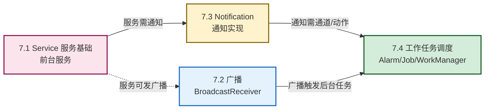

# MOC - 第7章 后台服务与消息通知

本章是 Android 应用从"前台可见"走向"后台常驻"的关键一步。围绕"Activity 不可见时应用还能做什么"这一核心问题，串起 Service 后台服务、BroadcastReceiver 广播机制、Notification 通知实现与 WorkManager/JobScheduler/AlarmManager 任务调度四个主题，构成 Android 后台运行的完整能力图谱。

> [!info] 本章定位
> - **核心对象**：Activity 生命周期之外的运行能力——后台服务、跨组件通信、用户通知、定时/条件任务
> - **关键能力**：Service 启动与绑定、广播收发、通知通道与样式、WorkManager 持久化任务调度
> - **承前启后**：在第6章异步网络请求基础上引入后台运行；为第8章移动应用安全（权限最小化、后台限制、防滥用）打基础
> - **考试权重**：Service 生命周期、前台服务、广播注册方式、NotificationChannel、WorkManager 为高频考点
> - **版本敏感**：Android 8.0+ 后台限制、Android 14 前台服务类型均为必考版本要点

> [!abstract] 本章核心问题
> 1. Service 与 Activity 有何不同？startService 与 bindService 两种启动方式的生命周期如何区分？
> 2. 为什么 Android 8.0+ 严格限制后台 Service？前台服务如何"用通知换可见性"？
> 3. 广播的发布-订阅模型如何工作？静态注册与动态注册各有什么限制？
> 4. NotificationChannel 从 Android 8.0 起为何成为强制要求？通知的样式与点击行为如何配置？
> 5. AlarmManager、JobScheduler、WorkManager 三种调度方案如何选型？

## 本章学习路线

## 知识点导航

| 序号 | 知识点 | 核心内容 | 重点等级 |
| ---- | ------ | -------- | -------- |
| 7.1 | [[7.1 Service 服务基础、前台服务\|Service 服务基础、前台服务]] | Service 特点、startService/bindService 生命周期、前台服务、Android 8.0+ 后台限制、音乐播放案例 | ⭐⭐⭐⭐⭐ |
| 7.2 | [[7.2 广播 BroadcastReceiver 使用\|广播 BroadcastReceiver]] | 发布-订阅模型、系统/自定义广播、静态/动态注册、有序/普通广播、Android 8.0+ 隐式广播限制 | ⭐⭐⭐⭐ |
| 7.3 | [[7.3 Notification 通知实现\|Notification 通知实现]] | NotificationChannel、NotificationCompat.Builder、通知样式、PendingIntent、Action 按钮、更新与取消 | ⭐⭐⭐⭐⭐ |
| 7.4 | [[7.4 工作任务调度基础\|工作任务调度基础]] | AlarmManager、JobScheduler、WorkManager（OneTime/PeriodicWork、Constraints）、三种方案对比 | ⭐⭐⭐⭐ |

## 核心考点速览

> [!warning] 高频考点（8 点）
> 1. **Service 生命周期**：startService（onCreate→onStartCommand→onDestroy）与 bindService（onCreate→onBind→onUnbind→onDestroy）两条路径的区别（**必考**）
> 2. **startService vs bindService**：启动方式、生命周期、通信方式、退出时机的对比
> 3. **前台服务**：startForeground 调用时机、必须提供通知、Android 8.0+ 后台启动 Service 限制、Android 14 前台服务类型
> 4. **广播注册方式**：静态注册（AndroidManifest）vs 动态注册（registerReceiver）的对比与 Android 8.0+ 隐式广播限制
> 5. **NotificationChannel**：Android 8.0+ 必须创建通道、重要性级别（IMPORTANCE_HIGH/NORMAL/LOW/MIN）
> 6. **PendingIntent**：与 Intent 的区别、FLAG_IMMUTABLE/FLAG_MUTABLE、通知点击跳转
> 7. **WorkManager 优势**：向后兼容、持久化、约束条件、OneTimeWorkRequest vs PeriodicWorkRequest
> 8. **三种调度方案对比**：AlarmManager vs JobScheduler vs WorkManager 的适用场景

## 关键概念速查

### Service 两种启动方式速查

| 维度 | startService | bindService |
| ---- | ------------ | ----------- |
| 启动方 | `startService(intent)` | `bindService(intent, conn, flags)` |
| 生命周期 | onCreate→onStartCommand→onDestroy | onCreate→onBind→onUnbind→onDestroy |
| 通信 | 无直接通信，靠 Intent / 广播 | 通过 IBinder 接口直接调用方法 |
| 退出 | 调用 `stopService`/`stopSelf` | 所有客户端 unbind 后自动销毁 |
| 多次启动 | 多次触发 onStartCommand | 多个客户端共享同一 Service |
| 典型场景 | 后台下载、音乐播放 | Activity 与 Service 实时交互 |

### 广播注册方式速查

| 维度 | 静态注册 | 动态注册 |
| ---- | -------- | -------- |
| 配置位置 | AndroidManifest.xml `<receiver>` | 代码 `registerReceiver(receiver, filter)` |
| 生效时机 | 应用安装后即生效（含未启动） | 仅在注册后到反注册前生效 |
| 监听系统广播 | Android 8.0+ 仅显式/部分白名单 | 全部支持 |
| 接收时机 | 应用可能被冷启动 | 必须应用已运行 |
| 资源占用 | 注册即占资源 | 灵活可控 |
| 推荐场景 | 开机自启动等少数 | 绝大多数业务广播 |

### 通知重要性级别速查

| 级别 | 用户感知 | 典型用途 |
| ---- | -------- | -------- |
| IMPORTANCE_HIGH | 发出声音 + 横幅通知 | 紧急消息、来电 |
| IMPORTANCE_DEFAULT | 发出声音 | 普通聊天消息 |
| IMPORTANCE_LOW | 状态栏图标，无声音 | 后台下载进度 |
| IMPORTANCE_MIN | 无声音、折叠到底部 | 系统更新提示 |

### 任务调度方案速查

| 方案 | 最低 API | 持久化 | 约束条件 | 典型场景 |
| ---- | -------- | ------ | -------- | -------- |
| AlarmManager | API 1 | 否（重启失效） | 仅时间 | 精确闹钟、定时提醒 |
| JobScheduler | API 21 | 否 | 网络/充电/空闲 | 条件触发型后台任务 |
| WorkManager | API 14+（Jetpack） | 是（重启后恢复） | 网络/充电/存储 | 持久化、可重启的任务 |

## 章节导航

- 上级：[[MOC - 移动互联网开发技术|移动互联网开发技术总览]]
- 上一章：[[MOC - 第6章|第6章 移动网络通信技术]]
- 下一章：[[MOC - 第8章|第8章 移动应用安全]]
- 习题：[[MOC - 第7章习题|第7章习题]]
