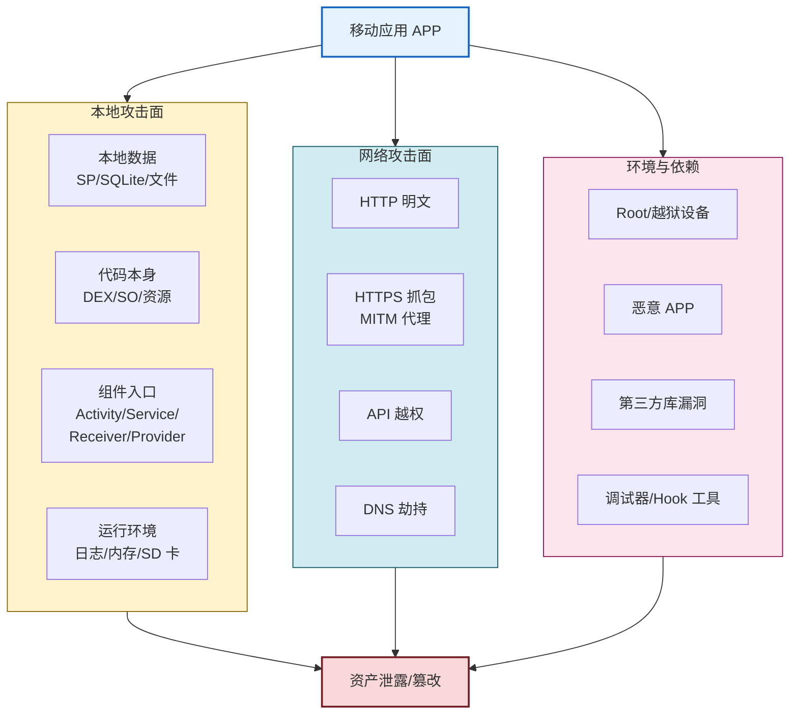

# 8.1 移动应用常见安全风险

> [!abstract] 本节概述
> 移动应用相比传统 Web 应用，攻击面更广：客户端代码可被反编译、本地数据可被提取、组件可被越权调用、网络流量可被中间人代理。本节从"威胁建模"出发，介绍 OWASP Mobile Top 10 风险清单，将常见风险归纳为数据存储、通信、认证授权、代码逆向、组件暴露、第三方库六大类，并通过攻击面图与对比表建立整体风险地图，为后续小节的防护手段提供问题驱动。

## 1. 威胁建模与攻击面

> [!definition] 威胁建模
> 威胁建模（Threat Modeling）是在设计与开发阶段识别"哪些资产需要保护、攻击者可能从哪里下手、会带来什么后果"的工程化方法。移动应用威胁建模通常回答四个问题：
> - **资产（Assets）**：用户隐私、账户凭证、业务数据、密钥、付费逻辑
> - **信任边界（Trust Boundary）**：应用沙箱、进程边界、网络边界、设备边界
> - **攻击者能力（Adversary Capability）**：本地用户、root 用户、恶意应用、网络中间人、APK 重打包者
> - **安全目标（Security Goals）**：机密性、完整性、可用性、认证、授权、不可否认性

> [!info] 资产与信任边界
> - **设备内资产**：SharedPreferences、SQLite、内部存储文件、Keystore 密钥、内存中的 Token
> - **网络资产**：API 接口、会话 Token、用户身份、传输中的业务数据
> - **应用本身**：APK 文件、DEX 字节码、SO 库、资源文件、业务算法
> - **信任边界**：应用沙箱（/data/data/<包名>）→ 设备边界 → 网络边界 → 服务器边界

### 1.1 移动应用攻击面



> [!warning] 攻击者能力分级
> - **远程攻击者**：只能控制网络，能力最弱，靠 MITM、DNS 劫持
> - **本地普通用户**：可安装恶意 APP、查看 SD 卡、抓包，能力中等
> - **Root 用户**：可读取任意应用沙箱、Hook 系统 API、注入代码，能力最强
> - **APK 重打包者**：反编译 → 修改 → 重签名 → 二次分发，能力最强且影响广

## 2. OWASP Mobile Top 10 概述

OWASP（Open Web Application Security Project）维护的 Mobile Top 10 是移动应用安全风险的事实标准，最新版本为 MASVS / Mobile Top 10 2024 体系，整合为 8 大类风险。

| 编号 | 风险类别（中英对照） | 典型表现 | 对应小节 |
| ---- | -------------------- | -------- | -------- |
| M1 | 不当凭证使用 / 凭证管理不当 | 密码明文存储、Token 不过期、长连接 Token 可重放 | 8.2 |
| M2 | 服务器端控制不足 | 业务逻辑仅靠客户端校验、API 越权 | — |
| M3 | 不安全的通信 | HTTP 明文、HTTPS 缺证书校验 | 8.3 |
| M4 | 不安全的认证 | 弱口令、本地绕过登录、生物识别可被劫持 | 8.2 |
| M5 | 密码学实现不足 | 弱算法（DES/MD5）、密钥硬编码、随机数不安全 | 8.2 |
| M6 | 不安全的授权 | 客户端越权、组件 exported 未保护 | 8.4 |
| M7 | 客户端代码质量差 | 内存泄漏、调试日志、未混淆 | 8.5 |
| M8 | 代码篡改 | APK 二次打包、注入恶意 SDK | 8.5 |
| M9 | 逆向工程 | DEX 反编译、SO 逆向、Hook 业务逻辑 | 8.5 |
| M10 | 不必要的数据存储 | 日志、剪贴板、备份文件泄露敏感信息 | 8.2 |

> [!note] Mobile Top 10 版本说明
> OWASP Mobile Top 10 在 2014、2016、2024 多次更新，编号与名称有差异。考试答题以"风险类别含义"为准，不必死记编号顺序。

## 3. 六大类常见风险

### 3.1 数据存储不安全

> [!warning] 仅限授权实验环境使用
> 本节描述的存储风险与命令仅用于自有应用的授权安全评估，不可用于读取他人应用数据。

**典型表现**：
- **SharedPreferences 明文**：Token、密码、API Key 以明文 XML 形式存在 `/data/data/<包名>/shared_prefs/`
- **SQLite 明文**：聊天记录、订单数据以明文存于 `/data/data/<包名>/databases/`
- **SD 卡暴露**：将缓存、日志、配置写到外部存储，任何应用持有存储权限即可读取
- **备份文件泄露**：`android:allowBackup="true"` 时 `adb backup` 可导出应用数据

**root 设备验证**（仅限授权实验环境）：
```bash
# 在已 root 的实验设备上查看某应用的 SP 文件
adb shell
su
cat /data/data/com.example.app/shared_prefs/user_prefs.xml
```

> [!example] 案例：某社交 APP 明文存储密码被泄露
> 某社交 APP 在"记住密码"功能中将用户密码以明文写入 `login_prefs.xml`。攻击者通过 root 设备或备份提取该文件后，可直接获取所有登录过的账号密码，导致大规模账户泄露。**正确做法**：记住密码应只存 Token，密码绝不明文存储；如必须本地校验，应使用加盐哈希（见 [[8.2 本地数据加密、敏感信息保护|8.2]]）。

### 3.2 通信不安全

**典型表现**：
- **HTTP 明文通信**：业务接口仍走 HTTP，流量可被任意嗅探
- **HTTPS 缺证书校验**：实现自定义 `X509TrustManager` 时直接 `return`，等于关闭校验
- **信任所有证书**：`TrustManager` 中 `checkServerTrusted` 空实现，导致 MITM 攻击成立

详见 [[8.3 HTTPS 防抓包、证书校验|8.3 HTTPS 防抓包、证书校验]]。

### 3.3 不安全的认证与授权

**典型表现**：
- **登录绕过**：客户端通过判断本地布尔值决定是否进入主界面，可被改 DEX 后跳过
- **会话超时缺失**：Token 长期有效，被盗后可永久使用
- **客户端越权**：服务端依赖客户端传 `user_id` 判断身份，被改包后可越权访问他人数据
- **生物识别可被劫持**：仅本地校验指纹结果，未与服务端联动

### 3.4 代码逆向与篡改

**典型表现**：
- **DEX 反编译**：未混淆的 APK 用 `jadx` 一键还原 Java 源码，业务算法、密钥、API 路径全部暴露
- **SO 逆向**：关键算法放 SO 仍可被 IDA Pro 静态分析
- **二次打包**：反编译 → 注入广告 SDK / 恶意代码 → 重签名 → 第三方市场分发
- **动态 Hook**：Frida、Xposed 可在运行期修改任意方法行为

详见 [[8.5 应用加固基础概念|8.5 应用加固基础概念]]。

### 3.5 组件暴露

> [!definition] exported 组件
> Android 四大组件（Activity / Service / BroadcastReceiver / ContentProvider）通过 `android:exported="true"` 声明为可被其他应用调用。Android 12（API 31）起，含 IntentFilter 的组件必须显式声明 exported 属性。

**典型表现**：
- **未保护的 exported Activity**：恶意 APP 直接 `startActivity` 跳到敏感页面（如支付界面）
- **未保护的 ContentProvider**：恶意 APP 查询/篡改数据库内容
- **隐式 Intent 携带敏感数据**：被恶意 APP 截获
- **PendingIntent 可被劫持**：`PendingIntent.getActivity` 默认无 Intent 限制

详见 [[8.4 权限最小化、恶意调用防范|8.4 权限最小化、恶意调用防范]]。

### 3.6 第三方库漏洞

**典型表现**：
- **引入含漏洞的 SDK**：旧版 OkHttp、Fastjson、 OpenSSL 等存在已知 CVE
- **广告/统计 SDK 越权**：SDK 申请与应用无关的权限，偷偷采集隐私
- **供应链攻击**：第三方库被植入恶意代码（如 XcodeGhost 事件）

> [!tip] 第三方库安全实践
> - 使用 `dependencyCheck` 或 OSV-Scanner 扫描已知漏洞
> - 锁定依赖版本，定期升级
> - 审计 SDK 申请的权限与网络请求
> - 避免引入来源不明的 SDK

## 4. 风险分类对比表

| 风险类别 | 主要威胁资产 | 攻击者能力要求 | 后果严重度 | 防护小节 |
| -------- | ------------ | -------------- | ---------- | -------- |
| 数据存储不安全 | 本地数据、凭证 | Root / 备份 / SD 卡 | 高 | 8.2 |
| 通信不安全 | 传输数据、Token | 网络中间人 | 高 | 8.3 |
| 认证授权不安全 | 账户、权限 | 改包 / 抓包 | 极高 | 8.2 / 8.3 |
| 代码逆向与篡改 | 业务逻辑、密钥 | 反编译 / Hook | 中高 | 8.5 |
| 组件暴露 | 组件入口、数据 | 恶意 APP | 中高 | 8.4 |
| 第三方库漏洞 | 全部资产 | 远程 / 供应链 | 中 | — |

## 5. 综合案例：某 APP 多维风险排查

> [!example] 案例：某电商 APP 的安全自检清单
> 某电商 APP 在上线前进行安全自检，发现以下问题：
>
> | 风险项 | 现状 | 修复建议 | 对应小节 |
> | ------ | ---- | -------- | -------- |
> | 登录 Token 存储 | SharedPreferences 明文 | 改用 EncryptedSharedPreferences | 8.2 |
> | 订单接口 | HTTP 明文 | 升级 HTTPS 并启用 SSL Pinning | 8.3 |
> | 支付页 Activity | exported=true 无权限 | 设 exported=false 或加自定义权限 | 8.4 |
> | APK 混淆 | 未开启 ProGuard | 开启 R8 混淆 + 加固 | 8.5 |
> | allowBackup | true | 改为 false，敏感应用禁备份 | 8.2 |
> | 第三方 SDK | 未审计 | 扫描 CVE 并清理冗余 SDK | — |
>
> 该案例体现了"风险识别 → 分层防护"的工程思路：先识别攻击面，再针对每类风险选择对应防护手段，而不是单纯堆叠加密算法。

## 6. 安全防护总体原则

> [!tip] 移动应用安全五原则
> 1. **纵深防御**：不依赖单一防护层，数据加密 + 通信加密 + 组件保护 + 加固多层叠加
> 2. **最小权限**：组件默认不暴露、运行时权限按需申请、SDK 权限从严
> 3. **安全左移**：在设计阶段就引入威胁建模，而非上线前才补漏洞
> 4. **服务端为权威**：客户端只做体验优化，所有权限/金额/身份校验以服务端为准
> 5. **密钥不落明文**：密钥放 Keystore，密码加盐哈希，Token 设置合理过期

## 章节导航

- 上级：[[MOC - 第8章|第8章 移动应用安全]]
- 下一节：[[8.2 本地数据加密、敏感信息保护|8.2 本地数据加密、敏感信息保护]]
- 习题：[[MOC - 第8章习题|第8章习题]]
