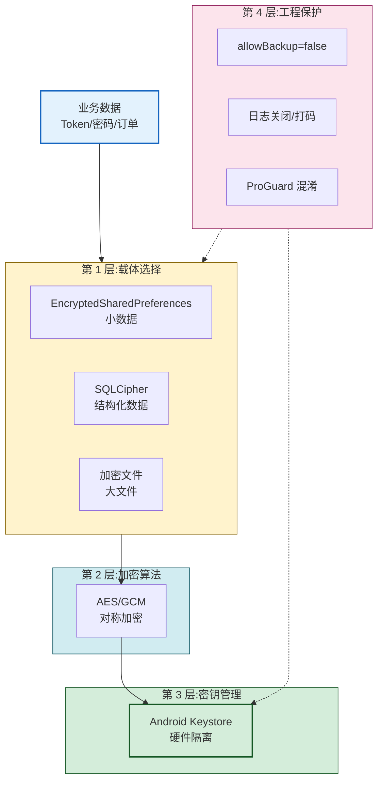

# 8.2 本地数据加密、敏感信息保护

> [!abstract] 本节概述
> Android 应用沙箱并不能阻挡 root 用户与备份提取，因此本地数据"必须假定可被读取"。本节聚焦"如何让本地数据被读到也没用"：识别 SharedPreferences、SQLite、日志、备份文件等泄露点；引入 AES 对称加密、Android Keystore 密钥管理、Jetpack Security 的 EncryptedSharedPreferences、SQLCipher 加密数据库；并讲解密码加盐哈希、密钥不硬编码、ProGuard 混淆等敏感信息保护原则。

## 1. 本地数据风险识别

> [!definition] 本地数据风险
> 凡是写到设备上的数据，都应视为可能被 root 用户、备份提取或恶意应用读取的"公开数据"。本地数据风险主要来自四类载体：SharedPreferences、SQLite 数据库、日志输出、外部存储文件。

### 1.1 风险载体与泄露路径

| 载体 | 默认存储路径 | 风险点 | 攻击路径 |
| ---- | ------------ | ------ | -------- |
| SharedPreferences | `/data/data/<pkg>/shared_prefs/*.xml` | 明文 XML | root 读取 / `adb backup` |
| SQLite | `/data/data/<pkg>/databases/*.db` | 明文表 | root 读取 / 备份导出 |
| Logcat 日志 | 内存缓冲区 | 打印 Token / 密码 | `adb logcat` / 恶意应用读日志（旧版本） |
| 内部存储文件 | `/data/data/<pkg>/files/` | 明文 | root 读取 |
| 外部存储（SD 卡） | `/sdcard/...` | 全局可读 | 任意应用读 |
| 备份文件 | `adb backup` 导出 | 含沙箱数据 | USB 调试 + allowBackup |

> [!warning] 仅限授权实验环境使用
> 下列命令仅用于在自有 root 实验设备上验证自有应用的数据安全，禁止用于读取他人应用数据：
> ```bash
> adb shell su -c "cat /data/data/com.example.app/shared_prefs/user_prefs.xml"
> adb backup -f app.ab com.example.app   # 仅 allowBackup=true 时可导出
> adb logcat | grep -i token             # 查找日志泄露
> ```

### 1.2 常见错误写法

```java
// ❌ 错误:Token 明文存 SharedPreferences
SharedPreferences sp = getSharedPreferences("user", MODE_PRIVATE);
sp.edit().putString("token", "eyJhbGciOi...").apply();

// ❌ 错误:日志打印密码
Log.d("LoginActivity", "password=" + password);

// ❌ 错误:密钥硬编码
private static final String AES_KEY = "1234567890abcdef";  // 反编译即得

// ❌ 错误:写到 SD 卡
File file = new File(Environment.getExternalStorageDirectory(), "config.txt");
```

## 2. AES 对称加密基础

> [!definition] AES
> AES（Advanced Encryption Standard，高级加密标准）是当前主流的对称分组加密算法，密钥长度 128/192/256 位，分组长度 128 位。Android 上推荐使用 **AES/GCM/NoPadding** 模式：GCM 同时提供机密性与完整性，无需额外 MAC。

| 模式 | 提供机密性 | 提供完整性 | 推荐 |
| ---- | ---------- | ---------- | ---- |
| AES/ECB | 是 | 否 | ❌ 不推荐（相同明文→相同密文） |
| AES/CBC | 是 | 否 | 需额外 HMAC |
| AES/GCM | 是 | 是 | ✅ 推荐 |

### 2.1 AES/GCM 加解密示例

```java
public class AesCrypto {
    private static final String TRANSFORMATION = "AES/GCM/NoPadding";
    private static final int GCM_TAG_LENGTH = 128;   // bits
    private static final int IV_LENGTH = 12;         // bytes, GCM 推荐 12 字节 IV

    /** 加密:返回 Base64(IV + 密文 + Tag) */
    public static String encrypt(String plaintext, SecretKey key) throws Exception {
        byte[] iv = new byte[IV_LENGTH];
        SecureRandom.getInstanceStrong().nextBytes(iv);   // 每次随机 IV

        Cipher cipher = Cipher.getInstance(TRANSFORMATION);
        GCMParameterSpec spec = new GCMParameterSpec(GCM_TAG_LENGTH, iv);
        cipher.init(Cipher.ENCRYPT_MODE, key, spec);
        byte[] cipherText = cipher.doFinal(plaintext.getBytes(StandardCharsets.UTF_8));

        // 拼接 IV + 密文,IV 解密时需要
        ByteBuffer bb = ByteBuffer.allocate(iv.length + cipherText.length);
        bb.put(iv);
        bb.put(cipherText);
        return Base64.encodeToString(bb.array(), Base64.NO_WRAP);
    }

    /** 解密 */
    public static String decrypt(String base64, SecretKey key) throws Exception {
        byte[] all = Base64.decode(base64, Base64.NO_WRAP);
        byte[] iv = Arrays.copyOfRange(all, 0, IV_LENGTH);
        byte[] cipherText = Arrays.copyOfRange(all, IV_LENGTH, all.length);

        Cipher cipher = Cipher.getInstance(TRANSFORMATION);
        cipher.init(Cipher.DECRYPT_MODE, key, new GCMParameterSpec(GCM_TAG_LENGTH, iv));
        return new String(cipher.doFinal(cipherText), StandardCharsets.UTF_8);
    }
}
```

> [!warning] AES 使用易错点
> 1. **IV 必须随机且不可复用**：同一密钥下 IV 重用会导致 GCM 安全性完全破坏
> 2. **不要用 ECB 模式**：相同明文块产生相同密文块，泄露模式信息
> 3. **不要硬编码密钥**：反编译即可获得，等于没加密
> 4. **不要用 `Random` 生成 IV/密钥**：必须用 `SecureRandom`

## 3. Android Keystore 密钥管理

> [!definition] Android Keystore
> Android Keystore 是系统提供的密钥存储容器，密钥的私钥部分**不会导出到内存**，所有加密/签名操作在 Keystore 内部（TEE / StrongBox）完成。即使 root 用户也无法直接读取私钥材料，只能调用其接口。

### 3.1 Keystore 的核心价值

| 维度 | 硬编码密钥 | Keystore 密钥 |
| ---- | ---------- | ------------- |
| 反编译可见 | 是 | 否 |
| 内存中可被 dump | 是 | 否（私钥不出 TEE） |
| 可绑定设备硬件 | 否 | 是（StrongBox） |
| 可设置用户认证解锁 | 否 | 是（setUserAuthenticationRequired） |
| 可设置有效期 | 否 | 是 |

### 3.2 生成与使用 Keystore 中的 AES 密钥

```java
public class KeystoreHelper {
    private static final String ANDROID_KEYSTORE = "AndroidKeyStore";
    private static final String KEY_ALIAS = "my_aes_key";

    /** 获取或创建 Keystore 中的 AES 密钥 */
    public static SecretKey getOrCreateKey() throws Exception {
        KeyStore ks = KeyStore.getInstance(ANDROID_KEYSTORE);
        ks.load(null);
        if (ks.containsAlias(KEY_ALIAS)) {
            return (SecretKey) ks.getKey(KEY_ALIAS, null);
        }
        KeyGenParameterSpec spec = new KeyGenParameterSpec.Builder(
                KEY_ALIAS,
                KeyProperties.PURPOSE_ENCRYPT | KeyProperties.PURPOSE_DECRYPT)
            .setBlockModes(KeyProperties.BLOCK_MODE_GCM)
            .setEncryptionPaddings(KeyProperties.ENCRYPTION_PADDING_NONE)
            .setKeySize(256)
            // .setUserAuthenticationRequired(true)   // 需指纹/锁屏解锁才能用
            .build();
        KeyGenerator kg = KeyGenerator.getInstance(KeyProperties.KEY_ALGORITHM_AES, ANDROID_KEYSTORE);
        kg.init(spec);
        return kg.generateKey();
    }
}
```

> [!note] Keystore 使用注意
> - Keystore 密钥绑定设备：换设备/重装系统后密钥失效，业务需重新生成
> - `setUserAuthenticationRequired(true)` 后未解锁会抛 `UserNotAuthenticatedException`，需配合 `BiometricPrompt`
> - API 23（Android 6.0）起支持对称密钥；之前版本仅支持非对称密钥

## 4. EncryptedSharedPreferences（Jetpack Security）

> [!definition] EncryptedSharedPreferences
> Jetpack Security 提供的 SharedPreferences 包装类，自动对键和值进行加密：键用 AES-SIV（确定性加密，支持查找），值用 AES-GCM（随机 IV，提供机密性与完整性）。密钥保存在 Android Keystore 中。

### 4.1 依赖与使用

```gradle
dependencies {
    implementation "androidx.security:security-crypto:1.1.0-alpha06"
}
```

```java
// 初始化(建议在 Application 中全局单例)
String masterKeyAlias = MasterKeys.getOrCreate(MasterKeys.AES256_GCM_SPEC);

SharedPreferences sp = EncryptedSharedPreferences.create(
    "secret_prefs",
    masterKeyAlias,
    context,
    EncryptedSharedPreferences.PrefKeyEncryptionScheme.AES256_SIV,
    EncryptedSharedPreferences.PrefValueEncryptionScheme.AES256_GCM
);

// 用法与普通 SharedPreferences 完全一致
sp.edit().putString("token", "eyJhbGciOi...").apply();
String token = sp.getString("token", null);
```

> [!tip] EncryptedSharedPreferences 优势
> - **API 零迁移成本**：与原生 `SharedPreferences` 接口一致，业务代码几乎不改
> - **密钥自动管理**：使用 Android Keystore，无需手写密钥生成与保存
> - **键值双加密**：连键名都被加密，攻击者无法从文件名推断业务
> - 适合存储 Token、登录态、用户偏好等小数据

### 4.2 加密前后对比

| 维度 | 原生 SP | EncryptedSharedPreferences |
| ---- | ------- | ------------------------- |
| 文件内容 | 明文 XML | Base64 密文 |
| 密钥位置 | — | Android Keystore |
| 读取速度 | 极快 | 略慢（首次解密开销） |
| 适用数据 | 非敏感配置 | 敏感配置、Token |

## 5. SQLCipher 加密 SQLite

> [!definition] SQLCipher
> SQLCipher 是 SQLite 的开源加密扩展，对整个数据库文件进行 AES-256 加密，打开数据库需提供密码。Room 也可通过 SupportSQLiteDatabase.Factory 集成 SQLCipher。

### 5.1 依赖与使用

```gradle
dependencies {
    implementation "net.zetetic:android-database-sqlcipher:4.5.4"
    implementation "androidx.sqlite:sqlite-ktx:2.3.1"
}
```

```java
// 初始化(建议在 Application.onCreate)
SQLiteDatabase.loadLibs(context);

// 打开加密数据库
String dbPassword = getPasswordFromKeystore();   // 密码本身应来自 Keystore
SQLiteDatabase db = SQLiteDatabase.openOrCreateDatabase(
    new File(context.getDatabasePath("secret.db").getAbsolutePath()),
    dbPassword,
    null
);

// 之后操作与普通 SQLiteDatabase 一致
db.execSQL("CREATE TABLE IF NOT EXISTS msg(_id INTEGER PRIMARY KEY, content TEXT)");
```

> [!warning] SQLCipher 密码管理
> - 密码不能硬编码，否则反编译即破
> - 推荐做法：用 Keystore 生成随机密钥 → 加密存储 → 启动时解密取出作为 SQLCipher 密码
> - 密码不要与用户登录密码相同：用户改密码会导致数据库无法打开

## 6. 敏感信息保护原则

### 6.1 密码不明文存储（加盐哈希）

> [!definition] 加盐哈希
> 密码绝不能明文或仅哈希存储。应在密码后拼接**随机盐**再做哈希，盐与哈希结果一起存储。盐的作用是让相同密码产生不同哈希，抵抗彩虹表攻击。

| 方案 | 抗彩虹表 | 抗暴力破解 | 推荐 |
| ---- | -------- | ---------- | ---- |
| 明文 | ❌ | ❌ | ❌ |
| MD5 | ❌ | ❌ | ❌（已被攻破） |
| MD5 + 盐 | ✅ | ❌ | ❌（速度太快） |
| SHA-256 + 盐 | ✅ | ❌ | ⚠️ 不推荐 |
| PBKDF2 / bcrypt / scrypt / Argon2 | ✅ | ✅ | ✅ 推荐 |

```java
// ✅ PBKDF2 加盐哈希(适合移动端,Java 原生支持)
public static String hashPassword(String password, byte[] salt) throws Exception {
    int iterations = 10000;     // 迭代次数,越大越慢越安全
    int keyLength = 256;        // 输出位数
    PBEKeySpec spec = new PBEKeySpec(password.toCharArray(), salt, iterations, keyLength);
    SecretKeyFactory skf = SecretKeyFactory.getInstance("PBKDF2WithHmacSHA256");
    byte[] hash = skf.generateSecret(spec).getEncoded();
    return Base64.encodeToString(hash, Base64.NO_WRAP);
}

// 注册时:生成随机盐 + 哈希,两者一起存
byte[] salt = new byte[16];
SecureRandom.getInstanceStrong().nextBytes(salt);
String hash = hashPassword(password, salt);
// 存储:Base64(salt) + ":" + hash
```

### 6.2 密钥不硬编码

> [!warning] 硬编码密钥的常见形式
> 以下写法都等于"没加密"，反编译即可获取：
> ```java
> private static final String KEY = "1234567890abcdef";        // ❌
> private static final byte[] KEY = {1,2,3,4,5,6,7,8,9,0,1,2,3,4,5,6};  // ❌
> String key = new String(new char[]{'1','2',...});             // ❌ 拼接也没用
> ```

**正确做法**：
- 密钥放 **Android Keystore**，让系统/硬件保管
- 服务端下发的临时密钥用 Keystore 中的主密钥加密后存储
- 必须硬编码的密钥配合 **ProGuard/R8 混淆 + 加固**（提高门槛，非绝对安全）

### 6.3 日志与备份保护

```xml
<!-- AndroidManifest.xml:敏感应用禁备份 -->
<application
    android:allowBackup="false"
    android:fullBackupContent="false"
    android:dataExtractionRules="@xml/data_extraction_rules">
</application>
```

```java
// ✅ 生产环境关闭日志
public class LogUtil {
    private static final boolean DEBUG = BuildConfig.DEBUG;
    public static void d(String tag, String msg) {
        if (DEBUG) Log.d(tag, msg);   // Release 包自动剔除
    }
}
```

> [!tip] 日志安全要点
> - 严禁 `Log.d("login", "pwd=" + password)`
> - Token、身份证、手机号打印时打码（如 `138****1234`）
> - ProGuard 配置移除 `Log.d/v/i` 调用：`-assumenosideeffects class android.util.Log { *** d(...); }`

## 7. 本地数据加密架构



## 8. 综合案例：银行 APP 本地数据加密方案

> [!example] 案例：某银行 APP 本地存储安全设计
> 某银行 APP 需要在本地存储：登录 Token、交易密码校验值、用户偏好（夜间模式）、最近转账记录。
>
> | 数据项 | 选型 | 理由 |
> | ------ | ---- | ---- |
> | 登录 Token | EncryptedSharedPreferences | 小数据 + 敏感 + 自动加密 |
> | 交易密码校验值 | PBKDF2 加盐哈希，存 EncryptedSharedPreferences | 密码绝不还原，仅比对 |
> | 主加密密钥 | Android Keystore + setUserAuthenticationRequired | 硬件隔离 + 指纹解锁 |
> | 用户偏好（夜间模式） | 原生 SharedPreferences | 非敏感，无需加密 |
> | 最近转账记录 | SQLCipher 加密 SQLite | 结构化 + 敏感 |
> | allowBackup | false | 银行应用禁备份 |
> | 日志 | BuildConfig.DEBUG 控制开关 | Release 包无敏感日志 |
> | 混淆 | R8 + 资源混淆 | 提高反编译门槛 |
>
> 该方案的核心理念：**按数据敏感度分级选型**，非敏感数据用原生方案换取性能，敏感数据用 Keystore + 加密换取安全，而不是"全部用最强加密"。

## 9. 易错点与最佳实践

> [!warning] 常见易错点
> 1. **EncryptedSharedPreferences 当数据库用**：每次写入触发全量重写加密，性能差，仅适合小数据
> 2. **AES 用 ECB 模式**：相同明文产生相同密文，泄露模式
> 3. **IV 复用**：GCM 模式下 IV 复用会导致安全性完全破坏
> 4. **SQLCipher 密码硬编码**：反编译即破
> 5. **密码用 MD5 存储**：MD5 已被攻破，必须用 PBKDF2/bcrypt
> 6. **allowBackup 默认 true**：敏感应用必须显式关闭
> 7. **Release 包仍打印日志**：ProGuard 未配置移除 Log 调用

> [!tip] 最佳实践
> - 数据分级：非敏感用原生 SP/SQLite，敏感用加密方案
> - 密钥统一进 Keystore，不硬编码、不落明文
> - 密码用 PBKDF2 加盐哈希，迭代次数 ≥ 10000
> - 敏感应用 `allowBackup=false`，日志由 BuildConfig 控制
> - 配合 [[8.5 应用加固基础概念|8.5 加固]] 提高反编译门槛

## 章节导航

- 上级：[[MOC - 第8章|第8章 移动应用安全]]
- 上一节：[[8.1 移动应用常见安全风险|8.1 移动应用常见安全风险]]
- 下一节：[[8.3 HTTPS 防抓包、证书校验|8.3 HTTPS 防抓包、证书校验]]
- 习题：[[MOC - 第8章习题|第8章习题]]
