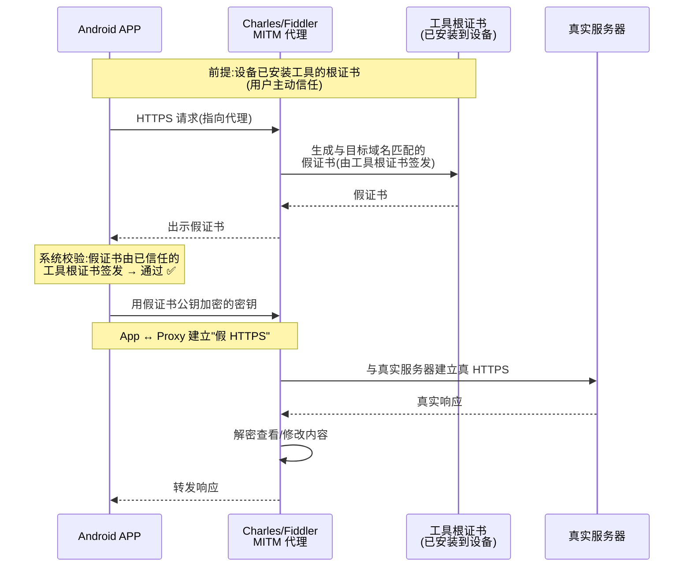
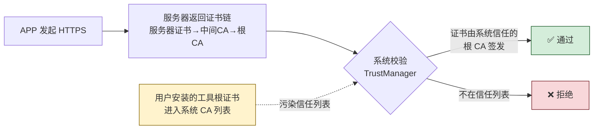
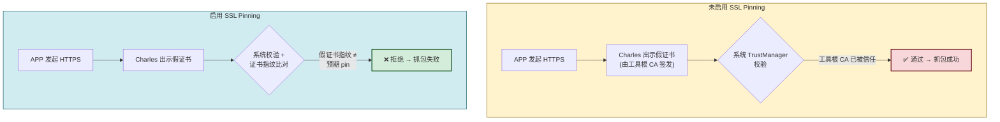

# 8.3 HTTPS 防抓包、证书校验

> [!abstract] 本节概述
> HTTPS 本应保护通信机密性，但在 Android 上若实现不当，仍然可被 Charles、Fiddler 等代理工具一键抓包。根本原因在于：默认 HTTPS 仅信任系统 CA，而用户/企业可自行安装 CA 证书到系统，代理工具借此成为"中间人"。本节从 MITM 抓包原理出发，讲解系统默认校验、自签名校验、证书固定（SSL Pinning）三层防护，重点演示 OkHttp `CertificatePinner` 实现，并讨论代理检测等辅助手段。

## 1. 抓包原理：中间人代理

> [!definition] MITM 攻击
> 中间人攻击（Man-in-the-Middle, MITM）指攻击者插入到客户端与服务端之间，分别与两端建立独立连接，转发并查看/修改流量。HTTPS 抓包工具本质上就是受控的 MITM：客户端信任了抓包工具的根证书，使工具可解密所有 HTTPS 流量。

### 1.1 抓包工具工作流程



> [!warning] 仅限授权实验环境使用
> 下列抓包配置仅用于测试自有 APP，禁止用于抓取他人应用流量：
> - **Charles**：菜单 Help → SSL Proxying → Install Charles Root Certificate on Android Devices
> - **Fiddler**：Options → HTTPS → Decrypt HTTPS → 安装根证书到设备
> - **mitmproxy**：`mitmproxy --mode transparent` + 安装 mitmproxy CA
> - **Android 7+ 用户证书**：需用户手动在"安全 → 加密与凭据 → 安装证书"中安装

### 1.2 为什么系统能"被骗"

Android 系统的 HTTPS 校验链路：



> [!info] Android 证书信任策略
> - Android 6.0（API 23）及以前：用户安装的 CA 默认被信任
> - Android 7.0（API 24）起：默认仅信任系统 CA，用户 CA 需 APP 在 `network_security_config.xml` 中显式声明信任，**但抓包工具仍可通过 root 将证书装入系统 CA 目录**
> - Android 10+ 进一步限制：APP 不能信任用户 CA，除非显式配置

## 2. 证书校验三层防护

### 2.1 第一层：系统默认校验

> [!definition] 系统默认校验
> OkHttp / HttpsURLConnection 默认使用系统 `TrustManager`，校验服务器证书是否由系统信任的根 CA 签发、是否过期、域名是否匹配。这是 HTTPS 的最低保障，但无法抵御"用户主动信任工具根证书"的抓包。

```java
// OkHttp 默认即系统校验,无需额外配置
OkHttpClient client = new OkHttpClient();
```

**局限**：用户/Root 安装工具根证书后，系统校验会通过假证书。

### 2.2 第二层：自定义 TrustManager 校验

开发者可自定义 `X509TrustManager`，在 `checkServerTrusted` 中添加额外校验逻辑（如证书指纹比对、有效期严格判断）。

> [!warning] 常见错误写法
> ```java
> // ❌ 严重错误:直接 return 等于关闭校验
> TrustManager tm = new X509TrustManager() {
>     public void checkClientTrusted(X509Certificate[] c, String s) {}
>     public void checkServerTrusted(X509Certificate[] c, String s) {}  // 空!
>     public X509Certificate[] getAcceptedIssuers() { return new X509Certificate[0]; }
> };
> ```
> 这种写法让 HTTPS 形同虚设，是 OWASP M3 的典型反例。

### 2.3 第三层：证书固定（SSL Pinning）

> [!definition] 证书固定 Certificate Pinning
> SSL Pinning 是在客户端硬编码（或安全存储）服务器证书的指纹（公钥哈希），握手时除了系统校验外，再额外校验服务器证书的指纹是否与预期一致。即使攻击者拥有被信任的根证书，也无法伪造出指纹匹配的假证书。

| 防护层 | 抵御系统 CA 被污染 | 抵御根证书被信任 | 性能开销 |
| ------ | ------------------ | ---------------- | -------- |
| 系统默认校验 | ❌ | ❌ | 无 |
| 自定义 TrustManager | ⚠️ 看实现 | ⚠️ 看实现 | 小 |
| **证书固定（Pinning）** | ✅ | ✅ | 极小 |

> [!tip] Pinning 的固定对象
> - **固定整个证书**：证书更换需发版，灵活性差
> - **固定公钥（推荐）**：证书续期只要公钥不变即可，灵活性较好
> - **固定中间 CA 公钥**：同一 CA 签发的所有证书都通过，灵活性最高但安全性略低

## 3. OkHttp CertificatePinner 实现

### 3.1 基本用法

```java
// 1. 计算证书的 SHA-256 公钥哈希
// 可用 OpenSSL:
// openssl s_client -connect api.example.com:443 2>/dev/null | \
//   openssl x509 -pubkey -noout | \
//   openssl pkey -pubin -outform der | \
//   openssl dgst -sha256 -binary | base64

// 2. 配置 CertificatePinner
CertificatePinner pinner = new CertificatePinner.Builder()
    .add("api.example.com", "sha256/AAAAAAAAAAAAAAAAAAAAAAAAAAAAAAAAAAAAAAAAAAA=")
    .add("api.example.com", "sha256/BBBBBBBBBBBBBBBBBBBBBBBBBBBBBBBBBBBBBBBBBBB=")  // 备用 pin
    .build();

OkHttpClient client = new OkHttpClient.Builder()
    .certificatePinner(pinner)
    .build();
```

> [!tip] 备用 Pin 的作用
> 配置多个 pin 是为了应对证书轮换/续期。若主证书过期更换，备用 pin 仍可匹配，避免 APP 全部请求失败。建议至少配 2 个 pin：当前证书公钥 + 备用 CA 公钥。

### 3.2 完整封装示例

```java
public class SecureHttpClient {

    private static volatile OkHttpClient instance;

    public static OkHttpClient getClient() {
        if (instance == null) {
            synchronized (SecureHttpClient.class) {
                if (instance == null) {
                    instance = buildClient();
                }
            }
        }
        return instance;
    }

    private static OkHttpClient buildClient() {
        CertificatePinner pinner = new CertificatePinner.Builder()
            .add("api.example.com", "sha256/AAAAAAAAAAAAAAAAAAAAAAAAAAAAAAAAAAAAAAAAAAA=")
            .add("api.example.com", "sha256/BBBBBBBBBBBBBBBBBBBBBBBBBBBBBBBBBBBBBBBBBBB=")
            .add("cdn.example.com",  "sha256/CCCCCCCCCCCCCCCCCCCCCCCCCCCCCCCCCCCCCCCCCCC=")
            .build();

        return new OkHttpClient.Builder()
            .certificatePinner(pinner)
            .connectTimeout(10, TimeUnit.SECONDS)
            .readTimeout(15, TimeUnit.SECONDS)
            // 生产环境日志必须 BASIC 或 NONE,避免泄露 Token
            .addInterceptor(new HttpLoggingInterceptor()
                .setLevel(HttpLoggingInterceptor.Level.BASIC))
            .build();
    }
}
```

### 3.3 Pin 失效的处理

> [!warning] Pin 失效的风险
> 如果服务器证书更换且未配置备用 pin，APP 所有请求会因 SSL 握手失败而无法使用，造成"自我拒绝服务"。工程实践要求：
> - 至少配置 2 个 pin（主 + 备）
> - Pin 列表通过服务端下发（用主密钥签名），支持热更新
> - 证书更换前先在服务端更新 pin 列表，APP 拉取后再切换证书

## 4. Network Security Config 配置

Android 7.0+ 推荐通过 `network_security_config.xml` 集中管理证书信任策略。

```xml
<!-- res/xml/network_security_config.xml -->
<network-security-config>
    <!-- 默认:不信任用户 CA -->
    <base-config cleartextTrafficPermitted="false">
        <trust-anchors>
            <certificates src="system"/>
        </trust-anchors>
    </base-config>

    <!-- 调试时:信任用户 CA,方便抓包 -->
    <debug-overrides>
        <trust-anchors>
            <certificates src="system"/>
            <certificates src="user"/>
        </trust-anchors>
    </debug-overrides>

    <!-- 特定域名证书固定 -->
    <domain-config>
        <domain includeSubdomains="true">api.example.com</domain>
        <pin-set expiration="2026-12-31">
            <pin digest="SHA-256">AAAAAAAAAAAAAAAAAAAAAAAAAAAAAAAAAAAAAAAAAAA=</pin>
            <pin digest="SHA-256">BBBBBBBBBBBBBBBBBBBBBBBBBBBBBBBBBBBBBBBBBBB=</pin>
        </pin-set>
    </domain-config>
</network-security-config>
```

```xml
<!-- AndroidManifest.xml -->
<application
    android:networkSecurityConfig="@xml/network_security_config"
    android:usesCleartextTraffic="false">
</application>
```

> [!info] 关键配置说明
> - `cleartextTrafficPermitted="false"`：禁止 HTTP 明文，强制 HTTPS
> - `debug-overrides`：仅在 `debuggable=true` 时生效，Release 包自动不信任用户 CA
> - `pin-set expiration`：固定过期日，避免忘记更新导致服务中断

## 5. 防抓包综合策略

### 5.1 检测代理设置

```java
public class ProxyDetector {
    /** 检测是否设置了 HTTP 代理 */
    public static boolean isProxySet(Context context) {
        String host = System.getProperty("http.proxyHost");
        String port = System.getProperty("http.proxyPort");
        if (host != null && !host.isEmpty() && port != null) {
            return true;
        }
        // 进一步检查 Wi-Fi 代理
        WifiManager wm = (WifiManager) context.getSystemService(Context.WIFI_SERVICE);
        ProxyInfo proxy = wm.getConnectionInfo().getHttpProxy();
        return proxy != null && proxy.getHost() != null;
    }
}
```

```java
// 在 Application 或主 Activity 启动时检测
if (ProxyDetector.isProxySet(context)) {
    // 业务策略:提示用户关闭代理 / 限制部分功能 / 上报风控
    Toast.makeText(context, "检测到代理,请关闭后重试", Toast.LENGTH_LONG).show();
}
```

> [!warning] 代理检测的局限
> - 透明代理（如 VPN 模式）无法通过 `System.getProperty` 检测
> - 代理检测只能提高门槛，不能替代 SSL Pinning
> - 检测到代理直接退出 APP 会被攻击者 Hook 绕过，应结合服务端风控

### 5.2 防护策略对比

| 策略 | 抵御工具抓包 | 抵御 Root 抓包 | 兼容性 | 推荐度 |
| ---- | ------------ | -------------- | ------ | ------ |
| 系统默认校验 | ❌ | ❌ | 极好 | ❌ 不够 |
| Network Security Config（不信任用户 CA） | ✅ | ❌ | 好 | ⭐⭐⭐ |
| **SSL Pinning（证书固定）** | ✅ | ✅ | 好 | ⭐⭐⭐⭐⭐ |
| 代理检测 | ⚠️ 部分 | ❌ | 好 | ⭐⭐ 辅助 |
| 证书双重校验（系统 + Pin） | ✅ | ✅ | 好 | ⭐⭐⭐⭐⭐ |
| 客户端请求签名 | 不直接防抓包 | 不直接防抓包 | 好 | ⭐⭐⭐ 防重放 |

> [!tip] 客户端请求签名
> 抓包能看到内容不代表能"重放"或"篡改"。对每个请求加签名（HMAC + 时间戳 + 随机数），服务端校验签名与时间窗，可防止重放攻击与参数篡改。签名密钥放 Keystore。

## 6. MITM 抓包与 SSL Pinning 防护对比



## 7. 综合案例：金融 APP 防抓包方案

> [!example] 案例：某支付 APP 的多层防抓包设计
> 某支付 APP 在网络层采用多层防护：
>
> | 层次 | 措施 | 作用 |
> | ---- | ---- | ---- |
> | 协议层 | 全站 HTTPS，`usesCleartextTraffic="false"` | 禁止明文 HTTP |
> | 信任层 | Network Security Config 仅信任系统 CA | 普通用户安装抓包 CA 无效 |
> | 固定层 | OkHttp CertificatePinner 固定公钥 | Root 用户安装系统 CA 也无法抓包 |
> | 检测层 | 启动时检测代理设置 | 提示用户关闭代理 |
> | 业务层 | 请求加 HMAC 签名 + 时间戳 + Nonce | 防重放、防篡改 |
> | 密钥层 | 签名密钥放 Android Keystore | 反编译无法获取密钥 |
>
> 该方案体现了纵深防御思想：任何单一层被绕过，其他层仍能拦截。即使攻击者通过 Frida Hook 移除了 Pinning，签名校验仍会让重放/篡改请求被服务端拒绝。

## 8. 易错点与最佳实践

> [!warning] 常见易错点
> 1. **TrustManager 空实现**：等于关闭 HTTPS 校验，最严重的安全漏洞
> 2. **Pinning 只配 1 个 pin**：证书续期时 APP 直接不可用
> 3. **生产环境信任用户 CA**：抓包工具一键安装即可解密
> 4. **日志打印请求体**：Level.BODY 会泄露 Token、签名等敏感信息
> 5. **Pinning 不更新**：证书更换前未更新 pin 列表导致服务中断
> 6. **代理检测当主防线**：透明代理和 Hook 可绕过

> [!tip] 最佳实践
> - 全站 HTTPS + `usesCleartextTraffic="false"`
> - Network Security Config 区分 debug/release，Release 不信任用户 CA
> - OkHttp 启用 CertificatePinner，至少配 2 个 pin
> - Pin 列表支持服务端下发（签名更新），避免发版依赖
> - 请求加 HMAC 签名 + 时间戳 + Nonce，防重放
> - 配合 [[8.5 应用加固基础概念|8.5 加固]] 防止 Pinning 被 Hook 绕过

## 章节导航

- 上级：[[MOC - 第8章|第8章 移动应用安全]]
- 上一节：[[8.2 本地数据加密、敏感信息保护|8.2 本地数据加密、敏感信息保护]]
- 下一节：[[8.4 权限最小化、恶意调用防范|8.4 权限最小化、恶意调用防范]]
- 习题：[[MOC - 第8章习题|第8章习题]]
