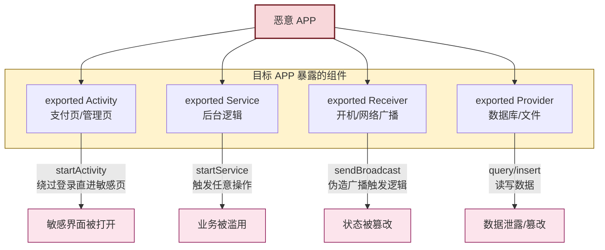

# 8.4 权限最小化、恶意调用防范

> [!abstract] 本节概述
> Android 四大组件（Activity / Service / BroadcastReceiver / ContentProvider）天然可被跨应用调用，"组件暴露"是移动应用最常被忽视的攻击面。本节围绕"最小权限原则"展开：识别 exported 组件的越权风险，讲解 `exported=false`、自定义权限、签名级权限三层组件保护；分析隐式 Intent、PendingIntent、Deep Link/App Link 的安全风险与防护代码；帮助开发者建立"组件入口即攻击入口"的工程意识。

## 1. 权限最小化原则

> [!definition] 最小权限原则
> 最小权限原则（Principle of Least Privilege）要求：应用只申请完成功能所必需的权限，组件只暴露给必需的调用方，运行时权限按需动态申请。任何多余的权限或暴露的组件，都是潜在的攻击面。

### 1.1 Android 权限的三个层面

| 层面 | 对象 | 配置位置 | 防护目标 |
| ---- | ---- | -------- | -------- |
| 应用级权限 | 系统权限（相机/位置/存储） | AndroidManifest + 运行时申请 | APP 访问系统资源 |
| 组件级权限 | 四大组件 | AndroidManifest `<intent-filter>` 配 `android:permission` | 其他 APP 调用本应用组件 |
| 自定义/签名权限 | 应用间共享 | `<permission>` 标签 | 限定可调用的应用范围 |

### 1.2 运行时权限最小化

```java
// ❌ 错误:一次性申请所有权限,过度收集
ActivityCompat.requestPermissions(this,
    new String[]{
        Manifest.permission.CAMERA,
        Manifest.permission.READ_EXTERNAL_STORAGE,
        Manifest.permission.ACCESS_FINE_LOCATION,
        Manifest.permission.READ_CONTACTS        // 与拍照无关
    }, 100);

// ✅ 正确:按功能场景分别申请,只申请当前需要的
// 拍照时只申请相机权限
ActivityCompat.requestPermissions(this,
    new String[]{Manifest.permission.CAMERA}, REQ_CAMERA);
```

> [!tip] 运行时权限最佳实践
> - 按功能场景申请：扫码时申请相机，定位时申请位置，不要"打包申请"
> - 申请前给 rationale：解释为什么需要权限，提高用户授权率
> - 处理"拒绝且不再询问"：引导用户到设置页手动开启
> - `targetSdkVersion` ≥ 23 时危险权限必须运行时申请，否则直接拒绝

## 2. 组件暴露风险

> [!definition] exported 属性
> Android 四大组件通过 `android:exported` 控制是否可被其他应用调用：
> - `exported="false"`（默认）：仅本应用可调用
> - `exported="true"`：可被其他应用调用
>
> **特例**：含 `<intent-filter>` 的组件在 Android 12 之前默认 exported=true，Android 12（API 31）起必须显式声明，否则编译报错。

### 2.1 组件暴露攻击路径



### 2.2 各组件暴露的典型风险

| 组件 | 暴露风险 | 典型攻击 | 后果 |
| ---- | -------- | -------- | ---- |
| Activity | 绕过登录直接打开敏感页面 | `startActivity` 跳支付页 | 越权操作 |
| Service | 远程调用任意方法 | `startService` / `bindService` | 业务被滥用 |
| BroadcastReceiver | 伪造广播触发逻辑 | `sendBroadcast` 注入数据 | 状态篡改 |
| ContentProvider | 任意 SQL 查询/注入 | `query` + selection 注入 | 数据泄露 |

> [!warning] 仅限授权实验环境使用
> 下列命令仅用于测试自有应用，禁止用于攻击他人应用：
> ```bash
> # 测试自有应用组件是否暴露(授权实验设备)
> adb shell am start -n com.example.app/.PaymentActivity
# 查询暴露的 Provider
adb shell content query --uri content://com.example.app.provider/users
# 发送广播
adb shell am broadcast -a com.example.app.ACTION_RESET --es extra "data"
```

## 3. 组件保护三层方案

### 3.1 第一层：exported=false（默认不暴露）

```xml
<!-- ✅ 默认不暴露:仅本应用可调用 -->
<activity
    android:name=".PaymentActivity"
    android:exported="false" />

<!-- 含 IntentFilter 必须显式声明 exported -->
<activity
    android:name=".MainActivity"
    android:exported="true">
    <intent-filter>
        <action android:name="android.intent.action.MAIN" />
        <category android:name="android.intent.category.LAUNCHER" />
    </intent-filter>
</activity>
```

> [!tip] 何时必须 exported=true
> - 启动 Activity（桌面图标）
> - 需要被外部调起的分享/支付 Activity
> - 系统广播接收器（开机、来电等）
> - 暴露给其他应用的 ContentProvider
> 其他场景一律 `exported="false"`。

### 3.2 第二层：自定义权限保护

```xml
<!-- 1. 在提供方应用声明自定义权限 -->
<permission
    android:name="com.example.app.permission.PAY"
    android:protectionLevel="normal"
    android:label="允许调用支付组件"
    android:description="@string/perm_pay_desc" />

<!-- 2. 组件用 android:permission 限定调用方 -->
<activity
    android:name=".PaymentActivity"
    android:exported="true"
    android:permission="com.example.app.permission.PAY" />

<!-- 3. 调用方应用声明使用权限 -->
<uses-permission android:name="com.example.app.permission.PAY" />
```

> [!info] protectionLevel 防护强度
> | 级别 | 防护强度 | 说明 |
> | ---- | -------- | ---- |
> | normal | 弱 | 安装时自动授予，用户无感知 |
> | dangerous | 中 | 安装时提示用户，但 Android Pro 特性已弱化 |
> | signature | 强 | 仅同签名应用可授予，**推荐用于应用内组件互调** |
> | signatureOrSystem | 极强 | 系统应用或同签名 |
>
> 普通自定义权限（normal）只能阻挡"未声明 uses-permission"的应用，恶意应用主动声明即可绕过。**真正可靠的组件保护是 signature 级权限**。

### 3.3 第三层：签名级权限（最可靠）

```xml
<!-- 提供方与调用方使用同一签名密钥 -->
<permission
    android:name="com.example.app.permission.INTERNAL"
    android:protectionLevel="signature" />

<activity
    android:name=".InternalActivity"
    android:exported="true"
    android:permission="com.example.app.permission.INTERNAL" />
```

> [!definition] 签名级权限
> `protectionLevel="signature"` 的权限，系统会自动比较调用方与声明方的 APK 签名是否一致。只有用同一密钥签名的应用才能获得该权限，第三方应用即使声明 `uses-permission` 也无法获取。这是组件暴露给"自家多应用"时的最佳实践。

### 3.4 ContentProvider 保护

```xml
<provider
    android:name=".UserProvider"
    android:authorities="com.example.app.user"
    android:exported="true"
    android:permission="com.example.app.permission.READ_USER"
    android:readPermission="com.example.app.permission.READ_USER"
    android:writePermission="com.example.app.permission.WRITE_USER"
    android:grantUriPermissions="false" />
```

> [!warning] ContentProvider SQL 注入
> 暴露的 Provider 若直接拼接用户输入到 `selection`，会被注入：
> ```java
> // ❌ 错误:可被注入
> String selection = "name='" + userInput + "'";
> Cursor c = db.query("users", null, selection, null, null, null, null);
> // 攻击:userInput = "' OR '1'='1" → 查出全表
>
> // ✅ 正确:用参数化查询
> String selection = "name=?";
> String[] args = new String[]{userInput};
> Cursor c = db.query("users", null, selection, args, null, null, null);
> ```
> 暴露的 Provider **必须**用 `?` 占位符 + `selectionArgs`，禁止字符串拼接。

## 4. Intent 安全

### 4.1 隐式 Intent 风险

> [!definition] 隐式 Intent
> 隐式 Intent 不指定目标组件名，只指定 action/category/data，由系统匹配所有符合条件的组件。若多个应用都注册了同一 action，用户/系统会选择其中一个，敏感数据可能被恶意应用截获。

```java
// ❌ 风险:隐式 Intent 发送敏感数据,可能被恶意应用截获
Intent intent = new Intent("com.example.SEND_MESSAGE");
intent.putExtra("token", "eyJhbGciOi...");
sendBroadcast(intent);   // 任意注册了该 action 的应用都能收到

// ✅ 安全:显式 Intent 指定目标包名
Intent intent = new Intent("com.example.SEND_MESSAGE")
    .setPackage("com.example.targetapp");   // 限定目标
sendBroadcast(intent, "com.example.permission.RECEIVE_MSG");  // 加权限限制
```

> [!tip] 隐式 Intent 安全规则
> - 携带敏感数据的广播必须 `setPackage()` 限定目标
> - 用 `sendBroadcast(intent, permission)` 限定接收方权限
> - 内部组件通信一律用显式 Intent
> - Android 14+ 对隐式广播进一步限制

### 4.2 PendingIntent 安全

> [!definition] PendingIntent
> PendingIntent 是"可跨进程传递、由其他应用代为发送"的 Intent。常用于通知点击、Widget、闹钟等场景。若未指定 Intent 限制，接收方可以修改 PendingIntent 的额外数据。

```java
// ❌ 风险:PendingIntent 不限制,接收方可填充恶意数据
PendingIntent pi = PendingIntent.getActivity(this, 0,
    new Intent("com.example.ACTION"),
    PendingIntent.FLAG_UPDATE_CURRENT);   // 缺少 FLAG_IMMUTABLE

// ✅ 安全:Android 12+ 强制要求声明可变性
PendingIntent pi = PendingIntent.getActivity(this, 0,
    new Intent("com.example.ACTION"),
    PendingIntent.FLAG_IMMUTABLE | PendingIntent.FLAG_UPDATE_CURRENT);
```

> [!warning] PendingIntent 必备 FLAG
> Android 12（API 31）起，PendingIntent 必须显式声明 `FLAG_IMMUTABLE` 或 `FLAG_MUTABLE`：
> - `FLAG_IMMUTABLE`（推荐）：Intent 内容不可被接收方修改
> - `FLAG_MUTABLE`：仅在必须让接收方填充字段时使用（如通知回复框），且必须最小化可变字段

## 5. 深度链接安全

### 5.1 Deep Link 与 App Link

> [!definition] Deep Link / App Link
> - **Deep Link**：通过 `<intent-filter>` 的 scheme/host/path 让浏览器或其他应用唤起 APP。Android 任何应用都可注册相同 scheme，会弹出"用哪个应用打开"选择框。
> - **App Link**（Android 6.0+）：基于 HTTPS scheme + 服务端 `assetlinks.json` 验证，系统能确定唯一处理应用，无选择框，更安全。

```xml
<!-- Deep Link:任何应用都可注册相同 scheme,有冲突风险 -->
<activity android:name=".DeepLinkActivity" android:exported="true">
    <intent-filter>
        <action android:name="android.intent.action.VIEW" />
        <category android:name="android.intent.category.DEFAULT" />
        <category android:name="android.intent.category.BROWSABLE" />
        <data android:scheme="myapp" android:host="open" />
    </intent-filter>
</activity>

<!-- App Link:基于 HTTPS + 服务端验证,无歧义 -->
<activity android:name=".AppLinkActivity" android:exported="true">
    <intent-filter android:autoVerify="true">
        <action android:name="android.intent.action.VIEW" />
        <category android:name="android.intent.category.DEFAULT" />
        <category android:name="android.intent.category.BROWSABLE" />
        <data android:scheme="https"
              android:host="www.example.com"
              android:pathPrefix="/open" />
    </intent-filter>
</activity>
```

### 5.2 Deep Link 安全风险

```java
// 在被唤起的 Activity 中
Uri data = getIntent().getData();
String param = data.getQueryParameter("param");
// ❌ 风险:任意网站可构造 myapp://open?param=XXX 唤起并传任意参数
// 若直接执行 param 对应的操作(如转账),构成 Deep Link 劫持
```

> [!warning] Deep Link 防护要点
> 1. **优先用 App Link**：HTTPS + autoVerify 让系统确定唯一应用
> 2. **校验来源**：Deep Link 入口必须校验调用方来源（referring package）
> 3. **参数白名单**：解析 URL 参数时只接受预期字段，拒绝意外字段
> 4. **敏感操作二次确认**：Deep Link 触发的转账/支付必须二次确认
> 5. **不要用 Deep Link 传敏感数据**：URL 可被日志/浏览器记录

## 6. 综合案例：恶意 APP 调用暴露组件

> [!example] 案例：某 APP 暴露支付组件被越权调用
> 某 APP 的 PaymentActivity 配置如下：
> ```xml
> <!-- ❌ 错误配置 -->
> <activity
>     android:name=".PaymentActivity"
>     android:exported="true">   <!-- 暴露但无权限保护 -->
>     <intent-filter>
>         <action android:name="com.example.PAY" />
>     </intent-filter>
> </activity>
> ```
>
> 攻击者构造恶意 APP，绕过登录直接打开支付页：
> ```java
> // 恶意 APP 代码
> Intent intent = new Intent("com.example.PAY");
> intent.putExtra("amount", 1000000);
> intent.putExtra("to_account", "attacker_account");
> startActivity(intent);
> ```
>
> **修复方案**：
> ```xml
> <permission android:name="com.example.app.permission.PAY"
>     android:protectionLevel="signature" />
>
> <activity
>     android:name=".PaymentActivity"
>     android:exported="false"   <!-- 默认不暴露 -->
>     android:permission="com.example.app.permission.PAY" />
> ```
> 同时 PaymentActivity 内部再次校验登录状态与金额，不依赖组件入口校验。

## 7. 组件保护对比表

| 保护方式 | 防护强度 | 兼容性 | 适用场景 |
| -------- | -------- | ------ | -------- |
| `exported="false"` | 强 | 极好 | 仅本应用调用的组件（默认） |
| 普通自定义权限（normal） | 弱 | 好 | 仅阻挡未声明权限的应用 |
| 签名级权限（signature） | 强 | 好 | 同签名的多应用互调 |
| 显式 Intent + setPackage | 强 | 好 | 内部应用间通信 |
| App Link（autoVerify） | 强 | Android 6.0+ | 网页唤起应用 |
| 组件内业务校验 | 强（兜底） | 极好 | 任何组件都应做 |

## 8. 易错点与最佳实践

> [!warning] 常见易错点
> 1. **含 IntentFilter 未声明 exported**：Android 12 前默认 true 暴露，Android 12 起编译报错
> 2. **暴露的 Activity 无权限保护**：恶意 APP 直接 `startActivity` 越权
> 3. **ContentProvider 拼接 selection**：SQL 注入泄露数据
> 4. **隐式 Intent 传敏感数据**：被恶意应用截获
> 5. **PendingIntent 缺 FLAG_IMMUTABLE**：Android 12+ 崩溃，且可被篡改
> 6. **Deep Link 直接执行敏感操作**：被任意网页劫持
> 7. **一次申请所有权限**：过度收集，被审核拒绝

> [!tip] 最佳实践
> - 组件默认 `exported="false"`，确需暴露时配签名级权限
> - 内部通信用显式 Intent，敏感广播用 `setPackage` 限定目标
> - PendingIntent 必须加 `FLAG_IMMUTABLE`
> - 网页唤起优先用 App Link 而非自定义 scheme Deep Link
> - 暴露的 Provider 一律用参数化查询防注入
> - 任何组件入口都应做业务校验，不信任调用方传入的参数

## 章节导航

- 上级：[[MOC - 第8章|第8章 移动应用安全]]
- 上一节：[[8.3 HTTPS 防抓包、证书校验|8.3 HTTPS 防抓包、证书校验]]
- 下一节：[[8.5 应用加固基础概念|8.5 应用加固基础概念]]
- 习题：[[MOC - 第8章习题|第8章习题]]
