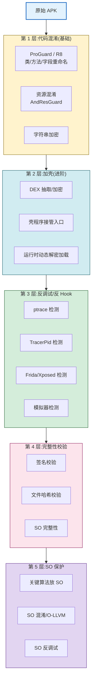
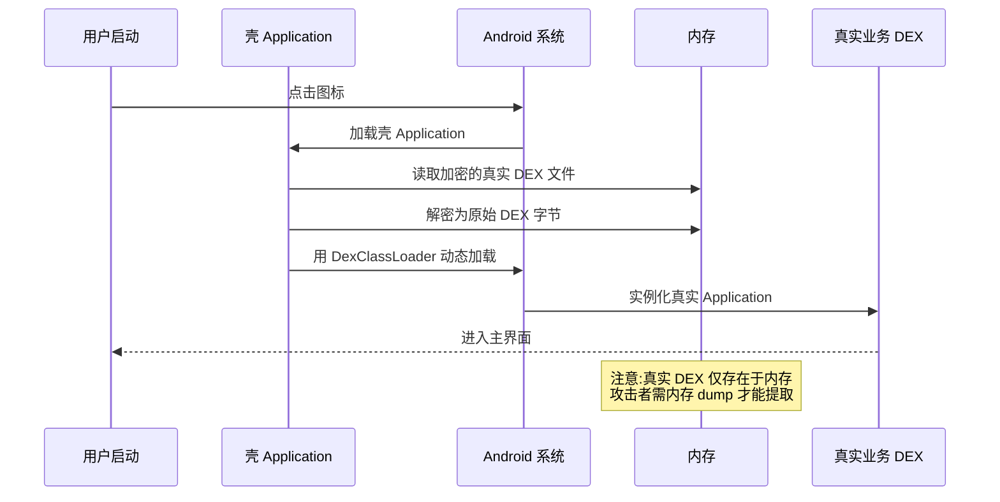

# 8.5 应用加固基础概念

> [!abstract] 本节概述
> 前几节的加密、防抓包、组件保护都属于"运行期防护"，但 APK 本身可被反编译、修改、重签名后再次分发。应用加固（App Hardening）针对"代码本身被逆向与篡改"这一层风险，通过代码混淆、加壳、反调试、完整性校验、SO 库保护等手段提高对抗门槛。本节讲解各类加固手段的原理、工具、强度与局限，建立"加固不等于绝对安全，而是提高攻击成本"的正确认知。

## 1. 应用加固的目的

> [!definition] 应用加固
> 应用加固是对已编译的 APK 进行二次处理，使其在保留功能的前提下，难以被反编译、分析、修改和调试。加固的三大目标是：
> - **防逆向**：阻止攻击者阅读代码、提取业务逻辑与密钥
> - **防篡改**：阻止攻击者修改 APK 后重签名分发
> - **防调试**：阻止攻击者用调试器/Hook 工具动态分析运行期行为

> [!info] 加固的边界
> 加固**不能**让 APP 变得"无法破解"，只能提高攻击成本。攻击者拥有 Root 设备 + Frida + IDA Pro + 足够时间，理论上能突破任何加固。加固的工程价值在于：
> - 提高破解门槛，过滤掉低水平攻击者
> - 延长破解时间，使业务窗口期（如活动期间）度过
> - 配合法律手段（如版权投诉）形成综合防护

## 2. 加固手段分层



## 3. 代码混淆：ProGuard / R8

> [!definition] ProGuard / R8
> ProGuard 是 Java 字节码优化与混淆工具，R8 是 Android Gradle Plugin 3.4+ 起的替代实现，集成了混淆、压缩、优化功能。两者将类名、方法名、字段名替换为无意义短名（如 `a`、`b`、`c`），移除未使用代码，大幅提高反编译可读性门槛。

### 3.1 启用混淆

```gradle
android {
    buildTypes {
        release {
            minifyEnabled true          // 开启 R8 混淆
            shrinkResources true        // 移除未使用资源
            proguardFiles getDefaultProguardFile('proguard-android-optimize.txt'),
                          'proguard-rules.pro'
        }
    }
}
```

### 3.2 proguard-rules.pro 关键规则

```proguard
# 保留四大组件(Manifest 已声明,R8 默认保留,显式更安全)
-keep public class * extends android.app.Activity
-keep public class * extends android.app.Service
-keep public class * extends android.content.BroadcastReceiver
-keep public class * extends android.content.ContentProvider

# 保留 JNI 调用的 native 方法
-keepclasseswithmembernames class * {
    native <methods>;
}

# 保留反射使用的类(如 Gson 序列化的 POJO)
-keep class com.example.model.** { *; }
-keep class com.google.gson.** { *; }

# 保留枚举
-keepclassmembers enum * {
    public static **[] values();
    public static ** valueOf(java.lang.String);
}

# 移除日志(可选,Release 包减小体积且不泄露调试信息)
-assumenosideeffects class android.util.Log {
    public static *** v(...);
    public static *** d(...);
    public static *** i(...);
}

# 保留序列化接口
-keep class java.io.Serializable { *; }
```

> [!warning] 混淆易错点
> 1. **混淆 Gson 模型类**：反射找不到字段，解析返回 null。必须 keep
> 2. **混淆 JNI 调用类**：native 方法名被改，Java 与 C++ 找不到对应。必须 keep native
> 3. **混淆反射调用类**：`Class.forName("com.example.A")` 失败。必须 keep 类名
> 4. **未开启 minifyEnabled**：Release 包未混淆，等于裸奔
> 5. **未测试 Release 包**：Debug 跑通不代表 Release 跑通，混淆后行为可能变化

### 3.3 资源混淆 AndResGuard

资源混淆将 `res/drawable/icon.png` 等长路径替换为 `r/a/a.png` 短路径，减小 APK 体积并提高资源提取门槛。

```bash
# AndResGuard 命令行(也支持 Gradle 插件)
java -jar AndResGuard.jar input.apk -config config.xml -out output_dir
```

## 4. 加壳（DEX 保护）

> [!definition] 加壳
> 加壳（Packing）是将原始 DEX 加密抽取，替换为壳程序的 DEX。APK 启动时壳程序先运行，在内存中解密原始 DEX 并动态加载。攻击者直接 `jadx` 反编译只能看到壳代码，看不到真实业务。

### 4.1 加壳工作流程



### 4.2 主流加壳服务

| 服务 | 厂商 | 特点 |
| ---- | ---- | ---- |
| 腾讯乐固 / 应用安全加固 | 腾讯 | DEX 加壳 + SO 加固 + 防调试 |
| 360 加固保 | 奇虎 360 | 多重加壳、内存保护 |
| 阿里聚安全 / 移动安全加固 | 阿里 | DEX 加壳 + VMP |
| 网易易盾 | 网易 | 加壳 + 反外挂 |
| 梆梆安全 / 爱加密 | 第三方 | 商业加壳服务 |

> [!tip] 加壳服务使用流程
> 1. 上传已签名 APK 到加固平台
> 2. 平台自动完成 DEX 加密、壳程序注入、SO 加固
> 3. 下载加固后的 APK（需重新签名才能发布）
> 4. 用自有密钥重签名 → 投产
> 加固会改变 DEX 结构，**必须在加固后重新签名**。

### 4.3 加壳的局限

> [!warning] 加壳不是万能的
> - **内存 dump**：运行期真实 DEX 必然在内存出现，可用 Frida + dexfinder 提取
> - **脱壳工具**：FART、BlackDex 等开源脱壳工具针对主流壳有效
> - **性能损耗**：启动时需解密 DEX，冷启动变慢 200ms~1s
> - **兼容性风险**：少数机型/系统版本可能出现崩溃
> - **应用商店审核**：部分商店对加壳 APK 有额外审查

## 5. 反调试与反 Hook

### 5.1 ptrace 检测

> [!definition] ptrace 反调试
> Linux 下一个进程同一时间只能被一个调试器附加。APP 启动时主动 `ptrace(PTRACE_TRACEME)` 自己，若已被调试器附加会失败，从而检测调试。

```c
// native-lib.c
#include <sys/ptrace.h>
#include <unistd.h>

void anti_debug() {
    if (ptrace(PTRACE_TRACEME, 0, 0, 0) < 0) {
        // 已被调试,直接退出
        _exit(0);
    }
}
```

### 5.2 TracerPid 检测

读取 `/proc/self/status` 中的 `TracerPid` 字段，非 0 表示有调试器附加。

```c
int check_tracer_pid() {
    FILE *f = fopen("/proc/self/status", "r");
    if (!f) return 0;
    char line[256];
    int pid = 0;
    while (fgets(line, sizeof(line), f)) {
        if (strncmp(line, "TracerPid:", 10) == 0) {
            sscanf(line + 10, "%d", &pid);
            break;
        }
    }
    fclose(f);
    return pid;   // 非 0 即被调试
}
```

### 5.3 Frida / Xposed 检测

```java
public class HookDetector {
    /** 检测 Frida(端口/进程) */
    public static boolean isFridaPresent() {
        // 1. 检测 frida-server 默认端口 27042
        try (Socket s = new Socket("127.0.0.1", 27042)) {
            return true;
        } catch (Exception ignored) {}
        // 2. 检测加载了 frida-gadget 的库
        for (File map : new File("/proc/self/maps").listFiles()) {
            // 简化:实际应读取 /proc/self/maps 文本查找 frida/gum 字样
        }
        return false;
    }

    /** 检测 Xposed */
    public static boolean isXposedPresent() {
        try {
            throw new Exception("test");
        } catch (Exception e) {
            // Xposed 会在异常栈中插入 de.robv.android.xposed
            for (StackTraceElement el : e.getStackTrace()) {
                if (el.getClassName().contains("de.robv.android.xposed")) {
                    return true;
                }
            }
        }
        try {
            Class.forName("de.robv.android.xposed.XposedBridge");
            return true;
        } catch (ClassNotFoundException ignored) {}
        return false;
    }
}
```

> [!warning] 反调试的局限
> - 反调试代码本身可被 Hook 绕过（让检测函数永远返回 false）
> - 高级攻击者会先 NOP 掉反调试再分析
> - 反调试应多层、多点、动态检测，单点必被绕过
> - 反调试触发"退出 APP"易被识别，可改为"静默上报风控"

## 6. 完整性校验

> [!definition] 完整性校验
> 完整性校验是 APP 在运行时检查自身 APK 文件是否被篡改：通过比对当前签名/文件哈希与预期值，识别二次打包。这是防篡改的最后一道防线。

### 6.1 签名校验

```java
public class IntegrityChecker {
    private static final String EXPECTED_SHA = "AB:CD:EF:...";   // 预期签名指纹

    public static boolean verifySignature(Context context) {
        try {
            PackageManager pm = context.getPackageManager();
            PackageInfo info = pm.getPackageInfo(
                context.getPackageName(),
                PackageManager.GET_SIGNATURES);
            for (Signature sig : info.signatures) {
                MessageDigest md = MessageDigest.getInstance("SHA-1");
                byte[] digest = md.digest(sig.toByteArray());
                String hex = bytesToHex(digest);
                if (EXPECTED_SHA.equalsIgnoreCase(hex)) {
                    return true;
                }
            }
        } catch (Exception e) {
            e.printStackTrace();
        }
        return false;
    }

    private static String bytesToHex(byte[] bytes) {
        StringBuilder sb = new StringBuilder();
        for (byte b : bytes) sb.append(String.format("%02X", b));
        return sb.toString();
    }
}
```

> [!warning] 签名校验易被绕过
> - 签名校验代码本身可被 Hook 让 `verifySignature` 永远返回 true
> - 签名校验应放在 SO 中执行，提高 Hook 难度
> - 应多点校验（启动、关键操作前、定时心跳）
> - 校验失败不应直接退出，可上报风控 + 静默降级

### 6.2 文件哈希校验

```java
/** 计算 APK 文件 SHA-256,与预期比对 */
public static boolean verifyApkHash(Context context, String expectedHash) {
    try {
        ApplicationInfo ai = context.getApplicationInfo();
        String apkPath = ai.sourceDir;
        MessageDigest md = MessageDigest.getInstance("SHA-256");
        try (FileInputStream fis = new FileInputStream(apkPath)) {
            byte[] buf = new byte[8192];
            int len;
            while ((len = fis.read(buf)) != -1) {
                md.update(buf, 0, len);
            }
        }
        String hash = bytesToHex(md.digest());
        return expectedHash.equalsIgnoreCase(hash);
    } catch (Exception e) {
        return false;
    }
}
```

## 7. SO 库保护

> [!definition] SO 库保护
> 将关键算法（加密、签名、校验）放到 Native 层（C/C++ 编译为 `.so`），借助 IDA Pro 等工具逆向 SO 的门槛高于 Java 反编译。SO 保护包括：SO 混淆、控制流平坦化、反调试、字符串加密。

### 7.1 SO 保护手段

| 手段 | 原理 | 工具 |
| ---- | ---- | ---- |
| O-LLVM 混淆 | 控制流平坦化、虚假控制流、指令替换 | O-LLVM / Hikari |
| 字符串加密 | 关键字符串编译期加密，运行时解密 | OLLVM 字符串加密 |
| 反调试 | ptrace + TracerPid + /proc 检测 | 自实现 |
| 符号剥离 | `strip` 移除符号表 | NDK strip |
| VMP | 代码虚拟化为自定义指令集 | 商业方案 |

```c
// native-lib.c:关键算法放 SO
#include <jni.h>
#include <string.h>

// 字符串编译期加密,运行时解密(简化示例)
static char* get_secret_key() {
    static char key[] = {0x41, 0x42, 0x43, 0x44, 0x00};  // 实际应用 XOR 加密
    return key;
}

JNIEXPORT jstring JNICALL
Java_com_example_App_getToken(JNIEnv *env, jobject thiz) {
    // 关键逻辑在 SO 中实现,Java 层只看到调用结果
    char *key = get_secret_key();
    // ... 计算 Token
    return (*env)->NewStringUTF(env, "computed_token");
}
```

```gradle
// build.gradle:启用 SO 剥离
android {
    defaultConfig {
        externalNativeBuild {
            cmake {
                cFlags "-fvisibility=hidden"   // 隐藏符号
                cppFlags "-fvisibility=hidden"
            }
        }
        packagingOptions {
            jniLibs {
                useLegacyPackaging true
            }
        }
    }
}
```

## 8. 加固手段对比

| 手段 | 防护目标 | 强度 | 性能损耗 | 工具/方案 | 局限 |
| ---- | -------- | ---- | -------- | --------- | ---- |
| ProGuard/R8 混淆 | 防逆向阅读 | 弱 | 极小 | Android 内置 | 字符串/算法仍可见 |
| 资源混淆 | 防资源提取 | 弱 | 极小 | AndResGuard | 不防代码 |
| 加壳 | 防静态分析 | 中 | 中（冷启动慢） | 腾讯乐固/360 | 内存 dump 可脱壳 |
| 反调试 | 防动态调试 | 中 | 小 | ptrace/TracerPid | 可被 Hook 绕过 |
| 签名校验 | 防二次打包 | 中 | 极小 | 自实现 | 校验函数可被 Hook |
| 文件哈希校验 | 防篡改 | 中 | 极小 | 自实现 | 同上 |
| SO 混淆 | 防 SO 逆向 | 中高 | 中 | O-LLVM/Hikari | 仍可被高级逆向 |
| VMP | 防逆向 | 高 | 高 | 商业方案 | 性能损耗大、兼容性差 |

## 9. 综合案例：加固前后逆向对比

> [!example] 案例：某 APP 加固前后反编译对比
> 某 APP 在加固前后分别用 `jadx` 反编译，对比结果：
>
> | 维度 | 未加固 | 加固后 |
> | ---- | ------ | ------ |
> | 类名 | `com.example.LoginManager` | `com.a.b.c` |
> | 方法名 | `verifyPassword` | `a` |
> | 字符串 | `"https://api.example.com/login"` | 加密字符串 |
> | 业务逻辑 | 完整可读 | 仅壳 Application 可见 |
> | DEX | 直接可见 | 加密抽取 |
> | 签名 | 可被二次签名 | 校验失败退出 |
> | 调试 | 可附加 | ptrace 检测退出 |
>
> 加固使攻击者从"5 分钟拿到完整源码"变为"需要数天脱壳 + 反混淆 + 反调试对抗"，过滤了绝大多数低水平攻击者。

## 10. 易错点与最佳实践

> [!warning] 常见易错点
> 1. **Release 包未开启 minifyEnabled**：DEX 完全可读
> 2. **混淆规则不完整**：Gson 模型被混淆导致解析失败
> 3. **加壳后未重新签名**：APK 无法安装
> 4. **加壳后未测试冷启动**：少数机型崩溃未发现
> 5. **反调试单点检测**：被 NOP 即失效
> 6. **签名校验放 Java 层**：被 Frida 一行代码绕过
> 7. **以为加固就安全**：忽略运行期数据保护与组件防护

> [!tip] 最佳实践
> - Release 必开 R8 + shrinkResources，混淆规则反复测试
> - 关键算法放 SO，配合 O-LLVM 混淆与反调试
> - 签名/完整性校验放 SO，多点定时检测
> - 选择主流加固服务（腾讯乐固/360）作为基础防护
> - 加固与 [[8.2 本地数据加密、敏感信息保护|8.2 数据加密]]、[[8.3 HTTPS 防抓包、证书校验|8.3 SSL Pinning]]、[[8.4 权限最小化、恶意调用防范|8.4 组件防护]] 多层叠加
> - 持续更新加固方案，跟踪新型脱壳/Hook 工具的对抗手段

## 章节导航

- 上级：[[MOC - 第8章|第8章 移动应用安全]]
- 上一节：[[8.4 权限最小化、恶意调用防范|8.4 权限最小化、恶意调用防范]]
- 习题：[[MOC - 第8章习题|第8章习题]]
