# MOC - 第8章 移动应用安全

移动应用承载着用户的隐私数据、账户凭证与商业逻辑，而 Android 平台的开放性、组件化与可逆向性使其攻击面远大于传统桌面应用。本章从"威胁建模 → 数据保护 → 通信安全 → 组件防护 → 加固对抗"五个维度串起移动应用安全的核心知识，目标是让开发者建立"安全左移"的工程意识，而非堆叠加密算法。

> [!info] 本章定位
> - **核心对象**：移动应用自身的资产、信任边界与对抗面
> - **关键能力**：威胁建模与风险识别、本地数据加密与密钥管理、HTTPS 防抓包与证书固定、组件权限最小化、应用加固与反逆向
> - **承前启后**：在第5章数据持久化、第6章网络通信基础上引入安全防护；为第10章应用打包发布时的签名校验、加固上线打基础
> - **考试权重**：本地数据加密、SSL Pinning、组件暴露防护为高频考点
> - **安全提示**：本章所有攻击命令、抓包操作仅限授权实验环境使用

> [!abstract] 本章核心问题
> 1. 移动应用常见的安全风险有哪些？OWASP Mobile Top 10 如何分类？
> 2. 本地数据如何加密存储？密钥应放在哪里才安全？
> 3. HTTPS 为什么仍能被抓包？证书固定（SSL Pinning）如何防护中间人攻击？
> 4. 组件 exported 暴露会带来什么风险？如何用权限最小化原则防护？
> 5. 应用加固能解决什么问题？ProGuard/R8、加壳、反调试各自的边界在哪里？

## 本章学习路线

```mermaid
flowchart LR
    S1["8.1 常见安全风险<br/>OWASP Mobile Top 10"]
    S2["8.2 本地数据加密<br/>Keystore/SQLCipher"]
    S3["8.3 HTTPS 防抓包<br/>SSL Pinning"]
    S4["8.4 权限最小化<br/>组件暴露防护"]
    S5["8.5 应用加固<br/>混淆/加壳/反调试"]

    S1 -->|"风险识别→分层防护"| S2
    S2 -->|"静态数据→动态通信"| S3
    S3 -->|"通信安全→组件入口"| S4
    S4 -->|"运行期防护→发布前加固"| S5

    style S1 fill:#e3f2fd,stroke:#1565c0,stroke-width:2px
    style S2 fill:#fff3cd,stroke:#856404,stroke-width:2px
    style S3 fill:#d1ecf1,stroke:#0c5460,stroke-width:2px
    style S4 fill:#d4edda,stroke:#155724,stroke-width:2px
    style S5 fill:#fce4ec,stroke:#880e4f,stroke-width:2px
```

## 知识点导航

| 序号 | 知识点 | 核心内容 | 重点等级 |
| ---- | ------ | -------- | -------- |
| 8.1 | [[8.1 移动应用常见安全风险\|常见安全风险]] | OWASP Mobile Top 10、攻击面建模、数据存储/通信/认证/逆向/组件/第三方库六大风险分类 | ⭐⭐⭐⭐ |
| 8.2 | [[8.2 本地数据加密、敏感信息保护\|本地数据加密]] | SP/SQLite/日志泄露、AES 加密、Android Keystore、EncryptedSharedPreferences、SQLCipher、加盐哈希 | ⭐⭐⭐⭐⭐ |
| 8.3 | [[8.3 HTTPS 防抓包、证书校验\|HTTPS 防抓包]] | MITM 抓包原理、系统 CA 校验、Certificate Pinning、OkHttp CertificatePinner、代理检测 | ⭐⭐⭐⭐⭐ |
| 8.4 | [[8.4 权限最小化、恶意调用防范\|权限最小化]] | 最小权限原则、exported 组件风险、自定义/签名权限、Intent 安全、Deep Link/App Link | ⭐⭐⭐⭐ |
| 8.5 | [[8.5 应用加固基础概念\|应用加固]] | 防逆向/防篡改/防调试、ProGuard/R8 混淆、加壳、反调试检测、签名完整性校验、SO 库保护 | ⭐⭐⭐ |

## 核心考点速览

> [!warning] 高频考点（7 点）
> 1. **OWASP Mobile Top 10 风险分类**：能识别六大类风险并举例（**必考**）
> 2. **本地数据加密方案**：SharedPreferences 明文风险、EncryptedSharedPreferences、SQLCipher 的使用场景
> 3. **Android Keystore**：密钥不硬编码、Keystore 存储密钥的原理与不可导出性
> 4. **SSL Pinning 原理与实现**：MITM 抓包流程、OkHttp CertificatePinner 代码实现（**必考**）
> 5. **组件暴露风险**：exported=true 的危害、自定义权限与签名权限的区别
> 6. **权限最小化原则**：Android 运行时权限、组件权限保护、Intent 安全
> 7. **加固手段对比**：ProGuard/R8 混淆、加壳、反调试、完整性校验各自的作用与局限

## 关键概念速查

### 安全属性 CIA 三要素

| 属性 | 英文 | 移动端体现 | 典型威胁 |
| ---- | ---- | ---------- | -------- |
| 机密性 | Confidentiality | 数据不泄露 | 明文存储、HTTPS 抓包、密钥硬编码 |
| 完整性 | Integrity | 数据不被篡改 | APK 二次打包、组件越权调用 |
| 可用性 | Availability | 服务可访问 | 拒绝服务、组件崩溃 |
| 认证 | Authentication | 身份识别 | 弱口令、Token 伪造 |
| 授权 | Authorization | 权限控制 | exported 组件越权、权限滥用 |

### 加固手段对比速查

| 手段 | 防护目标 | 强度 | 性能损耗 | 典型工具 |
| ---- | -------- | ---- | -------- | -------- |
| 代码混淆 | 防逆向阅读 | 弱 | 极小 | ProGuard / R8 |
| 资源混淆 | 防资源提取 | 弱 | 极小 | AndResGuard |
| 加壳 | 防静态分析 | 中 | 中 | 腾讯乐固、360 加固 |
| 反调试 | 防动态调试 | 中 | 小 | ptrace 检测、TracerPid |
| 完整性校验 | 防二次打包 | 中 | 极小 | 签名校验、文件哈希 |
| SO 加固 | 防 SO 逆向 | 中高 | 中 | SO 混淆、VMP |

### 本地存储方案对比

| 方案 | 明文风险 | 加密强度 | 密钥位置 | 适用场景 |
| ---- | -------- | -------- | -------- | -------- |
| 原生 SharedPreferences | 高 | 无 | — | 非敏感配置 |
| EncryptedSharedPreferences | 低 | AES-256-GCM | Android Keystore | 敏感配置（Token、密码） |
| 原生 SQLite | 高 | 无 | — | 非敏感结构化数据 |
| SQLCipher | 低 | AES-256 | 密码派生（建议 Keystore） | 敏感数据库 |
| 文件内部存储 | 中 | 无 | — | 私有文件 |
| 文件外部存储（SD 卡） | 极高 | 无 | — | 不要存敏感数据 |

## 章节导航

- 上级：[[MOC - 移动互联网开发技术|移动互联网开发技术总览]]
- 上一章：[[MOC - 第7章|第7章 后台服务与消息通知]]
- 下一章：[[MOC - 第9章|第9章 跨平台开发技术基础]]
- 习题：[[MOC - 第8章习题|第8章习题]]
