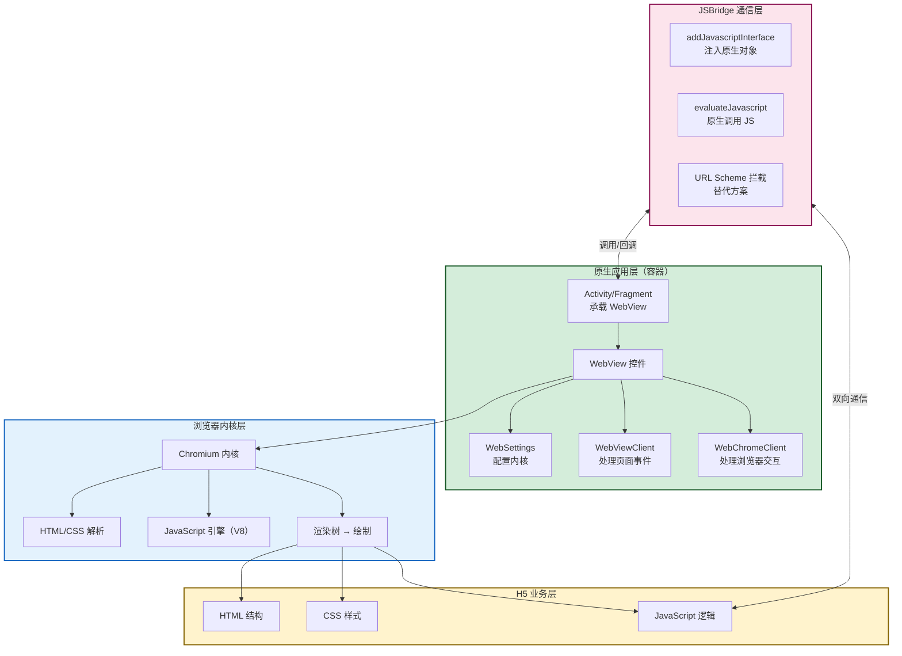
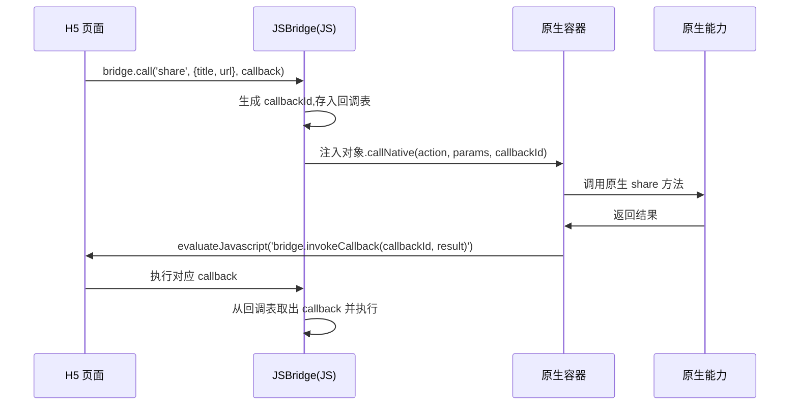

# 9.1 WebView 混合开发

> [!abstract] 本节概述
> 当业务需要"一次开发、随时更新"时，最直接的方案不是引入 Flutter 或 RN，而是用原生应用作为容器，内嵌一个浏览器内核加载 H5 页面，这就是 WebView 混合开发。本节围绕 WebView 控件的使用、原生与 JS 的双向通信机制、JSBridge 的实现原理、性能优化与安全风险展开，建立对"最轻量跨平台方案"的完整认识，为 9.4 节的方案选型提供判断依据。

## 1. WebView 混合开发的概念

> [!definition] WebView 与混合开发
> WebView 是 Android 系统提供的、基于浏览器内核（Chromium）的视图控件，可以在原生应用内嵌入渲染网页内容。**WebView 混合开发（Hybrid Development）** 指以原生应用为壳，通过 WebView 加载 H5 页面，并通过 JSBridge 让 H5 与原生能力交互的开发方式。

混合开发的本质是"职责分工"：

| 层次 | 负责方 | 典型职责 |
| ---- | ------ | -------- |
| 容器 | 原生（Java/Kotlin） | 提供 WebView、管理生命周期、注入原生能力 |
| 渲染 | 浏览器内核（Chromium） | 解析 HTML/CSS/JS、绘制页面 |
| 业务 | H5（HTML/CSS/JS） | 页面内容、交互逻辑、网络请求 |
| 通信 | JSBridge | H5 调用原生能力、原生回调 H5 |

> [!info] 混合开发的典型场景
> - 电商 APP 的活动页、商品详情页（需频繁更新，内容为主）
> - 资讯类 APP 的文章页（图文混排，H5 表现力足够）
> - 营销活动页（限时活动，发版来不及）
> - 小程序容器（微信、支付宝小程序的本质是受限的 WebView + 增强 API）

## 2. WebView 混合开发架构



> [!note] 图释
> - 原生层负责"壳"：承载 WebView、配置内核、处理页面生命周期
> - 内核层负责"渲染"：解析 H5 三件套并绘制到屏幕
> - H5 层负责"业务"：页面内容与交互逻辑
> - JSBridge 是原生与 H5 的唯一通信通道，决定了混合开发的"原生能力边界"

## 3. WebView 的基本使用

### 3.1 核心组件

> [!definition] WebView 三大核心组件
> - **WebView**：视图控件，继承自 `View`，用于显示网页
> - **WebSettings**：配置对象，控制 JavaScript、缓存、缩放、UA 等内核行为
> - **WebViewClient**：处理页面加载事件，如"是否在应用内打开"、"页面开始/结束加载"、"SSL 错误"
> - **WebChromeClient**：处理浏览器级交互，如"进度条"、"弹窗（alert/confirm/prompt）"、"网页图标"

### 3.2 基础代码示例

```xml
<!-- activity_webview.xml -->
<LinearLayout xmlns:android="http://schemas.android.com/apk/res/android"
    android:layout_width="match_parent"
    android:layout_height="match_parent"
    android:orientation="vertical">

    <ProgressBar
        android:id="@+id/progressBar"
        style="?android:attr/progressBarStyleHorizontal"
        android:layout_width="match_parent"
        android:layout_height="3dp"
        android:max="100" />

    <WebView
        android:id="@+id/webView"
        android:layout_width="match_parent"
        android:layout_height="match_parent" />
</LinearLayout>
```

```java
// WebViewActivity.java
public class WebViewActivity extends AppCompatActivity {
    private WebView webView;
    private ProgressBar progressBar;

    @Override
    protected void onCreate(Bundle savedInstanceState) {
        super.onCreate(savedInstanceState);
        setContentView(R.layout.activity_webview);

        webView = findViewById(R.id.webView);
        progressBar = findViewById(R.id.progressBar);

        // 1. 配置 WebSettings
        WebSettings settings = webView.getSettings();
        settings.setJavaScriptEnabled(true);              // 启用 JS（默认关闭）
        settings.setDomStorageEnabled(true);              // 启用 localStorage
        settings.setUseWideViewPort(true);                // 支持viewport meta
        settings.setLoadWithOverviewMode(true);           // 自适应屏幕
        settings.setCacheMode(WebSettings.LOAD_DEFAULT);  // 缓存策略

        // 2. 设置 WebViewClient:处理页面加载事件
        webView.setWebViewClient(new WebViewClient() {
            @Override
            public boolean shouldOverrideUrlLoading(WebView view, WebResourceRequest request) {
                // 控制链接是否在 WebView 内打开,而非跳系统浏览器
                view.loadUrl(request.getUrl().toString());
                return true;
            }

            @Override
            public void onPageStarted(WebView view, String url, Bitmap favicon) {
                progressBar.setVisibility(View.VISIBLE);
            }

            @Override
            public void onPageFinished(WebView view, String url) {
                progressBar.setVisibility(View.GONE);
            }
        });

        // 3. 设置 WebChromeClient:处理浏览器级交互
        webView.setWebChromeClient(new WebChromeClient() {
            @Override
            public void onProgressChanged(WebView view, int newProgress) {
                progressBar.setProgress(newProgress);
            }

            @Override
            public boolean onJsAlert(WebView view, String url, String message, JsResult result) {
                // 拦截 JS 的 alert(),用原生 Dialog 展示
                new AlertDialog.Builder(WebViewActivity.this)
                    .setMessage(message)
                    .setPositiveButton("确定", (d, w) -> result.confirm())
                    .show();
                return true;
            }
        });

        // 4. 加载页面
        webView.loadUrl("https://m.example.com/product/123");
    }

    // 5. 返回键回退网页历史,而非直接退出 Activity
    @Override
    public void onBackPressed() {
        if (webView.canGoBack()) {
            webView.goBack();
        } else {
            super.onBackPressed();
        }
    }
}
```

> [!tip] WebView 使用的常见陷阱
> - **未启用 JS**：`setJavaScriptEnabled(false)` 时绝大多数现代 H5 页面无法正常工作
> - **未处理返回键**：用户按返回键直接退出 Activity，而非回退到上一网页
> - **未拦截 URL**：默认点击链接会跳到系统浏览器，破坏应用内体验
> - **内存泄漏**：WebView 持有 Activity 引用，需在 `onDestroy` 中主动销毁

## 4. JavaScript 交互：原生与 H5 的双向通信

### 4.1 通信方向

| 方向 | 机制 | 说明 |
| ---- | ---- | ---- |
| Java → JS | `evaluateJavascript()` | 原生主动调用页面中的 JS 函数 |
| JS → Java | `addJavascriptInterface()` + `@JavascriptInterface` | 将 Java 对象注入 JS，JS 直接调用其方法 |
| JS → Java（替代） | URL Scheme 拦截 | JS 通过修改 `location.href` 触发原生拦截 |

### 4.2 Java 调用 JS

```java
// 原生调用 JS 函数(支持返回值,Android 4.4+)
webView.post(() -> {
    webView.evaluateJavascript("showToast('来自原生')", value -> {
        // value 是 JS 函数的返回值(JSON 字符串)
        Log.d("WebView", "JS 返回: " + value);
    });
});
```

> [!note] evaluateJavascript 的版本差异
> - Android 4.4（API 19）之前只能用 `loadUrl("javascript:showToast('...')")`，无法获取返回值
> - Android 4.4+ 推荐 `evaluateJavascript()`，可异步获取返回值
> - 调用必须在主线程执行

### 4.3 JS 调用 Java（addJavascriptInterface）

```java
// 1. 定义注入对象
public class JsBridge {
    private Context context;

    public JsBridge(Context context) {
        this.context = context;
    }

    @JavascriptInterface  // 必须!Android 4.2+ 安全要求
    public void callNative(String action, String params) {
        // JS 调用:window.JsBridge.callNative('share', '{...}')
        Toast.makeText(context, "JS 调用原生: " + action, Toast.LENGTH_SHORT).show();
    }

    @JavascriptInterface
    public String getToken() {
        return "user_token_from_native";
    }
}

// 2. 注入到 WebView
webView.addJavascriptInterface(new JsBridge(this), "JsBridge");
```

```javascript
// H5 端调用原生
function callNative() {
    // 直接调用注入的对象
    window.JsBridge.callNative('share', JSON.stringify({title: '商品', url: '...'}));
}

function getToken() {
    // 可获取返回值
    var token = window.JsBridge.getToken();
    console.log('从原生获取 token:', token);
}
```

> [!warning] addJavascriptInterface 的安全风险
> 在 Android 4.2（API 17）之前，`addJavascriptInterface` 存在严重安全漏洞：所有 Java 对象的公有方法（包括 `getClass()`、`Runtime.exec()`）都能被 JS 调用，恶意网页可借此执行任意命令。
>
> - **Android 4.2+ 修复**：必须显式标注 `@JavascriptInterface` 注解的方法才能被 JS 调用
> - **防护建议**：不要注入敏感对象；仅注入最小必要方法；不要在低版本上使用；对加载的 URL 做白名单校验
> - 详见 [[8.4 权限最小化、恶意调用防范|8.4 权限最小化]]

### 4.4 URL Scheme 拦截（替代方案）

```java
webView.setWebViewClient(new WebViewClient() {
    @Override
    public boolean shouldOverrideUrlLoading(WebView view, WebResourceRequest request) {
        String url = request.getUrl().toString();
        // 拦截自定义协议:jsbridge://action?params=xxx
        if (url.startsWith("jsbridge://")) {
            Uri uri = Uri.parse(url);
            String action = uri.getHost();
            String params = uri.getQueryParameter("params");
            handleJsBridgeCall(action, params);
            return true;  // 拦截,不加载该 URL
        }
        view.loadUrl(url);
        return true;
    }
});
```

```javascript
// H5 端通过修改 location.href 触发拦截
function callNativeViaScheme(action, params) {
    var iframe = document.createElement('iframe');
    iframe.src = 'jsbridge://' + action + '?params=' + encodeURIComponent(params);
    document.body.appendChild(iframe);
    setTimeout(() => document.body.removeChild(iframe), 0);
}
```

> [!info] 两种 JS→Java 方案对比
> | 方案 | 优点 | 缺点 |
> | ---- | ---- | ---- |
> | addJavascriptInterface | 调用直接、可获取返回值、性能好 | 4.2 以下有安全漏洞、需 `@JavascriptInterface` 注解 |
> | URL Scheme 拦截 | 兼容性好、无注解限制 | 无法直接返回值（需原生回调 JS）、URL 编码繁琐 |

## 5. JSBridge：混合通信的工程化封装

> [!definition] JSBridge
> JSBridge 是混合开发中"原生与 H5 双向通信"的工程化封装。它统一了通信协议、处理了异步回调、屏蔽了平台差异，是大型混合应用的核心基础设施。微信小程序的 `wx.*` API、京东的 `JDApp*` API 本质上都是 JSBridge。

### 5.1 JSBridge 的完整通信流程



> [!note] 异步回调的本质
> JS→Java 的调用通常是异步的（原生能力如网络、相机都需要时间）。JSBridge 通过"callbackId + 回调表"机制实现异步回调：JS 调用时传入回调函数，Bridge 给回调分配唯一 ID，原生完成后用 `evaluateJavascript` 调用 `bridge.invokeCallback(callbackId, result)` 触发对应回调。

### 5.2 简化版 JSBridge 实现

```java
// JsBridge.java:原生侧封装
public class JsBridge {
    private WebView webView;
    private Map<String, Callback> handlers = new HashMap<>();

    public interface Callback {
        void onResult(String result);
    }

    public JsBridge(WebView webView) {
        this.webView = webView;
        webView.addJavascriptInterface(this, "_JsBridge");
    }

    @JavascriptInterface
    public void post(String action, String params, String callbackId) {
        // JS 调用:window._JsBridge.post('share', '{...}', 'cb_123')
        Callback handler = handlers.get(action);
        if (handler != null) {
            handler.onResult(params);
            // 异步回调 JS
            if (callbackId != null) {
                webView.post(() -> webView.evaluateJavascript(
                    "window._JsBridge.invokeCallback('" + callbackId + "', " + params + ")",
                    null));
            }
        }
    }

    // 注册原生能力
    public void registerHandler(String action, Callback handler) {
        handlers.put(action, handler);
    }

    // 原生主动调用 JS
    public void callJs(String method, String params) {
        webView.post(() -> webView.evaluateJavascript(
            method + "(" + params + ")", null));
    }
}
```

```javascript
// H5 侧 JSBridge 封装
window._JsBridge = window._JsBridge || {};
window._JsBridge._callbacks = {};

window._JsBridge.invokeCallback = function(callbackId, result) {
    var cb = this._callbacks[callbackId];
    if (cb) {
        cb(result);
        delete this._callbacks[callbackId];
    }
};

window.JSBridge = {
    call: function(action, params, callback) {
        var callbackId = 'cb_' + Date.now() + '_' + Math.random();
        this._callbacks[callbackId] = callback;
        // 调用注入的原生对象
        _JsBridge.post(action, JSON.stringify(params), callbackId);
    }
};

// 业务调用
JSBridge.call('share', {title: '商品', url: 'https://...'}, function(result) {
    console.log('分享结果:', result);
});
```

## 6. WebView 性能优化

> [!tip] WebView 性能优化要点
> WebView 首次初始化耗时可达 200~500ms（需启动 Chromium 内核），是混合应用卡顿的主因。优化核心是"复用内核 + 预加载资源"。

### 6.1 内核复用：WebView 池

```java
public class WebViewPool {
    private static Queue<WebView> pool = new LinkedList<>();

    public static WebView acquire(Context context) {
        WebView webView = pool.poll();
        if (webView == null) {
            webView = new WebView(context.getApplicationContext());
            // 预初始化 WebSettings
            initSettings(webView.getSettings());
        }
        return webView;
    }

    public static void release(WebView webView) {
        // 重置状态后入池复用
        webView.stopLoading();
        webView.clearHistory();
        pool.offer(webView);
    }
}
```

### 6.2 缓存策略

```java
WebSettings settings = webView.getSettings();
// 1. 启用 DOM Storage(localStorage/sessionStorage)
settings.setDomStorageEnabled(true);
// 2. 启用 H5 应用缓存(已废弃,建议用 Service Worker)
settings.setAppCacheEnabled(true);
settings.setAppCachePath(context.getCacheDir().getAbsolutePath());
// 3. 缓存模式:优先缓存,网络失败时用缓存
settings.setCacheMode(WebSettings.LOAD_CACHE_ELSE_NETWORK);
```

### 6.3 预加载

| 优化手段 | 说明 | 效果 |
| -------- | ---- | ---- |
| WebView 池 | 应用启动时预创建 WebView，业务用时直接取 | 节省 200~500ms 初始化时间 |
| 资源预加载 | 在首页预加载常用 JS/CSS 到缓存 | 二次打开页面更快 |
| URL 预连接 | 提前建立 DNS/TLS 连接 | 减少首字节时间 |
| 离线包 | 将 H5 资源打包到本地，拦截请求本地返回 | 秒开效果，淘宝/微信常用 |

> [!example] 离线包方案
> 淘宝、微信等大型 APP 普遍使用"离线包"：将 H5 资源（HTML/CSS/JS/图片）打包成 ZIP 推送到客户端，客户端拦截 WebView 的资源请求，优先从本地返回。这样 H5 页面几乎可以"秒开"，性能接近原生。这是 WebView 混合方案在大型应用中能存活的关键技术。

## 7. 安全问题

> [!warning] WebView 混合开发的安全风险
> 1. **JS 注入风险**：恶意网页通过 `addJavascriptInterface` 调用敏感方法（如读取文件、执行命令）
> 2. **URL 白名单缺失**：加载任意 URL，可能被钓鱼网站劫持
> 3. **明文 HTTP**：H5 资源走 HTTP，可被中间人篡改注入恶意 JS
> 4. **File 域风险**：`file://` 协议下 JS 可读取本地文件，需禁用
> 5. **密码自动填充**：`setSavePassword(true)` 会导致密码明文保存到数据库

### 7.1 安全防护清单

| 风险 | 防护措施 |
| ---- | -------- |
| JS 注入 | 仅注入最小必要方法；方法加 `@JavascriptInterface`；敏感方法做权限校验 |
| URL 白名单 | 加载前校验域名，非白名单 URL 拒绝加载 |
| HTTP 明文 | 全站 HTTPS，配合 [[8.3 HTTPS 防抓包、证书校验\|SSL Pinning]] |
| File 域 | `settings.setAllowFileAccess(false)`；禁用 `file://` 协议加载外部 URL |
| 密码保存 | `settings.setSavePassword(false)`（已废弃，但仍需禁用） |
| 二级页面跳转 | 在 `shouldOverrideUrlLoading` 中拦截并校验所有 URL |

## 8. 案例：电商 APP 商品详情页

> [!example] 案例：某电商 APP 商品详情页的 WebView 混合方案
> 某电商 APP 的商品详情页采用 WebView 混合开发，整体方案如下：
>
> **架构组成**：
> - **原生壳**：`ProductActivity` 承载 WebView，顶部导航栏、底部购买按钮为原生控件
> - **H5 内容区**：商品图文详情、评价、推荐由 H5 渲染
> - **JSBridge**：H5 调用原生的"加入购物车"、"分享"、"查看大图"等能力
>
> **为什么选 WebView**：
> - 商品详情页内容频繁更新（运营改 HTML 即可，无需发版）
> - 图文混排用 H5 表现力足够，无需复杂动画
> - 多端复用：同一套 H5 可用于 APP、小程序、浏览器
>
> **性能优化**：
> - 离线包：核心 CSS/JS 打包到本地，首屏秒开
> - 预创建 WebView 池：进入商品列表时预创建，点击商品直接复用
> - 图片懒加载：H5 内部使用 IntersectionObserver 懒加载图片
>
> **原生与 H5 的边界**：
> - 原生：导航栏、底部按钮、购物车动画（性能敏感）
> - H5：图文内容、评价列表、推荐位（内容动态）
> - JSBridge：`addToCart`、`share`、`previewImage`、`login`

## 本节小结

- WebView 混合开发是"原生壳 + H5 + JSBridge"的轻量跨平台方案，适合内容型、频繁更新的页面
- 核心组件是 WebView、WebSettings、WebViewClient、WebChromeClient，分别负责视图、配置、页面事件、浏览器交互
- 原生与 JS 双向通信：Java→JS 用 `evaluateJavascript`，JS→Java 用 `addJavascriptInterface` 或 URL Scheme 拦截
- JSBridge 是工程化的通信封装，通过 callbackId + 回调表实现异步通信
- 性能优化的关键是内核复用（WebView 池）与资源预加载（缓存、离线包）
- 安全风险主要在 JS 注入与 URL 加载，需做白名单校验与最小化注入

## 章节导航

- 上级：[[MOC - 第9章|第9章 跨平台开发技术基础]]
- 下一节：[[9.2 Flutter 基础框架简介|9.2 Flutter 基础框架简介]]
- 习题：[[MOC - 第9章习题|第9章习题]]
