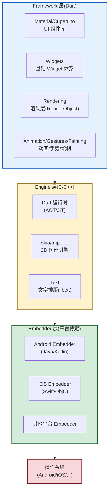
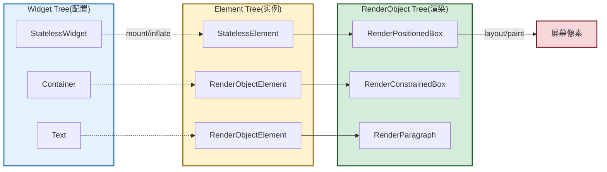
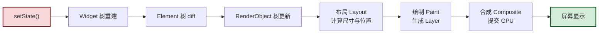

# 9.2 Flutter 基础框架简介

> [!abstract] 本节概述
> 与 WebView"借用浏览器内核渲染"的思路不同，Flutter 选择"自建渲染引擎、绕过原生控件"，用同一套 Dart 代码在 Android 与 iOS 上画出像素级一致的 UI。本节围绕 Flutter 的核心特点、三层架构、Widget 体系、渲染链路、与原生的通信机制展开，建立对"自绘式跨平台"的理解，并与 9.1 的 WebView 方案形成对比，为 9.4 的选型决策提供技术依据。

## 1. Flutter 的核心特点

> [!definition] Flutter
> Flutter 是 Google 于 2017 年发布的开源 UI 框架，使用 Dart 语言开发，通过自有的渲染引擎（Skia/Impeller）直接绘制 UI，不依赖平台原生控件，实现"一套代码、双端一致"的跨平台开发。

### 1.1 Flutter 的关键设计选择

| 设计选择 | 说明 | 带来的优势 |
| -------- | ---- | ---------- |
| 语言：Dart | Google 自研，支持 AOT 与 JIT 双模式 | 开发期 JIT 热重载、发布期 AOT 高性能 |
| 渲染：自绘引擎 | Skia（2D）/ Impeller（新引擎）直接绘制 | 双端像素一致，不依赖原生控件 |
| UI：一切皆 Widget | UI 元素、布局、动画、甚至主题都是 Widget | 声明式 UI，组合性强 |
| 架构：分层设计 | Framework / Engine / Embedder 三层 | 跨平台抽象清晰，扩展性好 |
| 通信：Channel | 与原生通过 MethodChannel/EventChannel 通信 | 双端通信统一，但需桥接 |

> [!info] Flutter 不使用原生控件
> Flutter 不调用 Android 的 `TextView`、`Button`，而是用自己的 Dart 实现的 `Text`、`ElevatedButton`，通过 Skia 引擎直接绘制到画布上。这意味着 Flutter 的 `Text` 在 Android 和 iOS 上看起来完全一样——因为它们是同一个 Dart 代码画出来的，而不是各自调用系统的 TextView。

### 1.2 Flutter 的优势与劣势

> [!tip] Flutter 的优势
> - **性能接近原生**：Dart AOT 编译为机器码，无 JS Bridge 开销；自绘引擎直接调用 GPU
> - **双端 UI 高度一致**：同一套代码画出的 UI 在 Android/iOS 上像素一致
> - **开发效率高**：Hot Reload 秒级看到改动；Widget 组合性强
> - **跨平台覆盖广**：Android、iOS、Web、桌面、嵌入式均支持

> [!warning] Flutter 的劣势
> - **包体积大**：APK 需包含 Flutter Engine（约 4~6MB）
> - **原生能力需桥接**：相机、蓝牙、传感器等需通过 Plugin 调用原生
> - **Dart 学习成本**：非主流语言，团队需学习
> - **原生体验差异**：自绘 UI 不完全遵循平台设计规范（Material/Cupertino 双风格）
> - **热更新不原生支持**：需自研或第三方方案（受应用商店政策限制）

## 2. Flutter 的三层架构



> [!note] 三层职责划分
> - **Framework 层（Dart）**：开发者直接接触的层，提供 Widget、动画、手势、绘制 API。这是应用代码与 Flutter 框架代码共同工作的地方
> - **Engine 层（C/C++）**：提供 Dart 运行时与图形渲染能力，是跨平台的核心——同一份 C++ 代码在不同平台运行
> - **Embedder 层（平台特定）**：将 Engine 嵌入具体平台，处理平台事件（输入、生命周期）、渲染上下文（GL/Surface）的创建

### 2.1 Framework 层详解

| 子层 | 职责 | 典型 API |
| ---- | ---- | -------- |
| Material/Cupertino | 平台风格组件库 | `MaterialApp`、`CupertinoNavigationBar` |
| Widgets | 基础 Widget 体系 | `StatelessWidget`、`StatefulWidget`、`Container`、`Row` |
| Rendering | 渲染层 | `RenderObject`、`RenderBox`、布局与绘制 |
| Animation/Gestures | 动画与手势 | `AnimationController`、`GestureDetector` |
| Painting | 绘制原语 | `Canvas`、`Paint`、`Path` |

### 2.2 Engine 层详解

- **Dart 运行时**：开发期用 JIT（支持热重载），发布期用 AOT（编译为机器码，性能接近原生）
- **Skia**：Google 的 2D 图形库，Chrome 也用它。Flutter 用 Skia 直接绘制到 GPU
- **Impeller**：Flutter 3.7+ 引入的新渲染引擎，预编译 Shader，解决 Skia 的 Shader 编译卡顿问题
- **libtxt**：文字排版引擎，支持复杂文字（如阿拉伯语、emoji）

### 2.3 Embedder 层详解

Embedder 是平台特定的"胶水层"，负责：
- 创建渲染上下文（Android 的 `GLSurfaceView`/`SurfaceView`、iOS 的 `Metal`）
- 处理输入事件（触摸、键盘）并传递给 Engine
- 管理应用生命周期（前后台切换）
- 管理线程（UI 线程、GPU 线程、IO 线程）

## 3. Widget 体系：一切皆 Widget

> [!definition] Widget
> Widget 是 Flutter 描述 UI 配置的不可变对象。Flutter 的核心理念是"一切皆 Widget"——布局、控件、动画、主题、甚至应用本身都是 Widget。Widget 只是 UI 的"配置描述"，不负责实际绘制。

### 3.1 两种基础 Widget

> [!definition] StatelessWidget vs StatefulWidget
> - **StatelessWidget**：无状态 Widget，UI 由构造参数完全决定，参数不变则 UI 不变。适用于纯展示型组件（如 `Text`、`Icon`、`Image`）
> - **StatefulWidget**：有状态 Widget，UI 由 State 对象驱动，State 变化时调用 `setState()` 触发重建。适用于交互型组件（如 `Checkbox`、`TextField`、动画）

```dart
// StatelessWidget 示例:无状态展示组件
class GreetingCard extends StatelessWidget {
  final String name;

  const GreetingCard({Key? key, required this.name}) : super(key: key);

  @override
  Widget build(BuildContext context) {
    return Container(
      padding: const EdgeInsets.all(16),
      color: Colors.blue[50],
      child: Text(
        'Hello, $name!',
        style: const TextStyle(fontSize: 20, fontWeight: FontWeight.bold),
      ),
    );
  }
}
```

```dart
// StatefulWidget 示例:计数器
class CounterWidget extends StatefulWidget {
  const CounterWidget({Key? key}) : super(key: key);

  @override
  State<CounterWidget> createState() => _CounterState();
}

class _CounterState extends State<CounterWidget> {
  int _count = 0;

  void _increment() {
    setState(() {  // 调用 setState 触发重建
      _count++;
    });
  }

  @override
  Widget build(BuildContext context) {
    return Column(
      mainAxisAlignment: MainAxisAlignment.center,
      children: [
        Text('Count: $_count', style: const TextStyle(fontSize: 24)),
        const SizedBox(height: 16),
        ElevatedButton(
          onPressed: _increment,
          child: const Text('Increment'),
        ),
      ],
    );
  }
}
```

> [!tip] 何时用 StatefulWidget
> - 数据会变化（计数器、开关、表单）
> - 需要响应用户交互改变 UI
> - 涉及动画（`AnimationController`）
> - 需要监听 Stream/Future
>
> **常见误用**：把所有 Widget 都写成 StatefulWidget。这会带来不必要的重建开销。原则是"能用 StatelessWidget 就用 StatelessWidget"。

### 3.2 Widget 的组合性

Flutter 的 Widget 是高度组合的——一个复杂 Widget 由多个简单 Widget 嵌套组成：

```dart
// 复杂 Widget 由简单 Widget 嵌套组合
Card(
  child: Padding(
    padding: const EdgeInsets.all(16),
    child: Column(
      children: [
        Row(
          children: [
            Icon(Icons.person),
            SizedBox(width: 8),
            Text('用户名'),
          ],
        ),
        Divider(),
        Text('详细信息...'),
      ],
    ),
  ),
)
```

## 4. Hot Reload：Flutter 的开发体验利器

> [!definition] Hot Reload
> Hot Reload（热重载）是 Flutter 的开发期特性：开发者修改 Dart 代码后，按 `r` 键即可在 1 秒内看到改动效果，**保留应用当前状态**（如已输入的文本、滚动位置）。这得益于 Dart 的 JIT 模式与 Flutter 的 Widget 重建机制。

> [!info] Hot Reload vs Hot Restart
> - **Hot Reload**：注入新代码，重建 Widget 树，但保留 State 状态。秒级生效
> - **Hot Restart**：重启整个应用，State 清空。略慢
> - **Full Restart**：重新编译并启动，最慢

Hot Reload 的原理：
1. Dart VM 支持运行期替换代码（JIT 模式）
2. Flutter 收到改动后，重新执行 `main()` 后的 Widget 构建逻辑
3. Flutter 框架对比新旧 Widget 树，只更新变化部分
4. State 对象被保留，因此页面状态不丢失

## 5. Flutter 的渲染机制：三棵树

> [!definition] Flutter 渲染三棵树
> Flutter 渲染涉及三棵树协作：
> - **Widget Tree**：UI 配置描述（不可变），开发者编写的 Widget 组成的树
> - **Element Tree**：Widget 的实例化对象（可变），管理生命周期，是 Widget 与 RenderObject 的桥梁
> - **RenderObject Tree**：实际负责测量、布局、绘制的对象



> [!note] 三棵树的职责
> - **Widget Tree**：声明"UI 应该长什么样"，是不可变的配置。`setState()` 会创建新的 Widget 树
> - **Element Tree**：维护 Widget 与 RenderObject 的对应关系，是"有状态的中间层"。当 Widget 变化时，Element 决定是更新已有 RenderObject 还是创建新的
> - **RenderObject Tree**：真正干活的对象，负责 measure（测量）、layout（布局）、paint（绘制）。Flutter 通过 diff 算法只更新变化的 RenderObject

### 5.1 渲染流程



> [!tip] 理解三棵树的意义
> - 开发者只需关注 Widget Tree（写 Widget）
> - Element Tree 是 Flutter 的内部机制，开发者一般不直接操作
> - 性能优化时要理解：`setState()` 会重建 Widget Tree，但 Element Tree 会复用，RenderObject Tree 只更新变化部分
> - `const` Widget 能让 Flutter 跳过重建，提升性能

## 6. 与原生交互：Platform Channel

> [!definition] Platform Channel
> Platform Channel（平台通道）是 Flutter 与原生通信的机制。它通过命名通道（如 `MethodChannel('com.example.app/audio')`）在 Dart 与原生之间传递消息。Flutter 不直接调用系统 API，需通过 Channel 让原生代为执行。

### 6.1 三种 Channel

| Channel 类型 | 通信模式 | 典型场景 |
| ------------ | -------- | -------- |
| MethodChannel | 方法调用（请求-响应） | 调用原生方法（如 `playAudio`、`takePhoto`） |
| EventChannel | 事件流（原生持续推送） | 监听传感器、电池状态、网络变化 |
| BasicMessageChannel | 双向消息传递 | 自定义协议通信 |

### 6.2 MethodChannel 示例

```dart
// Flutter 侧:调用原生获取电量
import 'package:flutter/services.dart';

class BatteryService {
  static const platform = MethodChannel('com.example.app/battery');

  static Future<String> getBatteryLevel() async {
    try {
      final int level = await platform.invokeMethod('getBatteryLevel');
      return 'Battery: $level%';
    } on PlatformException catch (e) {
      return "Failed: ${e.message}";
    }
  }
}
```

```kotlin
// Android 侧:注册 MethodChannel 处理调用
class MainActivity : FlutterActivity() {
    private val CHANNEL = "com.example.app/battery"

    override fun configureFlutterEngine(flutterEngine: FlutterEngine) {
        super.configureFlutterEngine(flutterEngine)
        MethodChannel(flutterEngine.dartExecutor.binaryMessenger, CHANNEL)
            .setMethodCallHandler { call, result ->
                if (call.method == "getBatteryLevel") {
                    val level = getBatteryLevel()
                    if (level != -1) {
                        result.success(level)
                    } else {
                        result.error("UNAVAILABLE", "Battery not available", null)
                    }
                } else {
                    result.notImplemented()
                }
            }
    }

    private fun getBatteryLevel(): Int {
        val bm = getSystemService(BATTERY_SERVICE) as BatteryManager
        return bm.getIntProperty(BatteryManager.BATTERY_PROPERTY_CAPACITY)
    }
}
```

> [!note] Channel 的通信特性
> - **异步**：Channel 通信是异步的，Dart 侧用 `Future`/`await` 处理
> - **序列化**：消息需序列化传递，支持基本类型与 List/Map
> - **开销**：跨语言通信有开销，不适合高频调用（如每帧动画）
> - **线程**：MethodChannel 默认在主线程通信

## 7. 案例：Flutter 登录页面

> [!example] 案例：用 Flutter 实现登录页面
> ```dart
> import 'package:flutter/material.dart';
> 
> class LoginPage extends StatefulWidget {
>   const LoginPage({Key? key}) : super(key: key);
>   @override
>   State<LoginPage> createState() => _LoginPageState();
> }
> 
> class _LoginPageState extends State<LoginPage> {
>   final _formKey = GlobalKey<FormState>();
>   final _usernameCtrl = TextEditingController();
>   final _passwordCtrl = TextEditingController();
>   bool _loading = false;
> 
>   Future<void> _login() async {
>     if (!_formKey.currentState!.validate()) return;
>     setState(() => _loading = true);
>     // 调用 API 或通过 MethodChannel 调原生登录
>     await Future.delayed(const Duration(seconds: 1));  // 模拟网络请求
>     setState(() => _loading = false);
>     if (!mounted) return;
>     Navigator.pushReplacementNamed(context, '/home');
>   }
> 
>   @override
>   Widget build(BuildContext context) {
>     return Scaffold(
>       appBar: AppBar(title: const Text('登录')),
>       body: Padding(
>         padding: const EdgeInsets.all(24),
>         child: Form(
>           key: _formKey,
>           child: Column(
>             mainAxisAlignment: MainAxisAlignment.center,
>             children: [
>               TextFormField(
>                 controller: _usernameCtrl,
>                 decoration: const InputDecoration(labelText: '用户名'),
>                 validator: (v) => v!.isEmpty ? '请输入用户名' : null,
>               ),
>               TextFormField(
>                 controller: _passwordCtrl,
>                 decoration: const InputDecoration(labelText: '密码'),
>                 obscureText: true,
>                 validator: (v) => v!.length < 6 ? '密码至少6位' : null,
>               ),
>               const SizedBox(height: 24),
>               SizedBox(
>                 width: double.infinity,
>                 child: ElevatedButton(
>                   onPressed: _loading ? null : _login,
>                   child: _loading
>                       ? const SizedBox(height: 20, width: 20, child: CircularProgressIndicator())
>                       : const Text('登录'),
>                 ),
>               ),
>             ],
>           ),
>         ),
>       ),
>     );
>   }
> }
> ```
>
> **体现的 Flutter 特性**：
> - StatefulWidget 管理表单状态与加载状态
> - 一切皆 Widget：Scaffold/AppBar/Form/TextFormField 都是 Widget
> - `setState()` 触发重建，但 Element 树复用，性能开销小
> - 同一份代码在 Android/iOS 上 UI 完全一致（自绘渲染）

## 8. Flutter 与 WebView 的对比

| 维度 | Flutter | WebView 混合 |
| ---- | ------- | ------------ |
| 渲染方式 | 自绘引擎（Skia/Impeller） | 浏览器内核 |
| 性能 | 接近原生 | 较弱（内核初始化慢） |
| 一致性 | 极高（双端像素一致） | 较低（受内核版本影响） |
| 开发语言 | Dart | HTML/CSS/JS |
| 热更新 | 不原生支持 | 支持（替换 H5） |
| 原生通信 | MethodChannel | JSBridge |
| 适用场景 | 业务应用、复杂交互 | 内容页、活动页 |

## 本节小结

- Flutter 用 Dart 语言 + 自绘引擎实现"一套代码、双端一致"，性能接近原生
- 三层架构：Framework（Dart）/ Engine（C++/Skia）/ Embedder（平台特定），各司其职
- Widget 是 UI 的不可变配置描述，分 StatelessWidget（无状态）与 StatefulWidget（有状态）
- Hot Reload 基于 Dart JIT 模式，秒级看到改动，是 Flutter 开发体验的核心
- 渲染涉及三棵树：Widget（配置）→ Element（实例）→ RenderObject（渲染），diff 算法只更新变化部分
- 与原生通过 MethodChannel/EventChannel 异步通信，有开销，不适合高频调用

## 章节导航

- 上级：[[MOC - 第9章|第9章 跨平台开发技术基础]]
- 上一节：[[9.1 WebView 混合开发|9.1 WebView 混合开发]]
- 下一节：[[9.3 React Native 基础概念|9.3 React Native 基础概念]]
- 习题：[[MOC - 第9章习题|第9章习题]]
