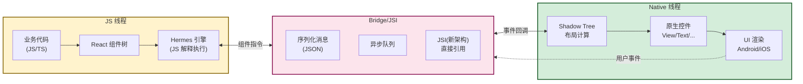
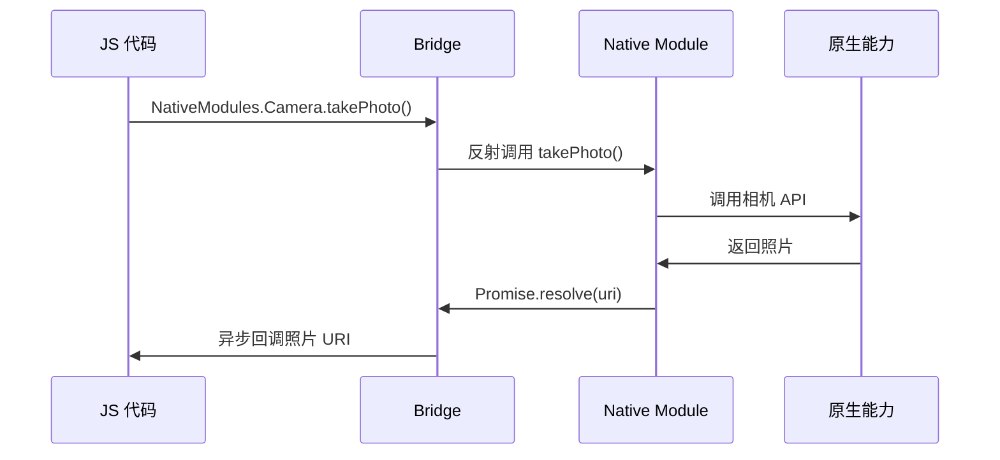

# 9.3 React Native 基础概念

> [!abstract] 本节概述
> React Native（RN）是 Facebook 推出的跨平台框架，它选择了与 Flutter 完全不同的路径：不"自绘 UI"，而是"用 JS 写逻辑、调用原生控件渲染"。本节围绕 RN 的核心特点、三线程架构、组件映射机制、Native Module 原生交互展开，并与 Flutter 做横向对比，建立对"原生映射式跨平台"的理解，为 9.4 的方案选型补全最后一块拼图。

## 1. React Native 的核心特点

> [!definition] React Native
> React Native（RN）是 Facebook 于 2015 年开源的跨平台移动开发框架，使用 JavaScript/TypeScript 编写业务逻辑，通过 Bridge/JSI 将 JS 组件映射到 Android 与 iOS 的原生控件，实现"Learn once, write anywhere"的跨平台开发。

### 1.1 RN 与 Flutter 的根本分歧

| 维度 | React Native | Flutter |
| ---- | ------------ | ------- |
| 渲染思路 | JS 驱动原生控件 | 自绘引擎绕过原生 |
| UI 一致性 | 遵循平台风格（Android 用 Material、iOS 用 UIKit） | 双端像素一致（自定义风格） |
| 语言 | JS/TS | Dart |
| 与原生关系 | 紧密（直接调用原生控件） | 松散（只通过 Channel 通信） |
| 体验 | 接近原生（用真原生控件） | 接近原生（自绘但流畅） |

> [!info] RN 的核心理念："Learn once, write anywhere"
> RN 的口号不是"Write once, run everywhere"（一次编写到处运行），而是"Learn once, write anywhere"（学会一次，各端编写）。RN 不追求双端 UI 完全一致，而是让开发者用同一套 JS 技能，针对各端写出符合该平台风格的 UI。

### 1.2 RN 的优势与劣势

> [!tip] RN 的优势
> - **JS 生态丰富**：可复用 npm 海量库，前端技能迁移
> - **原生控件渲染**：UI 用真原生控件，符合平台设计规范
> - **热更新支持**：通过 CodePush 等方案可热更新 JS 代码（应用商店允许）
> - **React 开发模型**：声明式 UI、组件化，与 React Web 一致
> - **社区成熟**：Facebook、微软、京东等大厂支持，社区生态完善

> [!warning] RN 的劣势
> - **性能略逊 Flutter**：Bridge 通信有序列化开销，复杂动画受限
> - **依赖原生控件**：双端控件行为差异需处理，平台兼容性问题多
> - **Bridge 瓶颈**：旧架构 Bridge 是异步序列化通信，高频通信卡顿
> - **JS 引擎开销**：JS 解释执行比 AOT 慢（Hermes 优化后改善）
> - **学习曲线**：需同时懂 JS、React、原生开发（调试与定制 Native Module）

## 2. RN 的三线程架构



> [!note] 三线程协作流程
> 1. **JS 线程**：运行业务代码，计算 React 组件树，决定 UI 应该长什么样
> 2. **Bridge**：将 JS 的组件指令（"创建一个 View"、"修改 Text 内容"）序列化为 JSON，异步传递到 Native 线程
> 3. **Native 线程**：接收指令，创建/更新原生控件，计算布局，渲染到屏幕
> 4. **事件回传**：用户点击等原生事件，反向通过 Bridge 传回 JS 线程，触发 React 重新渲染

### 2.1 Bridge 的瓶颈与新架构

> [!warning] 旧架构 Bridge 的性能瓶颈
> RN 旧架构的 Bridge 有三大问题：
> - **异步**：所有通信走异步队列，无法同步调用
> - **序列化**：JS 与 Native 之间数据需 JSON 序列化，大数据量时开销大
> - **单线程**：JS 单线程，繁忙时无法及时响应 UI 更新

RN 新架构（0.68+，Fabric + TurboModules + JSI）的改进：

| 改进点 | 旧架构 | 新架构 |
| ------ | ------ | ------ |
| 通信 | 异步 Bridge（JSON 序列化） | JSI（JS 直接持有 C++ 对象引用） |
| 渲染 | 异步 | 同步可選 |
| 模块加载 | 启动时全加载 | 按需加载（TurboModules） |
| 布局 | Native 线程 | 可在 JS 线程（Fabric） |

> [!info] JSI（JavaScript Interface）
> JSI 是 RN 新架构的核心：它让 JS 代码可以直接持有 C++ 对象的引用，调用方法时无需序列化，类似 Flutter 的 MethodChannel 但更高效。JSI 让 RN 的通信性能接近 Flutter。

### 2.2 Hermes 引擎

> [!definition] Hermes
> Hermes 是 Facebook 为 RN 专门优化的 JS 引擎，预编译 JS 为字节码（而非运行期 JIT），启动速度比 JSC（JavaScriptCore）快约 2 倍，内存占用更低。RN 0.70+ 默认启用 Hermes。

## 3. 组件体系：映射原生控件

> [!definition] RN 组件映射
> RN 的核心组件（`View`、`Text`、`Image`、`ScrollView`）在 JS 层是统一的接口，但渲染时映射到各平台的原生控件。开发者写一份 JS 代码，RN 在 Android 上调用 `android.view.View`，在 iOS 上调用 `UIView`。

### 3.1 核心组件映射表

| RN 组件 | Android 原生控件 | iOS 原生控件 | 用途 |
| ------- | ---------------- | ------------ | ---- |
| `View` | `android.view.View` | `UIView` | 容器 |
| `Text` | `TextView` | `UILabel` | 文本 |
| `Image` | `ImageView` | `UIImageView` | 图片 |
| `ScrollView` | `ScrollView` | `UIScrollView` | 滚动容器 |
| `TextInput` | `EditText` | `UITextField` | 输入框 |
| `FlatList` | `RecyclerView` | `UICollectionView` | 长列表 |
| `Button` | `Button` | `UIButton` | 按钮 |

> [!note] 为什么 RN 用原生控件
> - **体验一致性**：用户在 Android 上看到的是 Material 风格的控件，在 iOS 上是 UIKit 风格，符合各平台习惯
> - **性能**：原生控件由系统优化，性能好
> - **可访问性**：原生控件天然支持无障碍功能
> - **代价**：双端控件行为有差异，需处理平台兼容性

### 3.2 简单 RN 组件示例

```javascript
// App.js:一个简单的 RN 列表页
import React, {useState} from 'react';
import {
  SafeAreaView,
  View,
  Text,
  FlatList,
  TouchableOpacity,
  StyleSheet,
} from 'react-native';

const DATA = [
  {id: '1', title: '商品 A', price: '¥99'},
  {id: '2', title: '商品 B', price: '¥199'},
  {id: '3', title: '商品 C', price: '¥299'},
];

export default function App() {
  const [selected, setSelected] = useState(null);

  const renderItem = ({item}) => (
    <TouchableOpacity
      style={[styles.item, selected === item.id && styles.selected]}
      onPress={() => setSelected(item.id)}>
      <View style={styles.row}>
        <Text style={styles.title}>{item.title}</Text>
        <Text style={styles.price}>{item.price}</Text>
      </View>
    </TouchableOpacity>
  );

  return (
    <SafeAreaView style={styles.container}>
      <Text style={styles.header}>商品列表</Text>
      <FlatList
        data={DATA}
        keyExtractor={item => item.id}
        renderItem={renderItem}
      />
    </SafeAreaView>
  );
}

const styles = StyleSheet.create({
  container: {flex: 1, backgroundColor: '#fff'},
  header: {fontSize: 20, fontWeight: 'bold', padding: 16},
  item: {padding: 16, borderBottomWidth: 1, borderBottomColor: '#eee'},
  selected: {backgroundColor: '#e3f2fd'},
  row: {flexDirection: 'row', justifyContent: 'space-between'},
  title: {fontSize: 16},
  price: {fontSize: 16, color: '#e53935', fontWeight: 'bold'},
});
```

> [!tip] RN 的 React 风格
> RN 的代码风格与 React Web 几乎一致：用 JSX 声明 UI，用 `useState`/`useEffect` 管理状态，用 `StyleSheet` 替代 CSS。前端开发者迁移成本低。但要注意 RN 用 `View`/`Text` 而非 `div`/`span`，且样式不支持全部 CSS 属性。

## 4. 与原生交互：Native Module

> [!definition] Native Module
> Native Module（原生模块）是 RN 中"JS 调用原生能力"的桥梁。当 RN 的核心组件无法满足需求（如调用相机、蓝牙、传感器）时，开发者需编写 Native Module，在原生侧实现功能，再暴露给 JS 调用。

### 4.1 Native Module 工作流程



### 4.2 编写 Android Native Module

```kotlin
// CameraModule.kt:Android 侧 Native Module
package com.example.app

import android.Manifest
import android.content.pm.PackageManager
import androidx.core.app.ActivityCompat
import com.facebook.react.bridge.*
import com.facebook.react.module.annotations.ReactModule

@ReactModule(name = CameraModule.NAME)
class CameraModule(reactContext: ReactApplicationContext) :
    ReactContextBaseJavaModule(reactContext) {

    companion object {
        const val NAME = "CameraModule"
    }

    override fun getName(): String = NAME

    @ReactMethod  // 标记为 JS 可调用
    fun takePhoto(promise: Promise) {
        val activity = currentActivity
        if (activity == null) {
            promise.reject("NO_ACTIVITY", "Activity 不存在")
            return
        }

        if (ActivityCompat.checkSelfPermission(activity, Manifest.permission.CAMERA)
            != PackageManager.PERMISSION_GRANTED) {
            promise.reject("NO_PERMISSION", "无相机权限")
            return
        }

        // 调用相机(简化示例)
        // 实际需启动相机 Intent 并处理回调
        promise.resolve("file:///storage/photo.jpg")
    }

    @ReactMethod
    fun getDeviceName(promise: Promise) {
        promise.resolve(android.os.Build.MODEL)
    }
}
```

```kotlin
// CameraPackage.kt:注册 Module
package com.example.app

import com.facebook.react.ReactPackage
import com.facebook.react.bridge.NativeModule
import com.facebook.react.bridge.ReactApplicationContext
import com.facebook.react.uimanager.ViewManager

class CameraPackage : ReactPackage {
    override fun createNativeModules(reactContext: ReactApplicationContext): List<NativeModule> {
        return listOf(CameraModule(reactContext))
    }

    override fun createViewManagers(reactContext: ReactApplicationContext): List<ViewManager<*, *>> {
        return emptyList()
    }
}
```

```javascript
// JS 侧:调用 Native Module
import {NativeModules} from 'react-native';

const {CameraModule} = NativeModules;

async function takePhoto() {
  try {
    const uri = await CameraModule.takePhoto();
    console.log('照片 URI:', uri);
  } catch (e) {
    console.error('拍照失败:', e);
  }
}

// 调用
takePhoto();
```

> [!note] Native Module 与 Flutter Channel 对比
> | 维度 | RN Native Module | Flutter MethodChannel |
> | ---- | ----------------- | --------------------- |
> | 注册方式 | Package + ReactMethod 注解 | setMethodCallHandler |
> | 调用方式 | `NativeModules.X.method()` | `channel.invokeMethod()` |
> | 返回值 | Promise（异步） | Future（异步） |
> | 学习成本 | 较高（需写原生代码 + 注册） | 较低（统一 Channel API） |
> | 性能 | 旧架构 Bridge 有开销，新架构 JSI 高效 | 较好 |

## 5. RN 与 Flutter 的全面对比

| 维度 | React Native | Flutter |
| ---- | ------------ | ------- |
| 渲染 | 原生控件映射 | 自绘引擎（Skia/Impeller） |
| 语言 | JS/TS | Dart |
| UI 一致性 | 中等（遵循平台风格） | 极高（双端像素一致） |
| 性能 | 中等（Bridge 开销） | 接近原生 |
| 开发效率 | 高（前端技能复用） | 高（Hot Reload） |
| 包体积 | 中 | 大（含 Engine） |
| 热更新 | 支持（CodePush） | 不原生支持 |
| 原生通信 | Native Module | MethodChannel |
| 社区生态 | 成熟（npm 生态） | 成长中（pub.dev） |
| 学习成本 | 低（前端可迁移） | 中（需学 Dart） |
| 适用场景 | JS 团队、需热更新 | UI 一致性要求高 |

## 6. 案例：RN 实现列表页

> [!example] 案例：用 RN 实现商品列表页
> 上文的 `App.js` 示例展示了一个 RN 商品列表页。其特点：
>
> **为什么选 RN**：
> - 团队是前端为主，JS 技能可直接迁移
> - 列表页是内容型，性能要求中等
> - 需要热更新：商品运营改 JS 后可直接推送（CodePush），无需发版
>
> **RN 的优势体现**：
> - `FlatList` 自动映射到 Android 的 `RecyclerView`、iOS 的 `UICollectionView`，性能好
> - 用 React 的 `useState` 管理选中状态，前端开发者熟悉
> - `StyleSheet` 类似 CSS，前端友好
>
> **RN 的限制**：
> - 拍照、分享等原生能力需写 Native Module
> - 复杂动画性能不如 Flutter（旧 Bridge 异步开销）
> - 双端控件行为差异需处理（如 ScrollView 滚动惯性不同）

## 7. RN 的演进与新架构

> [!info] RN 新架构（0.68+）
> RN 在 2022 年推出新架构，解决旧 Bridge 瓶颈：
> - **JSI**：JS 直接持有 C++ 引用，无需序列化
> - **Fabric**：新渲染系统，同步渲染，提升动画性能
> - **TurboModules**：原生模块按需加载，启动更快
> - **Hermes**：默认 JS 引擎，预编译字节码，启动快
>
> 新架构让 RN 在性能上更接近 Flutter，但生态迁移仍在进行中。

## 本节小结

- RN 用 JS/TS 写逻辑，调用原生控件渲染，是"原生映射式"跨平台方案
- 三线程架构：JS 线程（业务）→ Bridge/JSI（通信）→ Native 线程（渲染）
- 组件映射：`View`/`Text`/`FlatList` 等映射到各平台原生控件，体验符合平台风格
- Native Module 是 JS 调用原生能力的桥梁，通过 `@ReactMethod` 暴露方法
- 与 Flutter 对比：RN 优势在 JS 生态与热更新，劣势在性能与一致性
- 新架构（JSI/Fabric/TurboModules/Hermes）显著提升 RN 性能

## 章节导航

- 上级：[[MOC - 第9章|第9章 跨平台开发技术基础]]
- 上一节：[[9.2 Flutter 基础框架简介|9.2 Flutter 基础框架简介]]
- 下一节：[[9.4 跨平台方案选型对比|9.4 跨平台方案选型对比]]
- 习题：[[MOC - 第9章习题|第9章习题]]
