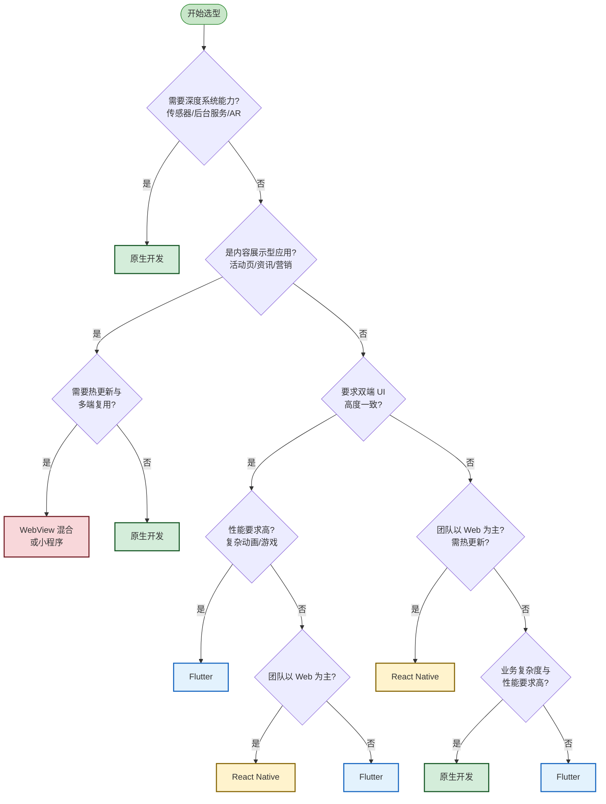
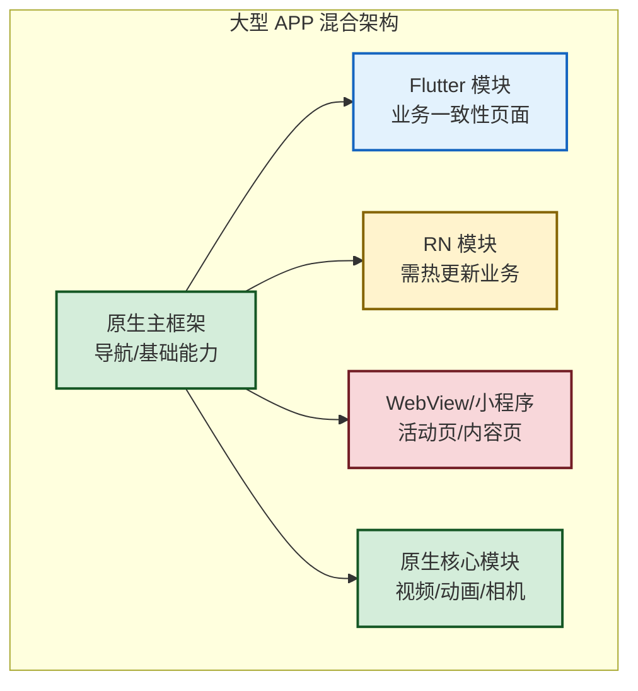

# 9.4 跨平台方案选型对比

> [!abstract] 本节概述
> 前 3 节分别深入了 WebView、Flutter、RN 三种跨平台方案的内部机制，本节回到工程视角，将它们与原生开发放在一起做系统性对比。本节不是简单地罗列优劣，而是建立"业务驱动选型"的判断框架：先理解四方案在性能、开发效率、一致性等八维度上的本质差异，再用决策树把"业务需求 → 技术方案"的映射过程显性化，最后用主流 APP 的真实案例验证选型逻辑。

## 1. 四种方案的本质差异

> [!definition] 四种移动开发方案
> - **原生开发**：用平台官方语言（Kotlin/Swift）与 SDK 直接构建应用
> - **Flutter**：用 Dart 语言 + 自绘引擎绕过原生控件
> - **React Native**：用 JS/TS 写逻辑 + 调用原生控件渲染
> - **WebView 混合**：原生壳 + H5 页面 + JSBridge 通信

```mermaid
flowchart TB
    subgraph Native["原生开发"]
        N1["业务代码<br/>Kotlin/Swift"] --> N2["平台 SDK"]
        N2 --> N3["系统原生控件<br/>渲染"]
    end

    subgraph Flutter["Flutter"]
        F1["业务代码<br/>Dart"] --> F2["Flutter Framework"]
        F2 --> F3["Engine(C++)<br/>Skia/Impeller"]
        F3 --> F4["自绘渲染<br/>绕过原生控件"]
    end

    subgraph RN["React Native"]
        R1["业务代码<br/>JS/TS"] --> R2["JS 引擎<br/>Hermes"]
        R2 --> R3["Bridge/JSI"]
        R3 --> R4["原生控件<br/>映射渲染"]
    end

    subgraph WebView["WebView 混合"]
        H1["业务代码<br/>HTML/CSS/JS"] --> H2["WebView 容器"]
        H2 --> H3["浏览器内核<br/>Chromium"]
        H3 -.->|"JSBridge"| H4["原生能力"]
    end

    style Native fill:#d4edda,stroke:#155724,stroke-width:2px
    style Flutter fill:#e3f2fd,stroke:#1565c0,stroke-width:2px
    style RN fill:#fff3cd,stroke:#856404,stroke-width:2px
    style WebView fill:#f8d7da,stroke:#721c24,stroke-width:2px
```

> [!note] 渲染路径的差异是性能差异的根源
> - **原生**：业务代码 → 系统控件 → 屏幕（路径最短）
> - **Flutter**：业务代码 → 自绘引擎 → GPU → 屏幕（绕过系统控件，但路径仍短）
> - **RN**：业务代码 → JS 引擎 → Bridge → 原生控件 → 屏幕（路径较长，有 Bridge 开销）
> - **WebView**：业务代码 → JS 引擎 → 浏览器内核 → 屏幕渲染 → 屏幕（路径最长，内核开销大）

## 2. 八维度对比

| 维度 | 原生 | Flutter | React Native | WebView 混合 |
| ---- | ---- | ------- | ------------- | ------------ |
| **性能** | ★★★★★ | ★★★★ | ★★★ | ★★ |
| **开发效率** | ★★（双端） | ★★★★ | ★★★★ | ★★★★★ |
| **双端一致性** | ★★ | ★★★★★ | ★★★ | ★★★★ |
| **原生能力访问** | ★★★★★ | ★★★（需 Plugin） | ★★★（需 Native Module） | ★★（需 JSBridge） |
| **维护成本** | ★★（双端） | ★★★★ | ★★★★ | ★★★★ |
| **热更新** | 不支持 | 不原生支持 | 支持（CodePush） | 支持（H5 替换） |
| **包体积** | 小 | 大（含 Engine） | 中 | 小 |
| **学习成本** | 高（双端语言） | 中（Dart） | 低（前端可迁移） | 低（前端可迁移） |
| **社区生态** | 官方支持 | 成长中（pub.dev） | 成熟（npm） | Web 生态 |

> [!info] 评分说明
> - **性能**：启动速度、帧率、内存占用综合考量。原生最优，WebView 最差
> - **开发效率**：考虑双端开发成本、调试体验、迭代速度
> - **一致性**：双端 UI 视觉与交互的统一程度。Flutter 最优（自绘），原生最差（双端控件不同）
> - **热更新**：能否不发版更新业务代码。受应用商店政策限制，iOS 对热更新较严格

## 3. 选型决策树

> [!tip] 决策树的核心问题顺序
> 选型不是"哪个方案最好"，而是"哪个方案最适合当前业务"。决策树按以下顺序提问：
> 1. **是否需要深度系统能力**？是 → 原生（无替代）
> 2. **是否为内容展示型**？是 → WebView（开发快、热更新）
> 3. **是否要求双端 UI 一致**？是 → Flutter（自绘一致）
> 4. **团队是否以 Web 为主**？是 → RN（技能复用）
> 5. **以上都不满足**？→ 按性能与复杂度选 Flutter 或原生

## 4. 各方案适用场景

| 应用类型 | 推荐方案 | 理由 |
| -------- | -------- | ---- |
| 系统工具、相机、AR、游戏 | 原生 | 性能与 API 完整性 |
| 高一致性业务应用（电商、金融） | Flutter 或 原生 + Flutter 模块 | 性能与一致性的平衡 |
| 已有 Web 团队快速试错 | React Native | 技能复用、热更新 |
| 营销活动页、内容频道 | WebView 混合 / 小程序 | 迭代快、可热更新 |
| 即时通讯、社交动态流 | 原生或 Flutter | 性能敏感、交互复杂 |
| 资讯阅读、图文详情 | WebView 或 Flutter | 内容为主，可热更新 |
| 超级 APP（微信/支付宝） | 原生壳 + 多方案混合 | 主框架原生，模块按需选型 |

## 5. 选型建议总结

> [!tip] 四种典型场景的选型建议
> 1. **高性能 / 复杂交互 → 原生**
>    - 例：相机应用、游戏、视频编辑、AR
>    - 理由：性能最优、API 完整、体验最佳
>
> 2. **跨平台 UI 一致 → Flutter**
>    - 例：电商首页、金融应用、品牌强调一致性的应用
>    - 理由：自绘引擎双端像素一致，性能接近原生
>
> 3. **JS 团队 / Web 经验 → React Native**
>    - 例：内容型应用、需热更新的业务模块
>    - 理由：前端技能迁移、生态成熟、CodePush 热更新
>
> 4. **内容展示 / 快速迭代 → WebView 混合**
>    - 例：活动页、营销页、图文详情
>    - 理由：开发最快、热更新最灵活、多端复用

## 6. 案例：主流 APP 的技术选型

> [!example] 案例：四款主流 APP 的选型实践
>
> ### 微信：原生 + 小程序 + Flutter
> - **主框架**：原生（保证性能与基础体验）
> - **小程序容器**：受限的 WebView + 增强 API（业务动态化）
> - **部分模块**：Flutter（部分新业务页尝试）
> - **选型逻辑**：基础能力必须原生保证性能；业务动态化用小程序容器；新业务尝试 Flutter 提升一致性
>
> ### 抖音：原生为主 + 跨端模块
> - **主框架**：原生（视频编解码等核心能力必须原生）
> - **部分业务模块**：跨端方案（如直播间某些 UI 模块）
> - **选型逻辑**：视频处理性能敏感，必须原生；UI 业务模块按需引入跨端
>
> ### 淘宝：原生 + Weex + H5
> - **主框架**：原生壳
> - **业务模块**：Weex（阿里自研，类 RN 跨端方案）
> - **活动页**：大量 H5（运营频繁更新）
> - **选型逻辑**：电商业务需频繁更新，Weex 兼顾性能与动态化；活动页用 H5 极速迭代
>
> ### 美团：原生 + Flutter + H5
> - **主框架**：原生（基础业务）
> - **部分模块**：Flutter（如到店综合业务）
> - **活动页**：H5
> - **选型逻辑**：Flutter 在部分模块提升双端一致性；活动页用 H5 快速迭代

> [!warning] 选型的常见误区
> 1. **"哪个火就用哪个"**：盲目追新，不考虑团队能力与业务需求
> 2. **"全部用跨平台"**：性能敏感模块也用跨平台，导致体验问题
> 3. **"全部用原生"**：忽视内容型模块的快速迭代需求
> 4. **"选了就锁死"**：技术选型应随业务演进，预留混合架构空间
> 5. **"忽视团队技能"**：纯前端团队强上 Flutter，学习成本拖慢项目

## 7. 混合架构：大型 APP 的主流实践

> [!info] 混合架构的本质
> 大型 APP 几乎不存在"纯单一方案"。主流实践是**按模块分层选型**：
> - **主框架**：原生（保证性能与基础体验）
> - **业务模块**：按一致性/迭代速度需求选择 Flutter 或 RN
> - **活动/营销页**：WebView 或小程序（快速迭代、热更新）
> - **核心性能模块**：原生（视频、动画、传感器）

> [!tip] 混合架构的实现关键
> - **统一的模块加载机制**：原生主框架提供容器，按需加载 Flutter/RN/WebView 模块
> - **统一的路由与通信**：模块间通过统一路由跳转，通信协议标准化
> - **性能监控**：各方案的启动时间、帧率、内存需统一监控
> - **降级方案**：跨端模块出问题时应能降级到原生或 H5

## 8. 与第 1 章选型对比的关系

> [!note] 本章与 [[1.3 原生开发、跨平台开发方案对比\|1.3 节]] 的关系
> 第 1 章 1.3 节给出了"原生 vs 跨平台"的初步对比，是入门级认知。本章 9.1~9.3 深入了三种跨平台方案的内部机制，9.4 则在前 3 节基础上做更系统的对比。
>
> **本章相对 1.3 的深化**：
> - 1.3 给结论（"Flutter 性能好、RN 用 JS、WebView 性能弱"）
> - 本章给原理（"Flutter 自绘所以一致、RN 走 Bridge 所以慢、WebView 走内核所以更弱"）
> - 1.3 给简单决策树（5 步）
> - 本章给更完整的决策树与混合架构实践

## 本节小结

- 四方案的本质差异在渲染路径：原生最短、WebView 最长，Flutter 与 RN 居中但机制不同
- 八维度对比：性能、开发效率、一致性、原生能力、维护成本、热更新、包体积、学习成本
- 选型决策树：从"系统能力 → 内容型 → 一致性 → 团队技能"逐层筛选
- 四种典型场景：高性能用原生、一致性用 Flutter、JS 团队用 RN、内容型用 WebView
- 主流 APP 普遍采用混合架构：原生主框架 + 业务模块按需选型 + 活动页用 WebView

## 章节导航

- 上级：[[MOC - 第9章|第9章 跨平台开发技术基础]]
- 上一节：[[9.3 React Native 基础概念|9.3 React Native 基础概念]]
- 习题：[[MOC - 第9章习题|第9章习题]]
