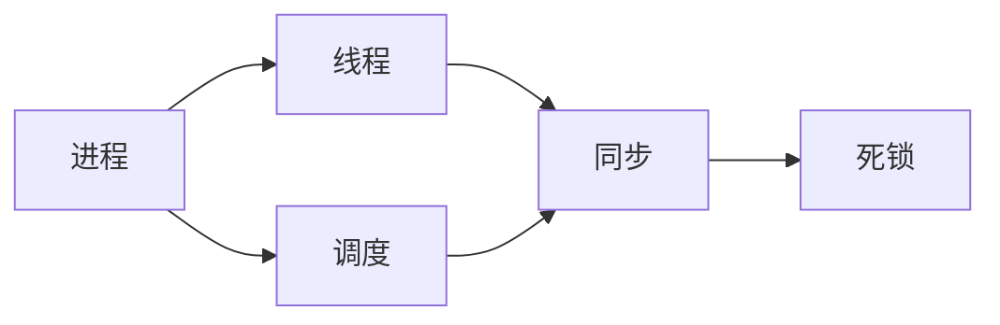

# MOC - 第2部分 进程管理

本部分围绕“谁在执行、如何共享处理器、如何协调并发以及失败时如何恢复”组织进程与线程机制。

> [!info] 层级导航
> 课程总入口：[[MOC - 操作系统]]

## 章节入口

| 章节 | 核心问题 |
| --- | --- |
| [[第03章 进程]] | 进程如何表示、创建、调度与通信？ |
| [[第04章 多线程编程]] | 多线程如何利用并行性，又带来哪些编程问题？ |
| [[第05章 进程调度]] | CPU 时间应按什么目标和算法分配？ |
| [[第06章 同步]] | 共享状态如何避免竞态并保持一致？ |
| [[第07章 死锁]] | 资源等待环如何预防、避免、检测与恢复？ |

## 部分主线

> [!tip] 前后导航
> 上一部分：[[MOC - 第1部分 概论]]　｜　下一部分：[[MOC - 第3部分 内存管理]]
