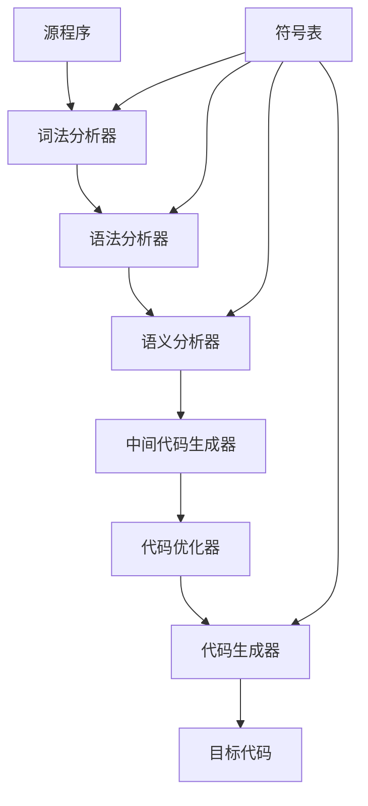

# 习题-第1章-编译原理概述

> [!abstract] 本章习题概览
> 本章习题涵盖编译器工作阶段划分、解释器与编译器区别、编译整体流程等核心知识点。

## 一、选择题

### 1.1 编译器的工作阶段

**题目1**：编译器的前端不包括以下哪个阶段？（ ）
A. 词法分析
B. 语法分析
C. 代码优化
D. 语义分析

**答案**：C

**解析**：编译器前端包括词法分析、语法分析、语义分析和中间代码生成，代码优化属于后端。

**题目2**：以下哪个阶段负责检查程序的语义正确性？（ ）
A. 词法分析
B. 语法分析
C. 语义分析
D. 代码优化

**答案**：C

**解析**：语义分析阶段负责检查程序的语义正确性，包括类型检查、作用域分析等。

### 1.2 解释器与编译器

**题目3**：以下关于编译器和解释器的说法，正确的是？（ ）
A. 编译器生成目标代码，解释器直接执行源程序
B. 编译器执行速度慢，解释器执行速度快
C. 编译器需要运行时支持，解释器不需要
D. 编译器和解释器的工作原理完全相同

**答案**：A

**解析**：编译器将源程序转换为目标代码后再执行，解释器直接执行源程序，不生成目标代码。

**题目4**：Java编译器生成的是什么形式的代码？（ ）
A. 机器码
B. 汇编代码
C. 字节码
D. 中间代码

**答案**：C

**解析**：Java编译器生成字节码，由Java虚拟机解释执行。

### 1.3 编译流程

**题目5**：以下哪个不是编译器的组成部分？（ ）
A. 词法分析器
B. 语法分析器
C. 代码编辑器
D. 代码生成器

**答案**：C

**解析**：编译器的组成部分包括词法分析器、语法分析器、语义分析器、中间代码生成器、代码优化器和代码生成器，代码编辑器不属于编译器。

## 二、填空题

### 1.1 编译器工作阶段

**题目1**：编译器的工作阶段包括______、______、______、______、______和______。

**答案**：词法分析、语法分析、语义分析、中间代码生成、代码优化、目标代码生成

**题目2**：编译器的前端负责______，后端负责______。

**答案**：分析源程序、生成目标代码

### 1.2 解释器与编译器

**题目3**：编译器和解释器的主要区别在于______。

**答案**：是否生成目标代码

**题目4**：解释器的优点是______，缺点是______。

**答案**：灵活性高、执行速度慢

### 1.3 编译流程

**题目5**：编译过程中产生的中间代码具有______的特点。

**答案**：与目标机无关

## 三、简答题

### 1.1 编译器工作阶段

**题目1**：简述编译器的工作阶段及其主要任务。

**答案**：
1. **词法分析**：将源程序分解为词法单元（token）。
2. **语法分析**：根据语法规则构建语法树。
3. **语义分析**：检查程序的语义正确性，收集语义信息。
4. **中间代码生成**：生成与目标机无关的中间代码。
5. **代码优化**：优化中间代码，提高效率。
6. **目标代码生成**：将优化后的中间代码转换为目标机代码。

### 1.2 解释器与编译器

**题目2**：比较编译器和解释器的优缺点。

**答案**：
**编译器的优点**：
- 执行速度快
- 生成的目标代码可多次执行
- 适合大规模程序

**编译器的缺点**：
- 编译时间长
- 不灵活，修改后需要重新编译
- 需要更多内存

**解释器的优点**：
- 灵活性高，支持交互
- 调试方便
- 内存占用少

**解释器的缺点**：
- 执行速度慢
- 每次执行都需要重新解释
- 不适合大规模程序

### 1.3 编译流程

**题目3**：为什么需要中间代码？中间代码的特点是什么？

**答案**：
**需要中间代码的原因**：
1. 与目标机无关，提高编译器的可移植性
2. 便于进行代码优化
3. 简化代码生成过程

**中间代码的特点**：
1. 与目标机无关
2. 简洁、统一
3. 易于处理和优化

## 四、综合题

**题目1**：画出编译器的结构框图，并说明各部分的作用。

**答案**：

**各部分作用**：
1. **词法分析器**：将源程序分解为词法单元。
2. **语法分析器**：构建语法树。
3. **语义分析器**：检查语义正确性，收集语义信息。
4. **中间代码生成器**：生成中间代码。
5. **代码优化器**：优化中间代码。
6. **代码生成器**：生成目标代码。
7. **符号表**：存储标识符信息。

**题目2**：说明编译过程中符号表的作用。

**答案**：
符号表在编译过程中的作用：
1. **存储信息**：存储变量、函数、类等的属性。
2. **快速查找**：支持快速查找标识符。
3. **作用域管理**：管理标识符的作用域。
4. **类型检查**：提供类型信息进行类型检查。
5. **代码生成**：提供存储位置信息。

---

**导航**：下一章 [[习题-第2章-词法分析与有限自动机.md]]