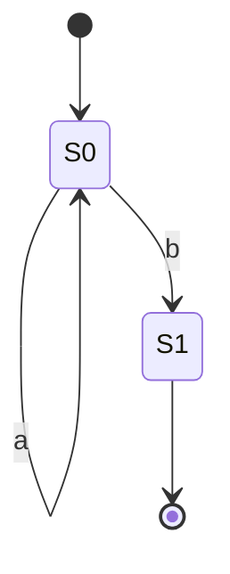
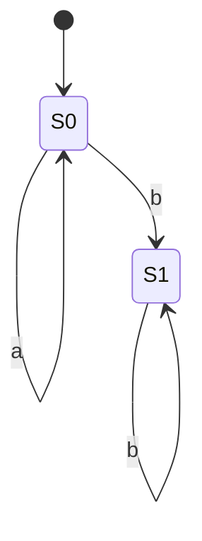
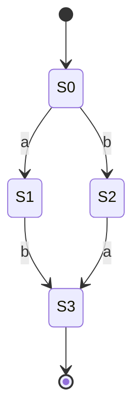

# 习题-第2章-词法分析与有限自动机

> [!abstract] 本章习题概览
> 本章习题涵盖词法分析的任务、正则表达式、有限自动机及其转换等核心知识点。

## 一、选择题

### 2.1 词法分析

**题目1**：词法分析器的输出是什么？（ ）
A. 语法树
B. 词法单元（token）
C. 中间代码
D. 目标代码

**答案**：B

**解析**：词法分析器将源程序分解为词法单元（token）序列。

**题目2**：以下哪个不是词法单元的组成部分？（ ）
A. 类型
B. 值
C. 位置
D. 语法规则

**答案**：D

**解析**：词法单元由类型、值和位置组成，语法规则不属于词法单元。

### 2.2 正则表达式

**题目3**：正则表达式 `a*b` 表示什么语言？（ ）
A. 以a开头，以b结尾的字符串
B. 零个或多个a后跟一个b
C. 一个a后跟零个或多个b
D. 零个或多个ab

**答案**：B

**解析**：`a*` 表示零个或多个a，`b` 表示一个b，所以 `a*b` 表示零个或多个a后跟一个b。

**题目4**：正则表达式 `(a|b)*` 表示什么语言？（ ）
A. 只包含a的字符串
B. 只包含b的字符串
C. 包含a和b的字符串
D. 由a和b组成的任意字符串

**答案**：D

**解析**：`(a|b)` 表示a或b，`*` 表示零个或多个，所以 `(a|b)*` 表示由a和b组成的任意字符串。

### 2.3 有限自动机

**题目5**：DFA和NFA的区别在于？（ ）
A. DFA只有一个起始状态，NFA可以有多个
B. DFA的状态转换是确定的，NFA的状态转换可以是不确定的
C. DFA可以识别正则语言，NFA不能
D. DFA的状态数比NFA少

**答案**：B

**解析**：DFA的状态转换是确定的，对于每个状态和输入符号，只有一个后继状态；NFA的状态转换可以是不确定的，对于每个状态和输入符号，可以有多个后继状态。

## 二、填空题

### 2.1 词法分析

**题目1**：词法分析器的主要任务是______。

**答案**：将源程序分解为词法单元（token）

**题目2**：词法单元由______、______和______组成。

**答案**：类型、值、位置

### 2.2 正则表达式

**题目3**：正则表达式的基本运算包括______、______和______。

**答案**：并、连接、闭包

**题目4**：正则表达式 `a(b|c)d` 可以匹配的字符串有______和______。

**答案**：abd、acd

### 2.3 有限自动机

**题目5**：DFA的组成包括______、______、______、______和______。

**答案**：状态集合、输入符号集合、转换函数、起始状态、接受状态集合

## 三、简答题

### 2.1 词法分析

**题目1**：简述词法分析器的工作原理。

**答案**：
词法分析器的工作原理：
1. 从源程序中读取字符流
2. 根据词法规则识别词法单元
3. 生成词法单元序列
4. 将词法单元传递给语法分析器

### 2.2 正则表达式

**题目2**：说明正则表达式与有限自动机的关系。

**答案**：
正则表达式和有限自动机是等价的：
1. 对于每个正则表达式，可以构造一个等价的有限自动机。
2. 对于每个有限自动机，可以构造一个等价的正则表达式。

### 2.3 有限自动机

**题目3**：如何将NFA转换为DFA？

**答案**：
NFA转DFA的步骤：
1. **子集构造**：计算每个状态的ε-闭包。
2. **状态转换**：对于每个DFA状态和输入符号，计算后继状态的ε-闭包。
3. **接受状态**：如果DFA状态包含NFA的接受状态，则为接受状态。

## 四、综合题

**题目1**：构造识别正则表达式 `a*b` 的NFA和DFA。

**答案**：

**NFA**：



**DFA**：



**题目2**：将以下NFA转换为DFA。



**答案**：

**DFA**：

```mermaid
stateDiagram-v2
    [*] --> {S0}
    {S0} --> {S1}: a
    {S0} --> {S2}: b
    {S1} --> {S3}: b
    {S1} --> {}: a
    {S2} --> {S3}: a
    {S2} --> {}: b
    {S3} --> [*]
    {} --> {}: a
    {} --> {}: b
```

---

**导航**：上一章 [[习题-第1章-编译原理概述.md]] · 下一章 [[习题-第3章-自上而下语法分析.md]]