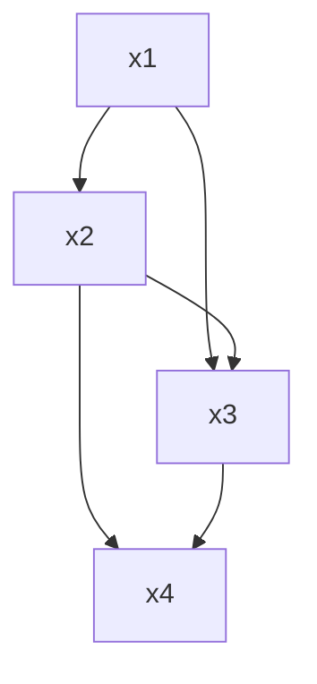

# 习题-第8章-目标代码生成

> [!abstract] 本章习题概览
> 本章习题涵盖目标代码生成概述、寄存器分配、代码生成技术等核心知识点。

## 一、选择题

### 8.1 目标代码生成概述

**题目1**：目标代码生成的任务不包括以下哪个？（ ）
A. 指令选择
B. 寄存器分配
C. 指令调度
D. 语法分析

**答案**：D

**解析**：语法分析是语法分析阶段的任务，不是目标代码生成的任务。

**题目2**：以下哪个不是目标代码的形式？（ ）
A. 机器码
B. 汇编代码
C. 字节码
D. 中间代码

**答案**：D

**解析**：中间代码是中间表示，不是目标代码的形式。

### 8.2 寄存器分配

**题目3**：图着色算法的基本思想是？（ ）
A. 将寄存器分配问题转化为图着色问题
B. 按变量的生命周期顺序扫描
C. 使用线性规划分配寄存器
D. 使用贪心算法分配寄存器

**答案**：A

**解析**：图着色算法将寄存器分配问题转化为图着色问题，用最少的颜色（寄存器）着色图。

**题目4**：线性扫描算法的时间复杂度是？（ ）
A. O(n)
B. O(n log n)
C. O(n^2)
D. O(n^3)

**答案**：B

**解析**：线性扫描算法的时间复杂度是O(n log n)，主要来自于排序。

### 8.3 代码生成技术

**题目5**：指令调度的目的是？（ ）
A. 提高流水线效率
B. 减少代码大小
C. 简化代码结构
D. 增加代码可读性

**答案**：A

**解析**：指令调度的目的是安排指令的执行顺序，提高流水线效率。

## 二、填空题

### 8.1 目标代码生成概述

**题目1**：目标代码生成的任务包括______、______、______和______。

**答案**：指令选择、寄存器分配、指令调度、代码生成

**题目2**：目标代码的形式包括______、______和______。

**答案**：机器码、汇编代码、字节码

### 8.2 寄存器分配

**题目3**：寄存器分配的方法包括______和______。

**答案**：图着色算法、线性扫描算法

**题目4**：图着色算法的步骤包括______、______和______。

**答案**：构建冲突图、图着色、分配寄存器

### 8.3 代码生成技术

**题目5**：指令调度的方法包括______、______和______。

**答案**：静态调度、动态调度、软件流水线

## 三、简答题

### 8.1 目标代码生成概述

**题目1**：简述目标代码生成的任务和目标。

**答案**：
目标代码生成的任务：
1. 指令选择：选择合适的目标机指令
2. 寄存器分配：分配寄存器给变量
3. 指令调度：安排指令的执行顺序
4. 代码生成：生成最终的目标代码

目标代码生成的目标：
1. 生成正确的代码
2. 生成高效的代码
3. 生成可移植的代码

### 8.2 寄存器分配

**题目2**：说明图着色算法和线性扫描算法的区别。

**答案**：
**图着色算法**：
- 将寄存器分配问题转化为图着色问题
- 时间复杂度：O(n^2)
- 生成的代码质量高
- 实现复杂

**线性扫描算法**：
- 按变量的生命周期顺序扫描
- 时间复杂度：O(n log n)
- 生成的代码质量中等
- 实现简单

### 8.3 代码生成技术

**题目3**：如何进行指令调度？指令调度的目的是什么？

**答案**：
指令调度的步骤：
1. 分析指令之间的依赖关系
2. 确定指令的执行顺序
3. 优化指令顺序，提高流水线效率

指令调度的目的：
1. 减少流水线停顿
2. 提高指令级并行度
3. 减少执行时间

## 四、综合题

**题目1**：使用图着色算法分配寄存器，假设有3个寄存器，变量的冲突图如下：



**答案**：

**着色结果**：
- x1: 颜色1 (寄存器R1)
- x2: 颜色2 (寄存器R2)
- x3: 颜色3 (寄存器R3)
- x4: 颜色1 (寄存器R1) 或 颜色2 (寄存器R2)

**分配结果**：
- x1 → R1
- x2 → R2
- x3 → R3
- x4 → R1（x1使用完毕后）

**题目2**：为以下中间代码生成目标代码（假设使用x86汇编）。

```
t1 = a + b
t2 = t1 * c
x = t2
```

**答案**：

```
MOV AX, a      ; AX = a
ADD AX, b      ; AX = a + b
MOV BX, c      ; BX = c
MUL BX         ; AX = AX * BX = (a + b) * c
MOV x, AX      ; x = AX
```

---

**导航**：上一章 [[习题-第7章-代码优化.md]]