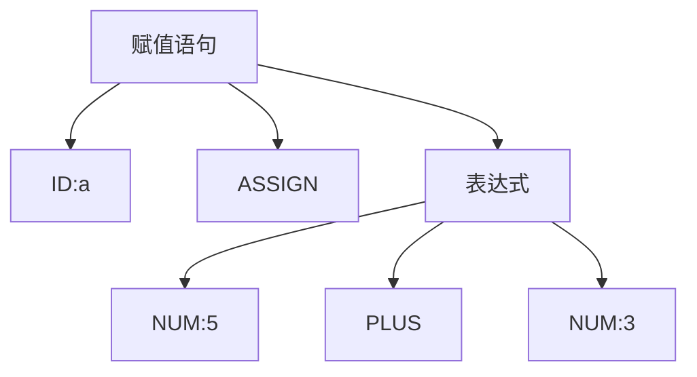
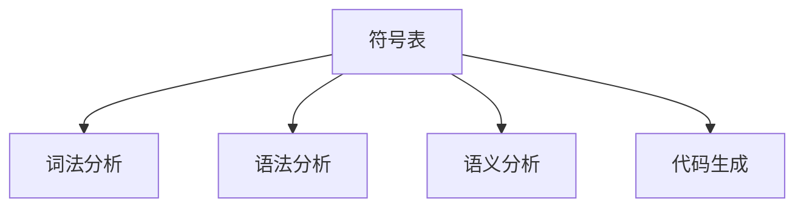

# 1.1 编译器工作阶段划分

> [!abstract] 核心问题
> 编译器的工作分为哪些阶段？每个阶段的主要功能是什么？

## 一、编译器的七个阶段

### 1. 词法分析（Lexical Analysis）

**功能**：将源程序字符流分解为词法单元（token）序列。

**输入**：源程序字符流

**输出**：token序列

**示例**：

```
源程序：int a = 5 + 3;
词法单元：[INT, ID(a), ASSIGN, NUM(5), PLUS, NUM(3), SEMI]
```

### 2. 语法分析（Syntax Analysis）

**功能**：根据语法规则构建语法树。

**输入**：token序列

**输出**：语法树或推导树

**示例**：



### 3. 语义分析（Semantic Analysis）

**功能**：检查语义正确性，收集语义信息。

**输入**：语法树

**输出**：带属性的语法树

**主要任务**：
- 类型检查
- 作用域分析
- 上下文相关检查

### 4. 中间代码生成（Intermediate Code Generation）

**功能**：生成与目标机无关的中间表示。

**输入**：带属性的语法树

**输出**：中间代码（四元式、三元式等）

**示例**：

```
四元式：
(+, 5, 3, t1)
(:=, t1, , a)
```

### 5. 代码优化（Code Optimization）

**功能**：优化中间代码，提高目标程序效率。

**输入**：中间代码

**输出**：优化后的中间代码

**优化类型**：
- 局部优化
- 全局优化
- 循环优化

### 6. 目标代码生成（Target Code Generation）

**功能**：将优化后的中间代码转换为目标机器指令。

**输入**：优化后的中间代码

**输出**：目标机器代码

**示例**：

```
MOV R1, #5
ADD R1, #3
MOV [a], R1
```

### 7. 符号表管理（Symbol Table Management）

**功能**：记录标识符的属性信息，支持各阶段查询。

**贯穿整个编译过程**：
- 变量名、函数名、类型、作用域
- 存储位置、参数列表

## 二、编译前端与编译后端

### 1. 编译前端

**定义**：与源语言相关的部分。

**包含阶段**：
- 词法分析
- 语法分析
- 语义分析
- 中间代码生成

**特点**：
- 与目标机器无关
- 可复用

### 2. 编译后端

**定义**：与目标机器相关的部分。

**包含阶段**：
- 代码优化
- 目标代码生成

**特点**：
- 与目标机器相关
- 需要为不同机器重新实现

### 3. 前后端划分的优点

| 优点 | 说明 |
|-----|------|
| 可移植性 | 前端只需开发一次，后端针对不同机器实现 |
| 可复用性 | 前端可以复用于不同目标机器 |
| 模块化 | 前后端独立开发，易于维护 |

## 三、编译器的遍（Pass）

### 1. 遍的概念

**定义**：对源程序或中间表示从头到尾扫描一次，并完成特定处理的过程。

### 2. 单遍编译与多遍编译

| 类型 | 说明 | 优点 | 缺点 |
|-----|------|------|------|
| 单遍编译 | 一次扫描完成所有阶段 | 效率高 | 代码复杂，难以维护 |
| 多遍编译 | 多次扫描，每遍完成部分工作 | 结构清晰，易于维护 | 需要多次扫描，效率较低 |

### 3. 多遍编译的典型结构


## 四、各阶段的关系

### 1. 数据流


### 2. 符号表的作用



> [!warning] 易错点
> 编译的七个阶段是逻辑划分，实际实现中可能合并某些阶段。语义分析和中间代码生成常常结合在一起。

---

**导航**：[[MOC - 第1章.md|返回章节导航]] · 下一节 [[1.2-解释器与编译器区别.md]]