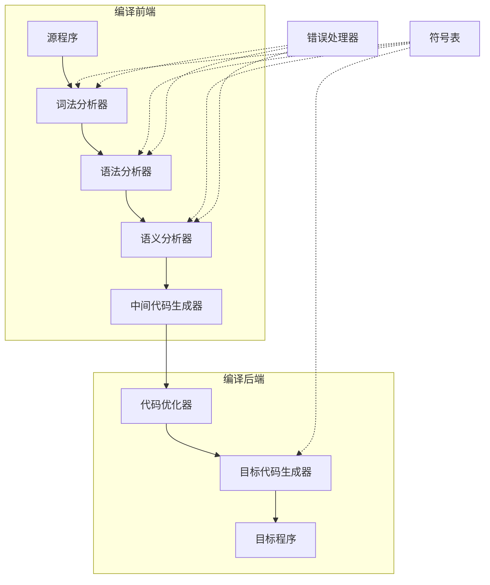
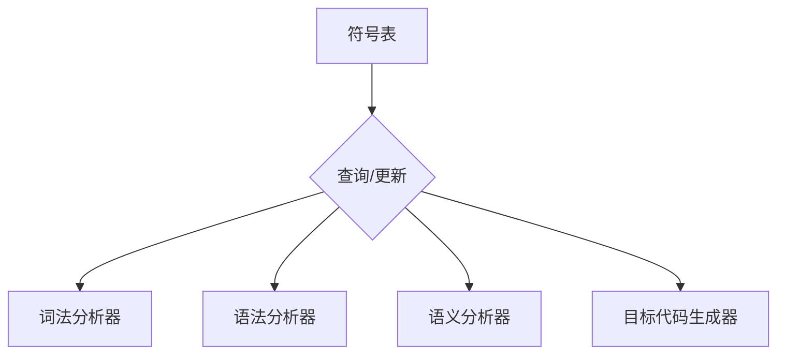
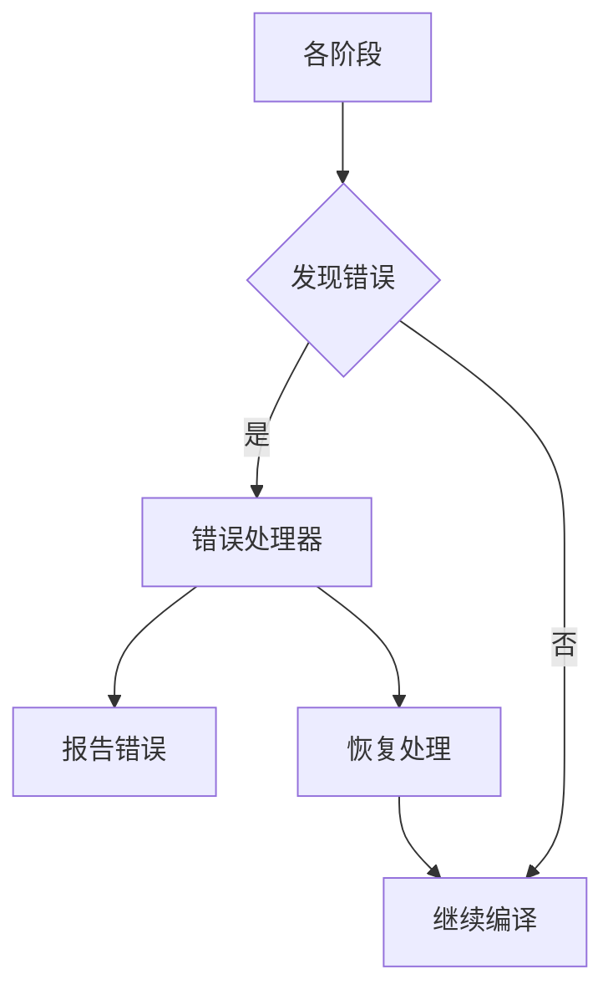
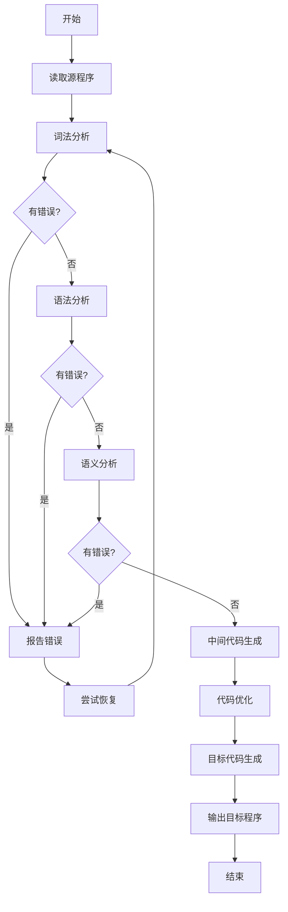
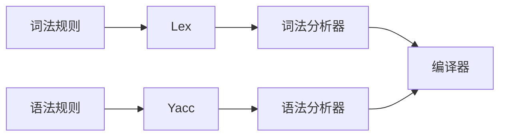
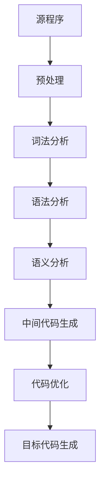
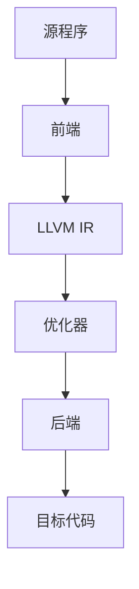

# 1.3 编译整体流程框图

> [!abstract] 核心问题
> 编译器的整体结构是怎样的？各个阶段之间的数据流和控制流是怎样的？

## 一、编译器的整体结构

### 1. 结构框图

### 2. 各组件说明

| 组件 | 功能 | 输入 | 输出 |
|-----|------|------|------|
| **词法分析器** | 识别词法单元 | 字符流 | token序列 |
| **语法分析器** | 构建语法树 | token序列 | 语法树 |
| **语义分析器** | 检查语义正确性 | 语法树 | 带属性的语法树 |
| **中间代码生成器** | 生成中间表示 | 带属性的语法树 | 中间代码 |
| **代码优化器** | 优化中间代码 | 中间代码 | 优化后的中间代码 |
| **目标代码生成器** | 生成目标代码 | 优化后的中间代码 | 目标代码 |
| **符号表** | 管理标识符信息 | - | - |
| **错误处理器** | 处理和报告错误 | - | - |

## 二、数据流

### 1. 顺序数据流

### 2. 符号表数据

### 3. 错误处理数据流

## 三、控制流

### 1. 主控制流程

### 2. 错误恢复策略

| 策略 | 说明 | 优点 | 缺点 |
|-----|------|------|------|
| **恐慌模式** | 跳过部分输入，直到遇到同步标记 | 简单可靠 | 可能遗漏多个错误 |
| **短语级恢复** | 尝试替换或删除部分语法单位 | 恢复效果好 | 实现复杂 |
| **全局纠正** | 查找最小距离的正确程序 | 恢复效果最好 | 计算量大 |

## 四、编译器的遍

### 1. 单遍编译

**特点**：
- 一次扫描完成所有工作
- 适合简单语言
- 代码复杂，难以维护

### 2. 多遍编译

**特点**：
- 结构清晰，易于维护
- 可以复用中间结果
- 需要多次扫描，效率较低

### 3. 遍的划分原则

| 原则 | 说明 |
|-----|------|
| **功能独立** | 每遍完成一个独立的功能 |
| **数据依赖** | 前一遍的输出是后一遍的输入 |
| **效率考虑** | 减少遍数可以提高效率 |

## 五、编译器的实现方式

### 1. 手工实现

**特点**：
- 完全手动编写代码
- 灵活性高
- 开发周期长

### 2. 编译器编译器

**工具**：
- Lex/Flex：词法分析器生成器
- Yacc/Bison：语法分析器生成器

**工作方式**：

**优点**：
- 开发效率高
- 规则描述清晰
- 易于维护

### 3. 混合实现

**方式**：
- 使用工具生成词法和语法分析器
- 手动实现语义分析和代码生成

**优点**：
- 兼顾开发效率和灵活性
- 是目前主流的实现方式

## 六、典型编译器示例

### 1. GCC（GNU Compiler Collection）

**结构**：

**特点**：
- 支持多种源语言
- 支持多种目标平台
- 优化能力强

### 2. LLVM

**结构**：

**特点**：
- 模块化设计
- 可复用的中间表示
- 支持多种前端和后端

> [!warning] 易错点
> 编译器的阶段划分是逻辑上的，实际实现中可以合并某些阶段！例如，词法分析和语法分析常常合并为一遍。

---

**导航**：上一节 [[1.2-解释器与编译器区别.md]] · [[MOC - 第1章.md|返回章节导航]]