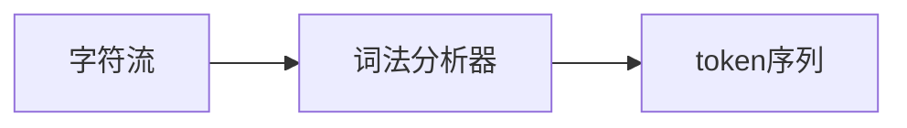
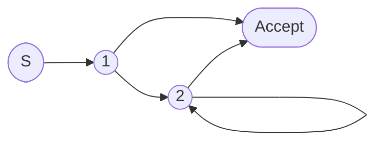
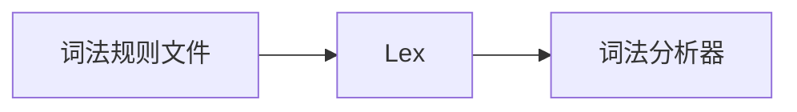

# 2.1 词法分析的任务与输出

> [!abstract] 核心问题
> 词法分析器的主要任务是什么？词法分析器的输入和输出是什么？

## 一、词法分析的任务

### 1. 基本任务

**定义**：词法分析是编译的第一个阶段，负责将源程序的字符流分解为词法单元（token）序列。

**示意图**：



### 2. 具体任务

| 任务 | 说明 | 示例 |
|-----|------|------|
| **识别词法单元** | 将字符组合成有意义的token | `int` → INT |
| **过滤空白和注释** | 忽略空格、换行、注释 | `// comment` → 忽略 |
| **处理错误** | 报告词法错误 | 非法字符 |
| **符号表管理** | 记录标识符信息 | 变量名、类型 |

## 二、词法单元的分类

### 1. 关键字（Keywords）

**定义**：语言保留的具有特定含义的词。

**示例**：

| 语言 | 关键字示例 |
|-----|-----------|
| C/C++ | `int`, `if`, `else`, `for`, `while` |
| Java | `public`, `class`, `void`, `static` |
| Python | `def`, `class`, `if`, `else`, `for` |

### 2. 标识符（Identifiers）

**定义**：用户定义的变量名、函数名、类名等。

**命名规则**：
- 以字母或下划线开头
- 可以包含字母、数字、下划线
- 不能是关键字

**示例**：`x`, `myVar`, `calculateSum`

### 3. 常量（Constants）

**定义**：具有固定值的词法单元。

**分类**：

| 类型 | 示例 |
|-----|------|
| 整型常量 | `123`, `-456`, `0x1A` |
| 浮点常量 | `3.14`, `1.2e3` |
| 字符常量 | `'a'`, `'\n'` |
| 字符串常量 | `"hello"`, `"world"` |

### 4. 运算符（Operators）

**定义**：表示运算的词法单元。

**示例**：

| 类型 | 示例 |
|-----|------|
| 算术运算符 | `+`, `-`, `*`, `/`, `%` |
| 关系运算符 | `<`, `>`, `<=`, `>=`, `==`, `!=` |
| 逻辑运算符 | `&&`, `\|\|`, `!` |
| 赋值运算符 | `=`, `+=`, `-=` |

### 5. 分隔符（Separators）

**定义**：用于分隔程序元素的符号。

**示例**：`;`, `,`, `(`, `)`, `{`, `}`, `[`, `]`

## 三、词法分析器的输入与输出

### 1. 输入

**源程序字符流**：

```
int x = 10 + 20;
```

### 2. 输出

**词法单元序列**：

| 词法单元类型 | 属性值 |
|------------|--------|
| INT | - |
| ID | `"x"` |
| ASSIGN | - |
| NUM | `10` |
| PLUS | - |
| NUM | `20` |
| SEMI | - |

### 3. 词法单元的表示

**二元组表示**：`(token_type, attribute_value)`

**示例**：
- `(INT, null)`
- `(ID, "x")`
- `(NUM, 10)`

## 四、词法分析器的设计

### 1. 状态转换图

**定义**：描述词法分析器状态转换的图形化工具。

**示例**：识别标识符的状态转换图



**状态说明**：
- S：起始状态
- 1：读入第一个字母或下划线
- 2：读入后续字母、数字或下划线
- Accept：接受状态

### 2. 手工实现

**步骤**：
1. 画出状态转换图
2. 将状态转换图转换为代码

**示例**：

```java
public class Lexer {
    private String input;
    private int pos;
    
    public Token nextToken() {
        while (pos < input.length()) {
            char c = input.charAt(pos);
            if (Character.isLetter(c) || c == '_') {
                // 识别标识符
                StringBuilder sb = new StringBuilder();
                while (pos < input.length() && 
                       (Character.isLetterOrDigit(input.charAt(pos)) || 
                        input.charAt(pos) == '_')) {
                    sb.append(input.charAt(pos++));
                }
                String id = sb.toString();
                if (isKeyword(id)) {
                    return new Token(TokenType.KEYWORD, id);
                }
                return new Token(TokenType.ID, id);
            } else if (Character.isDigit(c)) {
                // 识别数字
                StringBuilder sb = new StringBuilder();
                while (pos < input.length() && 
                       Character.isDigit(input.charAt(pos))) {
                    sb.append(input.charAt(pos++));
                }
                return new Token(TokenType.NUM, Integer.parseInt(sb.toString()));
            } else {
                // 识别运算符和分隔符
                pos++;
                return new Token(getOperatorType(c), null);
            }
        }
        return new Token(TokenType.EOF, null);
    }
}
```

### 3. 使用工具生成

**工具**：Lex/Flex

**工作方式**：



**Lex规则示例**：

```lex
%{
#include "token.h"
%}

%%
"int"        { return INT; }
[a-zA-Z_]+   { return ID; }
[0-9]+       { return NUM; }
"+"          { return PLUS; }
"="          { return ASSIGN; }
";"          { return SEMI; }
[ \t\n]+     { /* 忽略空白 */ }
%%
```

## 五、词法分析器的错误处理

### 1. 常见错误

| 错误类型 | 示例 |
|---------|------|
| 非法字符 | `#`, `$`, `@` |
| 字符串未闭合 | `"hello` |
| 注释未闭合 | `/* comment` |

### 2. 错误处理策略

| 策略 | 说明 |
|-----|------|
| **报告错误并终止** | 发现错误后报告并停止编译 |
| **跳过错误字符** | 跳过非法字符，继续分析 |
| **替换错误字符** | 将非法字符替换为合法字符 |

> [!warning] 易错点
> 词法分析器只负责识别词法单元，不负责语法检查！语法检查是语法分析阶段的任务。

---

**导航**：[[MOC - 第2章.md|返回章节导航]] · 下一节 [[2.2-正则表达式.md]]