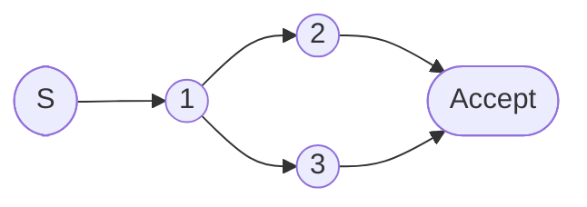
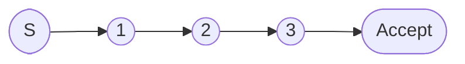
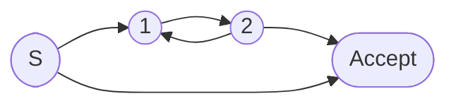
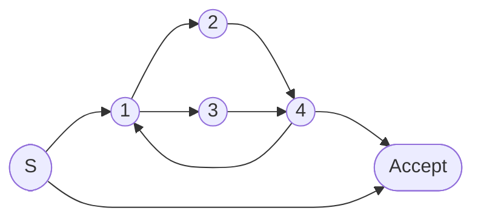

# 2.2 正则表达式

> [!abstract] 核心问题
> 什么是正则表达式？正则表达式的运算有哪些？如何使用正则表达式描述词法单元？

## 一、正则表达式的定义

### 1. 基本概念

**定义**：正则表达式（Regular Expression）是一种描述字符串模式的工具，用于匹配符合特定规则的字符串。

**字母表**：

$$\Sigma = \{a, b, c, \dots\}$$

**空串**：

$$\epsilon$$

**正则表达式的递归定义**：

1. **单个字符**：`a` 是正则表达式，匹配字符串 `"a"`
2. **空串**：`ε` 是正则表达式，匹配空串
3. **并运算**：如果 `r` 和 `s` 是正则表达式，则 `r | s` 也是正则表达式，匹配 `r` 或 `s`
4. **连接运算**：如果 `r` 和 `s` 是正则表达式，则 `rs` 也是正则表达式，匹配 `r` 后跟 `s`
5. **闭包运算**：如果 `r` 是正则表达式，则 `r*` 也是正则表达式，匹配 `r` 零次或多次

### 2. 运算优先级

| 优先级 | 运算 |
|-------|------|
| 1 | 闭包 `*` |
| 2 | 连接 |
| 3 | 并 `\|` |

### 3. 常用缩写

| 缩写 | 含义 | 等价表达式 |
|-----|------|-----------|
| `r+` | 匹配 `r` 一次或多次 | `rr*` |
| `r?` | 匹配 `r` 零次或一次 | `r \| ε` |
| `[abc]` | 匹配 `a`、`b` 或 `c` | `a \| b \| c` |
| `[^abc]` | 匹配除 `a`、`b`、`c` 外的任意字符 | - |
| `[a-z]` | 匹配 `a` 到 `z` 的任意字符 | `a \| b \| \dots \| z` |
| `.` | 匹配任意字符 | - |

## 二、正则表达式的运算

### 1. 并运算（Union）

**定义**：`r | s` 匹配 `r` 或 `s`。

**示例**：

```
a | b = {ε, a, b}
```

**状态转换图**：



### 2. 连接运算（Concatenation）

**定义**：`rs` 匹配 `r` 后跟 `s`。

**示例**：

```
ab = {ab}
```

**状态转换图**：



### 3. 闭包运算（Closure）

**定义**：`r*` 匹配 `r` 零次或多次。

**示例**：

```
a* = {ε, a, aa, aaa, ...}
```

**状态转换图**：



## 三、正则表达式的等价性

### 1. 等价的定义

**定义**：两个正则表达式 `r` 和 `s` 等价，如果它们描述的语言相同。

**示例**：

```
(a | b)* = (a*b*)*
```

### 2. 等价变换规则

| 规则 | 说明 |
|-----|------|
| **交换律** | `r | s = s | r` |
| **结合律** | `(r | s) | t = r | (s | t)` |
| **分配律** | `r(s | t) = rs | rt` |
| **单位元** | `εr = rε = r` |
| **零元** | `∅r = r∅ = ∅` |
| **幂等律** | `r | r = r` |

## 四、正则表达式的应用

### 1. 描述标识符

**规则**：以字母或下划线开头，后跟零个或多个字母、数字或下划线。

**正则表达式**：

```
[a-zA-Z_][a-zA-Z0-9_]*
```

### 2. 描述整数

**规则**：可选的负号，后跟一个或多个数字。

**正则表达式**：

```
(-)?[0-9]+
```

### 3. 描述浮点数

**规则**：整数部分，可选的小数点和小数部分。

**正则表达式**：

```
[0-9]+(\.[0-9]+)?
```

### 4. 描述字符串

**规则**：双引号包围的任意字符序列。

**正则表达式**：

```
"([^"]|\\")*"
```

## 五、正则表达式到有限自动机的转换

### 1. Thompson构造法

**步骤**：

1. **基础情况**：
   - 对于字符 `a`，构造一个包含起始状态、接受状态和一条标记为 `a` 的边的NFA
   - 对于空串 `ε`，构造一个包含起始状态和接受状态，以及一条标记为 `ε` 的边的NFA

2. **并运算**：
   - 创建新的起始状态和接受状态
   - 从新起始状态通过 `ε` 边连接到两个子NFA的起始状态
   - 从两个子NFA的接受状态通过 `ε` 边连接到新接受状态

3. **连接运算**：
   - 将第一个NFA的接受状态与第二个NFA的起始状态合并

4. **闭包运算**：
   - 创建新的起始状态和接受状态
   - 从新起始状态通过 `ε` 边连接到子NFA的起始状态和新接受状态
   - 从子NFA的接受状态通过 `ε` 边连接到子NFA的起始状态和新接受状态

### 2. 示例

**正则表达式**：`(a | b)*`

**构造过程**：



> [!warning] 易错点
> 正则表达式的闭包运算优先级最高！连接运算次之，并且运算最低。在书写复杂正则表达式时需要注意使用括号改变优先级。

---

**导航**：上一节 [[2.1-词法分析的任务与输出.md]] · [[MOC - 第2章.md|返回章节导航]] · 下一节 [[2.3-有限自动机.md]]