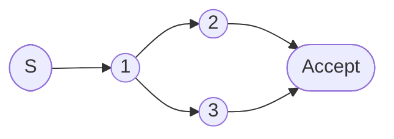

# 2.3 有限自动机

> [!abstract] 核心问题
> 什么是有限自动机？DFA和NFA的区别是什么？如何进行NFA到DFA的转换和DFA的最小化？

## 一、有限自动机的定义

### 1. NFA（非确定有限自动机）

**定义**：NFA是一个五元组：

$$M = (Q, \Sigma, \delta, q_0, F)$$

| 符号 | 含义 |
|-----|------|
| $Q$ | 状态集合 |
| $\Sigma$ | 输入字母表 |
| $\delta$ | 状态转换函数：$\delta(q, a) \subseteq Q$ |
| $q_0$ | 起始状态 |
| $F$ | 接受状态集合 |

**特点**：
- 对于同一个状态和输入，可能有多个转移
- 允许 $\varepsilon$ 转移

### 2. DFA（确定有限自动机）

**定义**：DFA是一个五元组：

$$M = (Q, \Sigma, \delta, q_0, F)$$

| 符号 | 含义 |
|-----|------|
| $Q$ | 状态集合 |
| $\Sigma$ | 输入字母表 |
| $\delta$ | 状态转换函数：$\delta(q, a) \to Q$ |
| $q_0$ | 起始状态 |
| $F$ | 接受状态集合 |

**特点**：
- 对于同一个状态和输入，只有一个转移
- 不允许 $\varepsilon$ 转移

### 3. NFA vs DFA

| 对比项 | NFA | DFA |
|-------|-----|-----|
| 转移函数 | $\delta(q, a) \subseteq Q$ | $\delta(q, a) \to Q$ |
| $\varepsilon$转移 | 允许 | 不允许 |
| 确定性 | 非确定 | 确定 |
| 状态数 | 通常较少 | 通常较多 |
| 实现难度 | 较高 | 较低 |

## 二、NFA到DFA的转换

### 1. 子集构造法

**步骤**：

1. **计算 $\varepsilon$-闭包**：
   - 对于状态集合 $S$，$\varepsilon$-闭包是从 $S$ 出发通过任意条 $\varepsilon$ 边可以到达的所有状态的集合

2. **构造DFA状态**：
   - DFA的每个状态对应NFA的一个状态集合
   - 起始状态是NFA起始状态的 $\varepsilon$-闭包

3. **构造转移**：
   - 对于DFA状态 $S$ 和输入 $a$，计算 $\delta(S, a) = \varepsilon$-闭包($\bigcup_{q \in S} \delta(q, a)$)

4. **确定接受状态**：
   - 如果DFA状态包含NFA的任何接受状态，则该DFA状态是接受状态

### 2. 示例

**NFA**：

**DFA状态构造**：

| DFA状态 | 对应NFA状态 | 是否接受 |
|--------|-----------|---------|
| $S_0$ | {A} | 否 |
| $S_1$ | {B} | 否 |
| $S_2$ | {C, D} | 是 |

**DFA转移表**：

| 状态 | a | b |
|-----|---|---|
| $S_0$ | $S_1$ | - |
| $S_1$ | $S_2$ | $S_2$ |
| $S_2$ | - | - |

## 三、DFA的最小化

### 1. 等价状态

**定义**：两个状态 $q_1$ 和 $q_2$ 等价，如果对于任意输入串 $w$，从 $q_1$ 和 $q_2$ 出发处理 $w$ 后，要么都到达接受状态，要么都到达非接受状态。

### 2. Hopcroft算法

**步骤**：

1. **初始划分**：
   - 将状态划分为接受状态和非接受状态两个集合

2. **迭代划分**：
   - 对于每个集合 $S$，根据某个输入 $a$ 的转移将 $S$ 进一步划分
   - 如果 $S$ 中的状态在输入 $a$ 下转移到不同的集合，则将 $S$ 划分为多个子集

3. **终止条件**：
   - 当没有集合可以进一步划分时，算法终止

4. **合并等价状态**：
   - 每个最终的集合中的状态可以合并为一个状态

### 3. 示例

**DFA状态**：

| 状态 | a | b | 是否接受 |
|-----|---|---|---------|
| $S_0$ | $S_1$ | $S_2$ | 否 |
| $S_1$ | $S_3$ | $S_4$ | 否 |
| $S_2$ | $S_4$ | $S_3$ | 否 |
| $S_3$ | $S_3$ | $S_3$ | 是 |
| $S_4$ | $S_4$ | $S_4$ | 是 |

**最小化过程**：

1. **初始划分**：$\{\{S_0, S_1, S_2\}, \{S_3, S_4\}\}$

2. **划分 $\{S_0, S_1, S_2\}$**：
   - 输入 $a$：$S_0 \to S_1$, $S_1 \to S_3$, $S_2 \to S_4$
   - $S_1$ 和 $S_2$ 的转移都进入 $\{S_3, S_4\}$，$S_0$ 的转移进入 $\{S_0, S_1, S_2\}$
   - 划分：$\{\{S_0\}, \{S_1, S_2\}, \{S_3, S_4\}\}$

3. **划分 $\{S_1, S_2\}$**：
   - 输入 $a$：$S_1 \to S_3$, $S_2 \to S_4$（都进入 $\{S_3, S_4\}$）
   - 输入 $b$：$S_1 \to S_4$, $S_2 \to S_3$（都进入 $\{S_3, S_4\}$）
   - 无法进一步划分

**最小化后的DFA**：

| 状态 | a | b | 是否接受 |
|-----|---|---|---------|
| $A$ | $B$ | $B$ | 否 |
| $B$ | $C$ | $C$ | 否 |
| $C$ | $C$ | $C$ | 是 |

## 四、有限自动机的应用

### 1. 词法分析器生成

**步骤**：

1. 为每个词法单元编写正则表达式
2. 将正则表达式转换为NFA
3. 将NFA转换为DFA
4. 将DFA最小化
5. 根据DFA生成词法分析器代码

### 2. 模式匹配

**应用**：
- 文本搜索
- 语法高亮
- 输入验证

### 3. 编译器优化

**应用**：
- 常量传播
- 死代码消除
- 数据流分析

## 五、有限自动机的性质

### 1. 正则语言

**定义**：可以由有限自动机识别的语言称为正则语言。

**等价描述**：
- 正则表达式
- NFA
- DFA

### 2. 泵引理

**定理**：对于任何正则语言 $L$，存在一个常数 $p$（泵长度），使得对于任何字符串 $s \in L$，如果 $|s| \geq p$，则 $s$ 可以分解为 $s = xyz$，满足：

1. $|y| > 0$
2. $|xy| \leq p$
3. 对于所有 $i \geq 0$，$xy^iz \in L$

**应用**：证明某些语言不是正则语言。

> [!warning] 易错点
> NFA和DFA的表达能力是等价的！任何NFA都可以转换为等价的DFA，反之亦然。

---

**导航**：上一节 [[2.2-正则表达式.md]] · [[MOC - 第2章.md|返回章节导航]]