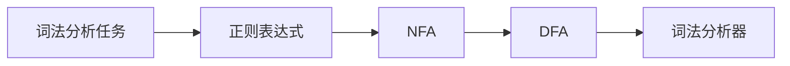

# 第2章-词法分析与有限自动机

> [!abstract] 本章定位
> 本章介绍词法分析的任务和方法，包括正则表达式、有限自动机（DFA和NFA）的定义和转换。

## 学习主线

## 章节内容

- [[2.1-词法分析的任务与输出.md]]：词法分析器的功能和输出
- [[2.2-正则表达式.md]]：正则表达式的定义和运算
- [[2.3-有限自动机.md]]：DFA和NFA的定义、转换和最小化

## 考点汇总

> [!important] 核心考点
> 1. 词法分析器的任务：识别词法单元、过滤空白和注释、处理错误
> 2. 正则表达式的定义和运算：并、连接、闭包
> 3. 正则表达式到NFA的转换（Thompson构造法）
> 4. NFA到DFA的转换（子集构造法）
> 5. DFA的最小化（Hopcroft算法）
> 6. 词法分析器的实现：手工实现和使用Lex生成

## 前后章节依赖

| 方向 | 章节 | 依赖关系 |
|-----|------|---------|
| 先修 | 第1章 | 词法分析是编译的第一个阶段 |
| 后续 | 第3章 | 语法分析依赖词法分析的输出 |

## 复习自测

> [!question] 自测题
> 1. 词法分析器的主要任务是什么？
> 2. 什么是正则表达式？正则表达式的运算有哪些？
> 3. 如何将正则表达式转换为NFA？
> 4. 如何将NFA转换为DFA？
> 5. 如何进行DFA的最小化？