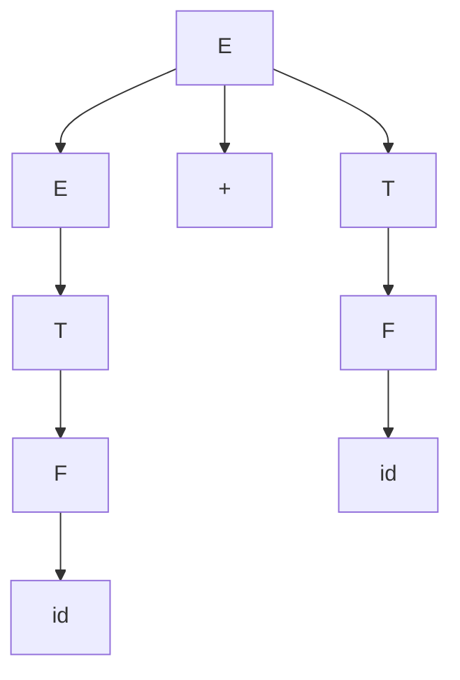
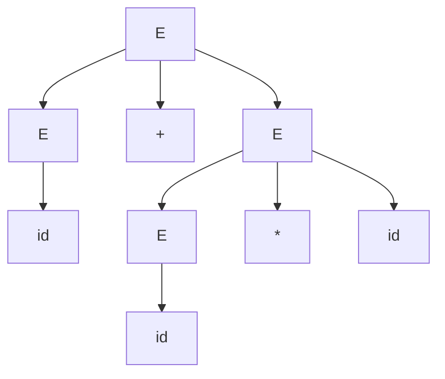
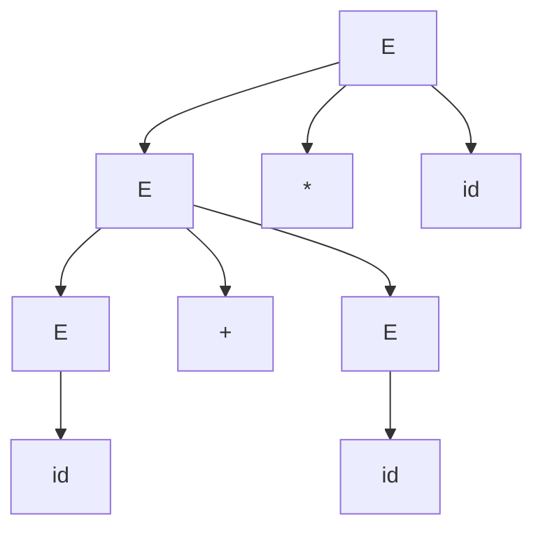
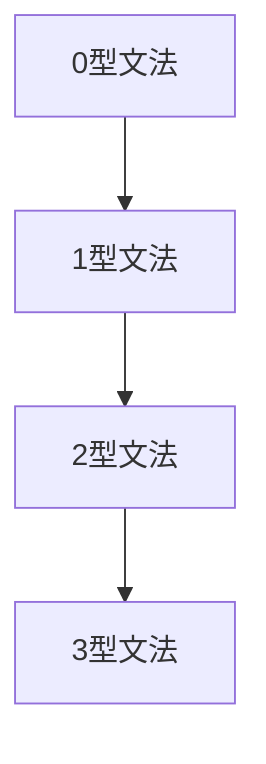

# 3.1 上下文无关文法

> [!abstract] 核心问题
> 什么是上下文无关文法？CFG的组成部分有哪些？如何进行推导和构造语法树？

## 一、上下文无关文法的定义

### 1. 基本概念

**定义**：上下文无关文法（Context-Free Grammar，CFG）是一个四元组：

$$G = (V_N, V_T, P, S)$$

| 符号 | 含义 |
|-----|------|
| $V_N$ | 非终结符集合 |
| $V_T$ | 终结符集合 |
| $P$ | 产生式集合 |
| $S$ | 开始符号 |

**示例**：

```
G = ({S, A}, {a, b}, P, S)
P:
  S → aSb | ε
  A → aA | b
```

### 2. 产生式的表示

**一般形式**：

$$A \to \alpha$$

其中 $A \in V_N$，$\alpha \in (V_N \cup V_T)^*$。

**示例**：

```
E → E + T | T
T → T * F | F
F → (E) | id
```

### 3. 缩写表示

**多个产生式可以合并**：

```
A → α_1 | α_2 | ... | α_n
```

**示例**：

```
E → E + T | E - T | T
```

## 二、推导和归约

### 1. 推导（Derivation）

**定义**：从开始符号出发，通过应用产生式逐步生成终结符串的过程。

**一步推导**：

$$\alpha A \beta \Rightarrow \alpha \gamma \beta$$

其中 $A \to \gamma$ 是一条产生式。

**示例**：

```
E → E + T → T + T → F + T → id + T → id + F → id + id
```

### 2. 最左推导（Leftmost Derivation）

**定义**：每次推导都替换最左边的非终结符。

**示例**：

```
E ⇒lm E + T ⇒lm T + T ⇒lm F + T ⇒lm id + T ⇒lm id + F ⇒lm id + id
```

### 3. 最右推导（Rightmost Derivation）

**定义**：每次推导都替换最右边的非终结符。

**示例**：

```
E ⇒rm E + T ⇒rm E + F ⇒rm E + id ⇒rm T + id ⇒rm F + id ⇒rm id + id
```

### 4. 归约（Reduction）

**定义**：推导的逆过程，从终结符串出发，逐步替换为非终结符。

**示例**：

```
id + id ⇐ F + id ⇐ T + id ⇐ E + id ⇐ E + F ⇐ E + T ⇐ E
```

## 三、语法树

### 1. 语法树的定义

**定义**：语法树是推导过程的图形化表示。

**特点**：
- 根节点是开始符号
- 每个内部节点是一个非终结符
- 每个叶子节点是一个终结符或ε
- 每个节点的子节点对应一条产生式右部的符号

### 2. 语法树的构造

**示例**：

```
产生式：
E → E + T
T → F
F → id

推导：E ⇒ E + T ⇒ E + F ⇒ E + id ⇒ T + id ⇒ F + id ⇒ id + id
```

**语法树**：



### 3. 二义性

**定义**：如果一个文法存在一个句子有两棵不同的语法树，则该文法是二义的。

**示例**：

```
产生式：
E → E + E | E * E | id

句子：id + id * id
```

**两棵语法树**：





### 4. 消除二义性

**方法**：

1. **引入优先级**：规定运算符的优先级
2. **引入结合性**：规定运算符的结合性
3. **重构文法**：将二义文法转换为等价的无歧义文法

**示例**：

```
无歧义文法：
E → E + T | T
T → T * F | F
F → (E) | id
```

## 四、文法的分类

### 1. Chomsky谱系

**0型文法（短语结构文法）**：

$$\alpha \to \beta$$

其中 $\alpha$ 和 $\beta$ 是任意符号串，$\alpha$ 至少包含一个非终结符。

**1型文法（上下文有关文法）**：

$$\alpha A \beta \to \alpha \gamma \beta$$

其中 $A \in V_N$，$\alpha, \beta, \gamma \in (V_N \cup V_T)^*$，$\gamma \neq \varepsilon$。

**2型文法（上下文无关文法）**：

$$A \to \alpha$$

其中 $A \in V_N$，$\alpha \in (V_N \cup V_T)^*$。

**3型文法（正则文法）**：

$$A \to aB \text{ 或 } A \to a$$

其中 $A, B \in V_N$，$a \in V_T$。

### 2. 文法分类关系



## 五、文法的应用

### 1. 描述程序设计语言的语法

**示例**：

```
Stmt → if Exp then Stmt else Stmt
Stmt → while Exp do Stmt
Stmt → id := Exp
Exp → Exp + Term | Term
Term → Term * Factor | Factor
Factor → (Exp) | id | num
```

### 2. 语法分析

**作用**：
- 验证程序的语法正确性
- 构建语法树供后续阶段使用

### 3. 代码生成

**作用**：
- 根据语法树生成中间代码或目标代码

> [!warning] 易错点
> 二义文法不能直接用于语法分析！必须先消除二义性或将其转换为无歧义文法。

---

**导航**：[[MOC - 第3章.md|返回章节导航]] · 下一节 [[3.2-递归下降分析法.md]]