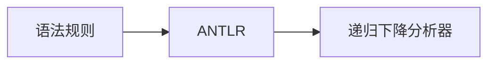

# 3.2 递归下降分析法

> [!abstract] 核心问题
> 递归下降分析的基本思想是什么？如何实现递归下降分析器？

## 一、递归下降分析的基本思想

### 1. 基本概念

**定义**：递归下降分析是一种自上而下的语法分析方法，通过为每个非终结符编写一个递归函数来实现。

**思想**：
- 对于每个非终结符 $A$，编写一个函数 $A()$
- 函数 $A()$ 根据 $A$ 的产生式进行递归调用
- 遇到终结符时，与输入token匹配

### 2. 示例

**文法**：

```
E → T E'
E' → + T E' | ε
T → F T'
T' → * F T' | ε
F → ( E ) | id
```

**递归下降分析器**：

```java
void E() {
    T();
    EPrime();
}

void EPrime() {
    if (lookahead == '+') {
        match('+');
        T();
        EPrime();
    }
    // else: ε产生式，什么也不做
}

void T() {
    F();
    TPrime();
}

void TPrime() {
    if (lookahead == '*') {
        match('*');
        F();
        TPrime();
    }
    // else: ε产生式，什么也不做
}

void F() {
    if (lookahead == '(') {
        match('(');
        E();
        match(')');
    } else if (lookahead == 'id') {
        match('id');
    } else {
        error();
    }
}

void match(Token expected) {
    if (lookahead == expected) {
        lookahead = nextToken();
    } else {
        error();
    }
}
```

## 二、递归下降分析器的设计

### 1. 消除左递归

**左递归的问题**：

```
E → E + T | T
```

**直接左递归消除**：

```
E → T E'
E' → + T E' | ε
```

**一般方法**：

```
A → A α_1 | A α_2 | ... | A α_m | β_1 | β_2 | ... | β_n

转换为：
A → β_1 A' | β_2 A' | ... | β_n A'
A' → α_1 A' | α_2 A' | ... | α_m A' | ε
```

### 2. 提取左因子

**左因子的问题**：

```
A → α β_1 | α β_2 | ... | α β_n
```

**提取左因子**：

```
A → α A'
A' → β_1 | β_2 | ... | β_n
```

### 3. 递归下降分析器的结构

**组成部分**：

| 部分 | 说明 |
|-----|------|
| **词法分析器** | 提供token流 |
| **预测分析** | 根据lookahead选择产生式 |
| **递归调用** | 为每个非终结符编写函数 |
| **匹配过程** | 匹配终结符和输入token |

### 4. 错误处理

**策略**：

| 策略 | 说明 |
|-----|------|
| **恐慌模式** | 跳过token直到找到同步标记 |
| **短语级恢复** | 尝试替换或删除token |
| **错误消息** | 报告错误位置和类型 |

## 三、递归下降分析的优缺点

### 1. 优点

| 优点 | 说明 |
|-----|------|
| **结构清晰** | 每个非终结符对应一个函数 |
| **易于实现** | 直接根据产生式编写代码 |
| **灵活性高** | 可以处理各种文法 |

### 2. 缺点

| 缺点 | 说明 |
|-----|------|
| **效率较低** | 递归调用有开销 |
| **栈溢出风险** | 深度递归可能导致栈溢出 |
| **需要改写文法** | 需要消除左递归和提取左因子 |

## 四、递归下降分析的应用

### 1. 手写编译器

**场景**：
- 教学编译器
- 小型语言编译器
- 快速原型开发

### 2. 语法分析器生成器

**工具**：
- ANTLR
- JavaCC

**工作方式**：



### 3. 表达式解析器

**示例**：

```java
public class ExpressionParser {
    private TokenStream tokens;
    
    public int parse() {
        return parseE();
    }
    
    private int parseE() {
        int result = parseT();
        while (tokens.peek() == TokenType.PLUS) {
            tokens.consume();
            result += parseT();
        }
        return result;
    }
    
    private int parseT() {
        int result = parseF();
        while (tokens.peek() == TokenType.MULTIPLY) {
            tokens.consume();
            result *= parseF();
        }
        return result;
    }
    
    private int parseF() {
        if (tokens.peek() == TokenType.NUMBER) {
            int num = Integer.parseInt(tokens.consume().getValue());
            return num;
        } else if (tokens.peek() == TokenType.LPAREN) {
            tokens.consume();
            int result = parseE();
            tokens.consume(); // 匹配右括号
            return result;
        }
        throw new RuntimeException("语法错误");
    }
}
```

## 五、递归下降分析的改进

### 1. 迭代实现

**方法**：使用显式栈代替递归调用。

**优点**：
- 避免栈溢出
- 提高效率

### 2. 表驱动

**方法**：使用分析表代替条件判断。

**优点**：
- 结构更清晰
- 易于维护

### 3. 预测分析

**方法**：使用FIRST集和FOLLOW集进行预测。

**优点**：
- 可以处理更多文法
- 错误处理更精确

> [!warning] 易错点
> 递归下降分析要求文法没有左递归！如果文法存在左递归，必须先消除左递归才能使用递归下降分析。

---

**导航**：上一节 [[3.1-上下文无关文法.md]] · [[MOC - 第3章.md|返回章节导航]] · 下一节 [[3.3-LL(1)分析法.md]]