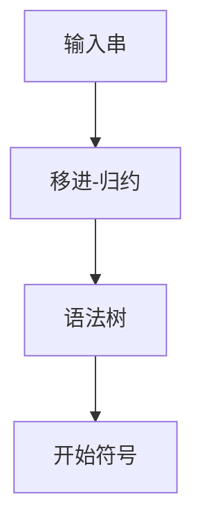

# 4.1 自下而上分析概述

> [!abstract] 核心问题
> 自下而上分析的基本思想是什么？移进-归约的过程是怎样的？

## 一、自下而上分析的基本思想

### 1. 基本概念

**定义**：自下而上分析是一种从输入串出发，逐步归约到开始符号的语法分析方法。

**思想**：
- 从叶子节点开始构建语法树
- 逐步向上归约到根节点（开始符号）

**示意图**：



### 2. 移进-归约过程

**过程**：

1. **移进（Shift）**：将输入token移进栈
2. **归约（Reduce）**：将栈顶的符号串归约为某个非终结符
3. **接受（Accept）**：当栈中只剩开始符号且输入为空时，分析成功
4. **报错（Error）**：无法继续移进或归约时，报告错误

**示例**：

```
文法：
E → E + T | T
T → T * F | F
F → ( E ) | id

输入：id + id * id
```

**分析过程**：

| 步骤 | 栈 | 输入 | 动作 |
|-----|-----|-----|-----|
| 1 | - | `id + id * id $` | 移进 `id` |
| 2 | `id` | `+ id * id $` | 归约 $F \to id$ |
| 3 | `F` | `+ id * id $` | 归约 $T \to F$ |
| 4 | `T` | `+ id * id $` | 归约 $E \to T$ |
| 5 | `E` | `+ id * id $` | 移进 `+` |
| 6 | `E +` | `id * id $` | 移进 `id` |
| 7 | `E + id` | `* id $` | 归约 $F \to id$ |
| 8 | `E + F` | `* id $` | 归约 $T \to F$ |
| 9 | `E + T` | `* id $` | 归约 $E \to E + T$ |
| 10 | `E` | `* id $` | 移进 `*` |
| 11 | `E *` | `id $` | 移进 `id` |
| 12 | `E * id` | `$` | 归约 $F \to id$ |
| 13 | `E * F` | `$` | 归约 $T \to T * F$ |
| 14 | `E * T` | `$` | 归约 $E \to E * T$ |
| 15 | `E` | `$` | 接受 |

## 二、句柄和最左素短语

### 1. 句柄（Handle）

**定义**：句柄是句型中的一个产生式右部，它对应于语法树中的一个最左直接子树的根节点。

**特点**：
- 句柄是最左直接短语
- 归约句柄对应于从左到右构建语法树

**示例**：

```
句型：E + T * F
句柄：T * F（对应产生式 T → T * F）
```

### 2. 最左素短语（Leftmost Prime Phrase）

**定义**：最左素短语是句型中最左边的素短语。

**素短语**：至少包含一个终结符的短语，且不包含其他素短语。

**示例**：

```
句型：E + T * F
素短语：T * F
最左素短语：T * F
```

### 3. 句柄和最左素短语的区别

| 对比项 | 句柄 | 最左素短语 |
|-------|------|-----------|
| 定义 | 产生式右部 | 最左边的素短语 |
| 用途 | LR分析 | 算符优先分析 |
| 包含 | 可以只含非终结符 | 必须含终结符 |

## 三、自下而上分析的类型

### 1. 算符优先分析（Operator-Precedence Parsing）

**特点**：
- 基于算符之间的优先级关系
- 适用于表达式文法
- 实现简单

**应用**：
- 表达式计算器
- 脚本语言解析器

### 2. LR分析（LR Parsing）

**特点**：
- 基于状态转换
- 功能强大，能处理大多数程序设计语言
- 分为LR(0)、SLR(1)、LR(1)、LALR(1)

**应用**：
- 编译器前端
- 语法分析器生成器

### 3. 类型对比

| 对比项 | 算符优先分析 | LR分析 |
|-------|-------------|--------|
| 文法限制 | 表达式文法 | 几乎任意CFG |
| 分析能力 | 较弱 | 强大 |
| 实现难度 | 简单 | 复杂 |
| 应用场景 | 简单表达式 | 完整语言 |

## 四、自下而上分析器的结构

### 1. 组成部分

| 部分 | 说明 |
|-----|------|
| **栈** | 存放已分析的符号 |
| **输入缓冲区** | 存放待分析的token |
| **分析表** | 指导分析过程 |
| **动作** | 移进、归约、接受、报错 |

### 2. 分析表的形式

**算符优先分析表**：

| | id | + | * | ( | ) | \$ |
|-----|---|---|---|---|---|---|
| **id** | - | > | > | - | > | > |
| **+** | < | > | < | < | > | > |
| **\*** | < | > | > | < | > | > |
| **(** | < | < | < | < | = | - |
| **)** | > | > | > | - | > | > |
| **\$** | < | < | < | < | - | = |

**LR分析表**：

| 状态 | id | + | * | ( | ) | \$ | E | T | F |
|-----|---|---|---|---|---|---|---|---|---|
| **0** | s5 | - | - | s4 | - | - | 1 | 2 | 3 |
| **1** | - | s6 | - | - | - | acc | - | - | - |
| **2** | - | r2 | s7 | - | r2 | r2 | - | - | - |
| ... | ... | ... | ... | ... | ... | ... | ... | ... | ... |

### 3. 分析算法

**算法框架**：

```java
Stack<Integer> stateStack = new Stack<>();
Stack<Symbol> symbolStack = new Stack<>();
stateStack.push(0);

Token token = nextToken();
while (true) {
    int state = stateStack.peek();
    Action action = parsingTable.getAction(state, token);
    
    if (action.isShift()) {
        stateStack.push(action.getNextState());
        symbolStack.push(token);
        token = nextToken();
    } else if (action.isReduce()) {
        Production production = action.getProduction();
        for (int i = 0; i < production.getRightLength(); i++) {
            stateStack.pop();
            symbolStack.pop();
        }
        int nextState = parsingTable.getGoto(stateStack.peek(), production.getLeft());
        stateStack.push(nextState);
        symbolStack.push(production.getLeft());
    } else if (action.isAccept()) {
        break;
    } else {
        error();
    }
}
```

## 五、自下而上分析的优缺点

### 1. 优点

| 优点 | 说明 |
|-----|------|
| **能力强** | 能处理更多文法 |
| **效率高** | 线性时间复杂度 |
| **自动化** | 可以自动生成分析器 |

### 2. 缺点

| 缺点 | 说明 |
|-----|------|
| **实现复杂** | 分析表构造复杂 |
| **空间开销** | 分析表可能很大 |
| **错误处理** | 错误恢复较困难 |

> [!warning] 易错点
> 自下而上分析是从叶子到根的归约过程！与自上而下分析的从根到叶子的推导过程相反。

---

**导航**：[[MOC - 第4章.md|返回章节导航]] · 下一节 [[4.2-算符优先分析法.md]]