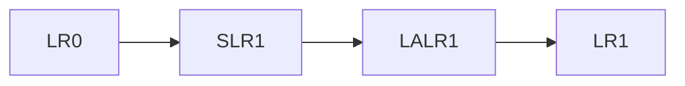

# 4.3 LR分析法

> [!abstract] 核心问题
> 什么是LR分析？LR(0)、SLR(1)、LR(1)、LALR(1)的区别是什么？如何构造LR分析表？

## 一、LR分析的基本概念

### 1. LR的含义

**LR(k)**：

- **L**：从左到右扫描输入串
- **R**：最右推导的逆过程（最左归约）
- **k**：向前看k个token

**特点**：
- 功能强大，能处理大多数程序设计语言的文法
- 分为LR(0)、SLR(1)、LR(1)、LALR(1)

### 2. LR分析的优点

| 优点 | 说明 |
|-----|------|
| **能力强** | 能处理几乎所有CFG |
| **效率高** | 线性时间复杂度 |
| **自动化** | 可以自动生成分析器 |
| **错误处理** | 错误检测及时 |

## 二、LR项目和项目集规范族

### 1. LR项目

**定义**：LR项目是产生式加一个圆点，表示分析过程中的某个状态。

**类型**：

| 类型 | 形式 | 含义 |
|-----|------|------|
| **移进项目** | $A \to \alpha \cdot a \beta$ | 等待移进 $a$ |
| **归约项目** | $A \to \alpha \cdot$ | 准备归约 $A \to \alpha$ |
| **接受项目** | $S' \to S \cdot$ | 分析成功 |

**示例**：

```
产生式：E → E + T
项目：
  E → ·E + T（等待移进E）
  E → E ·+ T（等待移进+）
  E → E + ·T（等待移进T）
  E → E + T ·（准备归约）
```

### 2. 项目集规范族

**定义**：项目集规范族是LR分析器的状态集合，每个状态对应一个项目集。

**构造方法**：

1. **闭包（Closure）**：对于项目集 $I$，将所有可以直接推导出的项目加入 $I$
2. **转移（Goto）**：对于项目集 $I$ 和符号 $X$，计算 $I$ 中所有项目在 $X$ 上的转移

**示例**：

```
产生式：
S' → E
E → E + T | T
T → T * F | F
F → ( E ) | id

项目集规范族：
I0:
  S' → ·E
  E → ·E + T
  E → ·T
  T → ·T * F
  T → ·F
  F → ·( E )
  F → ·id

I1:
  S' → E ·
  E → E ·+ T

I2:
  E → T ·
  T → T ·* F
  ...
```

## 三、LR(0)分析

### 1. LR(0)分析表的构造

**步骤**：

1. 构造项目集规范族
2. 对于每个项目集 $I$：
   - 如果有移进项目 $A \to \alpha \cdot a \beta$，则 $ACTION[I, a] = shift$
   - 如果有归约项目 $A \to \alpha \cdot$，则 $ACTION[I, a] = reduce$（对所有 $a$）
   - 如果有接受项目 $S' \to S \cdot$，则 $ACTION[I, \$] = accept$
   - 对于非终结符 $A$，$GOTO[I, A] = goto(I, A)$

### 2. LR(0)的局限性

**问题**：
- 当一个项目集中同时有移进和归约项目时，会产生冲突
- LR(0)只能处理没有冲突的文法

**示例**：

```
项目集I2:
  E → T ·（归约项目）
  T → T ·* F（移进项目）

冲突：当输入为`*`时，应该移进还是归约？
```

## 四、SLR(1)分析

### 1. SLR(1)的改进

**方法**：
- 对于归约项目 $A \to \alpha \cdot$，只在 $a \in \text{FOLLOW}(A)$ 时才归约
- 这样可以减少冲突

**步骤**：

1. 构造项目集规范族
2. 计算FOLLOW集
3. 对于每个项目集 $I$：
   - 如果有移进项目 $A \to \alpha \cdot a \beta$，则 $ACTION[I, a] = shift$
   - 如果有归约项目 $A \to \alpha \cdot$，则 $ACTION[I, a] = reduce$（仅当 $a \in \text{FOLLOW}(A)$）
   - 如果有接受项目 $S' \to S \cdot$，则 $ACTION[I, \$] = accept$

### 2. SLR(1)与LR(0)的区别

| 对比项 | LR(0) | SLR(1) |
|-------|-------|--------|
| 归约条件 | 无条件归约 | 仅当 $a \in \text{FOLLOW}(A)$ |
| 冲突处理 | 无法处理冲突 | 可以处理部分冲突 |
| 能力 | 较弱 | 较强 |

## 五、LR(1)分析

### 1. LR(1)的改进

**方法**：
- 在项目中加入向前看符号（lookahead）
- 向前看符号精确指示何时应该归约

**LR(1)项目**：

$$[A \to \alpha \cdot \beta, a]$$

其中 $a$ 是向前看符号。

### 2. LR(1)分析表的构造

**步骤**：

1. 构造LR(1)项目集规范族
2. 对于每个项目集 $I$：
   - 如果有移进项目 $[A \to \alpha \cdot a \beta, b]$，则 $ACTION[I, a] = shift$
   - 如果有归约项目 $[A \to \alpha \cdot, a]$，则 $ACTION[I, a] = reduce$
   - 如果有接受项目 $[S' \to S \cdot, \$]$，则 $ACTION[I, \$] = accept$

### 3. LR(1)的优点

| 优点 | 说明 |
|-----|------|
| **能力最强** | 能处理几乎所有CFG |
| **冲突最少** | 向前看符号精确 |
| **错误处理** | 错误检测更准确 |

## 六、LALR(1)分析

### 1. LALR(1)的概念

**定义**：LALR(1)是LR(1)的一种优化，将具有相同核心的LR(1)项目集合并。

**核心**：项目集中的项目去掉向前看符号后的部分。

### 2. LALR(1)的构造

**步骤**：

1. 构造LR(1)项目集规范族
2. 将具有相同核心的项目集合并
3. 构造分析表

### 3. LALR(1)与LR(1)的区别

| 对比项 | LR(1) | LALR(1) |
|-------|-------|---------|
| 项目集数量 | 较多 | 较少（与SLR(1)相同） |
| 能力 | 最强 | 略弱于LR(1) |
| 空间开销 | 较大 | 较小 |
| 冲突处理 | 无假冲突 | 可能有假冲突 |

## 七、四种LR分析方法的对比

### 1. 能力对比



| 方法 | 能力 | 项目集数量 | 空间开销 |
|-----|------|-----------|---------|
| LR(0) | 最弱 | 最少 | 最小 |
| SLR(1) | 较强 | 较少 | 较小 |
| LALR(1) | 强 | 较少 | 较小 |
| LR(1) | 最强 | 最多 | 最大 |

### 2. 应用场景

| 场景 | 推荐方法 |
|-----|---------|
| 简单文法 | LR(0) |
| 大多数程序设计语言 | LALR(1) |
| 复杂语言特性 | LR(1) |
| 教学 | SLR(1) |

> [!warning] 易错点
> LR分析的核心是项目集规范族的构造！项目集构造错误会导致分析表错误，从而导致分析失败。

---

**导航**：上一节 [[4.2-算符优先分析法.md]] · [[MOC - 第4章.md|返回章节导航]]