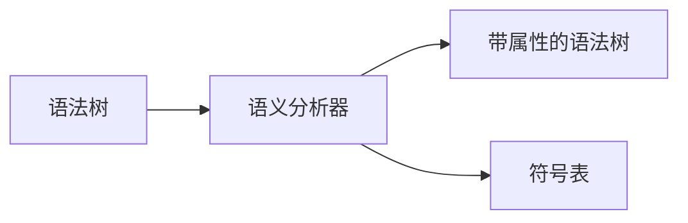
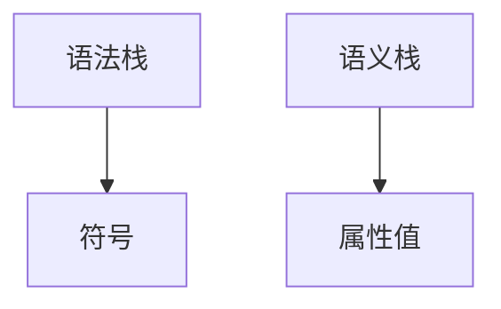
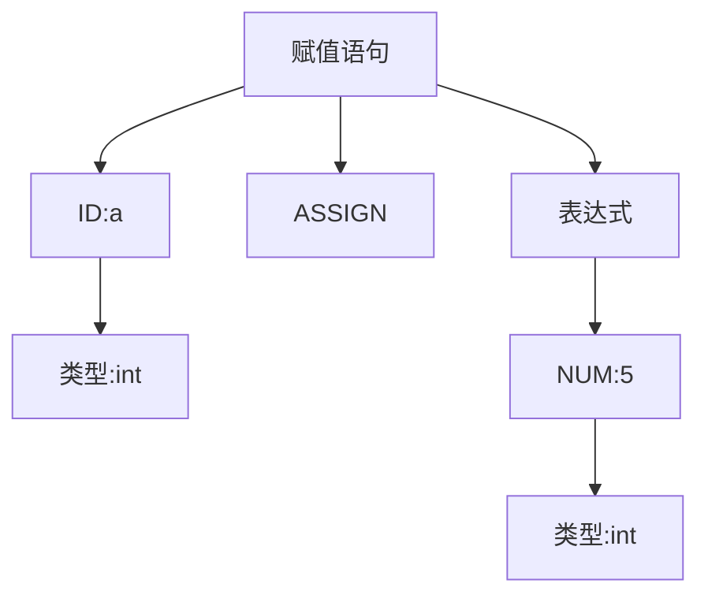

# 5.1 语义分析概述

> [!abstract] 核心问题
> 语义分析的主要任务是什么？语义分析和语法分析的区别是什么？

## 一、语义分析的任务

### 1. 基本任务

**定义**：语义分析是编译的第三个阶段，负责检查程序的语义正确性，并收集语义信息供后续阶段使用。

**示意图**：



### 2. 具体任务

| 任务 | 说明 | 示例 |
|-----|------|------|
| **类型检查** | 检查表达式的类型正确性 | `int + string` 错误 |
| **作用域分析** | 确定标识符的作用域 | 局部变量、全局变量 |
| **上下文相关检查** | 检查上下文相关的约束 | `break`必须在循环内 |
| **语义信息收集** | 收集变量类型、存储位置等信息 | 符号表 |
| **常量折叠** | 编译时计算常量表达式 | `3 + 5` → `8` |

## 二、语义分析与语法分析的区别

### 1. 语法分析

**关注**：程序的结构是否符合语法规则。

**示例**：

```
语法正确但语义错误：
int x;
x = "hello";  // 类型不匹配
```

### 2. 语义分析

**关注**：程序的含义是否正确。

**示例**：

```
语义检查：
int x;
x = "hello";  // 报错：类型不匹配
```

### 3. 区别对比

| 对比项 | 语法分析 | 语义分析 |
|-------|---------|---------|
| 关注内容 | 程序结构 | 程序含义 |
| 检查规则 | 上下文无关文法 | 上下文相关规则 |
| 输出 | 语法树 | 带属性的语法树 |
| 错误类型 | 语法错误 | 语义错误 |

## 三、语义分析的方法

### 1. 属性文法

**定义**：属性文法是在上下文无关文法的基础上，为每个符号添加属性和属性计算规则。

**属性分类**：

| 类型 | 说明 | 示例 |
|-----|------|------|
| **综合属性** | 从子节点计算到父节点 | 表达式的值 |
| **继承属性** | 从父节点传递到子节点 | 符号的作用域 |

### 2. 语法制导翻译

**定义**：语法制导翻译是在语法分析过程中，根据属性文法的规则计算属性值并生成中间代码。

**方法**：

| 方法 | 说明 |
|-----|------|
| **自上而下** | 在递归下降分析中计算属性 |
| **自下而上** | 在LR分析中计算属性 |
| **两遍扫描** | 第一遍分析语法，第二遍计算属性 |

### 3. 语义栈

**定义**：语义栈是在语法分析过程中，用于存储语义信息的栈。

**应用**：



## 四、语义错误的类型

### 1. 类型错误

**定义**：表达式的类型不匹配。

**示例**：

```
int x = 5;
String y = x;  // 类型错误
```

### 2. 作用域错误

**定义**：引用未声明的标识符或在错误的作用域内引用标识符。

**示例**：

```
void f() {
    int x = 10;
}
void g() {
    System.out.println(x);  // 作用域错误：x未在g中声明
}
```

### 3. 声明错误

**定义**：重复声明或声明不符合规则。

**示例**：

```
int x;
int x;  // 声明错误：重复声明
```

### 4. 上下文错误

**定义**：语句使用不符合上下文要求。

**示例**：

```
void f() {
    break;  // 上下文错误：break不在循环内
}
```

## 五、语义分析的输出

### 1. 带属性的语法树

**定义**：在语法树的每个节点上添加语义信息。

**示例**：



### 2. 符号表

**定义**：记录标识符的属性信息。

**示例**：

| 标识符 | 类型 | 作用域 | 存储位置 |
|-------|-----|-------|---------|
| x | int | 全局 | 地址1000 |
| y | String | 局部 | 地址2000 |

### 3. 中间代码

**定义**：与目标机无关的代码表示。

**示例**：

```
四元式：
(+, 5, 3, t1)
(:=, t1, , x)
```

## 六、语义分析的重要性

### 1. 保证程序正确性

**作用**：
- 检测类型错误
- 检测作用域错误
- 检测上下文错误

### 2. 支持代码优化

**作用**：
- 提供类型信息
- 提供常量信息
- 提供数据流信息

### 3. 支持代码生成

**作用**：
- 提供变量类型
- 提供存储位置
- 提供函数签名

> [!warning] 易错点
> 语义分析不仅检查错误，还收集语义信息！这些信息对于后续的代码优化和代码生成至关重要。

---

**导航**：[[MOC - 第5章.md|返回章节导航]] · 下一节 [[5.2-属性文法.md]]