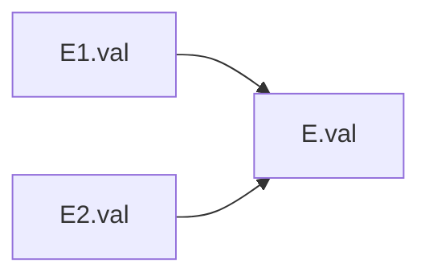

# 5.2 属性文法

> [!abstract] 核心问题
> 什么是属性文法？综合属性和继承属性的区别是什么？如何进行属性求值？

## 一、属性文法的定义

### 1. 基本概念

**定义**：属性文法（Attribute Grammar）是在上下文无关文法的基础上，为每个符号添加属性和语义规则。

**组成**：

| 组成 | 说明 |
|-----|------|
| **上下文无关文法** | 基础文法 |
| **属性** | 每个符号关联的属性 |
| **语义规则** | 属性的计算规则 |

### 2. 属性的分类

**综合属性（Synthesized Attribute）**：

**定义**：综合属性的值由子节点的属性值计算得到。

**特点**：
- 从下往上传递
- 用于表示符号的语义值

**示例**：

```
产生式：E → E1 + E2
语义规则：E.val = E1.val + E2.val
```

**继承属性（Inherited Attribute）**：

**定义**：继承属性的值由父节点或兄弟节点的属性值计算得到。

**特点**：
- 从上往下传递
- 用于表示上下文信息

**示例**：

```
产生式：D → T L
语义规则：L.in = T.type
```

### 3. 属性文法的表示

**示例**：

```
产生式：
  E → E1 + E2
  E → E1 * E2
  E → ( E1 )
  E → id

语义规则：
  E → E1 + E2: E.val = E1.val + E2.val
  E → E1 * E2: E.val = E1.val * E2.val
  E → ( E1 ): E.val = E1.val
  E → id: E.val = lookup(id.name)
```

## 二、属性求值的方法

### 1. 自上而下求值

**方法**：在自上而下语法分析过程中计算属性值。

**适用场景**：
- 递归下降分析
- 主要处理继承属性

**示例**：

```java
void E() {
    E1();
    match('+');
    E2();
    E.val = E1.val + E2.val;
}
```

### 2. 自下而上求值

**方法**：在自下而上语法分析过程中计算属性值。

**适用场景**：
- LR分析
- 主要处理综合属性

**示例**：

```
归约 E → E1 + E2 时：
  E.val = E1.val + E2.val
```

### 3. 两遍扫描

**方法**：第一遍分析语法，第二遍计算属性值。

**适用场景**：
- 需要多次遍历语法树
- 复杂的属性依赖

**示例**：


## 三、S属性文法和L属性文法

### 1. S属性文法

**定义**：只包含综合属性的属性文法。

**特点**：
- 可以在自下而上分析中求值
- 实现简单

**示例**：

```
产生式：
  E → E1 + E2
  E → id

语义规则（都是综合属性）：
  E.val = E1.val + E2.val
  E.val = lookup(id.name)
```

### 2. L属性文法

**定义**：属性的值可以依赖于：
- 该节点的综合属性
- 父节点的继承属性
- 兄弟节点的综合属性（仅限左边的兄弟）

**特点**：
- 可以在自上而下分析中求值
- 比S属性文法更强大

**示例**：

```
产生式：
  D → T L
  T → int
  T → float
  L → id L1
  L → , id L1

语义规则：
  T.type = "int"（综合属性）
  L.in = T.type（继承属性，依赖父节点）
  L1.in = L.in（继承属性，依赖兄弟节点）
```

### 3. 属性依赖图

**定义**：属性依赖图是表示属性之间依赖关系的有向图。

**示例**：



## 四、属性文法的应用

### 1. 表达式求值

**属性文法**：

```
产生式：
  E → E1 + E2
  E → E1 * E2
  E → ( E1 )
  E → id

语义规则：
  E.val = E1.val + E2.val
  E.val = E1.val * E2.val
  E.val = E1.val
  E.val = lookup(id.name)
```

**示例**：

```
输入：id1 + id2 * id3

属性计算：
  id1.val = 10（假设）
  id2.val = 20（假设）
  id3.val = 3（假设）
  E2.val = id2.val * id3.val = 60
  E.val = id1.val + E2.val = 70
```

### 2. 类型检查

**属性文法**：

```
产生式：
  E → E1 + E2
  E → id

语义规则：
  E.type = if E1.type == E2.type then E1.type else error
  E.type = lookup(id.name)
```

**示例**：

```
输入：int + float

类型检查：
  E1.type = int
  E2.type = float
  E.type = error（类型不匹配）
```

### 3. 符号表构建

**属性文法**：

```
产生式：
  D → T L
  T → int
  T → float
  L → id
  L → id , L1

语义规则：
  T.type = "int"
  L.in = T.type
  enter(id.name, L.in)
  L1.in = L.in
```

## 五、属性文法的优缺点

### 1. 优点

| 优点 | 说明 |
|-----|------|
| **形式化** | 语义规则可以形式化描述 |
| **自动化** | 可以自动生成语义分析器 |
| **清晰** | 属性依赖关系清晰 |

### 2. 缺点

| 缺点 | 说明 |
|-----|------|
| **复杂** | 复杂语言的属性文法很复杂 |
| **效率** | 属性求值可能效率较低 |
| **局限性** | 某些语义无法用属性文法表达 |

> [!warning] 易错点
> 综合属性和继承属性的区别！综合属性从下往上传递，继承属性从上往下传递。L属性文法是S属性文法的超集。

---

**导航**：上一节 [[5.1-语义分析概述.md]] · [[MOC - 第5章.md|返回章节导航]] · 下一节 [[5.3-中间代码表示.md]]