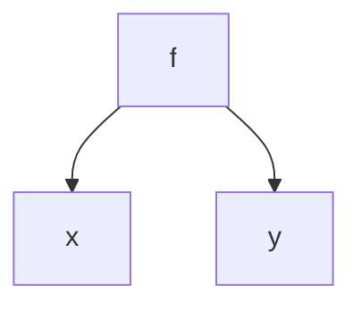

# 6.1 符号表的作用与组织

> [!abstract] 核心问题
> 符号表的主要作用是什么？符号表的组织方式有哪些？

## 一、符号表的作用

### 1. 基本概念

**定义**：符号表是编译器中用于存储标识符信息的数据结构。

**作用**：

| 作用 | 说明 |
|-----|------|
| **存储信息** | 存储变量、函数、类等的属性 |
| **快速查找** | 支持快速查找标识符 |
| **作用域管理** | 管理标识符的作用域 |
| **类型检查** | 提供类型信息进行类型检查 |
| **代码生成** | 提供存储位置信息 |

### 2. 存储的信息

**变量信息**：

| 属性 | 说明 |
|-----|------|
| 名称 | 变量名 |
| 类型 | 变量类型 |
| 作用域 | 变量的作用域 |
| 存储位置 | 变量的存储地址 |
| 初始值 | 变量的初始值 |

**函数信息**：

| 属性 | 说明 |
|-----|------|
| 名称 | 函数名 |
| 返回类型 | 函数返回类型 |
| 参数列表 | 参数类型和名称 |
| 作用域 | 函数的作用域 |
| 存储位置 | 函数的地址 |

**类信息**：

| 属性 | 说明 |
|-----|------|
| 名称 | 类名 |
| 父类 | 父类名称 |
| 成员变量 | 成员变量列表 |
| 成员方法 | 成员方法列表 |

## 二、符号表的组织方式

### 1. 线性表

**结构**：使用数组或链表存储符号。

**优点**：
- 实现简单
- 适合小规模符号表

**缺点**：
- 查找效率低（O(n)）
- 插入效率低

**示例**：

```
符号表：
[0] {name: "x", type: "int", scope: 0}
[1] {name: "y", type: "float", scope: 0}
[2] {name: "f", type: "void", scope: 0}
```

### 2. 哈希表

**结构**：使用哈希函数将符号名映射到数组索引。

**优点**：
- 查找效率高（O(1)平均）
- 插入效率高

**缺点**：
- 需要处理哈希冲突
- 空间开销较大

**示例**：

```
哈希表：
[0] → {name: "x", type: "int"} → null
[1] → {name: "y", type: "float"} → {name: "z", type: "char"}
[2] → null
```

### 3. 树结构

**结构**：使用二叉搜索树或平衡树存储符号。

**优点**：
- 查找效率高（O(log n)）
- 有序遍历

**缺点**：
- 实现复杂
- 需要维护平衡

**示例**：



### 4. 多层符号表

**结构**：为每个作用域维护一个符号表。

**优点**：
- 支持作用域嵌套
- 实现作用域规则

**缺点**：
- 需要处理作用域链

**示例**：

```
作用域0（全局）：
  {name: "x", type: "int"}
  {name: "f", type: "void"}

作用域1（函数f内）：
  {name: "x", type: "float"}  // 局部变量，覆盖全局变量
  {name: "y", type: "char"}
```

### 5. 组织方式对比

| 对比项 | 线性表 | 哈希表 | 树结构 | 多层符号表 |
|-------|-------|-------|-------|-----------|
| 查找效率 | O(n) | O(1) | O(log n) | O(n) |
| 插入效率 | O(n) | O(1) | O(log n) | O(1) |
| 实现难度 | 简单 | 中等 | 复杂 | 中等 |
| 适用场景 | 小规模 | 大规模 | 需要有序 | 作用域嵌套 |

## 三、作用域管理

### 1. 作用域的概念

**定义**：作用域是标识符可见的程序区域。

**类型**：

| 类型 | 说明 | 示例 |
|-----|------|------|
| **全局作用域** | 整个程序可见 | 全局变量 |
| **局部作用域** | 函数或块内可见 | 局部变量 |
| **类作用域** | 类内可见 | 成员变量 |

### 2. 作用域链

**定义**：作用域链是从当前作用域到全局作用域的符号表链。

**查找规则**：


**示例**：

```
查找变量x：
1. 在当前作用域查找
2. 如果找不到，在外层作用域查找
3. 如果找不到，在全局作用域查找
4. 如果找不到，报错
```

### 3. 作用域规则

**规则**：

| 规则 | 说明 |
|-----|------|
| **局部优先** | 局部变量覆盖全局变量 |
| **嵌套可见** | 内层作用域可以访问外层作用域的变量 |
| **同名覆盖** | 同名变量在不同作用域可以共存 |

## 四、符号表的操作

### 1. 插入

**操作**：将新符号插入符号表。

**步骤**：

1. 检查符号是否已存在
2. 如果存在，报告错误或覆盖
3. 如果不存在，插入符号

**示例**：

```java
void insert(String name, String type, int scope) {
    Symbol symbol = new Symbol(name, type, scope);
    symbolTable.put(name, symbol);
}
```

### 2. 查找

**操作**：根据名称查找符号。

**步骤**：

1. 在当前作用域查找
2. 如果找不到，在外层作用域查找
3. 如果找不到，返回null

**示例**：

```java
Symbol lookup(String name) {
    for (int i = currentScope; i >= 0; i--) {
        Symbol symbol = symbolTable[i].get(name);
        if (symbol != null) {
            return symbol;
        }
    }
    return null;
}
```

### 3. 删除

**操作**：删除符号。

**步骤**：

1. 找到符号
2. 删除符号

**示例**：

```java
void delete(String name) {
    symbolTable.remove(name);
}
```

### 4. 更新

**操作**：更新符号的属性。

**步骤**：

1. 找到符号
2. 更新属性

**示例**：

```java
void update(String name, String type) {
    Symbol symbol = symbolTable.get(name);
    if (symbol != null) {
        symbol.setType(type);
    }
}
```

## 五、符号表的实现

### 1. 线性符号表

**实现**：

```java
class LinearSymbolTable {
    private List<Symbol> symbols = new ArrayList<>();
    
    public void insert(Symbol symbol) {
        symbols.add(symbol);
    }
    
    public Symbol lookup(String name) {
        for (Symbol symbol : symbols) {
            if (symbol.getName().equals(name)) {
                return symbol;
            }
        }
        return null;
    }
}
```

### 2. 哈希符号表

**实现**：

```java
class HashSymbolTable {
    private Map<String, Symbol> symbols = new HashMap<>();
    
    public void insert(Symbol symbol) {
        symbols.put(symbol.getName(), symbol);
    }
    
    public Symbol lookup(String name) {
        return symbols.get(name);
    }
}
```

### 3. 多层符号表

**实现**：

```java
class MultiScopeSymbolTable {
    private List<Map<String, Symbol>> scopes = new ArrayList<>();
    
    public void enterScope() {
        scopes.add(new HashMap<>());
    }
    
    public void exitScope() {
        scopes.remove(scopes.size() - 1);
    }
    
    public void insert(Symbol symbol) {
        scopes.get(scopes.size() - 1).put(symbol.getName(), symbol);
    }
    
    public Symbol lookup(String name) {
        for (int i = scopes.size() - 1; i >= 0; i--) {
            Symbol symbol = scopes.get(i).get(name);
            if (symbol != null) {
                return symbol;
            }
        }
        return null;
    }
}
```

> [!warning] 易错点
> 符号表不仅存储信息，还管理作用域！作用域链的查找顺序是从内到外，局部变量优先于全局变量。

---

**导航**：[[MOC - 第6章.md|返回章节导航]] · 下一节 [[6.2-类型系统.md]]