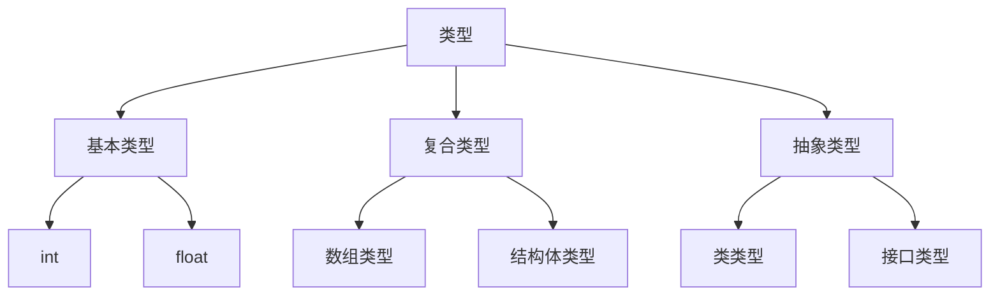

# 6.2 类型系统

> [!abstract] 核心问题
> 类型的分类有哪些？什么是结构等价和名字等价？类型系统的作用是什么？

## 一、类型的分类

### 1. 基本类型

**定义**：基本类型是语言内置的类型。

**示例**：

| 语言 | 基本类型 |
|-----|---------|
| C/C++ | int, float, double, char, bool |
| Java | int, float, double, char, boolean |
| Python | int, float, str, bool |

**特点**：

| 特点 | 说明 |
|-----|------|
| **固定大小** | 大小由语言定义 |
| **内置操作** | 支持基本运算 |
| **不可再分** | 不能分解为更小的类型 |

### 2. 复合类型

**定义**：复合类型是由基本类型或其他复合类型构成的类型。

**分类**：

| 类型 | 说明 | 示例 |
|-----|------|------|
| **数组类型** | 相同类型的元素序列 | int[] |
| **结构体类型** | 不同类型的元素集合 | struct Point { int x; int y; } |
| **联合类型** | 共享存储空间的类型 | union { int i; float f; } |
| **指针类型** | 指向其他类型的指针 | int* |
| **函数类型** | 函数的类型 | int (*)(int, int) |

### 3. 抽象类型

**定义**：抽象类型是隐藏实现细节的类型。

**分类**：

| 类型 | 说明 | 示例 |
|-----|------|------|
| **类类型** | 面向对象语言中的类 | class Point { ... } |
| **接口类型** | 定义方法签名的类型 | interface Shape { ... } |
| **泛型类型** | 参数化的类型 | List\<T\> |

### 4. 类型层次结构



## 二、类型等价规则

### 1. 结构等价（Structural Equivalence）

**定义**：两个类型等价，如果它们的结构相同。

**规则**：

| 规则 | 说明 |
|-----|------|
| **基本类型** | 相同名称的基本类型等价 |
| **数组类型** | 元素类型和长度都相同 |
| **结构体类型** | 字段类型和顺序都相同 |
| **函数类型** | 参数类型和返回类型都相同 |

**示例**：

```
struct Point1 { int x; int y; }
struct Point2 { int x; int y; }

Point1 和 Point2 结构等价
```

### 2. 名字等价（Name Equivalence）

**定义**：两个类型等价，如果它们的名称相同。

**规则**：

| 规则 | 说明 |
|-----|------|
| **类型别名** | 不同名称的类型不等价 |
| **类型声明** | 相同名称的类型等价 |

**示例**：

```
typedef int Length;
typedef int Width;

Length 和 Width 名字不等价（虽然都是int）
```

### 3. 等价规则对比

| 对比项 | 结构等价 | 名字等价 |
|-------|---------|---------|
| 判断标准 | 结构相同 | 名称相同 |
| 灵活性 | 高 | 低 |
| 安全性 | 低 | 高 |
| 适用语言 | C | Pascal, Java |

## 三、类型系统的作用

### 1. 类型检查

**作用**：
- 检测类型错误
- 保证程序正确性

**示例**：

```
int x = 5;
String y = x;  // 类型错误
```

### 2. 类型推断

**作用**：
- 自动推断表达式的类型
- 减少类型标注

**示例**：

```
// Java 10+
var x = 5;  // 推断为int
var y = "hello";  // 推断为String
```

### 3. 类型转换

**作用**：
- 显式或隐式转换类型
- 保证类型兼容性

**示例**：

```
// 隐式转换（向上转换）
int x = 5;
double y = x;  // 自动转换

// 显式转换（向下转换）
double a = 3.14;
int b = (int) a;  // 强制转换
```

### 4. 类型安全

**作用**：
- 防止类型错误
- 保证内存安全

**示例**：

```
// Java类型安全
String s = "hello";
int i = s.length();  // 正确
int j = s + 5;  // 编译错误
```

## 四、类型系统的设计

### 1. 强类型与弱类型

**强类型语言**：

**定义**：类型检查严格，不允许隐式类型转换。

**示例**：Java, Python

**特点**：

| 特点 | 说明 |
|-----|------|
| **类型安全** | 类型错误在编译时检测 |
| **可读性** | 代码清晰 |
| **灵活性** | 较低 |

**弱类型语言**：

**定义**：类型检查宽松，允许隐式类型转换。

**示例**：JavaScript, Perl

**特点**：

| 特点 | 说明 |
|-----|------|
| **灵活性** | 高 |
| **简洁性** | 代码简洁 |
| **安全性** | 较低 |

### 2. 静态类型与动态类型

**静态类型语言**：

**定义**：类型在编译时确定。

**示例**：Java, C++

**特点**：

| 特点 | 说明 |
|-----|------|
| **类型检查** | 编译时检查 |
| **性能** | 较好 |
| **灵活性** | 较低 |

**动态类型语言**：

**定义**：类型在运行时确定。

**示例**：Python, JavaScript

**特点**：

| 特点 | 说明 |
|-----|------|
| **类型检查** | 运行时检查 |
| **灵活性** | 高 |
| **性能** | 较低 |

### 3. 类型系统对比

| 对比项 | 强静态类型 | 弱动态类型 |
|-------|-----------|-----------|
| 类型检查 | 编译时严格检查 | 运行时宽松检查 |
| 类型安全 | 高 | 低 |
| 灵活性 | 低 | 高 |
| 性能 | 高 | 低 |
| 示例 | Java, C++ | JavaScript, Python |

## 五、类型系统的应用

### 1. 编译器设计

**作用**：
- 类型检查
- 类型推断
- 代码生成

**示例**：

```java
// 类型检查
int x = 5;
x = "hello";  // 编译错误

// 类型推断
var list = new ArrayList<String>();
```

### 2. 程序分析

**作用**：
- 静态分析
- 数据流分析
- 优化

**示例**：

```
// 常量传播
int x = 5;
int y = x + 3;  // 优化为 y = 8
```

### 3. 软件安全

**作用**：
- 防止缓冲区溢出
- 防止类型混淆
- 防止代码注入

**示例**：

```
// Java类型安全
String s = input();
int i = Integer.parseInt(s);  // 必须显式转换
```

> [!warning] 易错点
> 结构等价和名字等价的区别！结构等价根据类型的结构判断，名字等价根据类型的名称判断。大多数现代语言使用名字等价。

---

**导航**：上一节 [[6.1-符号表的作用与组织.md]] · [[MOC - 第6章.md|返回章节导航]] · 下一节 [[6.3-类型检查算法.md]]