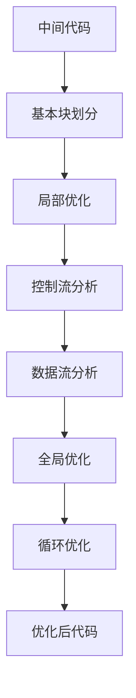
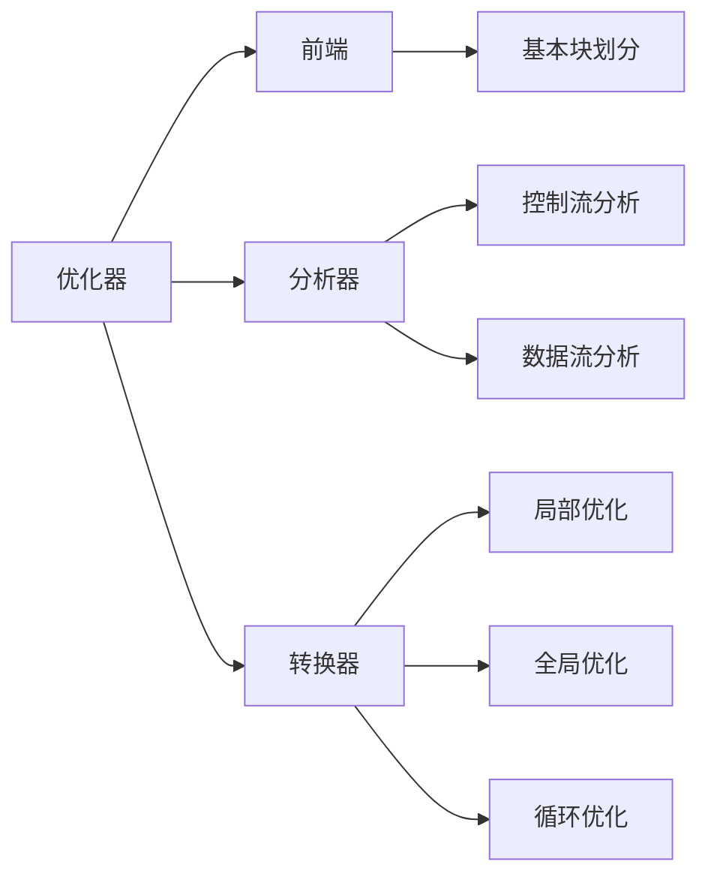

# 7.1 代码优化概述

> [!abstract] 核心问题
> 代码优化的目标是什么？优化的分类有哪些？为什么需要代码优化？

## 一、代码优化的目标

### 1. 基本概念

**定义**：代码优化是在不改变程序语义的前提下，提高程序性能或减少程序占用空间的过程。

**目标**：

| 目标 | 说明 |
|-----|------|
| **提高效率** | 减少执行时间 |
| **减少空间** | 减少内存占用 |
| **降低功耗** | 减少能源消耗 |
| **提高可靠性** | 减少错误概率 |

### 2. 优化的基本原则

**原则**：

| 原则 | 说明 |
|-----|------|
| **正确性** | 优化后程序的语义不变 |
| **有效性** | 优化确实能提高性能 |
| **可移植性** | 优化不依赖特定机器 |
| **可维护性** | 优化后的代码易于维护 |

### 3. 优化的约束条件

**约束**：

| 约束 | 说明 |
|-----|------|
| **时间约束** | 编译时间不能过长 |
| **空间约束** | 优化过程占用空间有限 |
| **复杂度约束** | 优化算法复杂度不能太高 |

## 二、代码优化的分类

### 1. 按优化阶段分类

**编译时优化**：

**定义**：在编译阶段进行的优化。

**示例**：
- 常量折叠
- 公共子表达式消除
- 循环优化

**链接时优化**：

**定义**：在链接阶段进行的优化。

**示例**：
- 跨模块优化
- 符号解析优化

**运行时优化**：

**定义**：在运行阶段进行的优化。

**示例**：
- JIT编译
- 动态优化

### 2. 按优化范围分类

**局部优化**：

**定义**：在基本块内进行的优化。

**示例**：
- 常量折叠
- 常量传播
- 死代码消除

**全局优化**：

**定义**：跨基本块进行的优化。

**示例**：
- 公共子表达式消除
- 数据流分析
- 全局常量传播

**循环优化**：

**定义**：针对循环进行的优化。

**示例**：
- 循环不变式外提
- 强度削弱
- 归纳变量消除

### 3. 按优化技术分类

**表达式优化**：

**定义**：优化表达式的计算。

**示例**：
- 常量折叠
- 公共子表达式消除

**控制流优化**：

**定义**：优化控制流结构。

**示例**：
- 死代码消除
- 循环展开

**数据流优化**：

**定义**：基于数据流分析的优化。

**示例**：
- 常量传播
- 可用表达式分析

### 4. 优化分类对比

| 分类 | 范围 | 技术 | 复杂度 |
|-----|------|------|-------|
| 局部优化 | 基本块内 | 常量折叠、常量传播 | 低 |
| 全局优化 | 跨基本块 | 公共子表达式消除 | 中 |
| 循环优化 | 循环内 | 循环不变式外提 | 高 |

## 三、代码优化的重要性

### 1. 提高程序性能

**作用**：
- 减少执行时间
- 提高响应速度

**示例**：

```
优化前：
int x = 5 + 3;  // 运行时计算

优化后：
int x = 8;  // 编译时计算
```

### 2. 减少内存占用

**作用**：
- 减少变量数量
- 优化数据结构

**示例**：

```
优化前：
int a = 10;
int b = 20;
int c = a + b;

优化后：
int c = 30;  // 消除中间变量
```

### 3. 降低能源消耗

**作用**：
- 减少计算量
- 降低功耗

**示例**：

```
优化前：
for (int i = 0; i < 1000000; i++) {
    x = x + 1;
}

优化后：
x = x + 1000000;  // 循环展开
```

### 4. 提高代码质量

**作用**：
- 消除冗余代码
- 提高代码可读性

**示例**：

```
优化前：
if (x > 0) {
    return true;
} else {
    return false;
}

优化后：
return x > 0;  // 简化代码
```

## 四、代码优化的流程

### 1. 优化流程



### 2. 优化步骤

**步骤**：

| 步骤 | 说明 |
|-----|------|
| **基本块划分** | 将中间代码划分为基本块 |
| **局部优化** | 在基本块内进行优化 |
| **控制流分析** | 分析基本块之间的控制流 |
| **数据流分析** | 分析数据的流动和依赖 |
| **全局优化** | 跨基本块进行优化 |
| **循环优化** | 针对循环进行优化 |

### 3. 优化器的结构



## 五、代码优化的挑战

### 1. 正确性保证

**挑战**：
- 确保优化后语义不变
- 处理复杂的依赖关系

### 2. 优化效果评估

**挑战**：
- 评估优化的实际效果
- 避免过度优化

### 3. 编译时间控制

**挑战**：
- 优化算法复杂度高
- 编译时间过长

### 4. 跨语言优化

**挑战**：
- 不同语言的特性差异
- 统一的优化策略

> [!warning] 易错点
> 代码优化不能改变程序的语义！优化的基本原则是正确性优先，效率其次。

---

**导航**：[[MOC - 第7章.md|返回章节导航]] · 下一节 [[7.2-局部优化.md]]