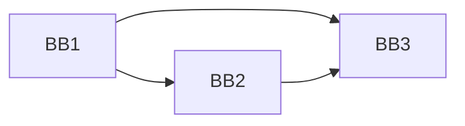

# 7.2 局部优化

> [!abstract] 核心问题
> 什么是基本块？局部优化技术有哪些？如何实现这些优化？

## 一、基本块的概念

### 1. 基本块的定义

**定义**：基本块是一段顺序执行的语句序列，其中只有一个入口和一个出口。

**特点**：

| 特点 | 说明 |
|-----|------|
| **单一入口** | 只有第一条语句可以被跳转到 |
| **单一出口** | 只有最后一条语句可以跳转出去 |
| **顺序执行** | 所有语句按顺序执行 |

### 2. 基本块的划分

**划分规则**：

| 规则 | 说明 |
|-----|------|
| **入口语句** | 程序的第一条语句或跳转语句的目标 |
| **出口语句** | 跳转语句或程序的最后一条语句 |
| **划分方法** | 将入口语句到下一个入口语句之间的语句作为一个基本块 |

**示例**：

```
代码：
(1) x = a + b
(2) y = x * c
(3) if y > 0 goto (5)
(4) z = 0
(5) w = z + 1

基本块：
BB1: (1), (2), (3)
BB2: (4)
BB3: (5)
```

### 3. 基本块的表示

**三地址码表示**：

```
BB1:
t1 = a + b
t2 = t1 * c
if t2 > 0 goto BB3

BB2:
t3 = 0

BB3:
t4 = t3 + 1
```

**流图表示**：



## 二、局部优化技术

### 1. 常量折叠（Constant Folding）

**定义**：编译时计算常量表达式的值。

**示例**：

```
优化前：
x = 5 + 3
y = 2 * 4

优化后：
x = 8
y = 8
```

**实现**：

```java
Value foldConstants(BinaryOperation op) {
    if (op.getLeft() instanceof Constant && op.getRight() instanceof Constant) {
        Constant left = (Constant) op.getLeft();
        Constant right = (Constant) op.getRight();
        return evaluate(op.getOperator(), left.getValue(), right.getValue());
    }
    return op;
}
```

### 2. 常量传播（Constant Propagation）

**定义**：用常量替换变量。

**示例**：

```
优化前：
x = 5
y = x + 3

优化后：
x = 5
y = 8  // x被替换为5
```

**实现**：

```java
Expression propagateConstants(Expression expr, Map<String, Constant> constants) {
    if (expr instanceof Variable) {
        String name = ((Variable) expr).getName();
        if (constants.containsKey(name)) {
            return constants.get(name);
        }
    }
    return expr;
}
```

### 3. 死代码消除（Dead Code Elimination）

**定义**：删除永远不会执行的代码。

**示例**：

```
优化前：
x = 5
if (false) {
    y = 3
}

优化后：
x = 5  // 删除if语句
```

**实现**：

```java
List<Statement> eliminateDeadCode(List<Statement> statements) {
    List<Statement> result = new ArrayList<>();
    for (Statement stmt : statements) {
        if (isReachable(stmt)) {
            result.add(stmt);
        }
    }
    return result;
}
```

### 4. 公共子表达式消除（Common Subexpression Elimination）

**定义**：避免重复计算相同的表达式。

**示例**：

```
优化前：
x = a + b
y = a + b

优化后：
t1 = a + b
x = t1
y = t1  // 复用t1
```

**实现**：

```java
Expression eliminateCommonSubexpressions(Expression expr, Map<Expression, Variable> expressions) {
    if (expressions.containsKey(expr)) {
        return expressions.get(expr);
    }
    expressions.put(expr, newTemp());
    return expr;
}
```

### 5. 代数化简（Algebraic Simplification）

**定义**：使用代数规则简化表达式。

**示例**：

```
优化前：
x = a * 0
y = a + 0
z = a - a

优化后：
x = 0  // 任何数乘以0等于0
y = a  // 任何数加0等于本身
z = 0  // 任何数减本身等于0
```

**实现**：

```java
Expression simplifyAlgebraically(BinaryOperation op) {
    if (op.getOperator() == MULTIPLY && isZero(op.getRight())) {
        return new Constant(0);
    }
    if (op.getOperator() == ADD && isZero(op.getRight())) {
        return op.getLeft();
    }
    // 其他代数规则
    return op;
}
```

### 6. 拷贝传播（Copy Propagation）

**定义**：用变量的值替换变量的引用。

**示例**：

```
优化前：
x = y
z = x + 1

优化后：
z = y + 1  // x被替换为y
```

**实现**：

```java
Expression propagateCopies(Expression expr, Map<String, String> copies) {
    if (expr instanceof Variable) {
        String name = ((Variable) expr).getName();
        while (copies.containsKey(name)) {
            name = copies.get(name);
        }
        return new Variable(name);
    }
    return expr;
}
```

## 三、局部优化的实现

### 1. 优化算法

**步骤**：

1. 划分基本块
2. 对每个基本块进行优化
3. 重复优化直到没有更多优化

**示例**：

```java
List<BasicBlock> optimize(List<BasicBlock> blocks) {
    boolean changed = true;
    while (changed) {
        changed = false;
        for (BasicBlock block : blocks) {
            changed |= optimizeBlock(block);
        }
    }
    return blocks;
}
```

### 2. 优化顺序

**顺序**：

| 顺序 | 说明 |
|-----|------|
| **常量折叠** | 先计算常量表达式 |
| **常量传播** | 再传播常量值 |
| **公共子表达式消除** | 消除重复计算 |
| **拷贝传播** | 传播拷贝值 |
| **死代码消除** | 最后删除死代码 |

### 3. 优化示例

**示例**：

```
优化前：
x = 5 + 3
y = x * 2
z = x + y

优化过程：
1. 常量折叠：x = 8
2. 常量传播：y = 8 * 2 = 16, z = 8 + y
3. 常量折叠：y = 16
4. 常量传播：z = 8 + 16 = 24
5. 常量折叠：z = 24

优化后：
x = 8
y = 16
z = 24
```

## 四、局部优化的效果

### 1. 性能提升

**效果**：
- 减少计算量
- 提高执行速度

**示例**：

```
优化前：需要3次加法和1次乘法
优化后：直接使用常量，不需要计算
```

### 2. 代码简化

**效果**：
- 减少变量数量
- 简化表达式

**示例**：

```
优化前：5 + 3 * 2
优化后：11
```

### 3. 空间节省

**效果**：
- 减少临时变量
- 降低内存占用

**示例**：

```
优化前：使用多个临时变量
优化后：使用常量，不需要临时变量
```

> [!warning] 易错点
> 局部优化只在基本块内进行！跨基本块的优化需要使用全局优化技术。

---

**导航**：上一节 [[7.1-代码优化概述.md]] · [[MOC - 第7章.md|返回章节导航]] · 下一节 [[7.3-全局优化.md]]