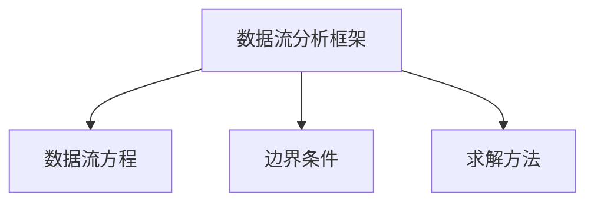

# 7.3 全局优化

> [!abstract] 核心问题
> 全局优化的技术有哪些？如何进行数据流分析？循环优化的方法是什么？

## 一、全局优化的概念

### 1. 全局优化的定义

**定义**：全局优化是跨基本块进行的优化。

**特点**：

| 特点 | 说明 |
|-----|------|
| **跨基本块** | 优化涉及多个基本块 |
| **需要分析** | 需要进行控制流和数据流分析 |
| **复杂度高** | 优化算法复杂度较高 |

### 2. 全局优化的目标

**目标**：

| 目标 | 说明 |
|-----|------|
| **消除冗余** | 消除跨基本块的冗余计算 |
| **优化控制流** | 优化基本块之间的跳转 |
| **提高效率** | 提高整个程序的效率 |

### 3. 全局优化的挑战

**挑战**：

| 挑战 | 说明 |
|-----|------|
| **数据依赖** | 需要处理跨基本块的数据依赖 |
| **控制流复杂** | 控制流可能很复杂 |
| **分析难度大** | 数据流分析难度较大 |

## 二、数据流分析

### 1. 数据流分析的概念

**定义**：数据流分析是分析程序中数据流动和依赖关系的过程。

**目的**：

| 目的 | 说明 |
|-----|------|
| **收集信息** | 收集变量的使用和定义信息 |
| **检测优化机会** | 检测全局优化的机会 |
| **保证正确性** | 保证优化的正确性 |

### 2. 数据流分析的类型

**到达定义分析（Reaching Definitions）**：

**定义**：分析变量的定义是否到达某个点。

**应用**：
- 常量传播
- 无用赋值消除

**可用表达式分析（Available Expressions）**：

**定义**：分析表达式是否在某个点可用。

**应用**：
- 公共子表达式消除

**活跃变量分析（Live Variable Analysis）**：

**定义**：分析变量在某个点之后是否被使用。

**应用**：
- 寄存器分配
- 死代码消除

### 3. 数据流分析的框架

**框架**：



**数据流方程**：

| 方程类型 | 说明 |
|---------|------|
| **正向分析** | 从程序入口向出口分析 |
| **反向分析** | 从程序出口向入口分析 |

**求解方法**：

| 方法 | 说明 |
|-----|------|
| **迭代法** | 迭代求解直到收敛 |
| **不动点算法** | 使用不动点定理求解 |

## 三、全局优化技术

### 1. 全局公共子表达式消除

**定义**：消除跨基本块的公共子表达式。

**示例**：

```
基本块1：
t1 = a + b
x = t1

基本块2：
t2 = a + b  // 与基本块1的t1相同
y = t2

优化后：
基本块1：
t1 = a + b
x = t1

基本块2：
y = t1  // 复用基本块1的t1
```

**实现**：

```java
void eliminateGlobalCommonSubexpressions(List<BasicBlock> blocks) {
    Map<Expression, Variable> expressions = new HashMap<>();
    for (BasicBlock block : blocks) {
        for (Statement stmt : block.getStatements()) {
            if (stmt instanceof Assignment) {
                Expression expr = ((Assignment) stmt).getRight();
                if (expressions.containsKey(expr)) {
                    stmt.setRight(expressions.get(expr));
                } else {
                    expressions.put(expr, ((Assignment) stmt).getLeft());
                }
            }
        }
    }
}
```

### 2. 全局常量传播

**定义**：跨基本块传播常量值。

**示例**：

```
基本块1：
x = 5

基本块2：
y = x + 3  // x的值是5

优化后：
基本块1：
x = 5

基本块2：
y = 8  // x被替换为5
```

**实现**：

```java
void propagateGlobalConstants(List<BasicBlock> blocks) {
    Map<String, Constant> constants = new HashMap<>();
    boolean changed = true;
    while (changed) {
        changed = false;
        for (BasicBlock block : blocks) {
            for (Statement stmt : block.getStatements()) {
                if (stmt instanceof Assignment) {
                    Variable left = ((Assignment) stmt).getLeft();
                    Expression right = ((Assignment) stmt).getRight();
                    Constant value = evaluateConstant(right, constants);
                    if (value != null) {
                        constants.put(left.getName(), value);
                        changed = true;
                    }
                }
            }
        }
    }
}
```

### 3. 全局死代码消除

**定义**：删除跨基本块的死代码。

**示例**：

```
基本块1：
x = 5

基本块2：
// x从未被使用

优化后：
基本块1：
// 删除x = 5

基本块2：
// 保持不变
```

**实现**：

```java
void eliminateGlobalDeadCode(List<BasicBlock> blocks) {
    Set<String> liveVariables = findLiveVariables(blocks);
    for (BasicBlock block : blocks) {
        List<Statement> statements = new ArrayList<>();
        for (Statement stmt : block.getStatements()) {
            if (stmt instanceof Assignment) {
                Variable left = ((Assignment) stmt).getLeft();
                if (liveVariables.contains(left.getName())) {
                    statements.add(stmt);
                }
            } else {
                statements.add(stmt);
            }
        }
        block.setStatements(statements);
    }
}
```

## 四、循环优化

### 1. 循环优化的概念

**定义**：循环优化是针对循环进行的优化。

**重要性**：

| 原因 | 说明 |
|-----|------|
| **循环执行次数多** | 循环可能执行成千上万次 |
| **优化效果显著** | 循环优化能显著提高性能 |
| **优化机会多** | 循环内有很多优化机会 |

### 2. 循环优化技术

**循环不变式外提（Loop Invariant Code Motion）**：

**定义**：将循环内不变的表达式移到循环外。

**示例**：

```
优化前：
for (int i = 0; i < n; i++) {
    x = a + b;  // a和b在循环内不变
    y = x * i;
}

优化后：
x = a + b;  // 移到循环外
for (int i = 0; i < n; i++) {
    y = x * i;
}
```

**强度削弱（Strength Reduction）**：

**定义**：将强度高的运算替换为强度低的运算。

**示例**：

```
优化前：
for (int i = 0; i < n; i++) {
    y = i * 4;  // 乘法
}

优化后：
for (int i = 0; i < n; i++) {
    y = i << 2;  // 移位运算，比乘法快
}
```

**归纳变量消除（Induction Variable Elimination）**：

**定义**：消除循环中的归纳变量。

**示例**：

```
优化前：
for (int i = 0; i < n; i++) {
    x = i * 2;
    y = x + 1;
}

优化后：
x = 0;
for (int i = 0; i < n; i++) {
    y = x + 1;
    x = x + 2;  // 消除乘法
}
```

### 3. 循环优化的实现

**步骤**：

1. 识别循环
2. 分析循环内的表达式
3. 应用循环优化技术
4. 重复优化直到没有更多优化

**示例**：

```java
void optimizeLoops(List<BasicBlock> blocks) {
    List<Loop> loops = findLoops(blocks);
    for (Loop loop : loops) {
        moveInvariants(loop);
        reduceStrength(loop);
        eliminateInductionVariables(loop);
    }
}
```

## 五、全局优化的效果

### 1. 性能提升

**效果**：
- 减少循环内的计算量
- 提高整体效率

**示例**：

```
优化前：循环内每次都计算a + b
优化后：a + b只计算一次
```

### 2. 代码质量提升

**效果**：
- 消除冗余代码
- 简化控制流

**示例**：

```
优化前：多个基本块重复计算相同表达式
优化后：表达式只计算一次
```

### 3. 空间节省

**效果**：
- 减少临时变量
- 优化寄存器分配

**示例**：

```
优化前：使用多个临时变量
优化后：复用临时变量
```

> [!warning] 易错点
> 循环优化需要小心处理依赖关系！移到循环外的表达式必须在循环内保持不变。

---

**导航**：上一节 [[7.2-局部优化.md]] · [[MOC - 第7章.md|返回章节导航]]