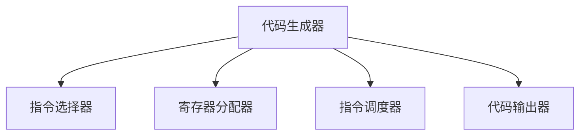

# 8.1 目标代码生成概述

> [!abstract] 核心问题
> 目标代码生成的任务是什么？目标代码的形式有哪些？代码生成器的设计原则是什么？

## 一、目标代码生成的任务

### 1. 基本概念

**定义**：目标代码生成是编译的最后一个阶段，负责将优化后的中间代码转换为目标机代码。

**任务**：

| 任务 | 说明 |
|-----|------|
| **指令选择** | 选择合适的目标机指令 |
| **寄存器分配** | 分配寄存器给变量 |
| **指令调度** | 安排指令的执行顺序 |
| **代码生成** | 生成最终的目标代码 |

### 2. 代码生成器的输入

**输入**：

| 输入 | 说明 |
|-----|------|
| **中间代码** | 优化后的中间代码 |
| **符号表** | 变量的类型和存储位置 |
| **目标机信息** | 目标机的指令集和寄存器 |

### 3. 代码生成器的输出

**输出**：

| 输出 | 说明 |
|-----|------|
| **目标代码** | 机器码、汇编代码或字节码 |
| **调试信息** | 用于调试的信息 |
| **符号表** | 用于链接的符号表 |

## 二、目标代码的形式

### 1. 机器码（Machine Code）

**定义**：机器码是直接由CPU执行的二进制代码。

**特点**：

| 特点 | 说明 |
|-----|------|
| **效率高** | 直接由CPU执行 |
| **不可移植** | 依赖特定CPU |
| **不可读** | 二进制形式，人类不可读 |

**示例**：

```
机器码：
10110100 00000001 00000010 00000000
```

### 2. 汇编代码（Assembly Code）

**定义**：汇编代码是机器码的文本表示。

**特点**：

| 特点 | 说明 |
|-----|------|
| **可读性好** | 使用助记符 |
| **接近机器码** | 与机器码一一对应 |
| **需要汇编** | 需要汇编器转换为机器码 |

**示例**：

```
汇编代码：
MOV AX, 1
ADD AX, 2
```

### 3. 字节码（Bytecode）

**定义**：字节码是一种中间格式，由虚拟机执行。

**特点**：

| 特点 | 说明 |
|-----|------|
| **可移植** | 不依赖特定CPU |
| **需要解释** | 需要虚拟机解释执行 |
| **效率中等** | 介于机器码和解释执行之间 |

**示例**：

```
Java字节码：
0x10 0x01  // bipush 1
0x60       // pop
```

### 4. 目标代码形式对比

| 对比项 | 机器码 | 汇编代码 | 字节码 |
|-------|-------|---------|-------|
| 可读性 | 差 | 好 | 中等 |
| 效率 | 高 | 高 | 中等 |
| 可移植性 | 差 | 差 | 好 |
| 生成难度 | 高 | 中等 | 中等 |

## 三、代码生成器的设计原则

### 1. 正确性

**原则**：生成的目标代码必须与源程序语义一致。

**措施**：

| 措施 | 说明 |
|-----|------|
| **语义保持** | 确保优化不改变语义 |
| **测试验证** | 进行充分的测试 |
| **形式化验证** | 使用形式化方法验证 |

### 2. 效率

**原则**：生成的目标代码必须高效。

**措施**：

| 措施 | 说明 |
|-----|------|
| **指令选择** | 选择高效的指令 |
| **寄存器分配** | 合理分配寄存器 |
| **指令调度** | 优化指令顺序 |

### 3. 可移植性

**原则**：代码生成器应尽可能可移植。

**措施**：

| 措施 | 说明 |
|-----|------|
| **中间表示** | 使用与目标机无关的中间表示 |
| **目标机描述** | 使用目标机描述文件 |
| **模块化设计** | 将目标机相关部分模块化 |

### 4. 可维护性

**原则**：代码生成器应易于维护。

**措施**：

| 措施 | 说明 |
|-----|------|
| **清晰结构** | 使用清晰的代码结构 |
| **文档完善** | 提供完善的文档 |
| **模块化设计** | 将功能模块化 |

## 四、代码生成器的结构

### 1. 代码生成器的组成

**组成**：



**各组件功能**：

| 组件 | 功能 |
|-----|------|
| **指令选择器** | 选择合适的目标机指令 |
| **寄存器分配器** | 分配寄存器给变量 |
| **指令调度器** | 安排指令的执行顺序 |
| **代码输出器** | 输出目标代码 |

### 2. 代码生成的流程

**流程**：


**步骤**：

| 步骤 | 说明 |
|-----|------|
| **指令选择** | 将中间代码映射到目标机指令 |
| **寄存器分配** | 为变量分配寄存器 |
| **指令调度** | 优化指令顺序，提高流水线效率 |
| **代码输出** | 输出最终的目标代码 |

### 3. 代码生成器的实现

**实现方法**：

| 方法 | 说明 |
|-----|------|
| **模板匹配** | 使用模板匹配选择指令 |
| **树遍历** | 遍历语法树生成代码 |
| **图着色** | 使用图着色进行寄存器分配 |
| **线性扫描** | 使用线性扫描进行寄存器分配 |

## 五、代码生成的质量评估

### 1. 评估指标

**指标**：

| 指标 | 说明 |
|-----|------|
| **执行时间** | 代码的执行时间 |
| **代码大小** | 生成代码的大小 |
| **寄存器使用** | 寄存器的使用效率 |
| **指令数量** | 生成的指令数量 |

### 2. 评估方法

**方法**：

| 方法 | 说明 |
|-----|------|
| **基准测试** | 使用基准程序测试 |
| **静态分析** | 分析生成的代码 |
| **动态分析** | 运行时分析 |

### 3. 优化策略

**策略**：

| 策略 | 说明 |
|-----|------|
| **指令选择优化** | 选择高效指令 |
| **寄存器分配优化** | 优化寄存器使用 |
| **指令调度优化** | 优化指令顺序 |

> [!warning] 易错点
> 代码生成不仅要生成正确的代码，还要生成高效的代码！寄存器分配是代码生成的关键环节，直接影响代码的效率。

---

**导航**：[[MOC - 第8章.md|返回章节导航]] · 下一节 [[8.2-寄存器分配.md]]