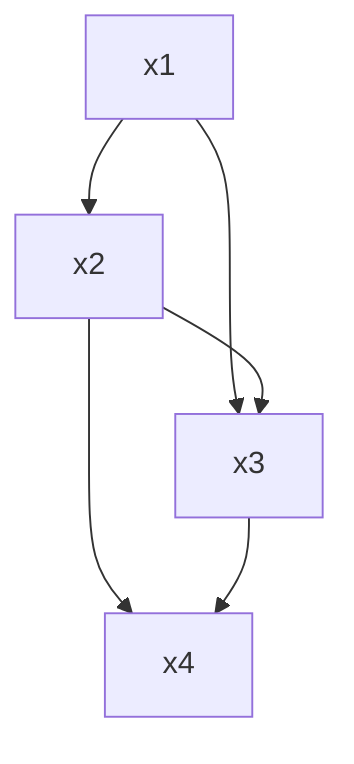

# 8.2 寄存器分配

> [!abstract] 核心问题
> 寄存器分配的方法有哪些？图着色和线性扫描算法的原理是什么？如何评估寄存器分配的效果？

## 一、寄存器分配的概念

### 1. 基本概念

**定义**：寄存器分配是将程序中的变量分配到寄存器中的过程。

**重要性**：

| 原因 | 说明 |
|-----|------|
| **效率** | 寄存器访问速度远快于内存 |
| **性能** | 合理的寄存器分配能显著提高性能 |
| **成本** | 寄存器数量有限，需要优化分配 |

### 2. 寄存器分配的目标

**目标**：

| 目标 | 说明 |
|-----|------|
| **最大化使用** | 尽可能多地使用寄存器 |
| **最小化溢出** | 减少变量溢出到内存 |
| **提高效率** | 提高代码执行效率 |

### 3. 寄存器分配的约束

**约束**：

| 约束 | 说明 |
|-----|------|
| **寄存器数量** | 目标机寄存器数量有限 |
| **寄存器类型** | 不同寄存器有不同用途 |
| **生命周期** | 变量的生命周期必须考虑 |

## 二、寄存器分配的方法

### 1. 图着色算法（Graph Coloring）

**基本思想**：

**定义**：将寄存器分配问题转化为图着色问题。

**步骤**：

| 步骤 | 说明 |
|-----|------|
| **构建冲突图** | 变量之间有冲突则连边 |
| **图着色** | 用最少颜色着色图 |
| **分配寄存器** | 每种颜色对应一个寄存器 |

**冲突图的构建**：



**图着色示例**：

```
冲突图：
x1 - x2 - x3
|   |   |
x4 - x5 - x6

着色结果：
x1: 颜色1 (寄存器R1)
x2: 颜色2 (寄存器R2)
x3: 颜色3 (寄存器R3)
x4: 颜色2 (寄存器R2)
x5: 颜色1 (寄存器R1)
x6: 颜色2 (寄存器R2)
```

**图着色算法**：

```java
void graphColoringRegisterAllocation(InterferenceGraph graph, int numRegisters) {
    Stack<Node> stack = new Stack<>();
    
    // 简化：移除度数小于寄存器数量的节点
    while (graph.hasNodes()) {
        Node node = graph.findNodeWithDegreeLessThan(numRegisters);
        if (node != null) {
            stack.push(node);
            graph.removeNode(node);
        } else {
            // 溢出处理
            Node spillNode = graph.selectSpillNode();
            stack.push(spillNode);
            graph.removeNode(spillNode);
        }
    }
    
    // 着色：从栈顶开始分配颜色
    while (!stack.isEmpty()) {
        Node node = stack.pop();
        Set<Integer> usedColors = new HashSet<>();
        for (Node neighbor : node.getNeighbors()) {
            if (neighbor.hasColor()) {
                usedColors.add(neighbor.getColor());
            }
        }
        int color = findAvailableColor(usedColors, numRegisters);
        node.setColor(color);
    }
}
```

### 2. 线性扫描算法（Linear Scan）

**基本思想**：

**定义**：按变量的生命周期顺序扫描，分配寄存器。

**步骤**：

| 步骤 | 说明 |
|-----|------|
| **排序** | 按变量的活跃区间排序 |
| **扫描** | 按顺序分配寄存器 |
| **回收** | 回收不再活跃的寄存器 |

**活跃区间**：

```
变量的活跃区间：
x1: [1, 5]
x2: [2, 6]
x3: [3, 7]
x4: [4, 8]
```

**线性扫描示例**：

```
寄存器数量：2

扫描过程：
时刻1：x1进入 → 分配R1
时刻2：x2进入 → 分配R2
时刻3：x3进入 → R1和R2都被占用，x1在时刻5结束，x3溢出到内存
时刻4：x4进入 → x1仍活跃，x4溢出到内存
时刻5：x1结束 → 回收R1，分配给x3
时刻6：x2结束 → 回收R2，分配给x4
```

**线性扫描算法**：

```java
void linearScanRegisterAllocation(List<Interval> intervals, int numRegisters) {
    List<Interval> active = new ArrayList<>();
    Map<Interval, Integer> registerMap = new HashMap<>();
    List<Integer> freeRegisters = new ArrayList<>();
    
    // 初始化空闲寄存器
    for (int i = 0; i < numRegisters; i++) {
        freeRegisters.add(i);
    }
    
    // 按起始点排序
    intervals.sort(Comparator.comparingInt(Interval::getStart));
    
    for (Interval interval : intervals) {
        // 回收不再活跃的寄存器
        List<Interval> toRemove = new ArrayList<>();
        for (Interval activeInterval : active) {
            if (activeInterval.getEnd() <= interval.getStart()) {
                freeRegisters.add(registerMap.get(activeInterval));
                toRemove.add(activeInterval);
            }
        }
        active.removeAll(toRemove);
        
        // 分配寄存器
        if (!freeRegisters.isEmpty()) {
            int register = freeRegisters.remove(0);
            registerMap.put(interval, register);
            active.add(interval);
        } else {
            // 溢出处理：选择结束最晚的变量溢出
            Interval spillInterval = active.stream()
                .max(Comparator.comparingInt(Interval::getEnd))
                .orElse(null);
            if (spillInterval != null) {
                active.remove(spillInterval);
                freeRegisters.add(registerMap.get(spillInterval));
                registerMap.remove(spillInterval);
                
                int register = freeRegisters.remove(0);
                registerMap.put(interval, register);
                active.add(interval);
            }
        }
    }
}
```

### 3. 寄存器分配方法对比

| 对比项 | 图着色算法 | 线性扫描算法 |
|-------|-----------|-------------|
| 复杂度 | O(n^2) | O(n log n) |
| 质量 | 高 | 中等 |
| 实现难度 | 高 | 低 |
| 适用场景 | 编译器 | JIT编译器 |

## 三、寄存器分配的优化

### 1. 寄存器重命名

**定义**：重命名变量以减少冲突。

**示例**：

```
优化前：
x = a + b
y = c + d
z = x + y

优化后：
t1 = a + b
t2 = c + d
t3 = t1 + t2  // 使用临时变量减少冲突
```

### 2. 寄存器合并

**定义**：合并生命周期不重叠的变量。

**示例**：

```
变量生命周期：
x: [1, 3]
y: [4, 6]

合并后：
x和y可以使用同一个寄存器
```

### 3. 溢出优化

**定义**：优化溢出代码。

**示例**：

```
溢出前：
x = memory[1000]
y = x + 1
memory[1000] = y

溢出后：
使用寄存器缓存，减少内存访问
```

## 四、寄存器分配的实现

### 1. 冲突图的构建

**方法**：

| 方法 | 说明 |
|-----|------|
| **活跃变量分析** | 使用活跃变量分析构建冲突图 |
| **数据流分析** | 使用数据流分析确定变量的活跃区间 |

**示例**：

```java
InterferenceGraph buildInterferenceGraph(ControlFlowGraph cfg) {
    InterferenceGraph graph = new InterferenceGraph();
    LiveVariableAnalysis lva = new LiveVariableAnalysis(cfg);
    
    for (BasicBlock block : cfg.getBlocks()) {
        Set<String> liveOut = lva.getLiveOut(block);
        for (Statement stmt : block.getStatements()) {
            if (stmt instanceof Assignment) {
                String def = ((Assignment) stmt).getLeft().getName();
                for (String use : liveOut) {
                    if (!def.equals(use)) {
                        graph.addEdge(def, use);
                    }
                }
                liveOut.remove(def);
                liveOut.addAll(getUses(stmt));
            }
        }
    }
    
    return graph;
}
```

### 2. 溢出处理

**方法**：

| 方法 | 说明 |
|-----|------|
| **简单溢出** | 将变量溢出到内存 |
| **优化溢出** | 选择最优的溢出位置 |
| **增量溢出** | 只溢出必要的变量 |

**示例**：

```java
void spillVariable(Variable variable) {
    // 将变量存储到内存
    emit("STORE", variable.getRegister(), variable.getMemoryLocation());
    // 从内存加载变量
    emit("LOAD", variable.getMemoryLocation(), variable.getRegister());
}
```

### 3. 代码生成

**方法**：

| 方法 | 说明 |
|-----|------|
| **直接生成** | 直接生成目标代码 |
| **间接生成** | 生成中间表示，再转换为目标代码 |
| **模板生成** | 使用模板生成目标代码 |

## 五、寄存器分配的效果评估

### 1. 评估指标

**指标**：

| 指标 | 说明 |
|-----|------|
| **寄存器使用率** | 使用寄存器的变量比例 |
| **溢出次数** | 变量溢出到内存的次数 |
| **代码效率** | 生成代码的执行效率 |
| **编译时间** | 寄存器分配的时间 |

### 2. 评估方法

**方法**：

| 方法 | 说明 |
|-----|------|
| **基准测试** | 使用基准程序测试 |
| **静态分析** | 分析生成的代码 |
| **动态分析** | 运行时分析 |

> [!warning] 易错点
> 寄存器分配不仅要分配寄存器，还要处理溢出！当寄存器数量不足时，需要将变量溢出到内存，这会降低代码效率。

---

**导航**：上一节 [[8.1-目标代码生成概述.md]] · [[MOC - 第8章.md|返回章节导航]] · 下一节 [[8.3-代码生成技术.md]]