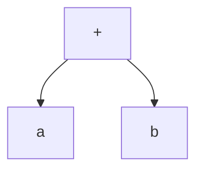
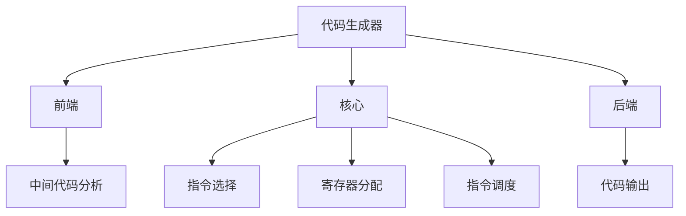

# 8.3 代码生成技术

> [!abstract] 核心问题
> 代码生成的技术有哪些？如何选择合适的指令？如何优化指令顺序？

## 一、指令选择

### 1. 指令选择的概念

**定义**：指令选择是将中间代码映射到目标机指令的过程。

**重要性**：

| 原因 | 说明 |
|-----|------|
| **效率** | 选择合适的指令能提高效率 |
| **正确性** | 指令选择必须保证语义正确 |
| **可移植性** | 指令选择应与目标机无关 |

### 2. 指令选择的方法

**模板匹配**：

**定义**：使用模板匹配选择指令。

**示例**：

```
中间代码：t1 = a + b

模板：
ADD R1, R2, R3  // R3 = R1 + R2

匹配结果：
MOV R1, a
MOV R2, b
ADD R1, R2, R3
MOV t1, R3
```

**树遍历**：

**定义**：遍历语法树生成代码。

**示例**：



**遍历过程**：

```
后序遍历：
1. 处理a → MOV R1, a
2. 处理b → MOV R2, b
3. 处理+ → ADD R1, R2, R3
```

**动态规划**：

**定义**：使用动态规划选择最优指令序列。

**示例**：

```
表达式：a + b * c

可能的指令序列：
1. MOV R1, a; MOV R2, b; MOV R3, c; MUL R2, R3, R4; ADD R1, R4, R5
2. MOV R1, b; MOV R2, c; MUL R1, R2, R3; MOV R4, a; ADD R4, R3, R5

选择最优序列：序列2（减少一次MOV）
```

### 3. 指令选择的实现

**示例**：

```java
void selectInstructions(IntermediateCode code) {
    for (Instruction instr : code.getInstructions()) {
        switch (instr.getOperator()) {
            case ADD:
                emitAddInstruction(instr);
                break;
            case SUB:
                emitSubInstruction(instr);
                break;
            case MUL:
                emitMulInstruction(instr);
                break;
            // 其他指令
        }
    }
}
```

## 二、指令调度

### 1. 指令调度的概念

**定义**：指令调度是安排指令执行顺序的过程。

**目的**：

| 目的 | 说明 |
|-----|------|
| **提高流水线效率** | 减少流水线停顿 |
| **提高并行度** | 最大化指令级并行 |
| **减少执行时间** | 提高整体效率 |

### 2. 指令调度的方法

**静态调度**：

**定义**：在编译时调度指令。

**示例**：

```
指令序列：
1. LOAD R1, a  // 需要2个周期
2. LOAD R2, b  // 需要2个周期
3. ADD R1, R2, R3  // 依赖R1和R2

优化后：
1. LOAD R1, a  // 开始加载a
2. LOAD R2, b  // 开始加载b（与加载a并行）
3. ADD R1, R2, R3  // a和b都已加载完成
```

**动态调度**：

**定义**：在运行时调度指令。

**示例**：

```
流水线状态：
周期1：LOAD R1, a
周期2：LOAD R2, b; ADD等待
周期3：ADD R1, R2, R3  // a已加载，b仍在加载，ADD等待
周期4：ADD R1, R2, R3  // b已加载，执行ADD

动态调度：
周期1：LOAD R1, a
周期2：LOAD R2, b
周期3：NOP（b未加载完成）
周期4：ADD R1, R2, R3
```

**软件流水线**：

**定义**：将循环展开并调度，实现循环级并行。

**示例**：

```
循环：
for (int i = 0; i < n; i++) {
    y[i] = a * x[i] + b;
}

软件流水线：
i=0: LOAD x[0]; MUL a, x[0]; ADD b
i=1: LOAD x[1]; MUL a, x[1]; ADD b（与i=0的ADD重叠）
```

### 3. 指令调度的实现

**示例**：

```java
void scheduleInstructions(List<Instruction> instructions) {
    List<Instruction> scheduled = new ArrayList<>();
    Set<Instruction> ready = new HashSet<>();
    
    // 初始化就绪队列
    for (Instruction instr : instructions) {
        if (instr.getDependencies().isEmpty()) {
            ready.add(instr);
        }
    }
    
    while (!ready.isEmpty()) {
        Instruction instr = selectOptimalInstruction(ready);
        scheduled.add(instr);
        ready.remove(instr);
        
        // 更新依赖关系
        for (Instruction dependent : instr.getDependents()) {
            dependent.removeDependency(instr);
            if (dependent.getDependencies().isEmpty()) {
                ready.add(dependent);
            }
        }
    }
    
    instructions.clear();
    instructions.addAll(scheduled);
}
```

## 三、代码生成的优化

### 1. 指令优化

**优化技术**：

| 技术 | 说明 |
|-----|------|
| **指令合并** | 将多个指令合并为一个 |
| **指令替换** | 用高效指令替换低效指令 |
| **指令删除** | 删除无用指令 |

**示例**：

```
优化前：
MOV R1, 0
ADD R1, R1, R2

优化后：
MOV R1, R2  // 合并为一条指令
```

### 2. 内存访问优化

**优化技术**：

| 技术 | 说明 |
|-----|------|
| **缓存优化** | 优化缓存访问模式 |
| **预取优化** | 提前加载数据 |
| **对齐优化** | 保证数据对齐 |

**示例**：

```
优化前：
LOAD R1, memory[1000]
LOAD R2, memory[1004]
LOAD R3, memory[1008]

优化后：
LOAD R1, memory[1000]  // 预取后续数据
LOAD R2, memory[1004]
LOAD R3, memory[1008]
```

### 3. 分支优化

**优化技术**：

| 技术 | 说明 |
|-----|------|
| **分支预测** | 预测分支方向 |
| **分支合并** | 合并条件分支 |
| **分支消除** | 删除无条件分支 |

**示例**：

```
优化前：
if (x > 0) {
    goto L1
}
goto L2
L1: ...

优化后：
if (x <= 0) {
    goto L2
}
...  // 删除无条件分支
```

## 四、代码生成器的设计

### 1. 代码生成器的架构

**架构**：



### 2. 代码生成器的实现

**实现方法**：

| 方法 | 说明 |
|-----|------|
| **自下而上** | 从中间代码的底部开始生成代码 |
| **自上而下** | 从中间代码的顶部开始生成代码 |
| **混合方法** | 结合自下而上和自上而下 |

**示例**：

```java
class CodeGenerator {
    private InstructionSelector selector;
    private RegisterAllocator allocator;
    private InstructionScheduler scheduler;
    
    public CodeGenerator(TargetMachine machine) {
        this.selector = new InstructionSelector(machine);
        this.allocator = new RegisterAllocator(machine);
        this.scheduler = new InstructionScheduler(machine);
    }
    
    public TargetCode generate(IntermediateCode code) {
        // 指令选择
        List<Instruction> instructions = selector.select(code);
        
        // 寄存器分配
        allocator.allocate(instructions);
        
        // 指令调度
        scheduler.schedule(instructions);
        
        // 输出目标代码
        return new TargetCode(instructions);
    }
}
```

### 3. 代码生成器的测试

**测试方法**：

| 方法 | 说明 |
|-----|------|
| **单元测试** | 测试单个功能 |
| **集成测试** | 测试整体流程 |
| **基准测试** | 测试性能 |

**示例**：

```java
void testCodeGenerator() {
    // 测试指令选择
    IntermediateCode code = new IntermediateCode();
    code.addInstruction(new BinaryOperation(ADD, new Variable("a"), new Variable("b"), new Variable("t1")));
    
    TargetCode target = codeGenerator.generate(code);
    assertEquals("ADD R1, R2, R3", target.getInstructions().get(0).toString());
}
```

## 五、代码生成的质量评估

### 1. 评估指标

**指标**：

| 指标 | 说明 |
|-----|------|
| **代码大小** | 生成代码的字节数 |
| **执行时间** | 代码的执行时间 |
| **指令数量** | 生成的指令数量 |
| **寄存器使用** | 寄存器的使用效率 |

### 2. 评估方法

**方法**：

| 方法 | 说明 |
|-----|------|
| **基准测试** | 使用标准基准程序测试 |
| **静态分析** | 分析生成的代码 |
| **动态分析** | 运行时分析性能 |

### 3. 优化策略

**策略**：

| 策略 | 说明 |
|-----|------|
| **指令选择优化** | 选择高效的指令 |
| **寄存器分配优化** | 优化寄存器使用 |
| **指令调度优化** | 优化指令顺序 |

> [!warning] 易错点
> 代码生成不仅要生成正确的代码，还要生成高效的代码！指令调度能显著提高流水线效率，是现代编译器的重要优化手段。

---

**导航**：上一节 [[8.2-寄存器分配.md]] · [[MOC - 第8章.md|返回章节导航]]