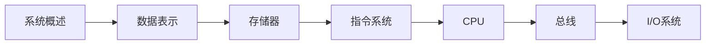

# 计算机组成原理

> [!abstract] 课程定位
> 本课程是计算机专业核心课程，系统讲授计算机硬件系统的组成原理和设计方法，包括数据表示、存储器、指令系统、CPU、总线和I/O系统。

> [!info] 进阶学习路径
> 完成本课程后，可深入学习以下方向：
> - **计算机体系结构**：多核处理器、并行计算
> - **嵌入式系统**：单片机、FPGA、ARM
> - **操作系统**：内存管理、进程调度
> - **数字逻辑设计**：Verilog、VHDL

## 学习路线



## 课程目录

### 第1章-计算机系统概述

- [[知识点/第1章-计算机系统概述/MOC - 第1章.md|第1章导航]]
- [[知识点/第1章-计算机系统概述/1.1-计算机硬件五大组成.md]]：运算器、控制器、存储器、输入设备、输出设备
- [[知识点/第1章-计算机系统概述/1.2-计算机性能评价指标.md]]：主频、CPI、MIPS、FLOPS
- [[知识点/第1章-计算机系统概述/1.3-计算机发展与分类.md]]：计算机的发展历程和分类

### 第2章-数据的表示与运算

- [[知识点/第2章-数据的表示与运算/MOC - 第2章.md|第2章导航]]
- [[知识点/第2章-数据的表示与运算/2.1-数制与编码.md]]：二进制、十进制、十六进制转换
- [[知识点/第2章-数据的表示与运算/2.2-定点数表示.md]]：原码、反码、补码、移码
- [[知识点/第2章-数据的表示与运算/2.3-定点数运算.md]]：加减乘除运算

### 第3章-存储器层次结构

- [[知识点/第3章-存储器层次结构/MOC - 第3章.md|第3章导航]]
- [[知识点/第3章-存储器层次结构/3.1-存储器分类与层次结构.md]]：内存、外存、Cache
- [[知识点/第3章-存储器层次结构/3.2-随机存取存储器RAM.md]]：SRAM、DRAM、内存条
- [[知识点/第3章-存储器层次结构/3.3-高速缓存Cache.md]]：Cache映射、替换策略、一致性

### 第4章-指令系统

- [[知识点/第4章-指令系统/MOC - 第4章.md|第4章导航]]
- [[知识点/第4章-指令系统/4.1-指令格式.md]]：指令的组成、寻址方式
- [[知识点/第4章-指令系统/4.2-指令类型与功能.md]]：数据传送、算术运算、逻辑运算、控制转移
- [[知识点/第4章-指令系统/4.3-指令系统设计.md]]：CISC与RISC

### 第5章-中央处理器CPU

- [[知识点/第5章-中央处理器CPU/MOC - 第5章.md|第5章导航]]
- [[知识点/第5章-中央处理器CPU/5.1-CPU的功能与结构.md]]：CPU的组成、指令周期
- [[知识点/第5章-中央处理器CPU/5.2-指令执行过程.md]]：取指、译码、执行、访存、写回
- [[知识点/第5章-中央处理器CPU/5.3-流水线技术.md]]：流水线的基本原理、冲突处理

### 第6章-总线系统

- [[知识点/第6章-总线系统/MOC - 第6章.md|第6章导航]]
- [[知识点/第6章-总线系统/6.1-总线概述.md]]：总线的定义、分类、性能指标
- [[知识点/第6章-总线系统/6.2-总线仲裁.md]]：集中式仲裁、分布式仲裁
- [[知识点/第6章-总线系统/6.3-总线操作与定时.md]]：同步定时、异步定时

### 第7章-I/O输入输出系统

- [[知识点/第7章-I/O输入输出系统/MOC - 第7章.md|第7章导航]]
- [[知识点/第7章-I/O输入输出系统/7.1-I/O系统概述.md]]：I/O设备、接口、控制方式
- [[知识点/第7章-I/O输入输出系统/7.2-程序查询方式.md]]：查询式I/O的流程和特点
- [[知识点/第7章-I/O输入输出系统/7.3-中断与DMA方式.md]]：中断机制、DMA原理

## 习题目录

### 第1章-计算机系统概述

- [[习题/习题-第1章-计算机系统概述.md]]：选择题、填空题、简答题、综合题

### 第2章-数据的表示与运算

- [[习题/习题-第2章-数据的表示与运算.md]]：选择题、填空题、简答题、综合题

### 第3章-存储器层次结构

- [[习题/习题-第3章-存储器层次结构.md]]：选择题、填空题、简答题、综合题

### 第4章-指令系统

- [[习题/习题-第4章-指令系统.md]]：选择题、填空题、简答题、综合题

### 第5章-中央处理器CPU

- [[习题/习题-第5章-中央处理器CPU.md]]：选择题、填空题、简答题、综合题

### 第6章-总线系统

- [[习题/习题-第6章-总线系统.md]]：选择题、填空题、简答题、综合题

### 第7章-I/O输入输出系统

- [[习题/习题-第7章-I/O输入输出系统.md]]：选择题、填空题、简答题、综合题

## 核心概念对比

| 概念对 | 区别 | 联系 |
|-------|------|------|
| **SRAM vs DRAM** | SRAM速度快、功耗高；DRAM速度慢、功耗低 | 都是随机存取存储器 |
| **CISC vs RISC** | CISC指令复杂、执行效率低；RISC指令简单、执行效率高 | 都是指令系统设计风格 |
| **同步总线 vs 异步总线** | 同步总线使用统一时钟；异步总线使用握手信号 | 都是总线定时方式 |
| **中断 vs DMA** | 中断需要CPU干预；DMA不需要CPU干预 | 都是I/O控制方式 |

## 复习要点

> [!question] 核心问题自测
> 1. 计算机硬件的五大组成部分是什么？各自的功能是什么？
> 2. 如何表示有符号数？原码、反码、补码的区别是什么？
> 3. 存储器的层次结构是怎样的？Cache的作用是什么？
> 4. 指令的格式是怎样的？常见的寻址方式有哪些？
> 5. CPU的指令周期包括哪些阶段？流水线技术的原理是什么？
> 6. 总线的分类有哪些？总线仲裁的方式有哪些？
> 7. I/O控制方式有哪些？中断和DMA的区别是什么？

## 笔记维护约定

- 每个章节包含：MOC导航笔记、知识点笔记、assets资源目录
- 知识点笔记使用「章节号.小节号-知识点名称.md」命名格式
- 使用Mermaid绘制硬件框图、流程图、层次结构图
- 使用LaTeX书写数学公式和推导
- 使用表格对比易混淆概念和硬件特性

```dataview
TABLE status AS 状态, chapter AS 章节, section AS 小节
FROM #计算机组成原理
WHERE file.name != this.file.name
SORT chapter ASC, section ASC
```