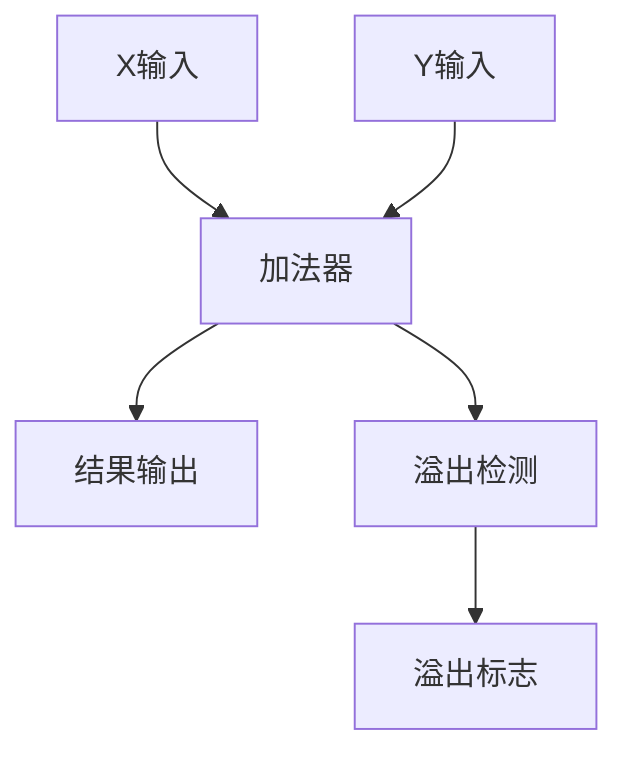

# 习题-第2章-数据的表示与运算

> [!abstract] 本章习题概述
> 本章习题主要考察数制转换、定点数表示、定点数运算和溢出检测。

## 一、选择题

### 2.1 数制与编码

**题目1**：将十进制数25转换为二进制数，结果为（ ）

A. 11001  
B. 10101  
C. 11010  
D. 10011  

**答案**：A

**解析**：25 ÷ 2 = 12 余 1  
12 ÷ 2 = 6 余 0  
6 ÷ 2 = 3 余 0  
3 ÷ 2 = 1 余 1  
1 ÷ 2 = 0 余 1  
从下往上取余数：11001

**题目2**：将二进制数10101转换为十进制数，结果为（ ）

A. 19  
B. 21  
C. 23  
D. 25  

**答案**：B

**解析**：1×2^4 + 0×2^3 + 1×2^2 + 0×2^1 + 1×2^0 = 16 + 0 + 4 + 0 + 1 = 21

### 2.2 定点数表示

**题目3**：字长为8位的原码表示范围是（ ）

A. -127 ~ +127  
B. -128 ~ +127  
C. -255 ~ +255  
D. -256 ~ +255  

**答案**：A

**解析**：原码的表示范围是 -(2^(n-1)-1) ~ +(2^(n-1)-1)，对于8位字长，范围是 -127 ~ +127。

**题目4**：字长为8位的补码表示范围是（ ）

A. -127 ~ +127  
B. -128 ~ +127  
C. -255 ~ +255  
D. -256 ~ +255  

**答案**：B

**解析**：补码的表示范围是 -2^(n-1) ~ +(2^(n-1)-1)，对于8位字长，范围是 -128 ~ +127。

**题目5**：下列关于补码的说法中，正确的是（ ）

A. 补码的正数和负数表示范围相同  
B. 补码的0只有一种表示形式  
C. 补码的负数比正数多一个  
D. 以上都正确  

**答案**：D

**解析**：补码的特点：0只有一种表示形式，负数比正数多一个，正数和负数的表示范围不同。

### 2.3 定点数运算

**题目6**：两个正数相加，结果为负数，这是发生了（ ）

A. 正溢出  
B. 负溢出  
C. 没有溢出  
D. 不确定  

**答案**：A

**解析**：两个正数相加，结果为负数，说明发生了正溢出（溢出到符号位）。

**题目7**：两个负数相加，结果为正数，这是发生了（ ）

A. 正溢出  
B. 负溢出  
C. 没有溢出  
D. 不确定  

**答案**：B

**解析**：两个负数相加，结果为正数，说明发生了负溢出（溢出到符号位）。

## 二、填空题

**题目8**：十进制数36转换为二进制数是____。

**答案**：100100

**题目9**：二进制数110101转换为十进制数是____。

**答案**：53

**题目10**：字长为8位的原码表示范围是____。

**答案**：-127 ~ +127

**题目11**：字长为8位的补码表示范围是____。

**答案**：-128 ~ +127

**题目12**：补码加法的规则是____。

**答案**：[X+Y]补 = [X]补 + [Y]补

## 三、简答题

**题目13**：简述原码、反码和补码的关系。

**答案**：

原码、反码和补码的关系：

- **正数**：原码、反码和补码相同。
- **负数**：反码是原码除符号位外取反；补码是反码加1。

**示例**：

```
原码：10000001（-1）
反码：11111110
补码：11111111
```

**题目14**：什么是溢出？如何检测溢出？

**答案**：

溢出是指两个数相加或相减的结果超出了数据类型的表示范围。

溢出检测方法：

1. **双符号位法**：使用两位符号位，当两位符号位不同时，表示发生溢出。

2. **进位法**：当最高位进位和次高位进位不同时，表示发生溢出。

**题目15**：简述补码加法的规则。

**答案**：

补码加法的规则：

```
[X+Y]补 = [X]补 + [Y]补
```

即两个数的补码相加，结果就是它们和的补码。

**示例**：

```
X = +5, Y = +3
[X]补 = 00000101
[Y]补 = 00000011
[X+Y]补 = 00001000 = +8
```

## 四、计算题

**题目16**：将十进制数-35转换为8位二进制补码。

**解答**：

```
步骤1：求绝对值的二进制表示
35 = 32 + 2 + 1 = 100011

步骤2：扩展为8位
00100011

步骤3：取反（反码）
11011100

步骤4：加1（补码）
11011101
```

**答案**：11011101

**题目17**：已知[X]补=11011010，求X的真值。

**解答**：

```
步骤1：判断符号位，1表示负数
步骤2：对补码取反
11011010 → 00100101

步骤3：加1
00100101 + 1 = 00100110

步骤4：转换为十进制
00100110 = 38

步骤5：加上负号
X = -38
```

**答案**：-38

**题目18**：计算[X]补 + [Y]补，其中[X]补=01010101，[Y]补=00101011。

**解答**：

```
[X]补 = 01010101
[Y]补 = 00101011
[X+Y]补 = 01010101 + 00101011 = 10000000
```

**答案**：10000000（发生正溢出）

**题目19**：计算[X]补 + [Y]补，其中[X]补=11011010，[Y]补=11100110。

**解答**：

```
[X]补 = 11011010
[Y]补 = 11100110
[X+Y]补 = 11011010 + 11100110 = 11000000
```

**答案**：11000000（没有溢出）

**题目20**：使用双符号位法检测[X]补 + [Y]补的溢出，其中[X]补=01010101，[Y]补=00101011。

**解答**：

```
步骤1：将补码扩展为双符号位
[X]补 = 001010101
[Y]补 = 000101011

步骤2：相加
001010101 + 000101011 = 010000000

步骤3：检测溢出
符号位为01，两位不同，发生正溢出
```

**答案**：发生正溢出

## 五、综合题

**题目21**：设计一个8位定点补码加法器，要求：

1. 能够进行两个8位补码的加法运算
2. 能够检测溢出
3. 给出逻辑电路图和真值表

**答案**：

**逻辑电路图**：



**真值表**：

| X符号位 | Y符号位 | 结果符号位 | 溢出 |
|--------|--------|-----------|------|
| 0 | 0 | 0 | 否 |
| 0 | 0 | 1 | 是（正溢出） |
| 0 | 1 | 0 | 否 |
| 0 | 1 | 1 | 否 |
| 1 | 0 | 0 | 否 |
| 1 | 0 | 1 | 否 |
| 1 | 1 | 0 | 是（负溢出） |
| 1 | 1 | 1 | 否 |

---

**导航**：[[习题-第1章-计算机系统概述.md|上一章习题]] · [[习题-第3章-存储器层次结构.md|下一章习题]]