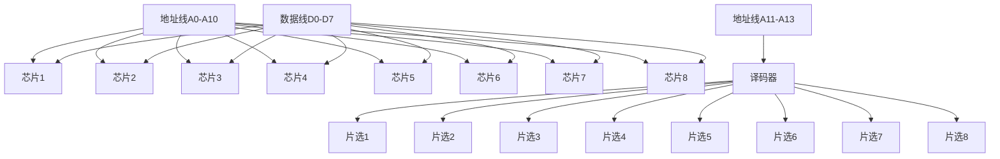

# 习题-第3章-存储器层次结构

> [!abstract] 本章习题概述
> 本章习题主要考察存储器分类、层次结构、RAM和Cache的原理与应用。

## 一、选择题

### 3.1 存储器分类与层次结构

**题目1**：下列关于存储器的说法中，错误的是（ ）

A. 寄存器速度最快，容量最小  
B. Cache速度比主存快  
C. 主存容量比辅存大  
D. 辅存速度最慢，容量最大  

**答案**：C

**解析**：辅存容量比主存大，主存容量比Cache大。

**题目2**：存储器层次结构的设计依据是（ ）

A. 程序局部性原理  
B. 数据局部性原理  
C. 时间局部性原理  
D. 空间局部性原理  

**答案**：A

**解析**：存储器层次结构的设计依据是程序局部性原理，包括时间局部性和空间局部性。

### 3.2 随机存取存储器RAM

**题目3**：下列关于SRAM的说法中，正确的是（ ）

A. SRAM需要定期刷新  
B. SRAM速度比DRAM快  
C. SRAM容量比DRAM大  
D. SRAM功耗比DRAM低  

**答案**：B

**解析**：SRAM不需要刷新，速度比DRAM快，但容量小，功耗高。

**题目4**：下列关于DRAM的说法中，正确的是（ ）

A. DRAM不需要刷新  
B. DRAM速度比SRAM快  
C. DRAM容量比SRAM大  
D. DRAM功耗比SRAM高  

**答案**：C

**解析**：DRAM需要定期刷新，速度比SRAM慢，但容量大，功耗低。

**题目5**：用4片1K×4位的RAM芯片组成4K×4位的存储器，需要（ ）根地址线。

A. 10  
B. 11  
C. 12  
D. 13  

**答案**：C

**解析**：4K = 2^12，所以需要12根地址线。其中10根用于片内寻址，2根用于片选。

### 3.3 高速缓存Cache

**题目6**：Cache的命中率是指（ ）

A. Cache被访问的次数  
B. Cache命中的次数与总访问次数的比值  
C. Cache的容量与主存容量的比值  
D. Cache的速度与主存速度的比值  

**答案**：B

**解析**：命中率 = Cache命中次数 / 总访问次数

**题目7**：下列关于Cache映射方式的说法中，错误的是（ ）

A. 直接映射方式最简单  
B. 全相联映射方式最灵活  
C. 组相联映射方式是前两种的折中  
D. 直接映射方式的命中率最高  

**答案**：D

**解析**：全相联映射方式的命中率最高，但实现最复杂。

**题目8**：Cache的替换策略中，最常用的是（ ）

A. 随机替换  
B. 先进先出（FIFO）  
C. 最近最少使用（LRU）  
D. 最不经常使用（LFU）  

**答案**：C

**解析**：LRU是最常用的Cache替换策略，因为它基于程序局部性原理。

## 二、填空题

**题目9**：存储器层次结构从上到下依次是____、____、____和____。

**答案**：寄存器、Cache、主存、辅存

**题目10**：SRAM的特点是____、____和____。

**答案**：速度快、不需要刷新、容量小

**题目11**：DRAM的特点是____、____和____。

**答案**：速度较慢、需要刷新、容量大

**题目12**：Cache的命中率公式是____。

**答案**：命中率 = Cache命中次数 / 总访问次数

**题目13**：Cache的映射方式有____、____和____。

**答案**：直接映射、全相联映射、组相联映射

## 三、简答题

**题目14**：简述存储器层次结构的原理和作用。

**答案**：

存储器层次结构的原理是程序局部性原理，包括：

- **时间局部性**：最近访问过的数据可能会被再次访问。
- **空间局部性**：访问的数据附近的数据可能会被访问。

作用：

- 通过在不同层次上使用不同速度和容量的存储器，平衡速度、容量和成本。
- 使整个存储系统的平均访问时间接近高速存储器，而容量接近低速存储器。

**题目15**：比较SRAM和DRAM的特点。

**答案**：

| 对比项 | SRAM | DRAM |
|-------|------|------|
| **速度** | 快 | 慢 |
| **刷新** | 不需要 | 需要 |
| **容量** | 小 | 大 |
| **功耗** | 高 | 低 |
| **成本** | 高 | 低 |

**题目16**：简述Cache的工作原理。

**答案**：

Cache的工作原理：

1. 当CPU访问数据时，首先检查Cache中是否有该数据。
2. 如果有（命中），直接从Cache中读取数据。
3. 如果没有（未命中），从主存中读取数据，并将数据及其附近的数据存入Cache。
4. 下次访问相同数据时，就可以从Cache中快速读取。

**题目17**：比较三种Cache映射方式的特点。

**答案**：

| 映射方式 | 优点 | 缺点 |
|---------|------|------|
| **直接映射** | 简单、速度快 | 冲突率高、命中率低 |
| **全相联映射** | 灵活、命中率高 | 复杂、速度慢 |
| **组相联映射** | 折中、命中率较高 | 较复杂、速度较快 |

## 四、计算题

**题目18**：已知Cache的命中率为0.95，Cache访问时间为10ns，主存访问时间为100ns，计算平均访问时间。

**解答**：

```
平均访问时间 = 命中率 × Cache访问时间 + (1-命中率) × 主存访问时间
             = 0.95 × 10ns + 0.05 × 100ns
             = 9.5ns + 5ns
             = 14.5ns
```

**答案**：14.5ns

**题目19**：用8片2K×8位的RAM芯片组成16K×8位的存储器，画出连接图。

**解答**：

```
地址线：16K = 2^14，需要14根地址线
数据线：8位，需要8根数据线
片选线：8片，需要3根片选线（2^3 = 8）

连接方式：
- 地址线低11位（A0-A10）连接到各芯片的地址输入端
- 地址线高3位（A11-A13）经过译码器产生片选信号
- 数据线连接到各芯片的数据输入端和输出端
```

**答案**：连接图如下：



**题目20**：Cache容量为16KB，主存容量为1MB，块大小为64B，采用直接映射方式，计算Cache的块数和主存的块数。

**解答**：

```
Cache块数 = Cache容量 / 块大小 = 16KB / 64B = 256块
主存块数 = 主存容量 / 块大小 = 1MB / 64B = 16384块
```

**答案**：Cache块数为256块，主存块数为16384块。

**题目21**：使用组相联映射方式，Cache容量为16KB，块大小为64B，每组包含4块，计算组数。

**解答**：

```
Cache块数 = Cache容量 / 块大小 = 16KB / 64B = 256块
组数 = Cache块数 / 每组块数 = 256块 / 4块/组 = 64组
```

**答案**：组数为64组。

## 五、综合题

**题目22**：设计一个Cache系统，要求：

1. Cache容量为32KB，主存容量为4MB
2. 块大小为128B
3. 采用组相联映射方式，每组包含8块
4. 计算Cache的块数、组数和主存的块数
5. 画出Cache和主存的地址结构

**解答**：

```
Cache块数 = 32KB / 128B = 256块
组数 = 256块 / 8块/组 = 32组
主存块数 = 4MB / 128B = 32768块

地址结构：
主存地址：22位
- 块标记：22 - 7（块内偏移） - 5（组号） = 10位
- 组号：5位（32组）
- 块内偏移：7位（128B）

Cache地址：15位
- 组号：5位
- 块内偏移：7位
```

**答案**：

Cache块数为256块，组数为32组，主存块数为32768块。

地址结构：

| 主存地址 | 块标记（10位） | 组号（5位） | 块内偏移（7位） |
|---------|---------------|-----------|----------------|
| Cache地址 | - | 组号（5位） | 块内偏移（7位） |

---

**导航**：[[习题-第2章-数据的表示与运算.md|上一章习题]] · [[习题-第4章-指令系统.md|下一章习题]]