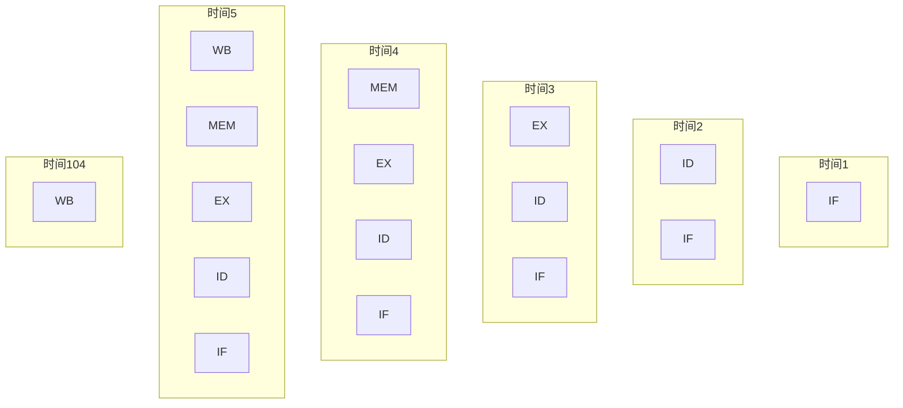

# 习题-第5章-中央处理器CPU

> [!abstract] 本章习题概述
> 本章习题主要考察CPU的功能与结构、指令执行过程和流水线技术。

## 一、选择题

### 5.1 CPU的功能与结构

**题目1**：CPU由（ ）组成。

A. 运算器和控制器  
B. 运算器和存储器  
C. 控制器和存储器  
D. 运算器、控制器和存储器  

**答案**：A

**解析**：CPU由运算器和控制器组成。

**题目2**：下列关于运算器的说法中，错误的是（ ）

A. 运算器执行算术运算  
B. 运算器执行逻辑运算  
C. 运算器包含寄存器  
D. 运算器控制程序执行  

**答案**：D

**解析**：控制器控制程序执行，运算器负责执行算术和逻辑运算。

**题目3**：下列关于控制器的说法中，错误的是（ ）

A. 控制器控制程序执行  
B. 控制器产生控制信号  
C. 控制器执行算术运算  
D. 控制器协调各部件工作  

**答案**：C

**解析**：运算器执行算术运算，控制器负责控制和协调。

### 5.2 指令执行过程

**题目4**：指令周期包含（ ）阶段。

A. 取指令、执行指令  
B. 取指令、译码、执行指令  
C. 取指令、译码、执行指令、访存  
D. 取指令、译码、执行指令、访存、写回  

**答案**：D

**解析**：指令周期包含取指令、译码、执行指令、访存、写回五个阶段。

**题目5**：取指令阶段的任务是（ ）

A. 从内存中读取指令  
B. 分析指令的操作码  
C. 执行指令的操作  
D. 写回结果  

**答案**：A

**解析**：取指令阶段的任务是从内存中读取指令到指令寄存器。

**题目6**：译码阶段的任务是（ ）

A. 从内存中读取指令  
B. 分析指令的操作码和地址码  
C. 执行指令的操作  
D. 写回结果  

**答案**：B

**解析**：译码阶段的任务是分析指令的操作码和地址码，确定操作类型和操作数地址。

### 5.3 流水线技术

**题目7**：流水线的特点是（ ）

A. 各阶段同时执行不同指令  
B. 各阶段同时执行相同指令  
C. 各阶段顺序执行不同指令  
D. 各阶段顺序执行相同指令  

**答案**：A

**解析**：流水线的特点是各阶段同时执行不同指令，提高指令执行效率。

**题目8**：流水线的加速比是指（ ）

A. 流水线执行时间与顺序执行时间的比值  
B. 顺序执行时间与流水线执行时间的比值  
C. 流水线的阶段数  
D. 流水线的吞吐率  

**答案**：B

**解析**：加速比 = 顺序执行时间 / 流水线执行时间

**题目9**：流水线的冒险包括（ ）

A. 结构冒险  
B. 数据冒险  
C. 控制冒险  
D. 以上都包括  

**答案**：D

**解析**：流水线的冒险包括结构冒险、数据冒险和控制冒险。

## 二、填空题

**题目10**：CPU由____和____组成。

**答案**：运算器、控制器

**题目11**：指令周期包含____、____、____、____和____五个阶段。

**答案**：取指令、译码、执行指令、访存、写回

**题目12**：流水线的特点是____。

**答案**：各阶段同时执行不同指令

**题目13**：流水线的加速比公式是____。

**答案**：加速比 = 顺序执行时间 / 流水线执行时间

**题目14**：流水线的冒险包括____、____和____。

**答案**：结构冒险、数据冒险、控制冒险

## 三、简答题

**题目15**：简述CPU的功能。

**答案**：

CPU的功能：

1. **指令执行**：执行程序中的指令。
2. **数据处理**：进行算术运算和逻辑运算。
3. **控制协调**：控制计算机各部件协调工作。
4. **数据存储**：管理寄存器和缓存。
5. **中断处理**：处理外部设备的中断请求。

**题目16**：简述指令周期的五个阶段。

**答案**：

指令周期的五个阶段：

1. **取指令**：从内存中读取指令到指令寄存器。
2. **译码**：分析指令的操作码和地址码。
3. **执行指令**：执行指令的操作。
4. **访存**：访问内存读取或写入数据。
5. **写回**：将结果写回寄存器或内存。

**题目17**：简述流水线的工作原理。

**答案**：

流水线的工作原理：

1. 将指令执行过程划分为多个阶段。
2. 每个阶段由专门的硬件处理。
3. 不同指令的不同阶段可以同时执行。
4. 提高指令执行的吞吐率。

**示例**：

```
时间：   1  2  3  4  5  6
指令1：  IF ID EX MEM WB
指令2：     IF ID EX MEM WB
指令3：        IF ID EX MEM WB
```

**题目18**：简述流水线冒险的类型和解决方法。

**答案**：

流水线冒险的类型：

1. **结构冒险**：多个指令同时访问同一硬件资源。
   - 解决方法：增加硬件资源或分时复用。

2. **数据冒险**：指令之间存在数据依赖关系。
   - 解决方法：数据前推、暂停流水线、编译器优化。

3. **控制冒险**：分支指令导致流水线冲刷。
   - 解决方法：分支预测、延迟分支、静态分支预测。

## 四、计算题

**题目19**：已知CPU的时钟周期为1ns，指令周期包含5个阶段，每个阶段占用1个时钟周期，计算执行一条指令所需的时间。

**解答**：

```
指令执行时间 = 阶段数 × 时钟周期
             = 5 × 1ns
             = 5ns
```

**答案**：5ns

**题目20**：使用流水线执行10条指令，每条指令包含5个阶段，每个阶段占用1个时钟周期，计算执行时间和加速比。

**解答**：

```
顺序执行时间 = 指令数 × 阶段数 × 时钟周期
             = 10 × 5 × 1ns
             = 50ns

流水线执行时间 = (指令数 + 阶段数 - 1) × 时钟周期
               = (10 + 5 - 1) × 1ns
               = 14ns

加速比 = 顺序执行时间 / 流水线执行时间
       = 50ns / 14ns
       ≈ 3.57
```

**答案**：执行时间为14ns，加速比约为3.57。

**题目21**：流水线包含4个阶段，每个阶段的延迟分别为2ns、3ns、2ns、3ns，计算流水线的时钟周期和执行一条指令的时间。

**解答**：

```
时钟周期 = max(2ns, 3ns, 2ns, 3ns) = 3ns

指令执行时间 = 阶段数 × 时钟周期
             = 4 × 3ns
             = 12ns
```

**答案**：时钟周期为3ns，执行一条指令的时间为12ns。

**题目22**：使用流水线执行20条指令，每条指令包含4个阶段，每个阶段占用1个时钟周期，计算执行时间和吞吐率。

**解答**：

```
执行时间 = (指令数 + 阶段数 - 1) × 时钟周期
         = (20 + 4 - 1) × 1ns
         = 23ns

吞吐率 = 指令数 / 执行时间
       = 20条 / 23ns
       ≈ 0.87条/ns
       ≈ 870 MIPS
```

**答案**：执行时间为23ns，吞吐率约为870 MIPS。

## 五、综合题

**题目23**：设计一个5级流水线CPU，要求：

1. 包含取指令、译码、执行、访存、写回五个阶段
2. 每个阶段占用1个时钟周期
3. 计算执行100条指令的时间和加速比
4. 画出流水线时空图

**解答**：

```
顺序执行时间 = 100 × 5 × 1ns = 500ns

流水线执行时间 = (100 + 5 - 1) × 1ns = 104ns

加速比 = 500ns / 104ns ≈ 4.81
```

**答案**：

执行时间为104ns，加速比约为4.81。

流水线时空图：



---

**导航**：[[习题-第4章-指令系统.md|上一章习题]] · [[习题-第6章-总线系统.md|下一章习题]]