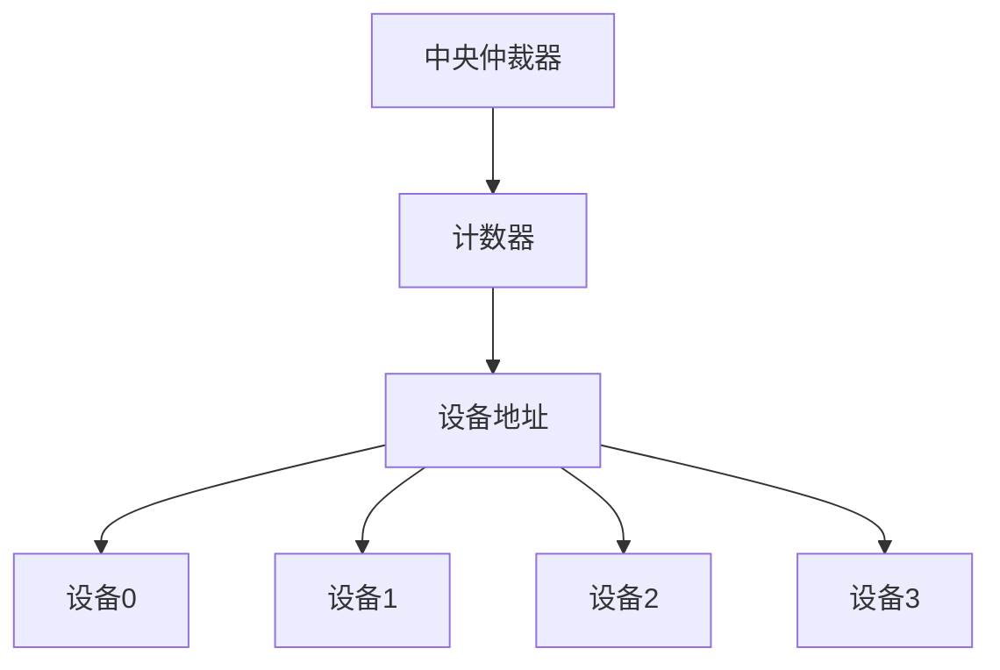
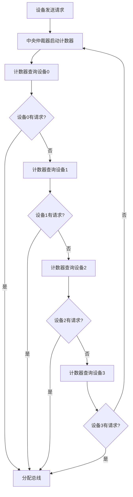

# 习题-第6章-总线系统

> [!abstract] 本章习题概述
> 本章习题主要考察总线的分类、仲裁方式和定时方式。

## 一、选择题

### 6.1 总线概述

**题目1**：总线是（ ）

A. 连接计算机各部件的公共通信线路  
B. 计算机的核心部件  
C. 存储程序和数据的部件  
D. 执行指令的部件  

**答案**：A

**解析**：总线是连接计算机各部件的公共通信线路。

**题目2**：系统总线包括（ ）

A. 数据总线、地址总线、控制总线  
B. 内部总线、外部总线、系统总线  
C. 串行总线、并行总线、高速总线  
D. 以上都不对  

**答案**：A

**解析**：系统总线包括数据总线、地址总线和控制总线。

**题目3**：数据总线的宽度是指（ ）

A. 数据总线的根数  
B. 数据总线的频率  
C. 数据总线的带宽  
D. 数据总线的传输速率  

**答案**：A

**解析**：数据总线的宽度是指数据总线的根数，决定了一次可以传输的数据位数。

### 6.2 总线仲裁

**题目4**：总线仲裁的目的是（ ）

A. 解决多个设备同时请求使用总线的冲突  
B. 提高总线的传输速度  
C. 增加总线的带宽  
D. 减少总线的延迟  

**答案**：A

**解析**：总线仲裁的目的是解决多个设备同时请求使用总线的冲突。

**题目5**：集中式仲裁的方式有（ ）

A. 链式查询、计数器定时查询、独立请求  
B. 分布式仲裁、集中式仲裁  
C. 自举方式、冲突检测方式  
D. 以上都不对  

**答案**：A

**解析**：集中式仲裁的方式有链式查询、计数器定时查询和独立请求。

**题目6**：下列关于链式查询方式的说法中，错误的是（ ）

A. 链式查询方式最简单  
B. 链式查询方式优先级固定  
C. 链式查询方式响应速度最快  
D. 链式查询方式可靠性较低  

**答案**：C

**解析**：链式查询方式响应速度最慢，独立请求方式响应速度最快。

### 6.3 总线操作与定时

**题目7**：同步定时方式的特点是（ ）

A. 使用统一的时钟信号  
B. 使用握手信号  
C. 传输距离远  
D. 可以适应不同速度的设备  

**答案**：A

**解析**：同步定时方式使用统一的时钟信号控制总线操作。

**题目8**：异步定时方式的特点是（ ）

A. 使用统一的时钟信号  
B. 使用握手信号  
C. 传输距离短  
D. 不能适应不同速度的设备  

**答案**：B

**解析**：异步定时方式使用握手信号协调总线操作。

**题目9**：半同步定时方式结合了（ ）

A. 同步定时和异步定时的优点  
B. 同步定时和异步定时的缺点  
C. 只有同步定时的优点  
D. 只有异步定时的优点  

**答案**：A

**解析**：半同步定时方式结合了同步定时和异步定时的优点。

## 二、填空题

**题目10**：系统总线包括____、____和____。

**答案**：数据总线、地址总线、控制总线

**题目11**：总线仲裁的方式有____和____。

**答案**：集中式仲裁、分布式仲裁

**题目12**：集中式仲裁的三种方式是____、____和____。

**答案**：链式查询、计数器定时查询、独立请求

**题目13**：总线定时的方式有____、____和____。

**答案**：同步定时、异步定时、半同步定时

**题目14**：异步定时方式使用____信号协调总线操作。

**答案**：握手

## 三、简答题

**题目15**：简述总线的分类和作用。

**答案**：

总线的分类：

1. **系统总线**：连接CPU、内存和I/O设备，包括数据总线、地址总线和控制总线。
2. **内部总线**：连接CPU内部各部件。
3. **外部总线**：连接计算机和外部设备。

总线的作用：

1. 提供各部件之间的通信通道。
2. 减少连接线的数量。
3. 提高系统的可靠性和可扩展性。

**题目16**：比较三种集中式仲裁方式的特点。

**答案**：

| 仲裁方式 | 优点 | 缺点 |
|---------|------|------|
| **链式查询** | 简单、成本低 | 优先级固定、响应慢、可靠性低 |
| **计数器定时查询** | 优先级可控、响应较快 | 实现较复杂、成本较高 |
| **独立请求** | 响应快、优先级灵活 | 实现复杂、成本高、线数多 |

**题目17**：比较同步定时和异步定时的特点。

**答案**：

| 定时方式 | 优点 | 缺点 |
|---------|------|------|
| **同步定时** | 简单、可靠、快速 | 不灵活、传输距离短 |
| **异步定时** | 灵活、传输距离远 | 复杂、速度较慢 |

**题目18**：简述半同步定时方式的原理。

**答案**：

半同步定时方式的原理：

1. 大部分操作使用同步定时，保证效率。
2. 当设备需要额外时间时，使用异步等待信号。
3. 兼顾效率和灵活性。

**示例**：

```
时序：
时钟1：主设备送地址
时钟2：主设备发读信号
如果设备快速响应：
    时钟3：从设备送数据
如果设备慢速响应：
    从设备发送等待信号
    时钟3：等待
    时钟4：从设备送数据
```

## 四、计算题

**题目19**：数据总线宽度为32位，总线频率为100MHz，计算总线带宽。

**解答**：

```
总线带宽 = 数据总线宽度 × 总线频率
         = 32位 × 100MHz
         = 3200 Mbps
         = 400 MB/s
```

**答案**：400 MB/s

**题目20**：地址总线宽度为20位，计算可以访问的内存容量。

**解答**：

```
内存容量 = 2^地址总线宽度
         = 2^20
         = 1MB
```

**答案**：1MB

**题目21**：使用链式查询方式，有8个设备，计算查询最长需要多少个时钟周期。

**解答**：

```
最长查询时间 = 设备数量 × 时钟周期
             = 8 × 1个时钟周期
             = 8个时钟周期
```

**答案**：8个时钟周期

## 五、综合题

**题目22**：设计一个总线仲裁系统，要求：

1. 包含4个设备
2. 使用计数器定时查询方式
3. 画出仲裁结构图
4. 说明仲裁流程

**解答**：

```
仲裁结构图：
- 中央仲裁器
- 计数器
- 设备地址线
- 请求线和批准线

仲裁流程：
1. 设备发送总线请求
2. 中央仲裁器启动计数器，从0开始计数
3. 计数器依次查询设备0、1、2、3
4. 有请求的设备响应查询
5. 中央仲裁器将总线使用权分配给响应的设备
```

**答案**：

仲裁结构图：



仲裁流程：



---

**导航**：[[习题-第5章-中央处理器CPU.md|上一章习题]] · [[习题-第7章-I/O输入输出系统.md|下一章习题]]