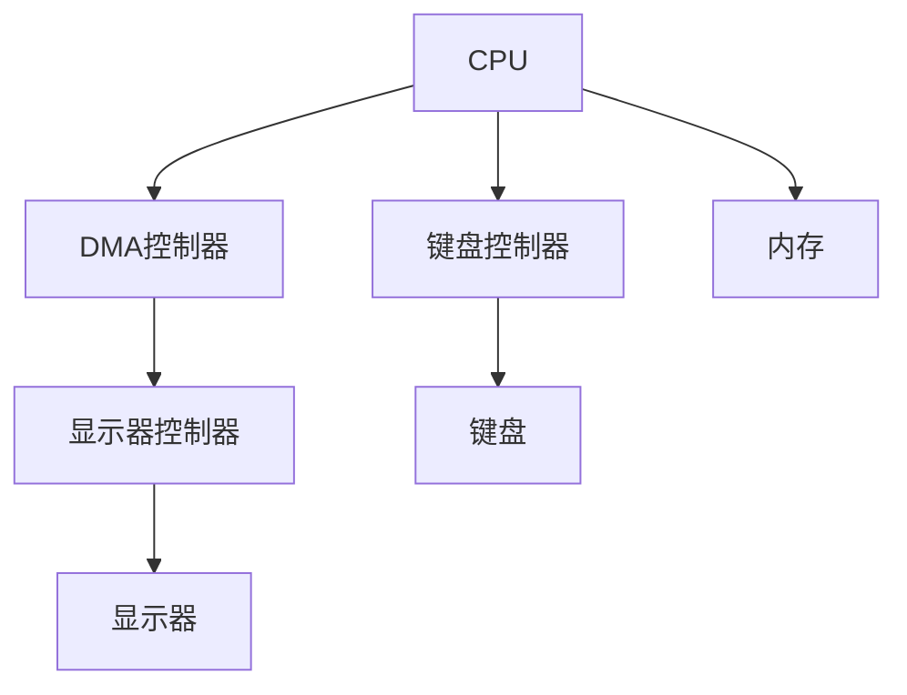
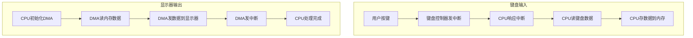

# 习题-第7章-IO输入输出系统

> [!abstract] 本章习题概述
> 本章习题主要考察IO设备分类、接口组成、控制方式、中断机制和DMA原理。

## 一、选择题

### 7.1 IO系统概述

**题目1**：下列设备中，属于输入设备的是（ ）

A. 显示器  
B. 打印机  
C. 键盘  
D. 音箱  

**答案**：C

**解析**：键盘是输入设备，显示器、打印机和音箱是输出设备。

**题目2**：IO接口的作用是（ ）

A. 连接CPU和IO设备  
B. 存储程序和数据  
C. 执行指令  
D. 进行算术运算  

**答案**：A

**解析**：IO接口的作用是连接CPU和IO设备，提供缓冲和控制。

**题目3**：IO接口不包含（ ）

A. 数据寄存器  
B. 状态寄存器  
C. 控制寄存器  
D. 程序计数器  

**答案**：D

**解析**：程序计数器是CPU的组成部分，不是IO接口的组成部分。

### 7.2 程序查询方式

**题目4**：程序查询方式的特点是（ ）

A. CPU主动查询设备状态  
B. CPU被动响应设备请求  
C. CPU不需要干预  
D. 设备主动通知CPU  

**答案**：A

**解析**：程序查询方式中，CPU主动查询设备状态，直到设备就绪。

**题目5**：程序查询方式的缺点是（ ）

A. CPU利用率高  
B. CPU利用率低  
C. 实现复杂  
D. 成本高  

**答案**：B

**解析**：程序查询方式的缺点是CPU利用率低，因为CPU在等待时不能做其他工作。

### 7.3 中断与DMA方式

**题目6**：中断方式的特点是（ ）

A. CPU主动查询设备状态  
B. CPU被动响应设备请求  
C. CPU不需要干预  
D. 设备主动通知CPU  

**答案**：B

**解析**：中断方式中，设备通过中断通知CPU，CPU被动响应。

**题目7**：DMA方式的特点是（ ）

A. CPU主动查询设备状态  
B. CPU被动响应设备请求  
C. CPU不需要干预数据传输  
D. 设备主动通知CPU  

**答案**：C

**解析**：DMA方式中，DMA控制器直接传输数据，CPU不需要干预。

**题目8**：下列关于DMA的说法中，错误的是（ ）

A. DMA不需要CPU干预数据传输  
B. DMA需要DMA控制器  
C. DMA的传输速度比中断方式慢  
D. DMA适合高速设备  

**答案**：C

**解析**：DMA的传输速度比中断方式快，因为不需要CPU干预。

## 二、填空题

**题目9**：IO设备按用途分为____、____和____。

**答案**：输入设备、输出设备、存储设备

**题目10**：IO接口的组成包括____、____和____。

**答案**：数据寄存器、状态寄存器、控制寄存器

**题目11**：IO控制方式有____、____、____和____。

**答案**：程序查询方式、中断方式、DMA方式、通道方式

**题目12**：中断处理流程包括____、____、____、____和____。

**答案**：中断请求、中断响应、保存现场、中断处理、恢复现场

**题目13**：DMA的工作流程包括____、____和____。

**答案**：初始化、数据传输、完成处理

## 三、简答题

**题目14**：简述IO设备的分类。

**答案**：

IO设备的分类：

1. **按用途分类**：
   - 输入设备：键盘、鼠标、扫描仪
   - 输出设备：显示器、打印机、音箱
   - 存储设备：硬盘、SSD、U盘

2. **按传输方式分类**：
   - 串行设备：逐位传输
   - 并行设备：同时传输多位

3. **按速度分类**：
   - 低速设备：键盘、鼠标
   - 中速设备：硬盘、U盘
   - 高速设备：SSD、内存

**题目15**：简述IO接口的组成和作用。

**答案**：

IO接口的组成：

1. **数据寄存器**：暂存传输的数据。
2. **状态寄存器**：存储设备的状态。
3. **控制寄存器**：存储控制命令。

IO接口的作用：

1. 连接CPU和IO设备。
2. 缓冲数据，协调速度差异。
3. 提供控制信号。
4. 转换数据格式。

**题目16**：比较四种IO控制方式的特点。

**答案**：

| 控制方式 | CPU干预 | 效率 | 硬件复杂度 | 适用场景 |
|---------|--------|------|-----------|---------|
| **程序查询** | 完全干预 | 低 | 低 | 低速设备 |
| **中断方式** | 部分干预 | 中 | 中 | 中速设备 |
| **DMA方式** | 不干预 | 高 | 高 | 高速设备 |
| **通道方式** | 不干预 | 高 | 很高 | 大型系统 |

**题目17**：简述中断处理流程。

**答案**：

中断处理流程：

1. **中断请求**：设备发送中断请求信号。
2. **中断响应**：CPU检测到中断请求，响应中断。
3. **保存现场**：CPU保存当前执行状态（PC、PSW、寄存器）。
4. **中断处理**：CPU执行中断服务程序。
5. **恢复现场**：CPU恢复执行状态。
6. **中断返回**：CPU返回原程序继续执行。

**题目18**：简述DMA的工作原理。

**答案**：

DMA的工作原理：

1. **初始化**：CPU初始化DMA控制器（设置地址、长度、方向）。
2. **数据传输**：DMA控制器直接在内存和设备之间传输数据。
3. **完成处理**：DMA控制器发送中断请求，CPU处理传输完成。

## 四、计算题

**题目19**：使用程序查询方式，设备每隔10ms就绪一次，每次数据传输需要1ms，计算CPU的利用率。

**解答**：

```
CPU利用率 = 数据传输时间 / (查询时间 + 数据传输时间)
         = 1ms / 10ms
         = 10%
```

**答案**：10%

**题目20**：使用中断方式，设备每隔10ms就绪一次，中断处理需要1ms，计算CPU的利用率。

**解答**：

```
CPU利用率 = 中断处理时间 / 设备就绪间隔
         = 1ms / 10ms
         = 10%
```

**答案**：10%

**题目21**：使用DMA方式，设备每隔10ms就绪一次，每次传输1000字节，DMA传输速率为1MB/s，计算CPU的利用率。

**解答**：

```
传输时间 = 数据量 / 传输速率
         = 1000字节 / 1MB/s
         = 1000字节 / 1024×1024字节/s
         ≈ 0.000977s
         ≈ 0.977ms

CPU利用率 = 初始化和完成处理时间 / 设备就绪间隔
         ≈ 0.1ms / 10ms  （假设初始化和完成处理需要0.1ms）
         = 1%
```

**答案**：约1%

**题目22**：比较程序查询、中断和DMA三种方式的CPU利用率。

**解答**：

```
假设条件：
- 设备就绪间隔：10ms
- 数据传输时间：1ms
- 中断处理时间：1ms
- DMA初始化和完成处理时间：0.1ms

程序查询方式：
CPU利用率 = 1ms / 10ms = 10%

中断方式：
CPU利用率 = 1ms / 10ms = 10%

DMA方式：
CPU利用率 = 0.1ms / 10ms = 1%
```

**答案**：

| 控制方式 | CPU利用率 |
|---------|----------|
| **程序查询** | 10% |
| **中断方式** | 10% |
| **DMA方式** | 1% |

## 五、综合题

**题目23**：设计一个IO控制方案，要求：

1. 包含键盘输入和显示器输出
2. 键盘使用中断方式
3. 显示器使用DMA方式
4. 画出系统结构图
5. 说明工作流程

**解答**：

```
系统结构图：
- CPU
- 键盘控制器（中断方式）
- 显示器控制器（DMA方式）
- DMA控制器
- 内存

工作流程：
键盘输入：
1. 用户按下键盘
2. 键盘控制器发送中断请求
3. CPU响应中断，读取键盘数据
4. CPU将数据存入内存

显示器输出：
1. CPU初始化DMA控制器（设置内存地址、数据长度）
2. DMA控制器从内存读取数据
3. DMA控制器将数据发送到显示器
4. DMA控制器发送中断请求，通知CPU完成
```

**答案**：

系统结构图：



工作流程：



---

**导航**：[[习题-第6章-总线系统.md|上一章习题]]