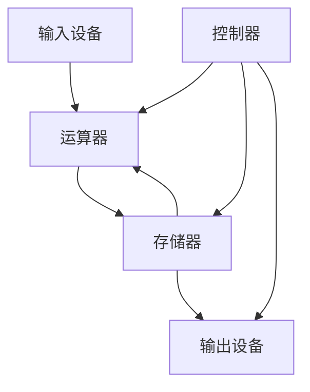
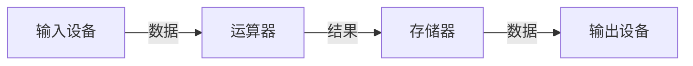
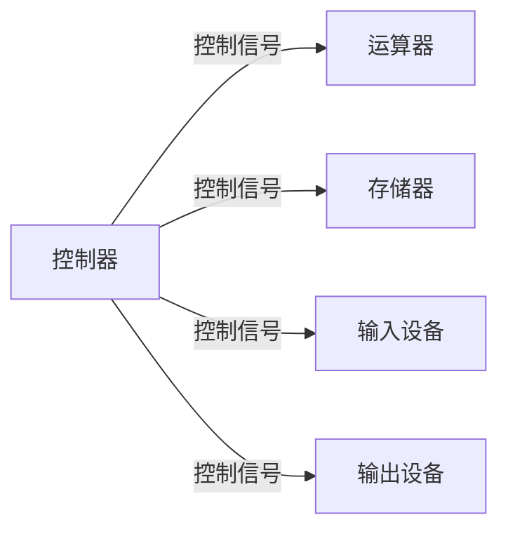

# 1.1 计算机硬件五大组成

> [!abstract] 核心问题
> 计算机硬件的五大组成部分是什么？各自的功能是什么？冯·诺依曼计算机的特点是什么？

## 一、冯·诺依曼计算机

### 1. 核心思想

**冯·诺依曼体系结构**是现代计算机的基础，其核心思想包括：

| 思想 | 说明 |
|-----|------|
| **存储程序** | 程序和数据都存储在存储器中 |
| **程序控制** | 计算机自动执行存储的程序 |
| **二进制** | 使用二进制表示数据和指令 |
| **五大组成** | 运算器、控制器、存储器、输入设备、输出设备 |

### 2. 硬件框图

## 二、计算机硬件五大组成部分

### 1. 运算器（ALU）

**定义**：运算器是计算机中执行算术运算和逻辑运算的部件。

**组成**：

| 组成 | 说明 |
|-----|------|
| **算术逻辑单元（ALU）** | 执行加减乘除等算术运算和与或非等逻辑运算 |
| **累加器（ACC）** | 临时存储运算结果 |
| **数据寄存器（DR）** | 暂存参与运算的数据 |

**功能**：

| 功能 | 说明 |
|-----|------|
| **算术运算** | 加、减、乘、除 |
| **逻辑运算** | 与、或、非、异或 |
| **移位运算** | 左移、右移、循环移位 |

### 2. 控制器（CU）

**定义**：控制器是计算机的指挥中心，负责控制计算机各部件协调工作。

**组成**：

| 组成 | 说明 |
|-----|------|
| **指令寄存器（IR）** | 存储当前执行的指令 |
| **程序计数器（PC）** | 存储下一条指令的地址 |
| **操作控制器** | 生成控制信号 |

**功能**：

| 功能 | 说明 |
|-----|------|
| **取指令** | 从存储器中取出指令 |
| **分析指令** | 解码指令，确定操作类型 |
| **执行指令** | 向各部件发送控制信号 |
| **控制时序** | 协调各部件的工作时序 |

### 3. 存储器（Memory）

**定义**：存储器是计算机中存储程序和数据的部件。

**分类**：

| 分类 | 说明 | 示例 |
|-----|------|------|
| **内存** | 速度快、容量小、断电丢失 | RAM |
| **外存** | 速度慢、容量大、断电不丢失 | HDD、SSD、U盘 |

**功能**：

| 功能 | 说明 |
|-----|------|
| **存储程序** | 存储计算机要执行的程序 |
| **存储数据** | 存储程序运行所需的数据 |
| **临时存储** | 暂存运算结果 |

### 4. 输入设备（Input Device）

**定义**：输入设备是向计算机输入数据和指令的设备。

**常见输入设备**：

| 设备 | 说明 |
|-----|------|
| **键盘** | 输入字符和命令 |
| **鼠标** | 控制光标和选择 |
| **扫描仪** | 输入图像 |
| **麦克风** | 输入声音 |

**功能**：

| 功能 | 说明 |
|-----|------|
| **数据输入** | 向计算机输入数据 |
| **指令输入** | 向计算机输入命令 |

### 5. 输出设备（Output Device）

**定义**：输出设备是将计算机处理结果输出的设备。

**常见输出设备**：

| 设备 | 说明 |
|-----|------|
| **显示器** | 显示文字和图像 |
| **打印机** | 打印文字和图像 |
| **音箱** | 输出声音 |
| **绘图仪** | 绘制图形 |

**功能**：

| 功能 | 说明 |
|-----|------|
| **结果输出** | 输出计算机处理结果 |
| **状态显示** | 显示计算机运行状态 |

## 三、五大组成部分的关系

### 1. 数据流

### 2. 控制流

### 3. 完整工作流程

**步骤**：

1. 输入设备向计算机输入程序和数据
2. 控制器从存储器中取出指令
3. 控制器分析指令，向运算器发送控制信号
4. 运算器执行运算，结果存入存储器
5. 输出设备将结果输出

## 四、冯·诺依曼计算机的特点

### 1. 主要特点

| 特点 | 说明 |
|-----|------|
| **存储程序** | 程序和数据都存储在存储器中 |
| **程序控制** | 计算机自动执行存储的程序 |
| **二进制** | 使用二进制表示数据和指令 |
| **指令串行执行** | 指令一条一条顺序执行 |
| **共享总线** | 各部件通过总线连接 |

### 2. 局限性

| 局限性 | 说明 |
|-----|------|
| **冯·诺依曼瓶颈** | CPU与存储器之间的带宽限制 |
| **串行执行** | 无法充分利用并行性 |
| **存储安全性** | 程序和数据存储在同一存储器中 |

### 3. 现代改进

**改进方向**：

| 改进 | 说明 |
|-----|------|
| **多级存储** | Cache、内存、外存的层次结构 |
| **并行处理** | 多核心、多处理器 |
| **指令流水线** | 重叠执行多条指令 |
| **分布式存储** | 多计算机协同工作 |

> [!warning] 易错点
> 运算器和控制器合称为CPU！CPU是计算机的核心，负责执行指令和控制各部件协调工作。

---

**导航**：[[MOC - 第1章.md|返回章节导航]] · 下一节 [[1.2-计算机性能评价指标.md]]